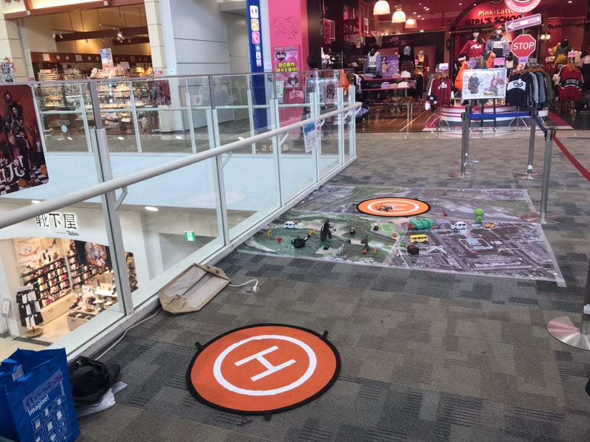
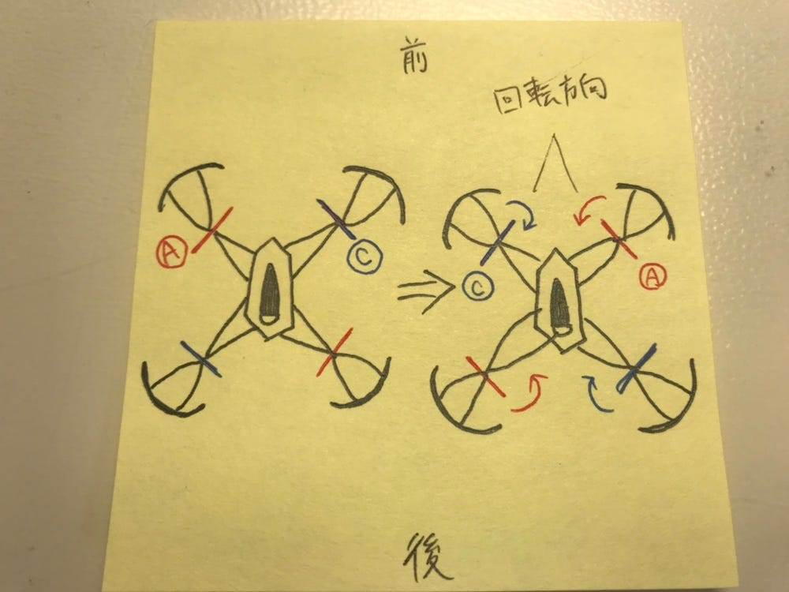
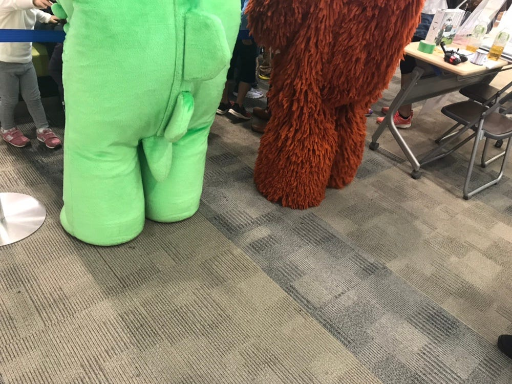

### イオンモール巡業ドローンワークショップ〜ドローンが動かなくなる恐怖〜

こんにちは！青山学院大学 古橋研究室3年の末光香織です。

今回は10月14日(日)イオンモールむさし村山にて行われたドローンワークショップの報告をさせていただきます。

副題にもあるように今回のワークショップでドローンが3台とも動かなくなるという事件が起きました。今後みなさんにはこのような恐怖を感じて欲しくないので、このレポートではそのことについて共有したいと思います。

### 状況

セットアップの時点で２台が動かなくなっていたので、残りの１台で最初から最後まで作動している状態でした。

### 動かなくなる前兆

第3回目の体験会(14時〜15時)が終わる15分ほど前にドローンのコントロールがあまり効かなくなってきました。着陸しただけで勝手に上昇したり、操作してなくても左右に揺れ始めたりといったことが起きました。

この時間帯にガチャピンとムックが私たちのブースに遊びにきてくれたおかげでドローン体験コーナーは子供達で賑わっていました。

楽しみにしている子供達もいるため代替機もない中、体験を続けることに。

### 最後の1台も飛行不可能に

大体の操作はこちらで制御していましたが、突然左に傾きドローンが落下。

ハルが1つ外れていたのでいつものようにはめ直し飛ばそうとしましたが飛行不可能になってしまいました。

その場で直そうと最善を尽くしましたが動かず体験会は残り1回を残し止むを得ず中止に。

### 古橋先生との連絡

プロペラが歪んでいたのでそれが原因なのかと思い付け替えましたがそれでも飛びませんでした。

そしてすぐに古橋先生に連絡を取りドローンの状態も伝えました。

テグスの位置もあっていて飛行が不安定だったので、超音波センサーが故障してしまっている可能性も考えられるとのこと。

プロペラに関しては対角にしている向きは合っていました。

しかし元々つけているプロペラの位置が違っていたようでした。それまでプロペラを全部付け替えることはなかったので、何故今まで飛んでいたのかは謎です。

AとCのセットを入れ替えたら飛ぶことはできました。が着陸しようとボタンを押しても反応せず徐々に上昇しようとする動きが見られました。

そのためやはり体験会を開催することができず、担当者の方にも報告と謝罪の連絡をしました。

これを機にプロペラについて少し調べましたので共有します。

### Parrot MAMBOのプロペラ

プロペラの向きにも決まりがあります。これを機会に皆さんもしっかり覚えましょう！

「Ｃ」と「Ａ」のプロペラ2種類が存在します。

#### 「Ｃ」プロペラ

左前部・右後部に付ける。プロペラは時計回りに回転します。

#### **「Ａ」プロペラ**

右前部・左後部に付ける。プロペラは反時計回りに回転します。

この2種類を交互に取り付けるのが正しいプロペラの取り付け方です。

### その後

後片付けをし再度確認してみようとドローンを動かして見たところ...

**動きました！**

着陸も無事できたので少しホッとしました。しかしまた何かあると不安なので古橋先生に状態を見てもらうことにしました。

1日中動かし続けたからなのでしょうか。やはり予備機の存在は大きいと感じました。

### 反省

飛行が不安定なのに代替機も無い状況であったため飛行を続けてしまったことを反省。このような時は速やかに飛行をやめ、状態の確認し何か問題がある場合は古橋先生へ迅速な対処法を聞くべきであったと思いました。

最初のセットアップの時もドローンの取り扱いにも十二分気をつけなければいけないと改めて感じました。そしてドローンの仕組みについてもっと勉強すると決意致します。

ゼミの時にも言われましたが、一番やんちゃな子供が訪れるという大阪にも行くので気を引き締めていきたいと思います。

#### 追記

今回のイベントは主に1階で行われたのに対し、我々のブースだけ３階と隔離されていましたがガチャピンとムックが遊びに来てくれました！ムックに離陸と着陸だけ操縦してもらうと子供達の興味が高まっていてさすが人気者でした。

写真も撮ってくれましたが人気すぎて子供が少し写り込んでしまったので、後ろ姿を。

ストラバ記録です。↓

[8.5 km Road Cycling Route on Strava
Edit descriptionwww.strava.com](https://www.strava.com/routes/15881999)
