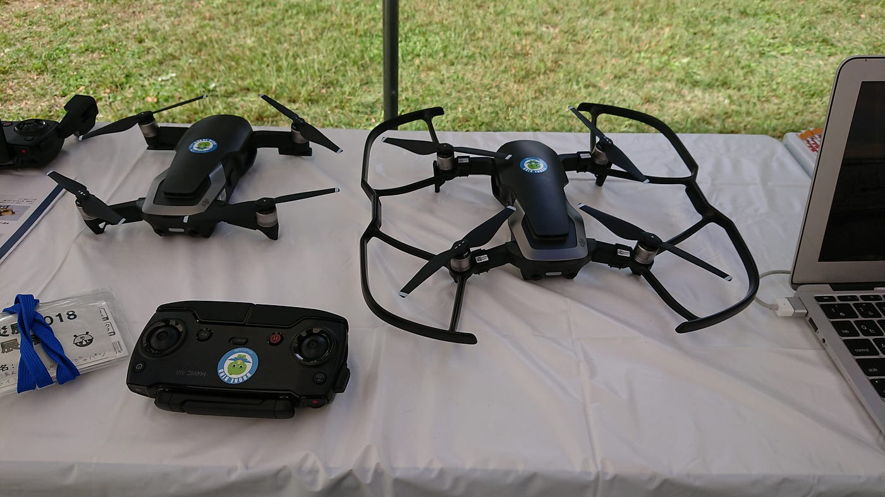
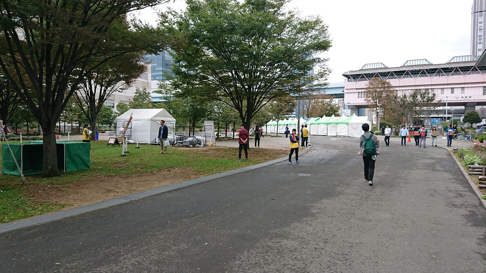
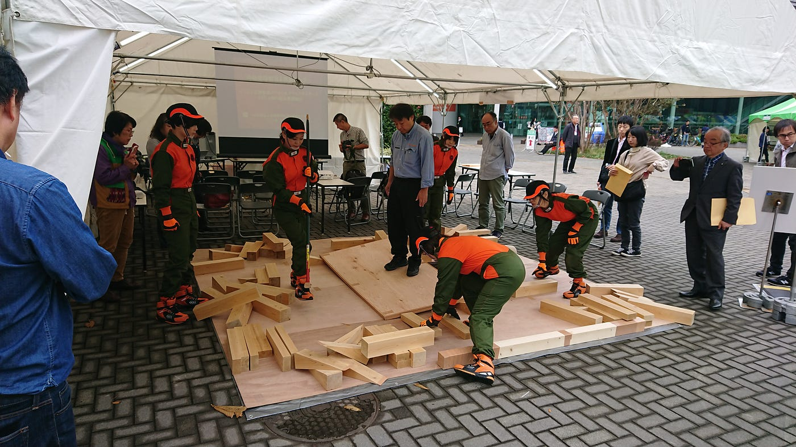
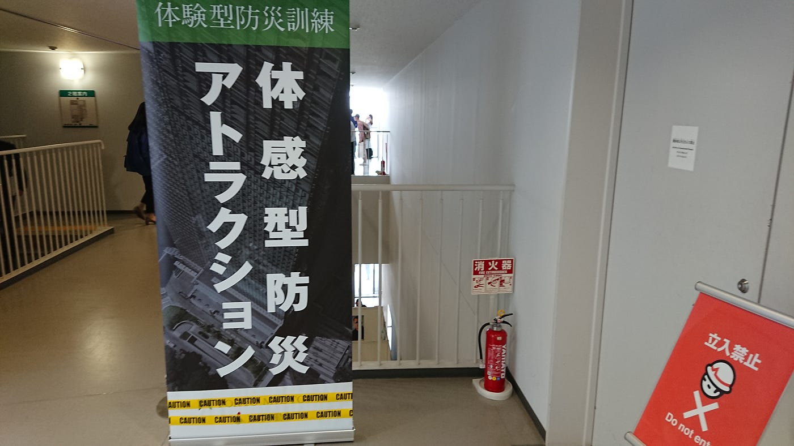
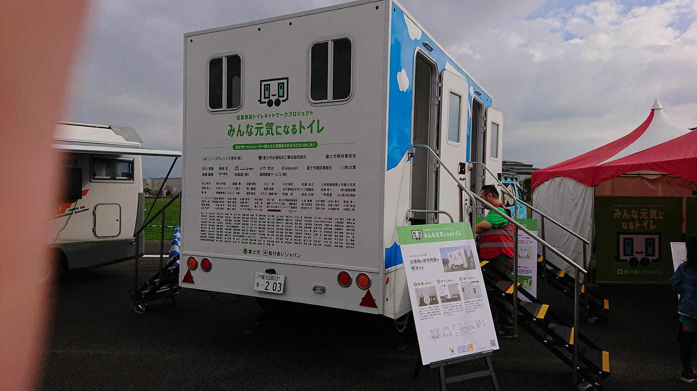
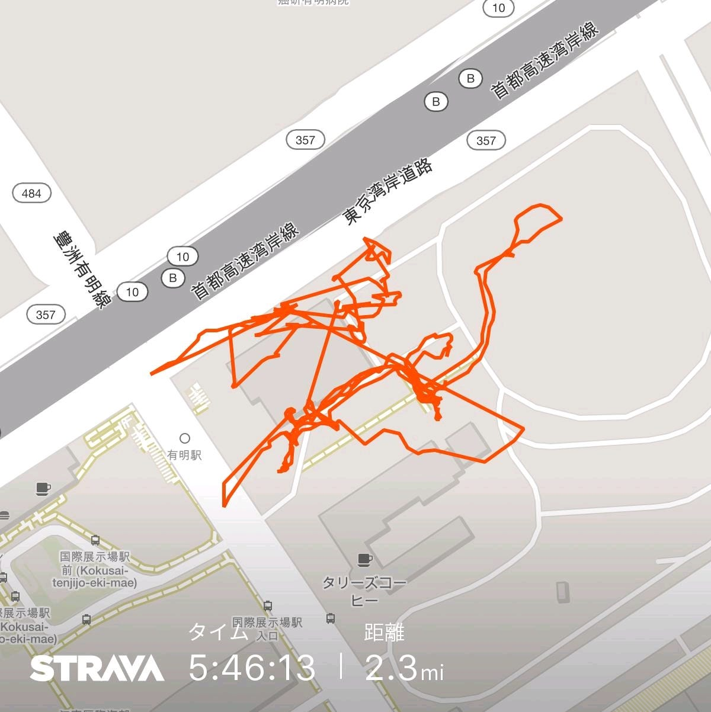

### 東京都防災展 二日目

こんにちは、GSC３年の田村康介です！今回私は、有明にある東京臨海広域防災公園にて、展示会に参加しました。今回はその様子について書いていきたいと思います。

この日は朝の9:00に現地に集合しました。しかし現地は雨模様でしかも寒い！地域によっては12℃を下回る所もあったとか…秋を通り越して冬の始まりという感じでした！

さて、我々が担当したDrone Bird のブースですが、悪天候にもかかわらず多くの人が興味を持ってくださいました！見に来てくださった人の中には、ドローンそのものに関心を持った子供や大人の方々が大勢いました。やはりドローンは人目を惹きやすいと実感しました。そう考えると、現地で飛ばせなかったことが悔やまれます…。また、ドローンについて詳しい知識を持った方、Drone Bird というプロジェクトそのものに興味を持った一般の方や政治家の面々も両日ともにいました！このように政治に関わる方が訪れることに、Drone Bird の災害時の重要性を改めて実感し、またテクニカルな質問が飛んできた時もその都度調べて正確に答えることで、自身の知識を身に着ける効果もありました。その他にも古橋先生の知人という方が数名いらっしゃったが、2日目の時点で配布用の名刺が残り2枚…配る人を選ばなくてはならず、申し訳なく感じました。

大きな問題も発生せず、スムーズに撤収まで終えることが出来ました！少数によるイベント参加はこのゼミでは初めてであったため内容自体満足しています。今後も、この防災展で培った経験を生かしてほかのイベントでも立ち回れたら良いな、と思います！

この防災展では、様々な団体が出展していました。中でも、実演するイベントは人目を惹くと感じました。

そのようなイベントの中で、私が興味を持ったものが、本部で開催された、脱出ゲーム形式で防災のノウハウを学ぶ、「Life Line(ライフライン)」です！

このアトラクションは、いざというときに公助（政府やその他の公共機関に頼ること）に依存せず、自助、共助するという意識を身に着け、且つ災害の際の立ち回りを理解することが目的です。

ゲームの内容ですが、大体4－5人のチームを組み、与えられたミッションを5個クリアすれば脱出成功！というルールです。会場内にちりばめられたヒントをもとにミッションに記されたクイズを協力して解かなければなりません。平時ならば簡単にクリアできること、制限時間も20分ありましたからね。しかしそう上手くはいきません。ゲーム開始とともに、サイレンや焦燥感を掻き立てる音楽や疑似ニュース速報、照明まで暗いオレンジ色となり、自分が今危機的状況にあるのだと思い込んでしまいました。クイズだけで終わればよかったのだが、最後のミッションが手先を使うものであったため、制限時間も残りわずかの中本当に焦りました！しかし、チームメイトに迅速かつ丁寧に教えてもらったため制限時間を超える前にこれもクリア。私のチームは、残り1分弱のところで無事脱出に成功しました！

このゲームを通じて実感したことは、限られた時間、自分の命がかかった状況で適切な行動をとることは非常に難しい、ということです。またゲーム中に何度かチームメイトをそっちのけにしてしまった状況がありました。災害という状況下では共助を行うことは非常に精神に負荷がかかることもわかりました。災害で自助、共助を適切に行うためには、常に災害が起きた時をシミュレーションし、不測の事態に臨機応変な対応をできるようにしなくてはならない、それを深く理解できました。

いずれ来る大災害、それこそ今日来るかもしれないそれに常に用心しなくてはなりません！

最後にもう一つ。課題となっていた「元気になるトイレ」について少しだけ。分類としては仮設トイレですが、実際に入ってみるとまるで使い慣れた我が家のトイレのような安心感がありました。もし今後災害が起きた時、避難所生活を余儀なくされたとき、トイレのストレスを解消できたら精神的負担が緩和されるな、と感じました。

以上が防災展で私が体験した出来事です！最後にStravaの記録を貼っておきます。ありがとうございました、おつかれさまでした！

青山学院大学 GSC 3年 田村康介
