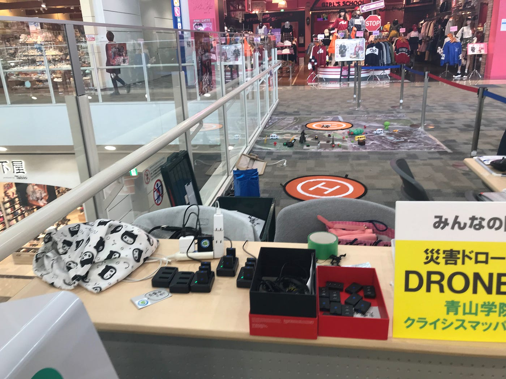
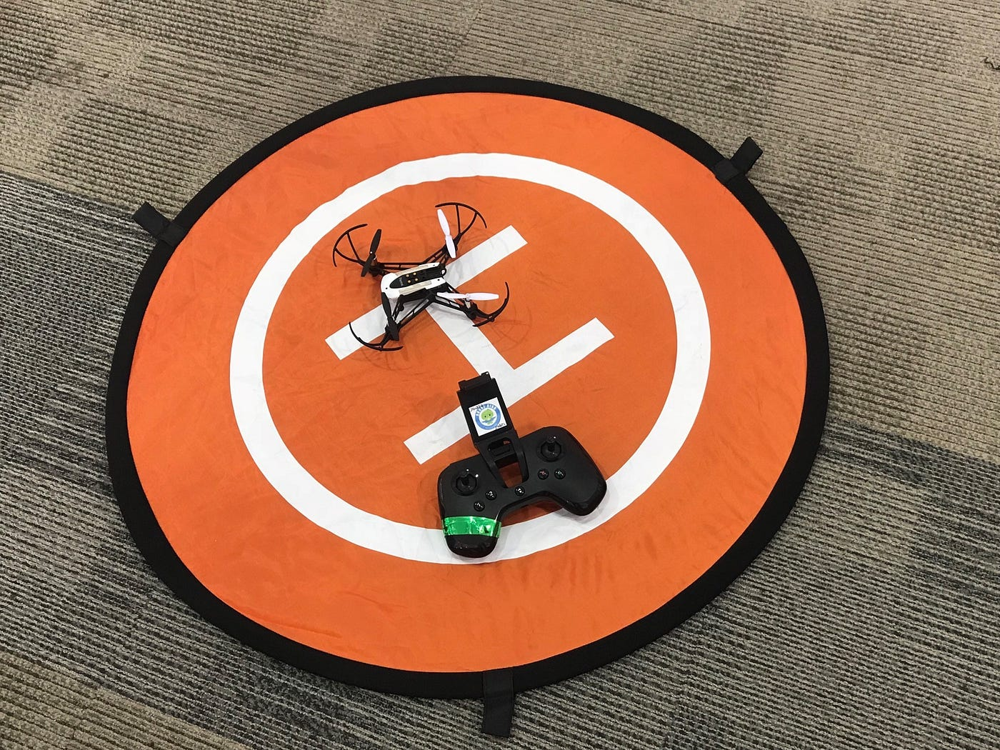
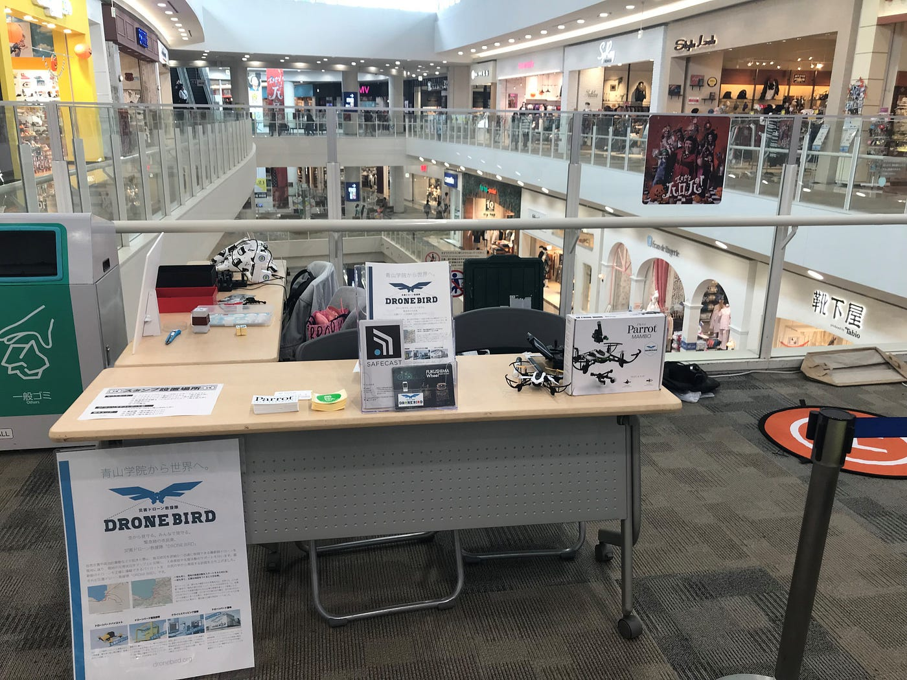
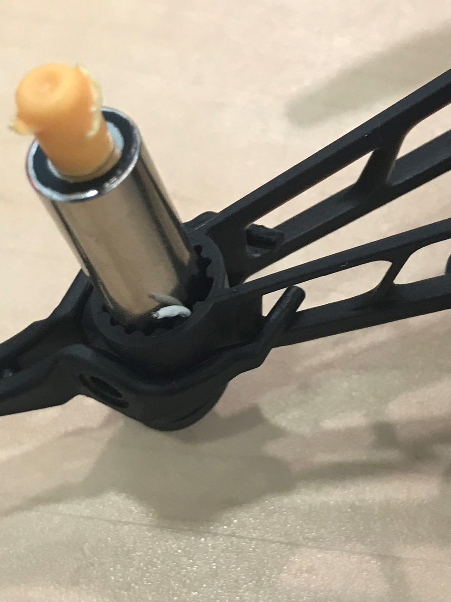
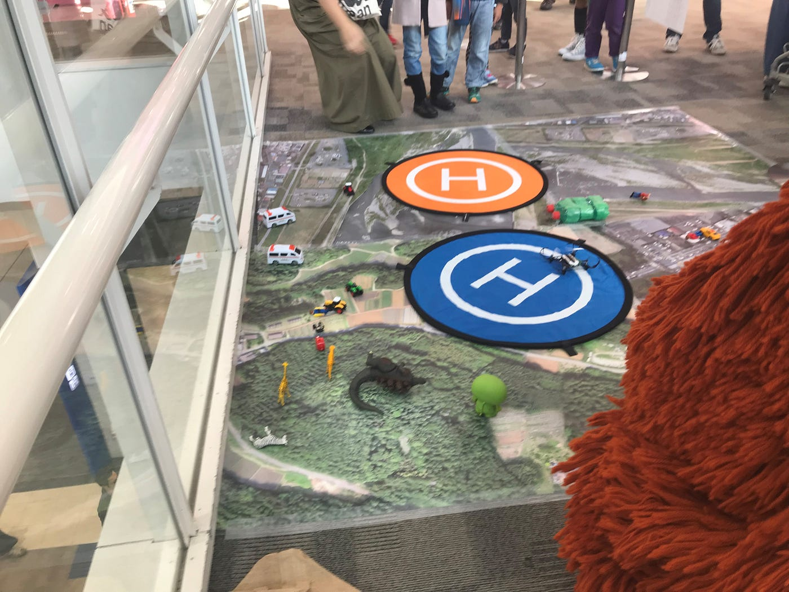

### 初めてのドローンワークショップ inイオンモール武蔵村山

今回はイオンモール武蔵村山でドローンのワークショップを行いました。集合時間には間に合ったのですが少々道に迷ってしまって予定より到着が遅れてしまいました。写真のブースで僕含めて3人で運営していきました。

ワークショップではこういったドローンとコントローラーを使っていきました。設定でスピードや高度を最低にし一部操作の使用を禁じたり、テグスと水の入ったペットボトルにつなぐなどの様々な制限のもとで体験会を進めてきました。

ここでパンフレットやスタンプラリー、などを行っていきました。

さてここからは設営の話です。設営の段階で3機中２機が不調であり、出だしからつまずいてしまった感があります。他のプロペラは動いているのに一つだけ動いていないという通信面ではなさそうな問題であり、色々試そうとしましたが結局体験会開始には間に合いませんでした。特にプロペラがガッチリ固定されており、外すことができないのがいくつかありました。また、とれても力の入れ過ぎで羽が曲がってしまったのもありました。アームなのですが一つは設営時点では正常に稼働し一つはギアの噛み合わせが悪いのか可動範囲が極端に狭い感じでした。本番では接続不良で結局どちらも動かすことができませんでした。

僕が担当したドローンはこのように配線が切れてしまっていたことが分かりました。

そうしたトラブルはありましたがなんとか一台だけでも始めることができました。

タイムスケジュールとしては１０時開始で１時間の体験会と１時間の休憩を繰り返していきました。最初の１時間は開店したばかりのことをあり、人自体が少なく７組ほどしか参加していただけませんでした。しかしお昼過ぎくらいになるとどんどん人が増えていき最終的には列ができるほどになりました。ガチャピンとムックがきてくれてその流れでお客さんが来るといったこともありました。しかし最後の一機も故障してしまい最後の一時間はまるまる切り上げて反省会や備品のチェックなどに使いました。一応チェックの途中で最後のドローンの状態は回復したのですがこれは一つのドローンに負担をかけすぎたからではないかと考えています。体験会に来てくださった人には申し訳なくおもいます。

今回の体験会で注意点や改善点などを共有しておきます。まず、機材関係のトラブルがあったときは即古橋先生などの詳しい人に意見を求めるべきだと思いました。今回はそれが遅れたためにトラブルの対処が遅くなった部分もあると思います。

また子供は本当に言うことを聞かない子がいます。実際に操作をみせたり、していけない操作を教えても無視して好きなように操作しようとします。特に多かったのはコントローラーのスティックを思いっきり倒すことです。今回はテグスをつけていたのでドローンが墜落するだけで済みましたがテグスを使わないチームは十分に注意してください。対処法では完全にコントローラーの主導権をこちらで握る。スティックを自分の指で押さえてその上にから子供に指を添えてもらい疑似的に操作している感じにするのがよいかと思います。

次以降のドローンワークショップではこの辺りを注意していただければと思います。

[イオンモールドローンワークショップ - 恭一朗 北野's 16.9 mi run
恭一朗 北. ran 16.9 mi on Oct 13, 2018.www.strava.com](https://www.strava.com/activities/1903658646)
