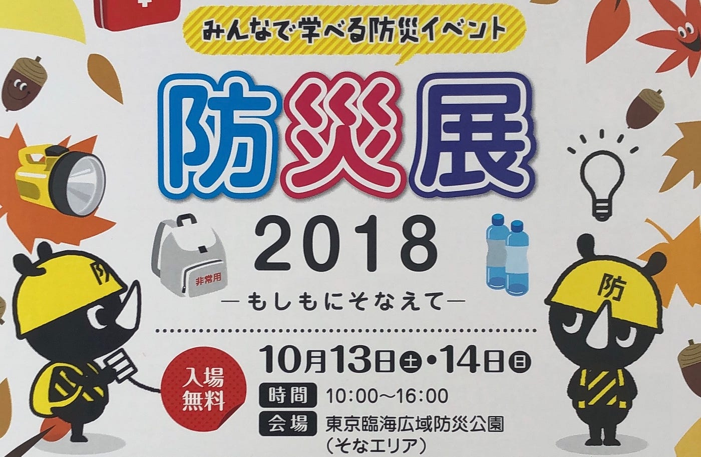
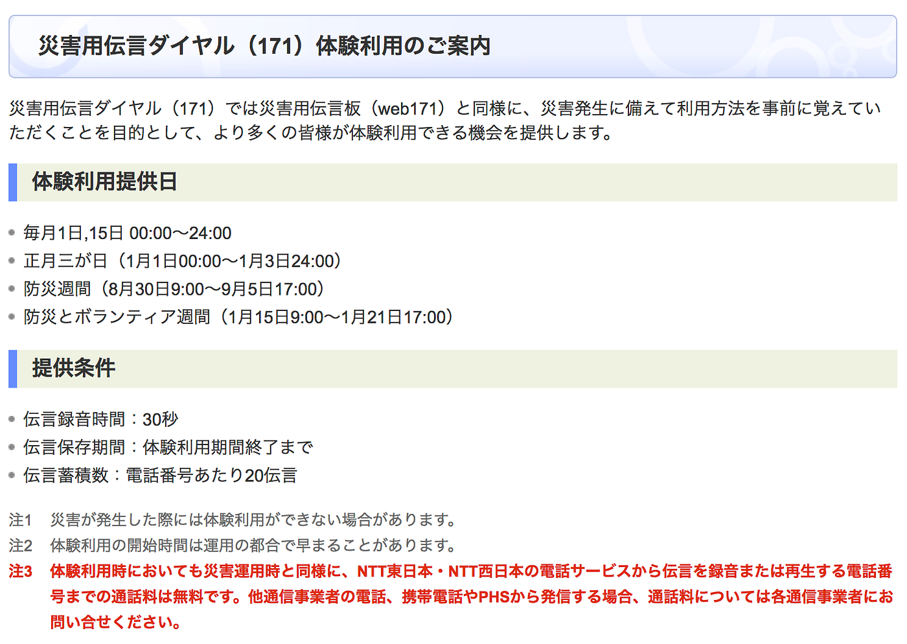
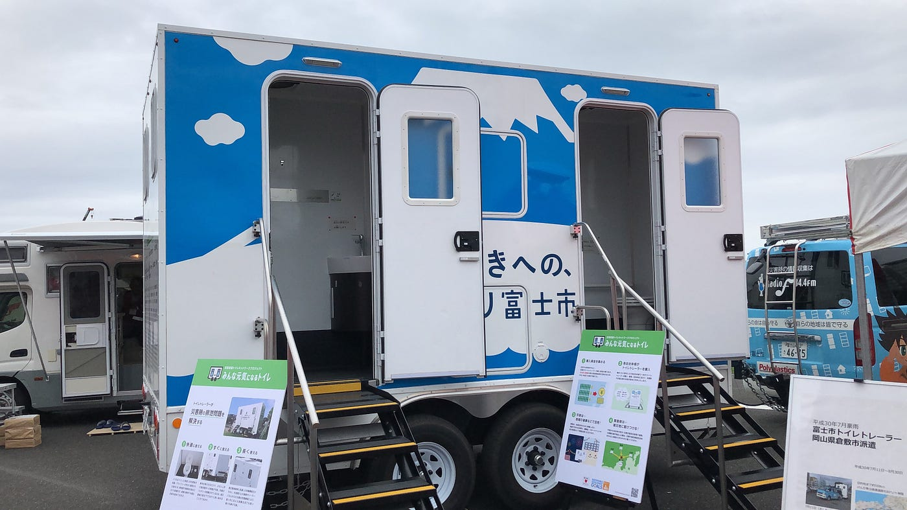
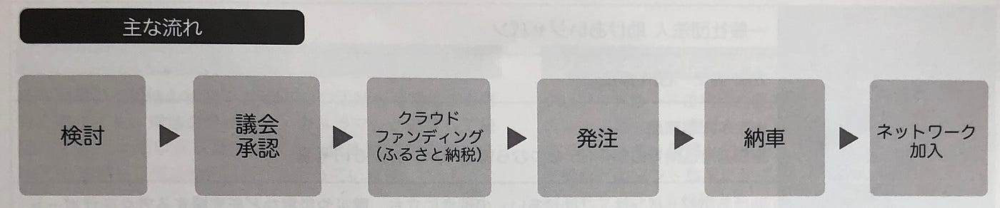

### ”みんな元気になるトイレ”から見えた災害時の新たな発見

こんにちは。古橋ゼミ三年の牧利亮です。
10月13/14(Sat/Sun)に東京臨海広域防災公園で開催されました、東京国際防災展の初日に、スタッフとして参加させて頂きましたので、その報告をさせていただきます。

> どんなイベントだったの？

今回のイベントは、内閣府・防災推進協議会・防災推進国民会議、三つの母体からなる防災国民推進大会2018 実行委員会の主催のもと、様々な災害が発生する日本で、『自助・共助』の取り組みを促進し、家族連れから専門家まで多くの人が防災を学ぶことを目的としたイベントでした。
今回は3回目を迎え、『大規模災害に備える 〜みんなの連携の輪を地域の力で強くする〜』をテーマにセッションや展示、イベントが行われました。

> 何をしたの？

私は、古橋先生が理事長を務める、**[NPO法人クラシスマッパーズジャパン**](http://crisismappers.jp/index.html)の活動を紹介する展示ブースに立ち、具体的な活動実績や活用するドローンの性能をブースに立ち寄られた方々に説明をしました。

> 体得したこと

私が学んだことは大きく二つあります。

一つ目は、NPO法人クラシスマッパーズジャパンがどのような活動をしているのかを理解することができたことです。説明する立場に立つことで、私たちが普段HOT Tasking Managerで行なっているマッピング作業は、どのような作業で、どのような役割を担うのかを、よく理解することができました。また、地図情報が収集▶︎管理▶︎編集▶︎波及されるプロセスを構造的に理解することができました。

二つ目は、ドローンのスペックについてです。当日の朝配布された**[想定問答集**](https://github.com/dronebird/docs4dronebirds/issues/7)を元に、空撮を行うドローンの飛行時間・距離・高度・カメラの撮影可能域、細かなことを学びました。

> 興味深かった他のブース

私が興味深かったブースは二つあります。

### _（株）NTT東日本_

災害用伝言ダイアル171のPRについてです。まずは災害用伝言ダイアルがどのような仕組みか、以下の短い動画(1:48)で見てみてください。

このサービスが便利だと思ったのは、**電話番号を一律にできる点**です。例えば、災害時に父親の電話番号に音声の録音・再生をすると家族間で決めておけば、安否を知らせるときに、家族全員の電話番号を覚える必要はないということです。これを聞いて、私自身も家族間で災害時に使う電話番号を決めておこうと思いました。また、**毎月１日**と**15日**は体験利用が可能なので一度試してみておくと良いと思います。

### みんな元気になるトイレ

一般社団法人 助けあいジャパン
災害派遣トイレネットワークプロジェクト

> トイレトレーラーの特徴

一つのトレーラーにトイレが4室あり、臭い逆流防止機能付き洋式便座、二重ロック付き扉、電動換気扇、洗面台、化粧鏡、ペーパー等収納庫が完備され申し分のない設備でした。

> 給水方法/汚物排水方法

給水はホース/揚水ポンプによるタンク給水/ホースによる直接給水の三つの手段があるそうです。汚物排泄方法としては、便座からのバキュームと専用ホースによる下水への落下が可能ということでした。

> トレーラーが作られるまでの主な流れ

資金源はクラウドファンディングとふるさと納税としています。ふるさと納税の寄付金控除制度を活用するため、寄付減税域内であれば2,000円以外は還付され、自治体も寄付者も少ない負担で支援が可能だそうです。

> 西日本豪雨での新たな発見

西日本豪雨で使用されたときに、トレーラーの管理をされていた方にお話を伺うことができました。その方は、『西日本豪雨の際にトイレがトイレとしてだけでなく、**被災者の泣き場所**になった。精神的・肉体的にもストレスを抱える環境下の生活の中で、それぞれが抱える思いを周りを気にすることなく発散できる空間が必要であったことを、初めて知ることができた。他にも、着替えをする場として使われたり、プライベート空間の必要性を感じさせられた。』とおっしゃっていました。話を聞いて、みんな元気になるトイレは名前の通り、ただの移動式トイレではなく、みんなを元気にする、みんなの心に寄り添うトイレであることを再認識しました。

> 東京国際防災展を通して感じたこと

防災先進国と言われる日本でも、災害ごとに課題やニーズが見えてくる現実に、防災/減災において大事なことの一つとして、いかにして防災/減災を**追い求め続けるか**が、大事であると思いました。災害をなくすことはできませんが、防災/減災を突き詰めていくことはできます。災害を記憶とするのではなく、次にそれを乗り越える為の教訓として、過去の災害の課題から目を背けることなく、今後起こるであろう災害に備えて、同じことを繰り返さないために何ができるのか考え続け、挑戦し続ける必要があると思いました。

### **STRAVAログ**

[https://strava.app.link/vex1UlfrdR](https://strava.app.link/vex1UlfrdR)
