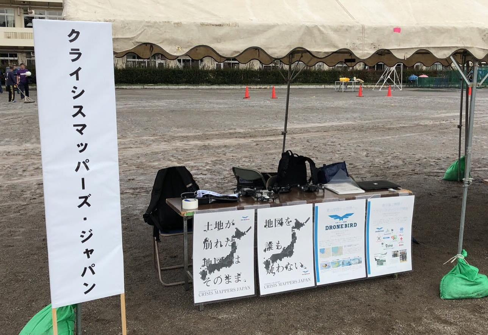
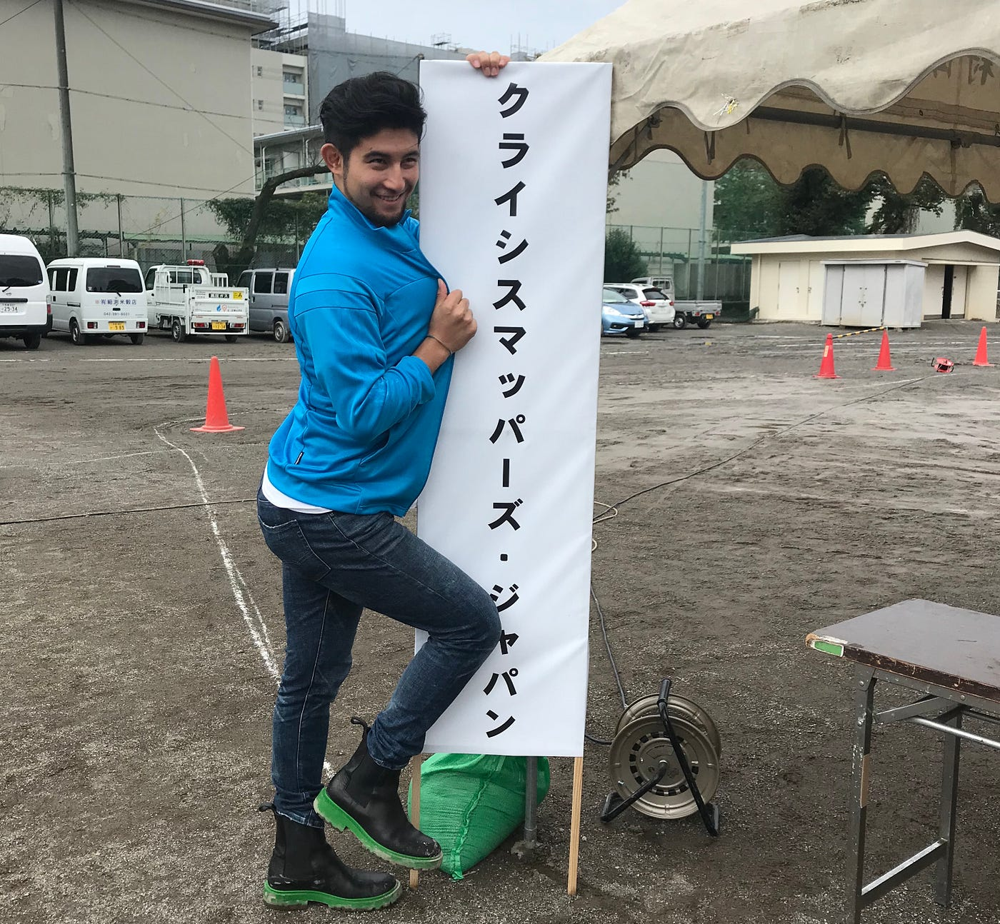
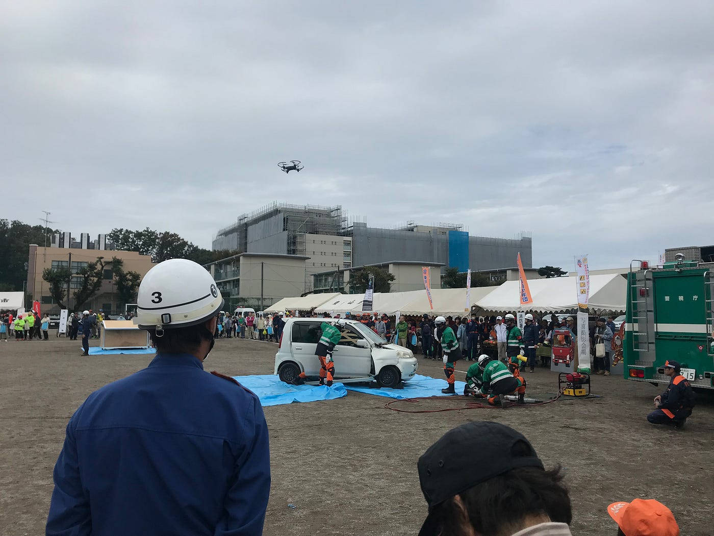

### 東村市防災訓練活動記

今回のブログは東村市の防災訓練に、NGO法人CrisisMappers Japanとして参加させていただいたお話。防災訓練は10月14日(日)に行われた。

私は市の防災訓練に参加するのは今回でおそらく４回目。何十回も参加している古橋先生もおっしゃっていたが、防災訓練って自治体で結構違う。私もそう思う。東村市の防災訓練に一緒に参加した相棒はナイル！プロジェクトのイメージカラーのブルーを前面に押し出すために、ナイルがかなり鮮やかなブルーの洋服を着てきたので写真載っける！！

10月14日(日)は前夜から朝にかけて雨。10時ぐらいから予報では晴れるということだったので外での防災訓練は実地するとのことだったが、現場では雨でぐちゃぐちゃになってしまった校庭での準備作業に、少し時間に追われていた。

今回はドローン飛行デモがあった。しかし航空法にひっかからない200g未満の機体で。そこで先生がチョイスしたのはDJI社のTelloという80gほどのドローン。今回私とナイルは初めてTelloを使ってみたのだが、正直に良い意味でかなり驚いた。80gとは思えない安定感を外の少し風がある状態で披露してくれ、映像の出力の時差もあまりない！

Telloの映像をプロジェクターに投影するやり方には、いつものMavicシリーズとのやり方と違ったため、途中先生に聞きながらの作業になってしまったが、市の方が防災訓練開始前にプロジャクターの確認作業をさせてくれたおかでげ本番はスムーズに飛ばすことができた。

ナイルが操縦して、私がみんなの質問に答える役目をドローン飛行デモ中に行なっていた。ナイルはTelloをiPhoneで操縦していたわけだが、一般の参加者には、「すぐ私の隣にいるナイルがあのドローンを操縦しています」と伝えると非常に驚いた表情を見せていた。みんなはナイルがドローンを操縦していたことに気がつかなかったのだ。確かにまさかスマホをいじっているようにしか見えない青年がドローンを操縦しているのはビックリだ、と。文明の進化に気付かされた瞬間だった。

ブース展示中も様々な方に興味を持ってもらえた。ドローンを飾ると、いろんな方が興味を示してくれる。実物のドローンを実際に生で見るのはあまりない体験なのかな、と防災訓練に参加すると毎度思う。

また電通さんが作ってくれたポスターも効果絶大！「誰も地図を疑わない」の一言にはあらゆる人が反応してくれる。途中で小雨も降ってきたりしたが、無事にドローン飛行デモもでき、ブースでたくさんお話もできたのでよかった。

[東村山市防災訓練 - Ayame Otsuki's 3.1 km run
Ayame O. ran 3.1 km on Oct 13, 2018.www.strava.com](https://www.strava.com/activities/1903232533?share_sig=87271F3B1539863499&utm_medium=social&utm_source=ios_share)

以上、防災訓練体験記！Tello優秀、すごかった！！
