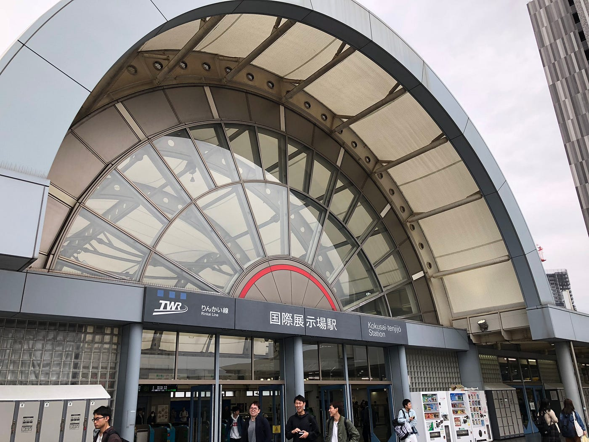
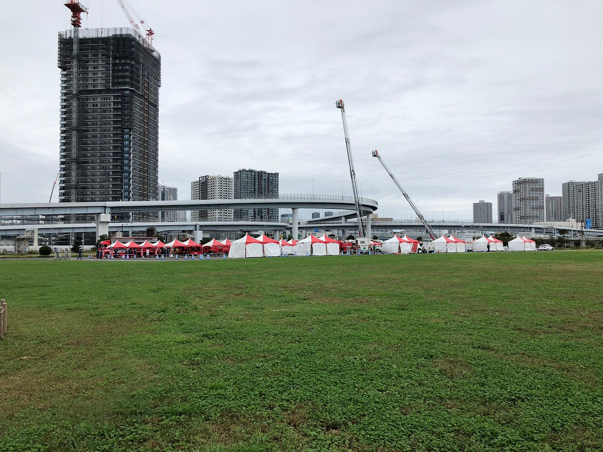
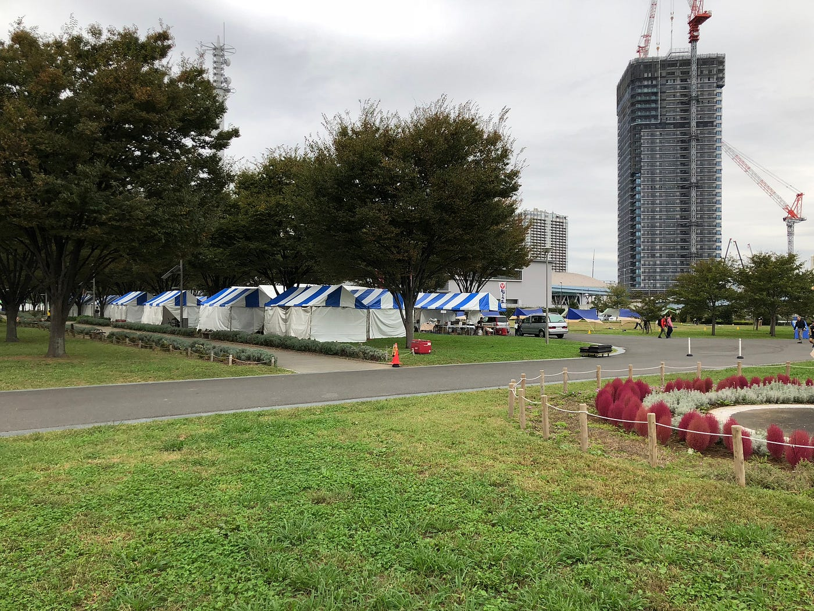
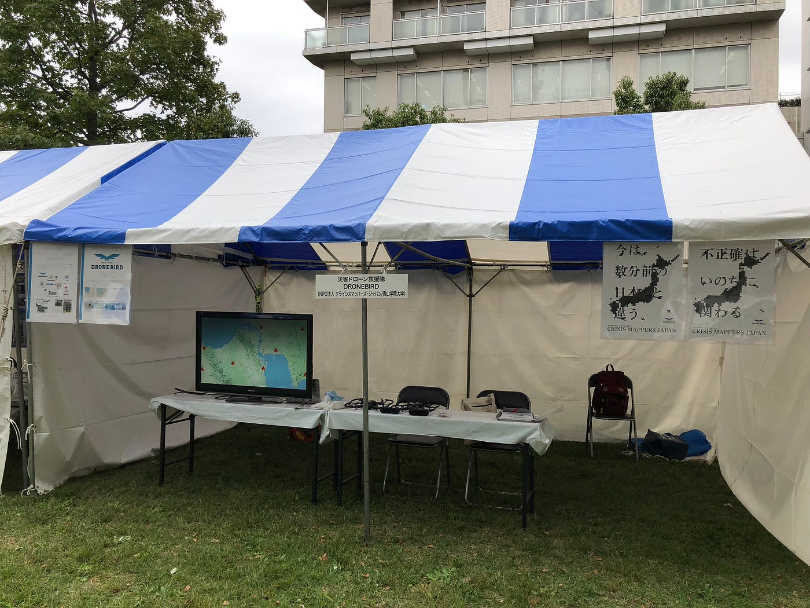
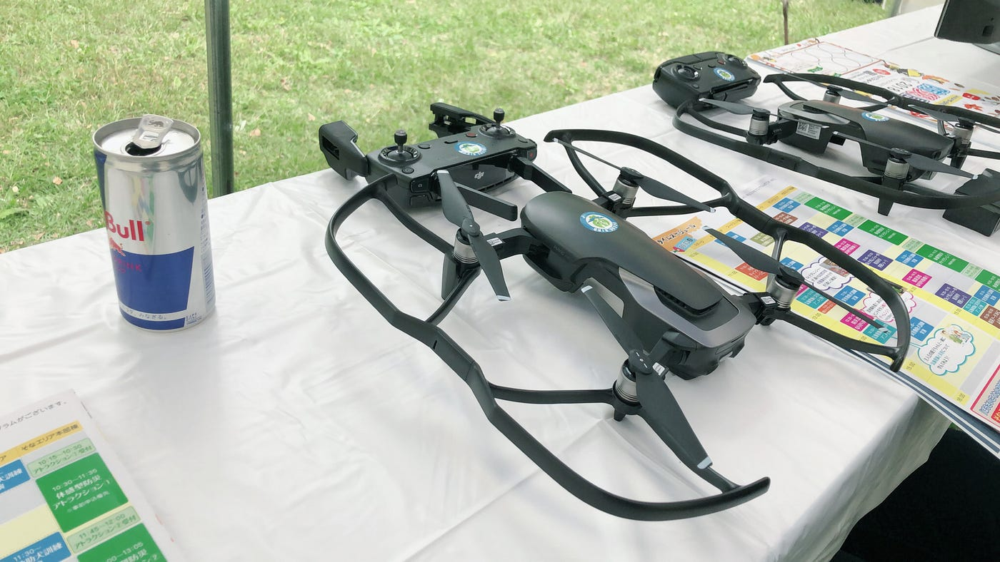
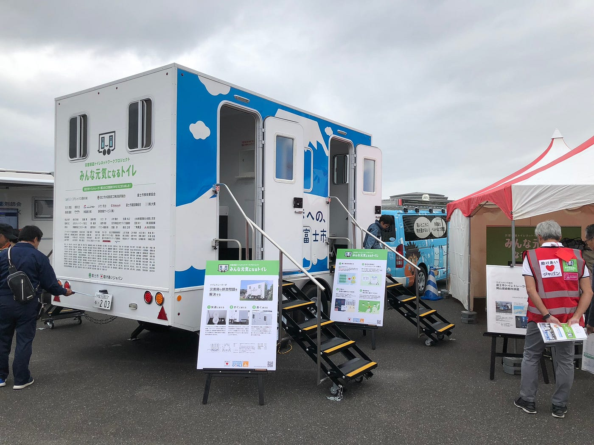
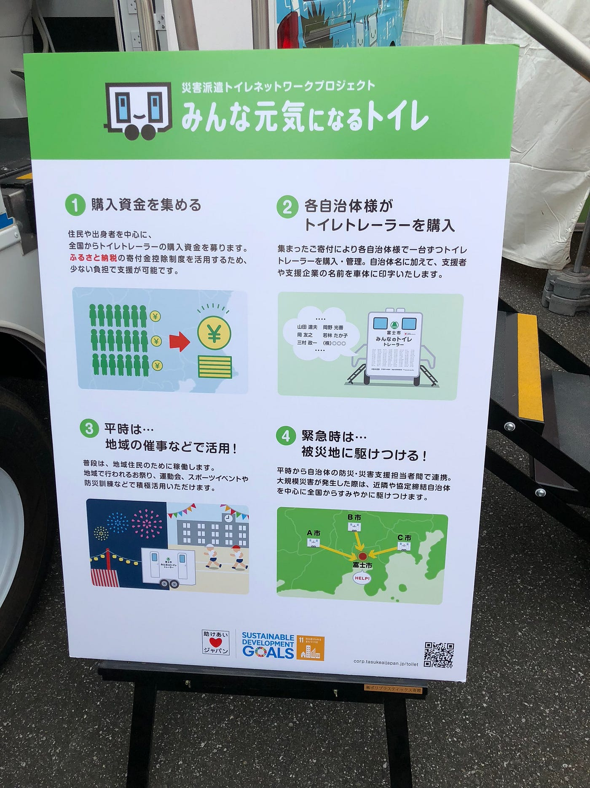
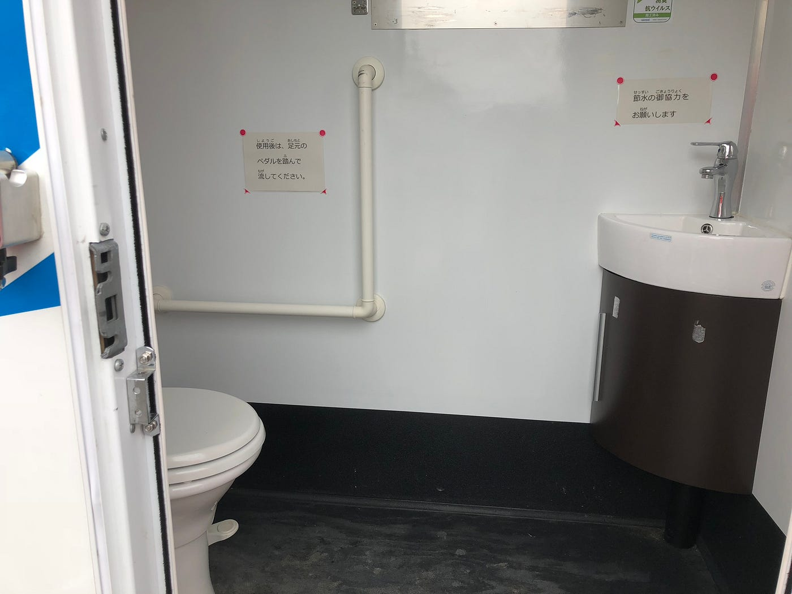
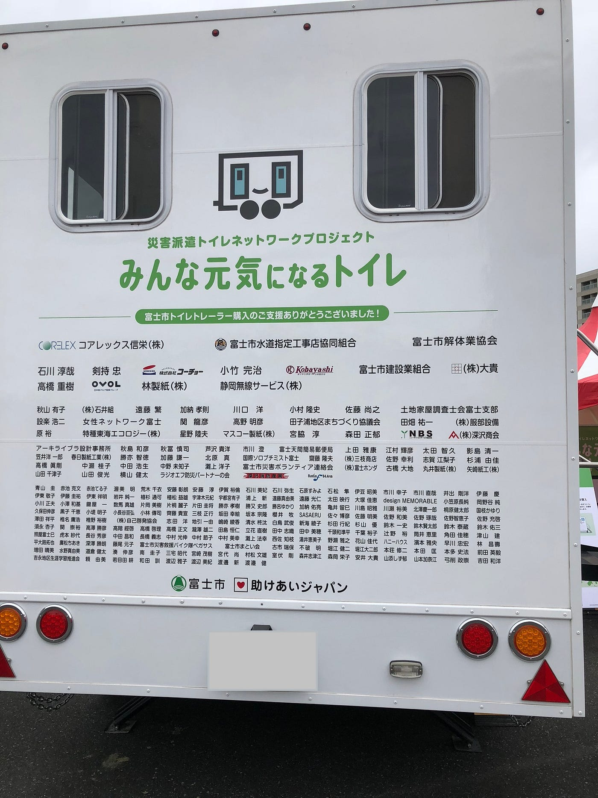

### こんなのがあったぞ防災展in東京防災展2018

いつくるかわからない災害に、普段から備えよう。

### #1 はじめに

大変寒い時期となってまいりました、皆様お元気でしょうか。私は少し風邪気味な、3年の武末です。本日ご紹介させていただくイベント、

### [東京都防災展2018](http://www.bousai.metro.tokyo.jp/taisaku/1000060/1000427/1006003.html)

### [ぼうさいこくたい2018](http://bosai-kokutai.jp/)

これらは東京都主催と内閣府主催のイベントで、東京ビックサイトで同時開催となりました。僕はこのイベントの一日目にNPO法人クライシスマッパーズ・ジャパンのブースで参加したのですが、とても多くの経験を得られましたのでここで共有したいと思います。

### #2 とりあえず活動報告

[東京防災展20181日目 - Kouki Takesue's 6.3 mi run
Kouki T. ran 6.3 mi on Oct 12, 2018.www.strava.com](https://www.strava.com/activities/1901205747)

### #3 到着・設営

土曜日ということもあって駅は相変わらずの人混み。設営ブースである臨海公園へはこの駅から徒歩10分くらいです。

ビックサイト側から入場したので最初このテントが見つからずかなり焦りましたが、公園内に入ってしばらくすると見えてきました。素直に西口から入ればよかったと反省。事前にいただいていた地図を元に自分たちのブースを発見、ご一緒する方とも無事合流できました。

この設営は特に問題もなく、10分くらいで完了しました。途中Macbookのコンセントの形が備え付けの電源（ディスプレイ後ろ）に合わず、急遽運営の方から延長コードを借りて対処しました。今後もこのようなことがあるかもしれないのでコネクターのタイプには要注意ですね。

少し気になったのはポスター。本来は額に入れて吊るすのでしょうが（運営からフックと紐の貸し出しがある）今回持参したのはポスターそのままだったのでガムテープを見えないように貼り、ポールに巻き付けてあります。後ろにも揺れないように一枚横に。これで風も問題ないです。

あらかじめドローンは家で充電しておき、説明書で組み立て方を確認してあったのでスムーズにセットできました。元々飛ばす予定はなかったのですが、もしかしたらという事態を予測してFWのアップデートも済ませておきました。その際にも更新中に本体充電が50％を切り、アップデートが中断されるということが多発したので、これも備忘録として残しておきます。だいたいの問題はフル充電と再接続でなんとかなるっぽいです。

[Mavic Air ユーザーマニュアル -DJI](https://dl.djicdn.com/downloads/Mavic%20Air/um%20/Mavic%20Air%20User%20Manual%20v1.2_JP.pdf)

今後使う人のために公式のマニュアルとプロペラガードの取り付け動画を共有しておきます。

これで設営完了です。お隣様への挨拶も忘れずに。

### #4 みんな元気になるトイレ — 一般社団法人助けあいジャパン様

度々古橋教授のお話にも登場する「**[みんな元気になるトイレ**](http://corp.tasukeaijapan.jp/toilet/)」、ネットである程度調べて知識はあったのですが、今回ぼうさいこくたいブースにて実物が展示されていると聞いて早速確認しにいきました。

みんな元気になるトイレとは、一般社団法人助けあいジャパン様が各自治体と協力し、資金を元にトレーラーを購入、管理し、災害時にはそのネットワークを使い全国から必要なトレーラーを派遣するプロジェクト、またトイレトレーラーの名称です。

災害時には多くの設備が必要になります。近年多くの災害から様々な設備が国や団体によって整備されていますが、トイレに関しては未だ有効な一手が進んでいない、というのが現状でした。現在でも多くの避難所で工事現場などで使われる仮設トイレのみ、という場所もあります。しかしながら従来の仮設トイレは、つかいずらかったり、数が足りなかったり、女性の方が安心して使えない等多くの問題を抱えていました。そこでこのプロジェクトでは、全国1741市区町村に一台ずつトイレトレーラーを配備し、被災地に集結させることを目標にスタートしました。

[災害用トイレ搭載トレーラー保有 全国ネット、富士市第１号｜静岡新聞アットエス
大規模災害時の避難所などでのトイレ不足を解消しようと、各自治体でトイレを搭載したトレーラーを保有するプロジェクト「みんなのトイレネットワーク」が始動するのに合わ...www.at-s.com](http://www.at-s.com/news/article/social/shizuoka/bosai/377215.html)

配備第一弾は静岡県富士市で、クラウドファンティングを2017年7月17日に開始。同年9月16日に目標資金額達成とすさまじい早さで進んでいます。その後第二弾、第三弾と続き、現在でも広く活動が行われているようです。

私が実際に確認して驚いたことは、きちんと手洗い台が付いていることですね。災害時にはとにかく節水！というイメージがあり、また、従来の仮設トイレには無い設備なので感心しました。確かにトイレの後すぐに手を洗うことができればその分衛生的にも良いですし、ドアノブからの感染、というのも少なくなると思います。また、スペースも充分に広く、子供と入る親御さんや大きな荷物を持った方でも問題なく使用することができます。手すりもあるので使いやすい方も多いのではないでしょうか。

もう一つ私が個人的に好きなのは、この後方ですね。クラウドファンディングで支援頂いた方のお名前がここに記されています。このように企業のみならず個人でも多くの方が支援しているんだと思うと災害に関する防災意識が芽生えてきますし、こういう形の支援もあるんだなと勉強になります。

### #5 まとめ

今回の防災展には大小問わず様々な団体様が参加しており、大人から子供まで幅広い層に向けて展示や活動を行っていました。クイズにショーにマスコット。しかしクイズに震災の日付を使ったり、VRを使って実際に過去の地震を体験出来るなど、内容は非常に洗練されていているなという感覚がありました。毎年行われている行事なので、興味を持った方はぜひ来年訪れてみてください。
