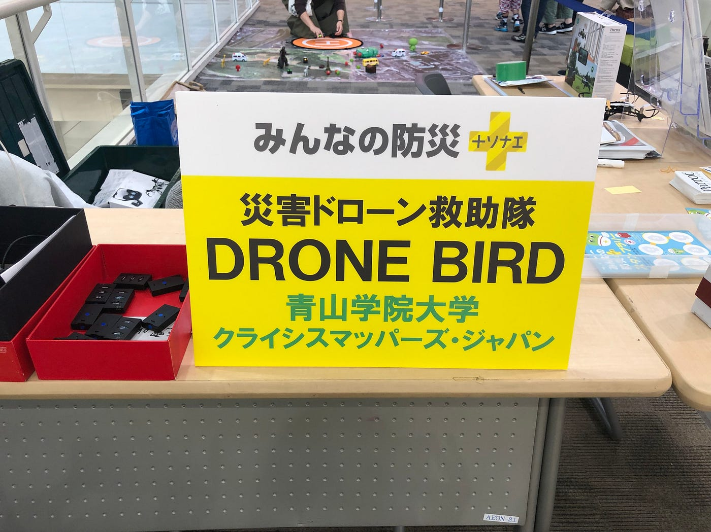
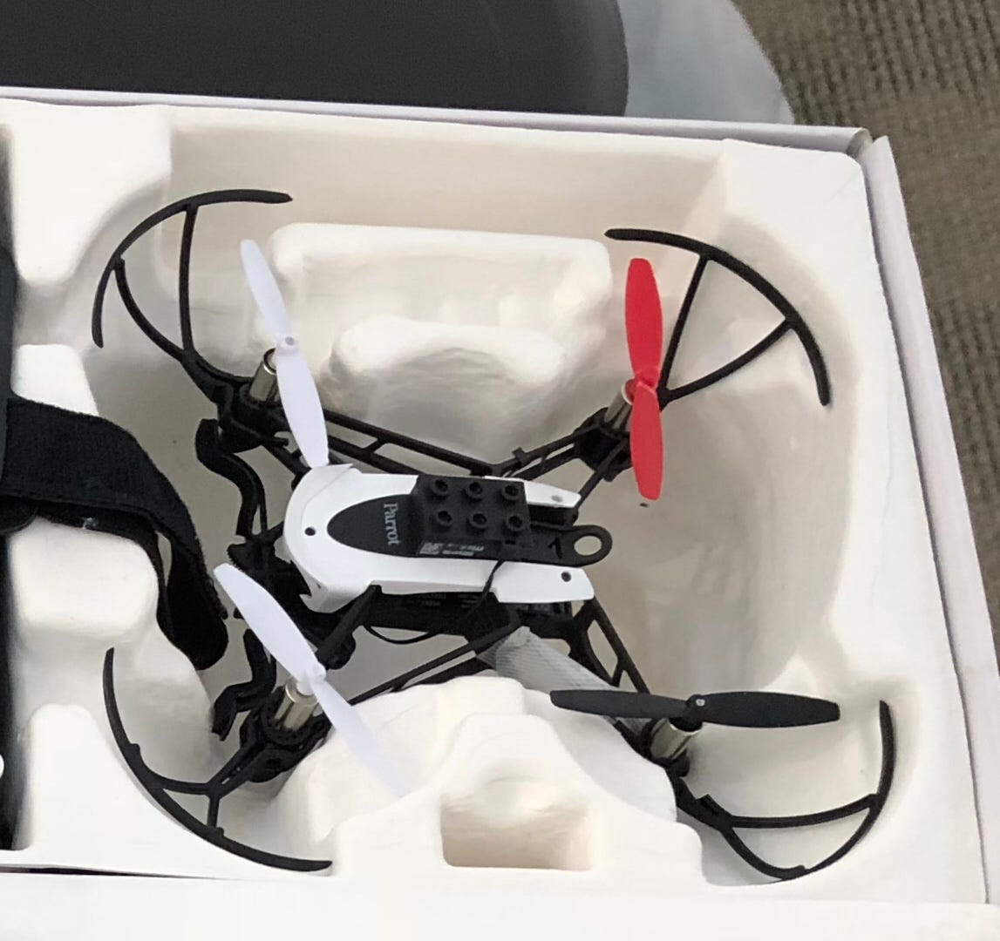
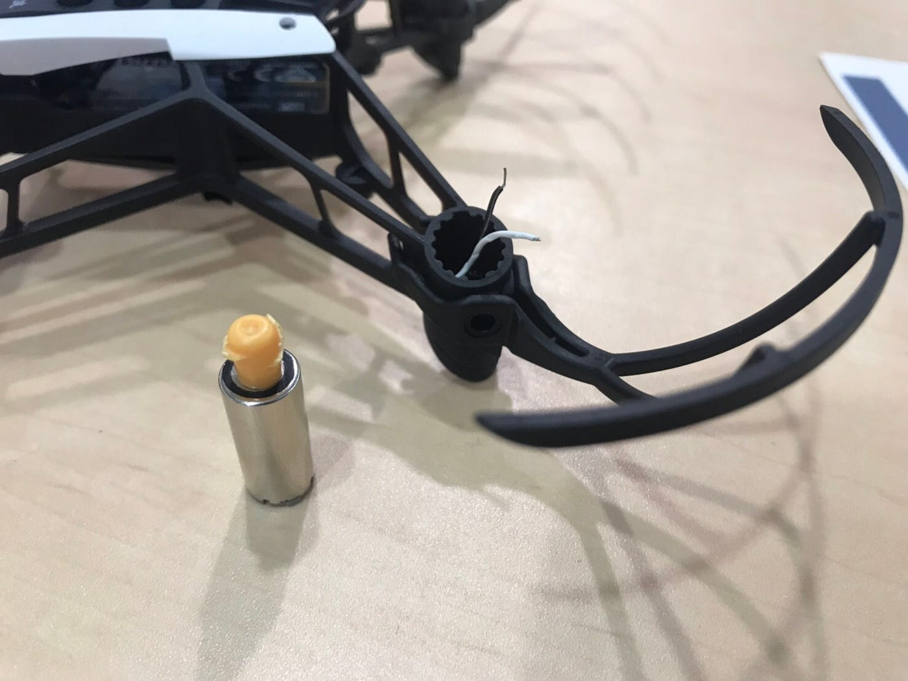
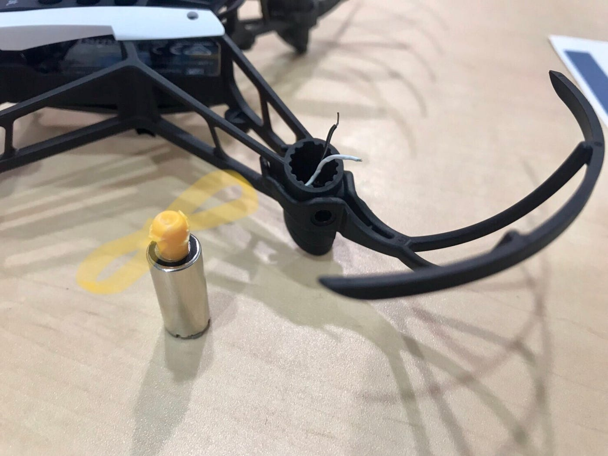
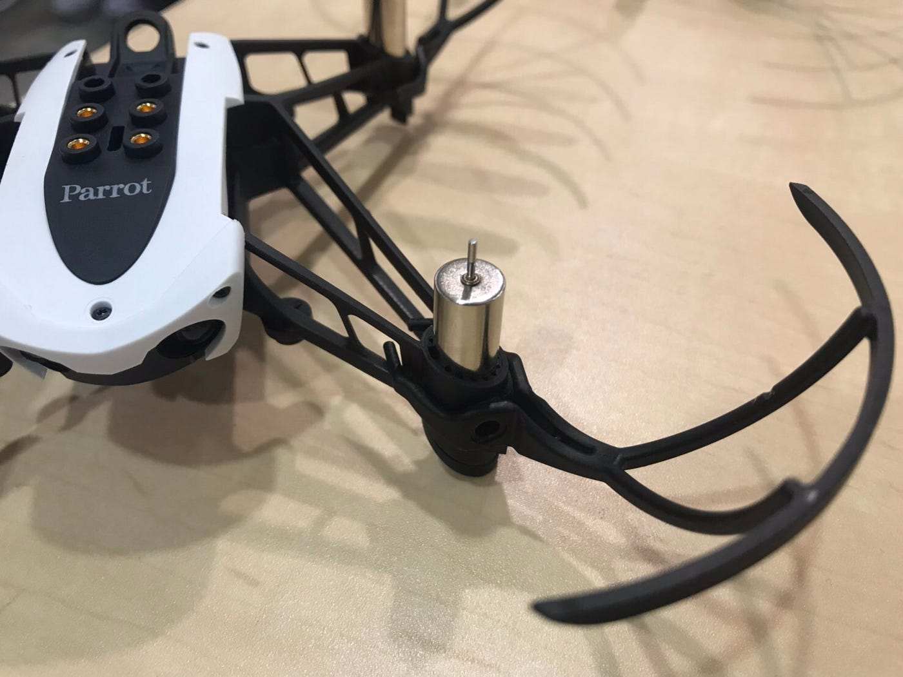
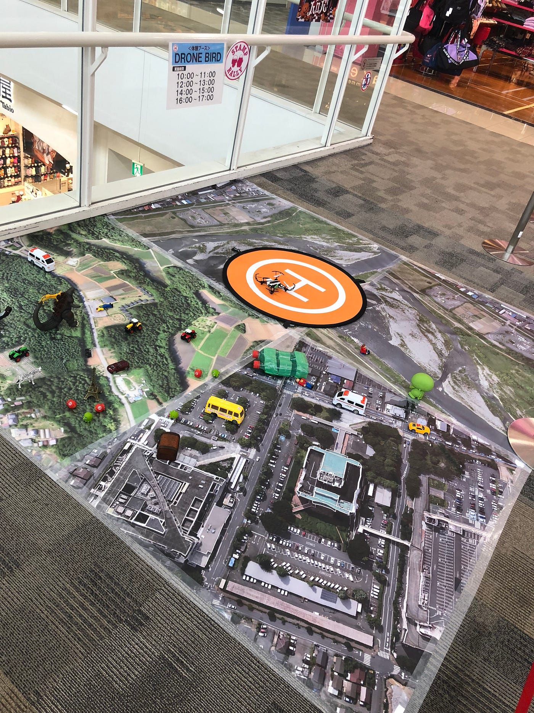
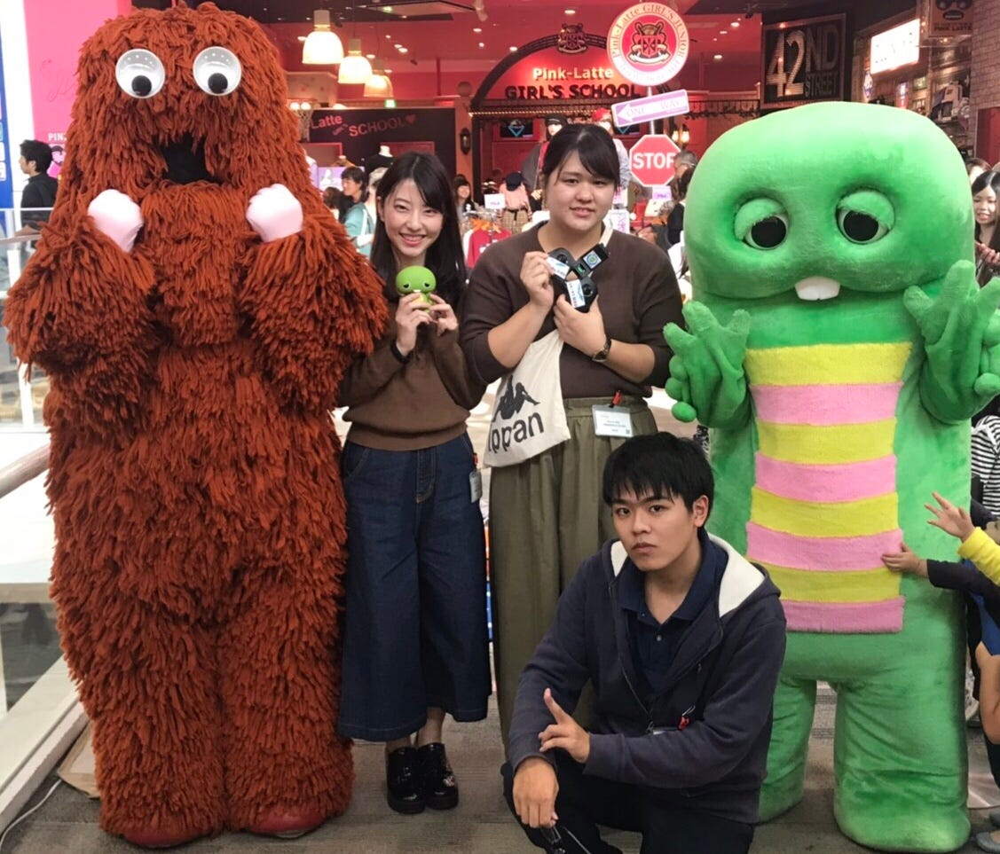

### ドローンワークショップ

### 〜子供にもドローンにも優しく〜 at武蔵村山

こんにちは！古橋ゼミ三年生、多賀谷美里です！10/14に武蔵村山イオンモールにて行われたドローンワークショップについての報告をさせていただきます！

前回のゼミでも報告があったように、今回私たちはドローン3機中3機とも動かなくなってしまうという事件を起こしてしまいました。これをしっかり受け止め、失敗を繰り返さないためにドローン故障についての原因と対策をレポートさせていただきます。

[strava.app.link](https://strava.app.link/VDWnHhFN9Q)

まずはストラバです！行きはつけ忘れてしまい帰りのみになってます。申し訳ございません

### 故障に至った経緯

ドローンを箱から取り出して、ペアリング作業に取り掛かりました！が、なんかうまくいかなく、羽が少し折れていたので付け替える事にしました。

が！すごく硬くて取れません。そして上の写真のようにまず羽が取れ、根っこの部分から抜いてしまい、モーターを壊してしまいました。

### なぜ壊してしまったのか、原因と解決策

- ドローンを優しく扱う

プロペラが取れないからどうしよう！と焦り力任せにやった結果で故障という大変大きなミスを犯しました。振り返ってもこの機の故障は防げたはずだと猛反省しました。

- 古橋先生の指示を仰ぐ

アクシデントが起きたからなんとかしなきゃ！と思う人多いと思います。私たちもその思いで、運営する事に必死でした。しかしドローンについての知識もないのに勝手に操作するのがどれほど危険な行為だったのか考えてませんでした。先生に連絡をすれば必ずヒントがもらえるので、自分達でどうにもできない場合はすぐに先生の指示をもらうべきです。

- ドローンについての知識

質問攻め対策、以前にドローンについての知識、経験が少ないならば出来る限り増やす努力を続けるべきです。

### 全体を通して

全体を通してこのイベントの感想を述べますと、子供に教えることの難しさを実感しました。 思ったよりも子供は言うことを聞いてくれませんし、力も強いです。そのため安全第一で運営することは第一です。

また、ドローンについての経験も、知識もまだまだであることを思い知りました。私と末光さんと北野くんがそれぞれ1機ずつ故障の原因と対策レポートしてるので、読んでもらって2度と同じ故障が起きないように、参考になったら嬉しいです。

次回は大阪のイオンモールに参加するので、反省を活かし、子供にもドローンにも優しい姿勢を心がけます！

