### OpenStreetCamというツール

「OpenStreetCam」とはスマートフォン用の**ストリートビュー作成用アプリ**。iOSとAndroidの両方のアプリがあり、これらのアプリは[Telenav](https://wiki.openstreetmap.org/wiki/Telenav)が作成・運用している。

OpenStreetMap(以下OSM])のストリートビューと聞くと以前紹介したMapillaryというツールを思い出す方もいるかもしれない。下記にMapillaryを紹介した時のブログを載せる。

[Mapillaryというツール
「Mapillary」とはスマートフォン用のストリートビュー作成用アプリ。もちろん観覧も可能。Google…medium.com](https://medium.com/furuhashilab/mapillary%E3%81%A8%E3%81%84%E3%81%86%E3%83%84%E3%83%BC%E3%83%AB-e6f19c6fb668)

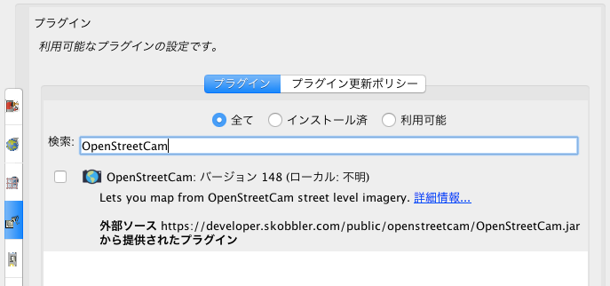

OpenStreetCamではたまにアプリが強制終了してしまったり、アップロードができなくなってしまうなどのトラブルもあるが、その際は何度か挑戦すれば解決するだろう。

それではOpenStreetCamの使い方を紹介する。

#### ・アプリ初めての画面

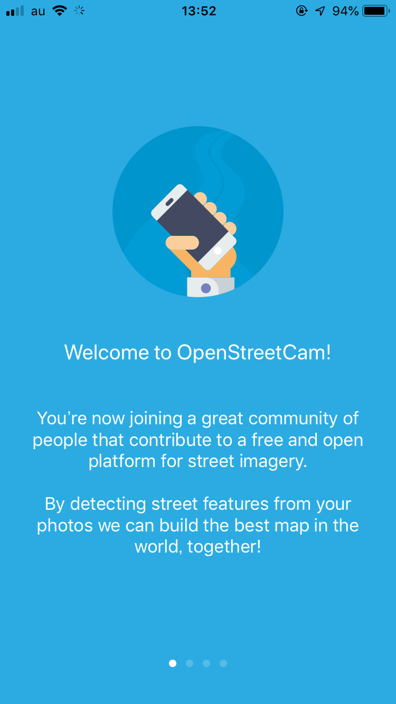

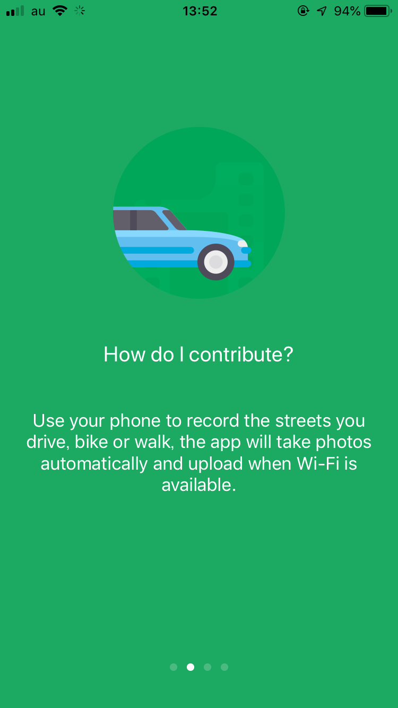

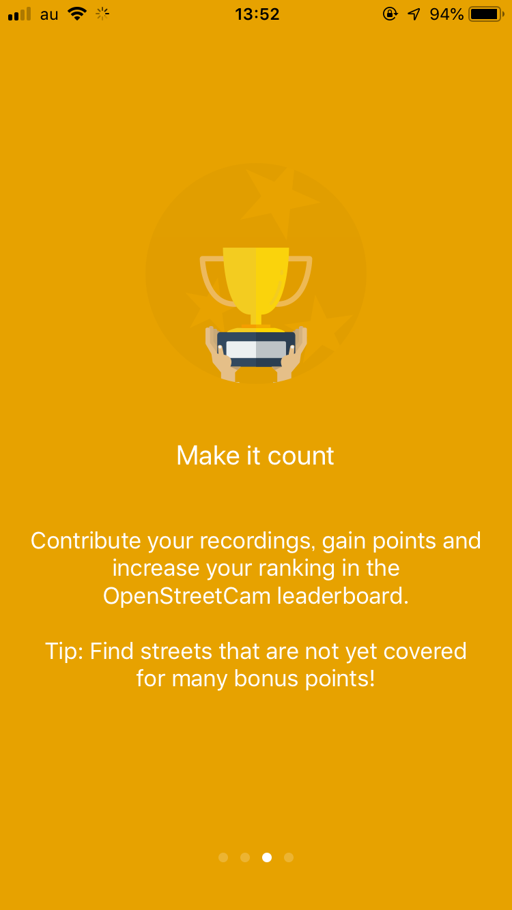

#### ・ホーム画面

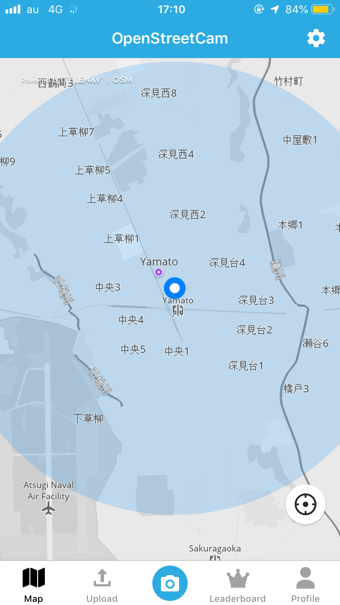

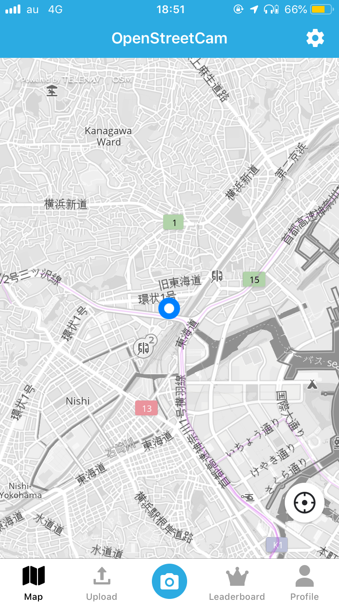

#### ・ストリートビュー撮影

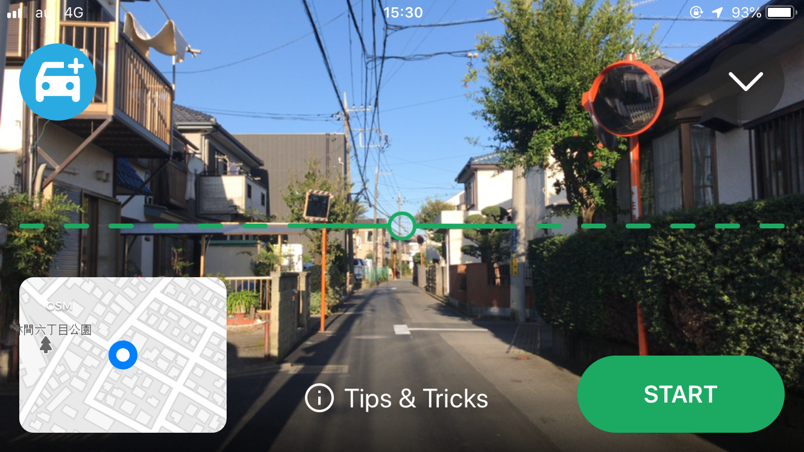

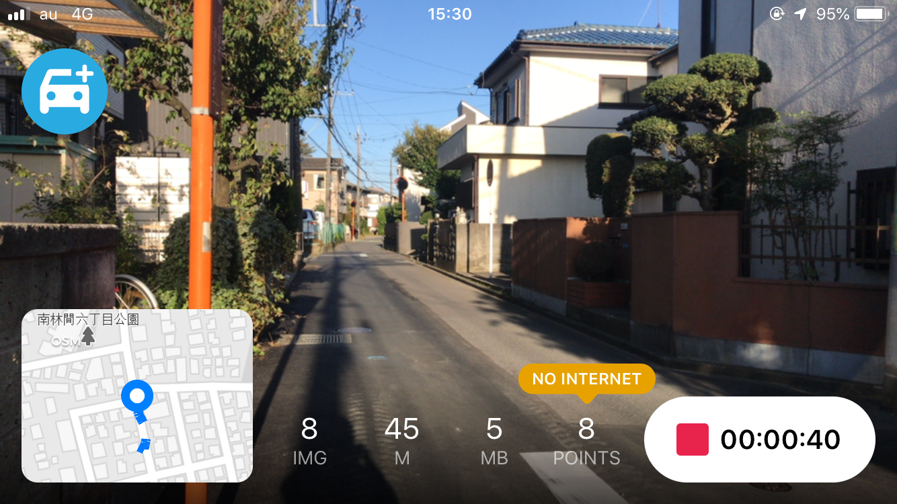

#### ・撮影終了と車につなぐ機能

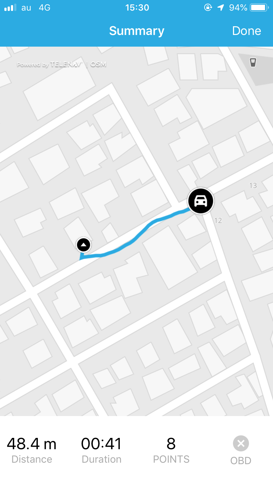

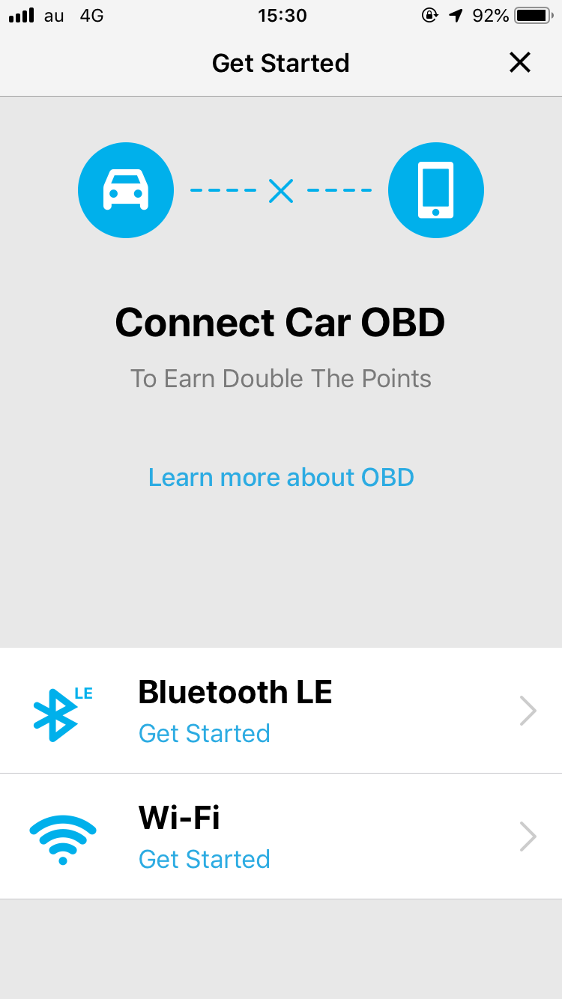

#### ・位置情報拾えないパターン

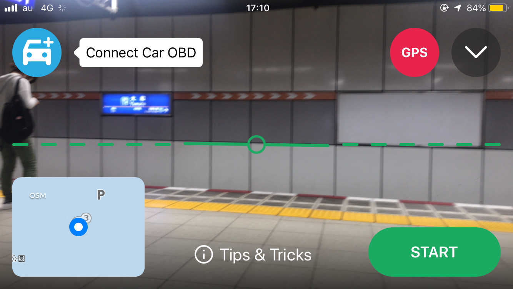

#### ・プロフィール画面

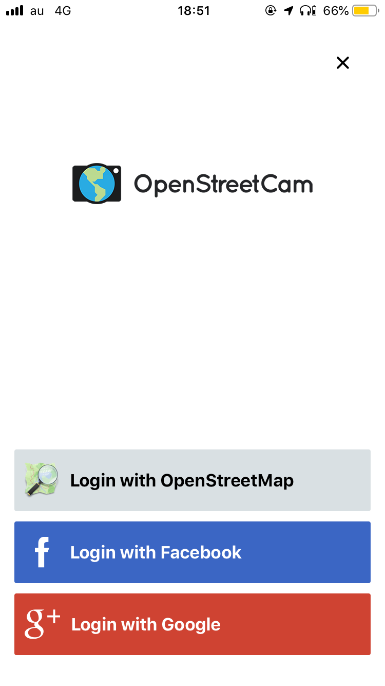

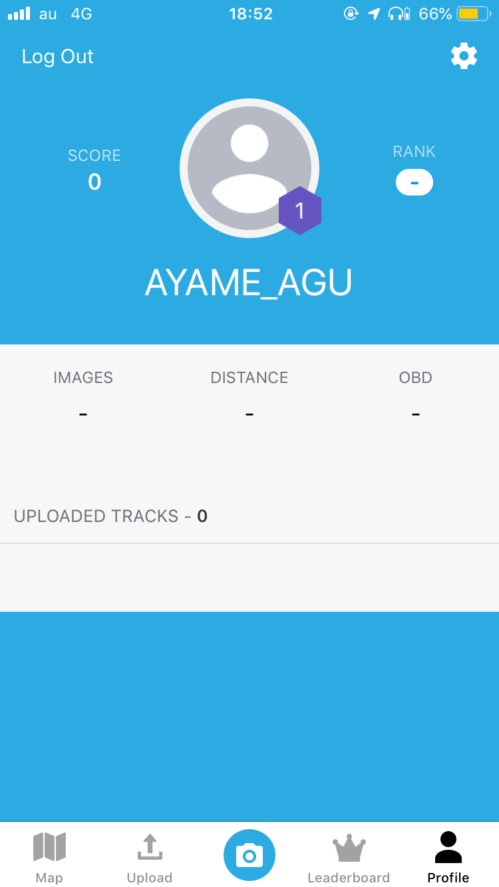

#### ・アップロード画面

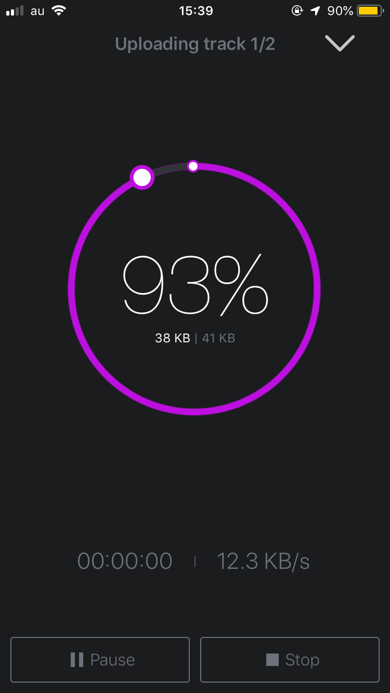

#### ・他の機能、ランキング

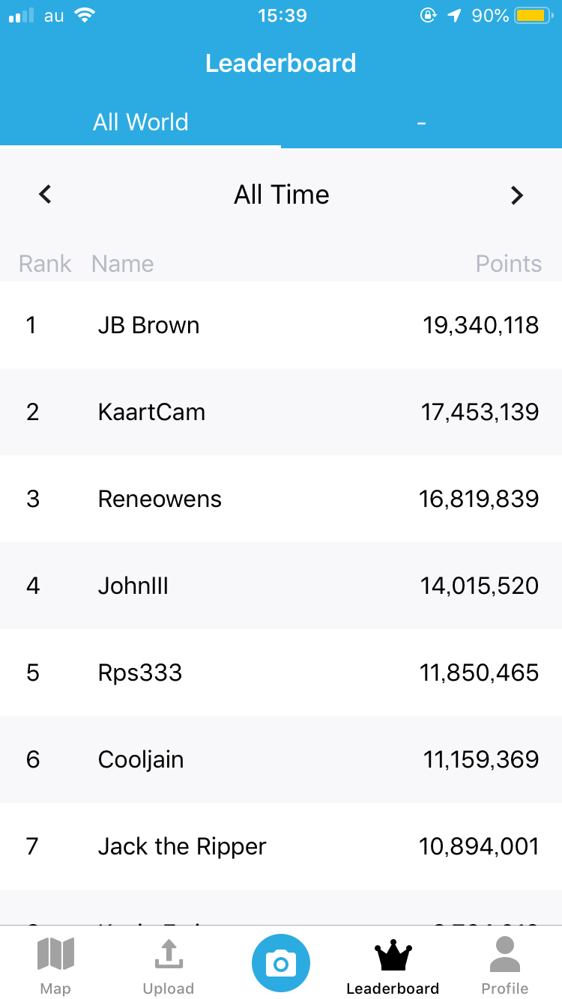

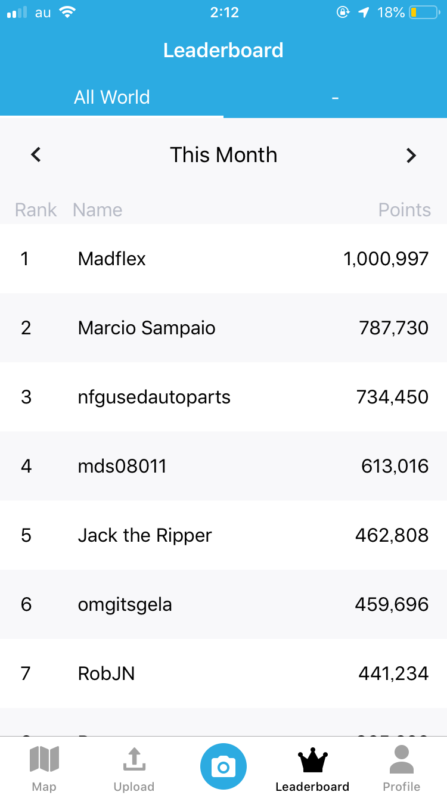

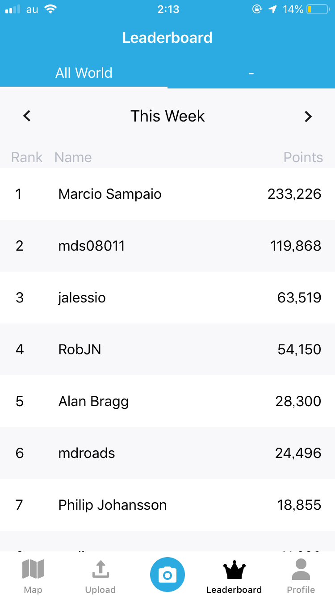

以上、今回はOpenStreetCamの紹介。

これでOSMの編集ツールの紹介は一通り終わったので、次回はついに私の卒業作品の話をする。OSM編集ツールを作成するつもりだが、現在多くの壁にぶつかっている。それを赤裸々に語りたい。

それではまた来週〜。
