### 火災と地震と飢えを1日で体験することができました。

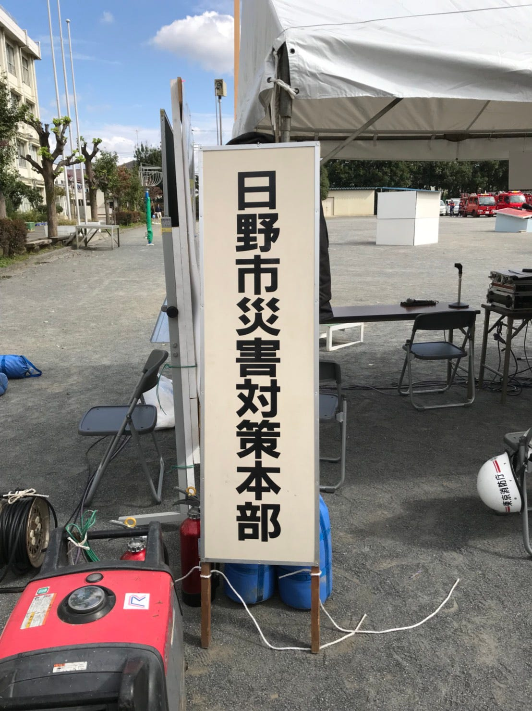

こんにちは。青山学院大学 地球社会共生学部 古橋研究室 3年 渡辺匠です。今回は10/20に日野市立第五小学校で開催された日野市総合防災訓練にクライシスマッパーズ・ジャパンの一員として参加させていただきました。

防災訓練の開始時刻は12時からだったのですが、私たちはその前に行われるリハーサルを行うべく9時に小学校に集合となりました。今回は学生のみの参加ではなく、ドローン芸人の谷プラスワンさん、古橋教授の高校時代？の後輩であった馬場加奈子さん（12時からお手伝いに来ていただきました。）と共にクライシスマッパーズ・ジャパンの活動を行いました。

まず、谷プラスワンさんと体育館で合流し、その後演習という時間にドローンを飛行させたり、体育館でドローンを展示、実演したりするのでバッテリーの充電、そしてドローン本体とコントローラのペアリングなどを行いました。プロジェクターにもしっかりと古橋教授を投影することができました。

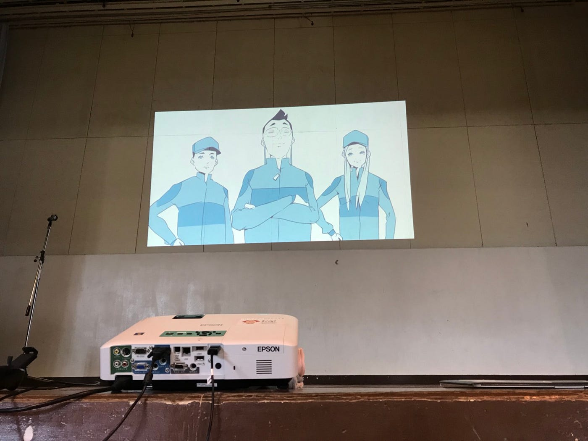

また、準備の際には、谷プラスワンさんがとても興味深い代物を持ってきてくれていました！

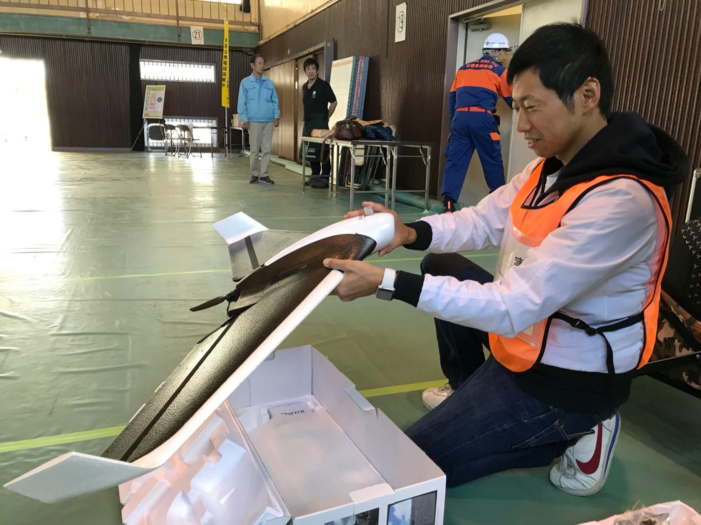

固定翼タイプのドローンです！多くの人はドローンと聞いて思い浮かべるのは４つの羽がある回転翼タイプのドローンじゃないでしょうか？本当にこんなものが飛ぶのか？という疑念があったのですが、谷プラスワンさんからどのように飛ぶのかということを詳しく教えていただいて納得することができました！

バッテリーの準備などが一段落した後にリハーサルまでまだ時間があったので、学生はTelloを使ってドローンの飛行練習を嗜んでいました。レベルが１上がった気がします。

束の間にリハーサルの時間になり、校庭に出ると様々な業種の方々がすでにずらいと並んでいました。

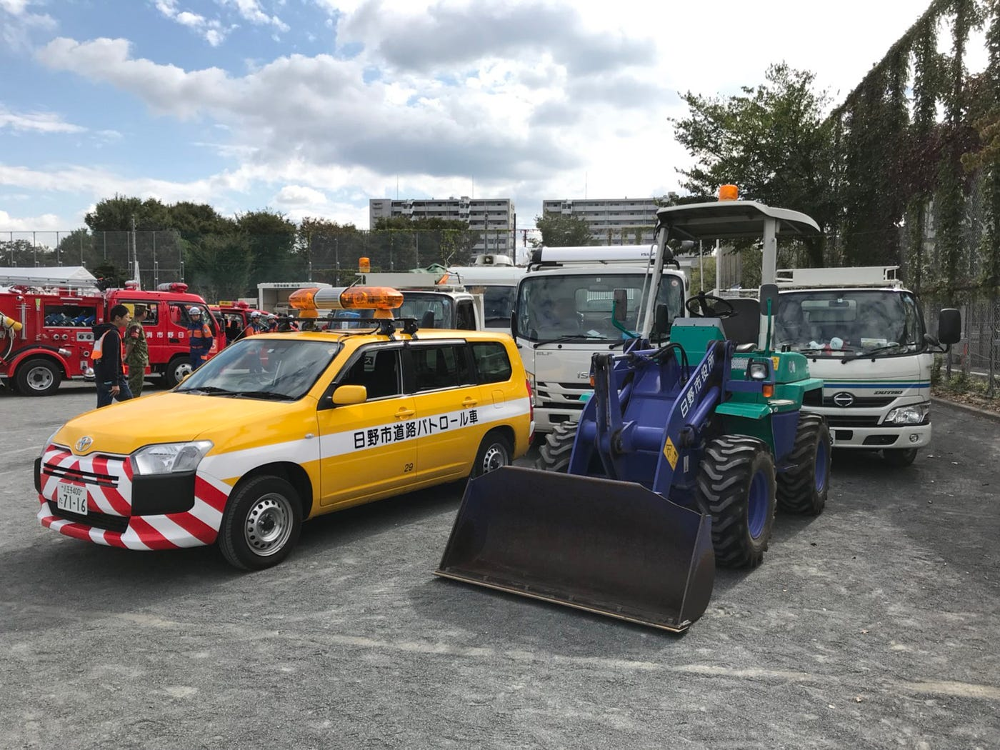

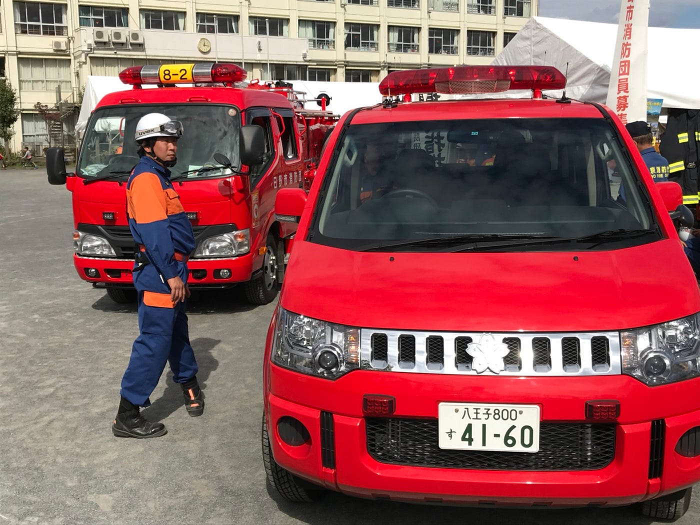

校庭に来ると消防団の方々が緊急脱出を行う場面のリハーサルを行っていました。垂直に降下するパターンとジップラインのように降下するパターンの２つを行っていました！とてもかっこよかったです！

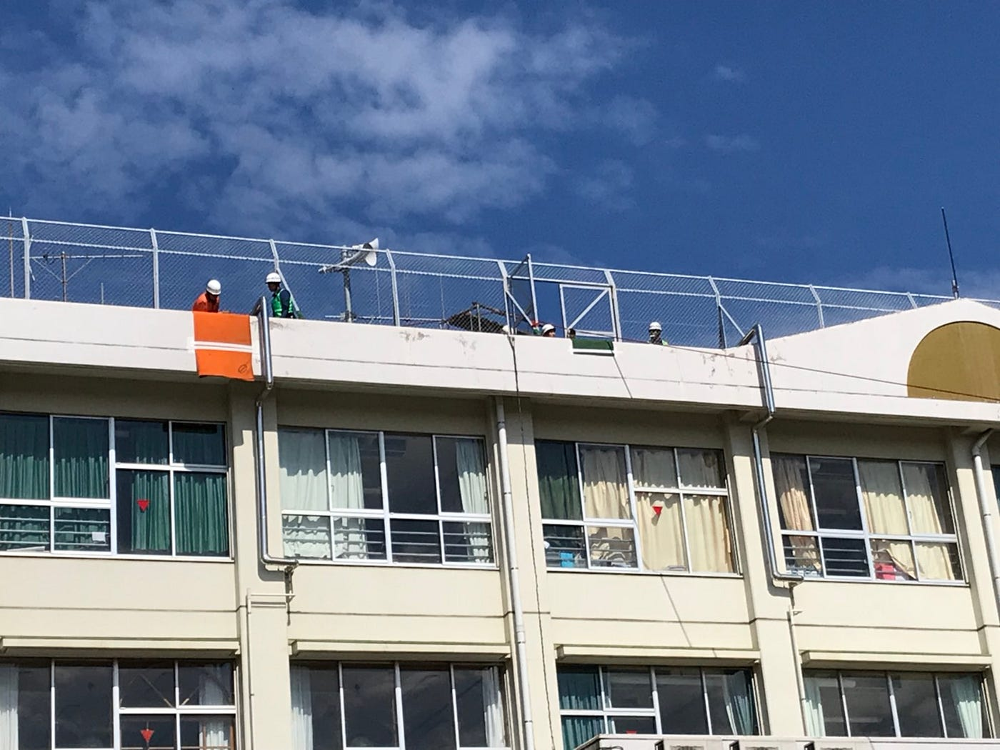

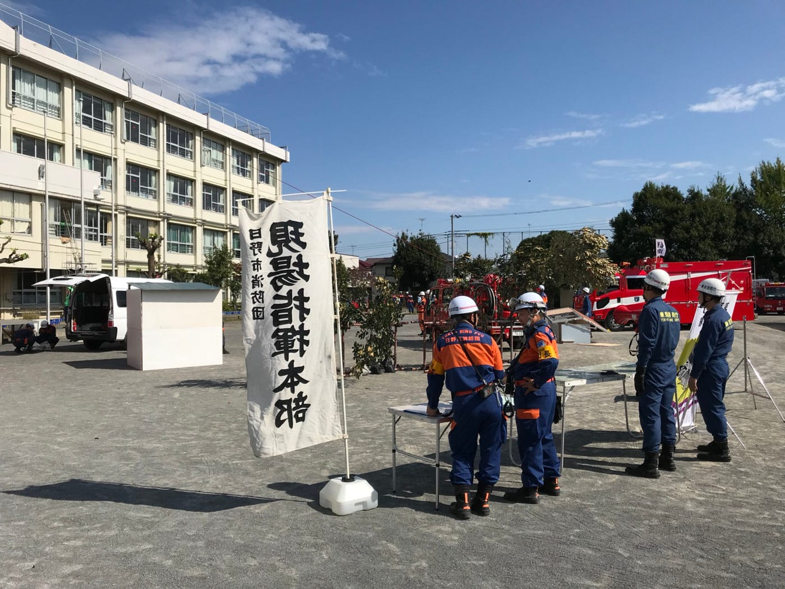

上の画像は災害が起きた際に、遮蔽物が進路を塞いでいるというシーンを想定した演目のリハーサルの風景です。本番では実際にチェーンソーなどを使って中にいる人形を救出したり、消防車が放水をしたり、と実戦さながらの迫力さでとても惹きつけられました。

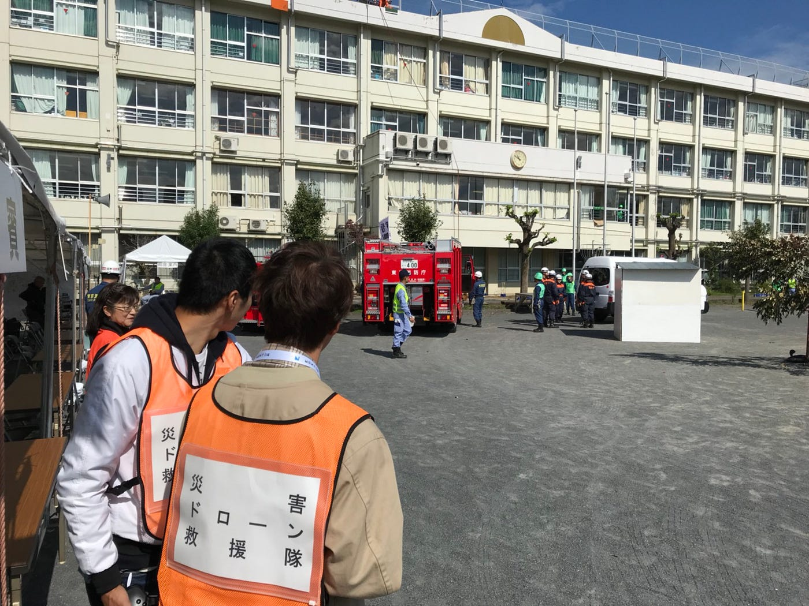

いよいよ私たちの番が来ました。今回の防災訓練では室内用の小型のParrotを使用しました。順調にいくのかと思いきや、風が強いという悪条件のなかでの演習になりました。常にどこからか風が吹いている、そんな状態でした。ドローンを飛ばすも、常に風に煽られていて、時には谷プラスワンさんですら制御不能に陥ることもありました。リハーサルだけでなく、本番もほとんど同じような状態だったので、飛行時間を短くし、あとはドローンを手に持って参加者に見せるという方針に変更しました。

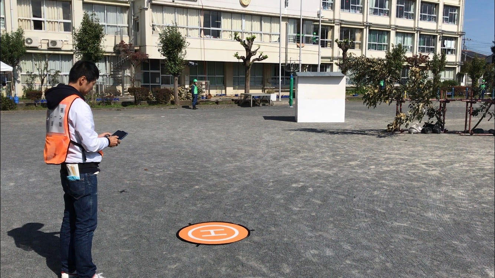

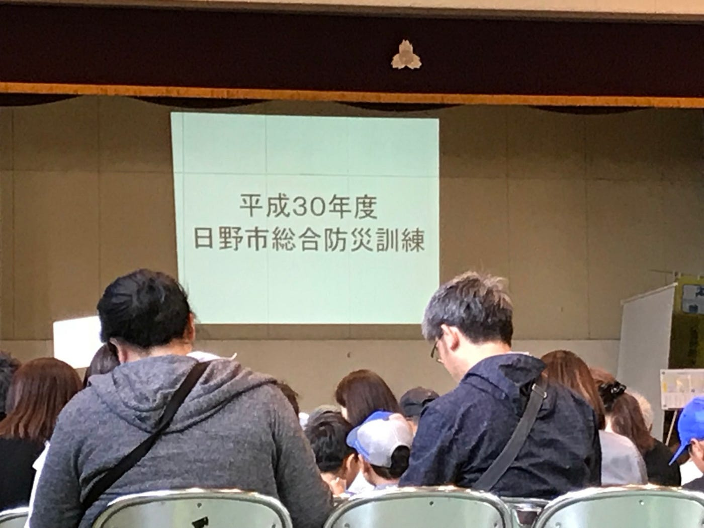

12時からは体育館で講演があったため、私たちは校庭の展示を見に行くことにしました。すると、先ほど見かけた消防車やパトロール者だけでなく、興味をそそる車両も来ていました。

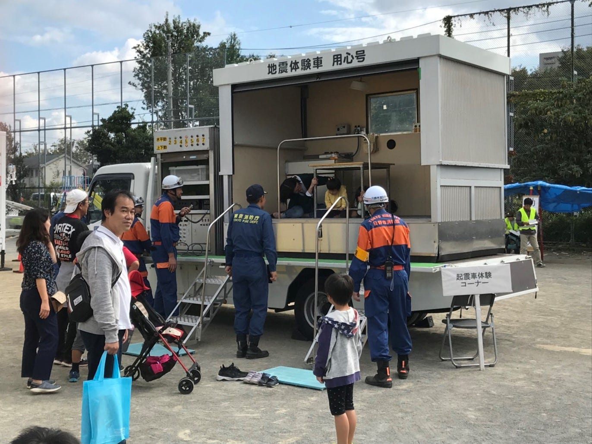

見た瞬間に「やってみたい」という衝動に駆られました。生まれてから震度７を実際に体感したことは一度もありませんでした。教科書で震度７は立つことができないとはっきりと断言していたので、本当なのだろうか、と疑っていました。そこで、実際に体験してみることで確信を得られると思ったので、実際に体験してきました！

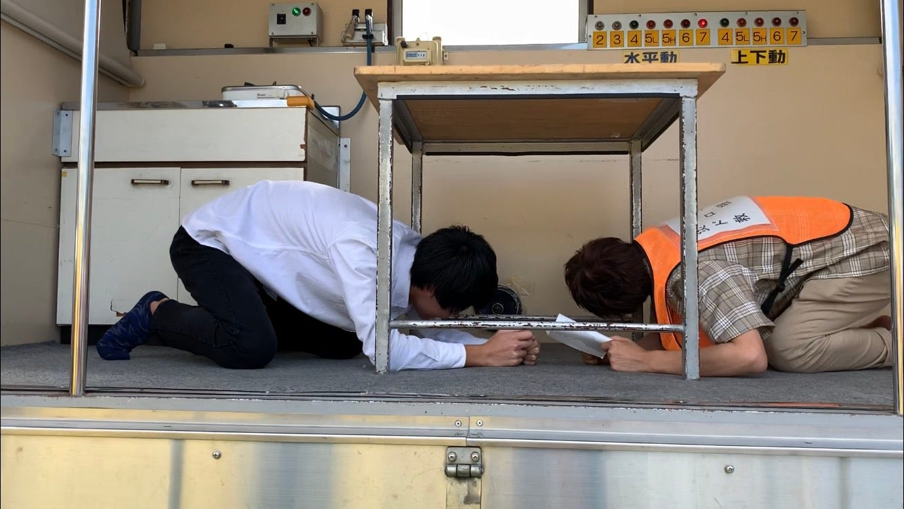

立つどころか四つん這いの姿勢を保つことすら非常に困難でした！震度７どころか震度５強あたりから既に四つん這いの姿勢がとても辛くなってきました。東日本大震災が起きた時、私が住んでいる地域は震度5弱でした。パソコンのモニターが倒れたりしたのですが、まだその時は立っていることができました。しかし５強になった途端に全くの別物でした。周囲の音などは全く聞こえずガタガタという音のみが響いていました。このような体験ができたことは非常にありがたいと思いました！

この起震車の隣には火災が起きた際の煙が充満した空間を再現したイベントスペースがありました。こちらも実際に体験してきました。

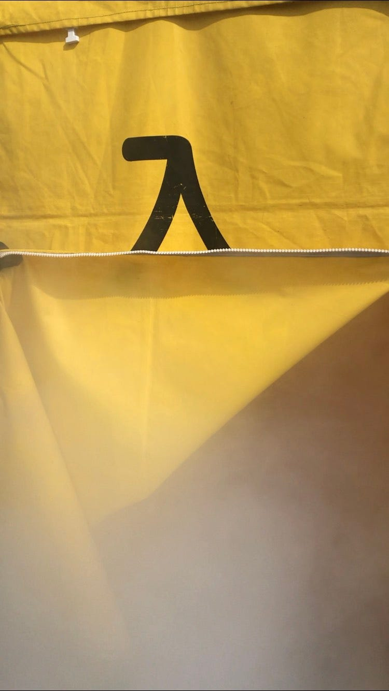

入口に立った際に撮影した写真です。既に煙が立ち込めていて全く見えない状況でした！

中に入ってみると、視界がほとんど塞がれてしまっていて隣にいた板垣くんですらほとんど視認することができない状態でした！中を歩いていると急に目の前に垂れ幕が現れました。何もないと踏んでいたのでとても驚きました。

今回は無害な煙を使用しているとのことですが、実際の火災現場でこのような状況が襲ってきたらと考えると、一酸化炭素中毒などの危険性もありとても恐ろしいなと感じました。

リハーサルが終わり、講演が終わり、そして本番も終わった後に自衛隊が提供している炊き出しのカレーを食べる予定をしていました。地元のお手伝いの方によると、自衛隊の方々が作るカレーはとてもおいしいのだとか。朝から何も食べていない状態で防災訓練に挑んだので炊き出しでブランチを取ろうと意気込んでいました。今日一番の楽しみです。お腹はペコペコです。そのようなことを考えながらカレーのもとに向かいました。

しかし、なんと私たちが演習の本番をしている間に炊き出しはすべて無くなってしまい終了の張り紙が…。谷プラスワンさん、学生一同茫然としてしまいました。結局私たちは防災訓練が終わるまで何も食べることはありませんでした。

なんだかんだで体育館でドローンの展示を行う時間になってしまいました。今回の防災訓練ではこのような配置で展示を行いました。

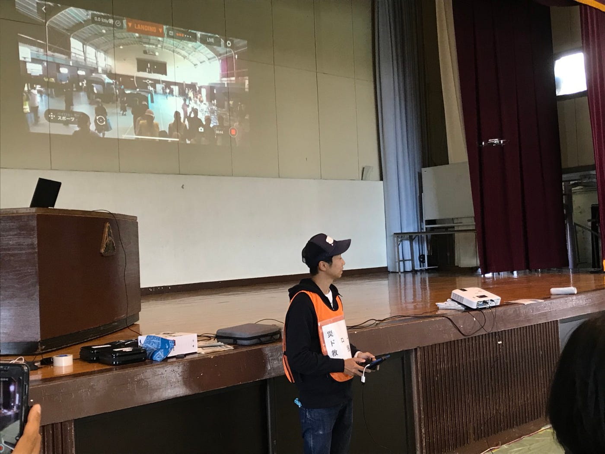

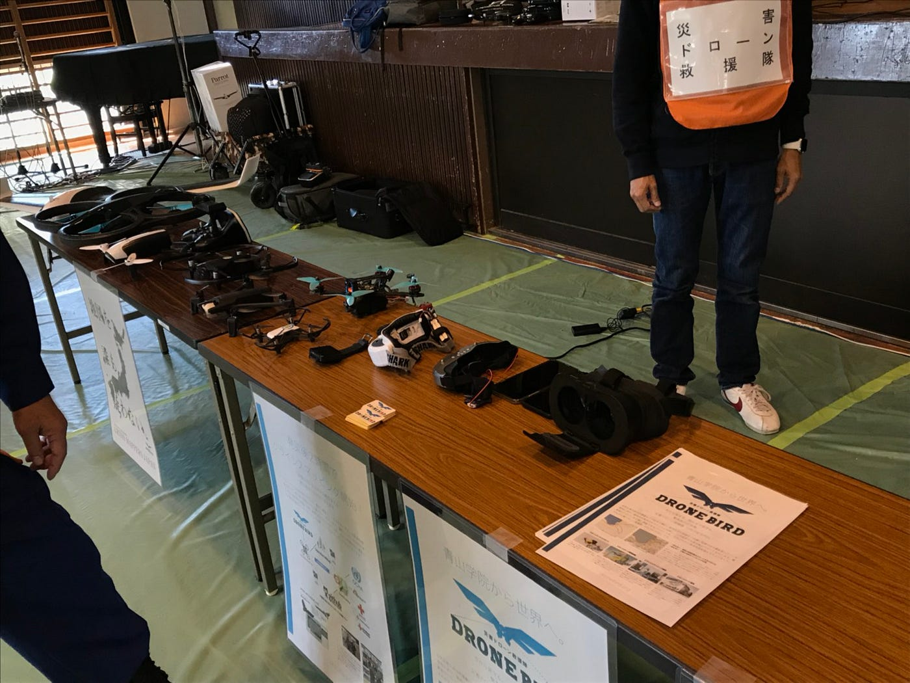

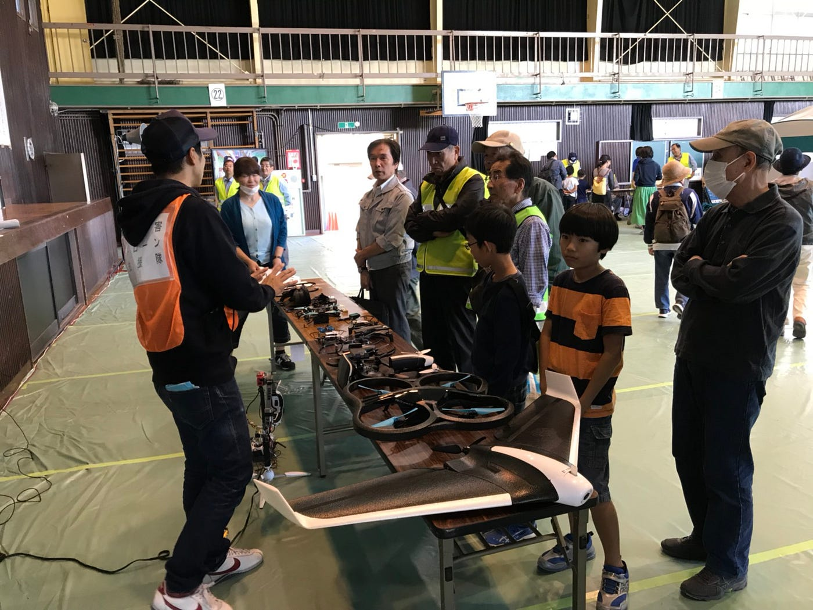

谷プラスワンさんや学生が主体となってドローンの操縦を行いました。谷プラスワンさんはさすがの腕前で様々なドローンや視点でいとも容易く扱っていました！その腕前に大人から子供まで釘付けの様子でした。小さな子供は谷プラスワンさんが操る世界最小のドローンを追っかけたりしてとても満足そうな雰囲気でした！私も負けじとManboを用いて上空を８の字に旋回したりぐるぐると上空を回っていました。板垣くんも負けじとManboを多彩に操っていました。

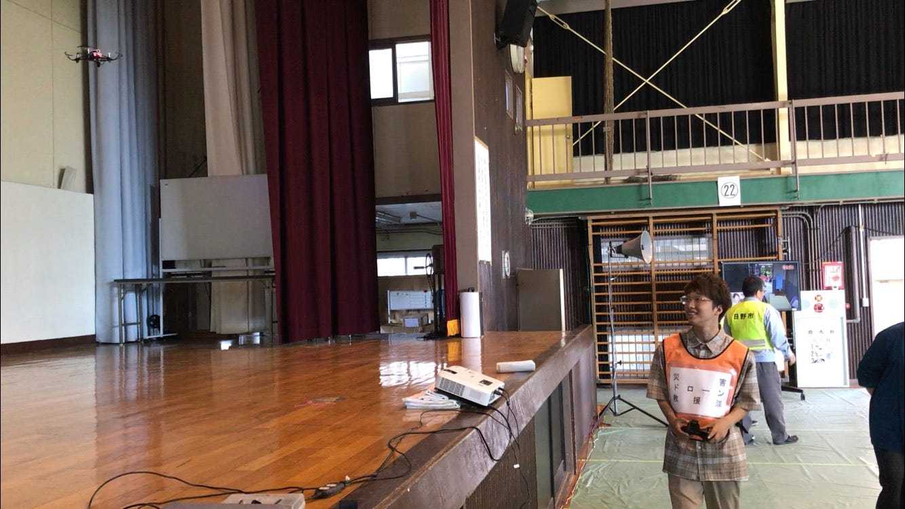

私たちもドローンに夢中になっていましたが、参加者も市の職員の方も夢中になって見ていました！板垣くんと交互にManboを飛ばしたり、参加者の質問に応えたりを繰り返していました。質問の多くはカンペに書いてあった内容がほとんどなのですが、時にはその範囲をさらに超えた内容を聞かれることもありました。例えば、「どこで飛行練習をしているんですか？」という質問に対して「秩父や調布などで行っています。」と答えたら「調布のどこ？」と更に詳細を求める声がありました。私自身もあまり詳しくなかったので、「調布に練習できる専用の場所があります。」とだけお伝えしました。私自身もう少し調べておく必要があったと反省しています。

### **STRAVA**

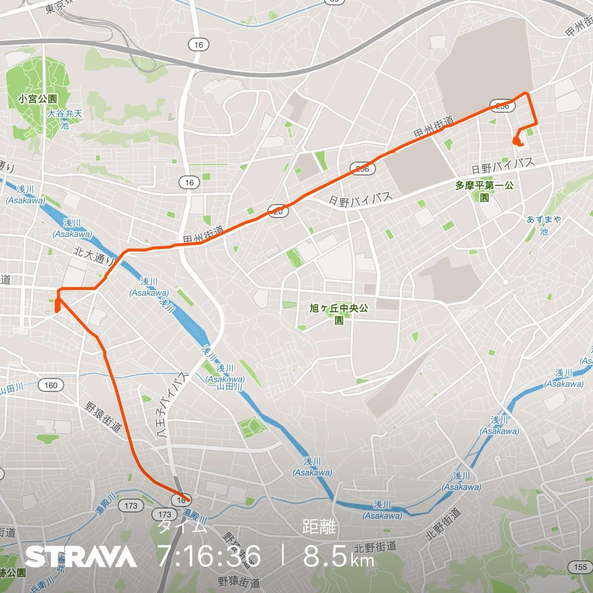

[https://www.strava.com/activities/1915436018/shareable_images/map_based?hl=ja-JP&v=1540017290](https://www.strava.com/activities/1915436018/shareable_images/map_based?hl=ja-JP&v=1540017290)
