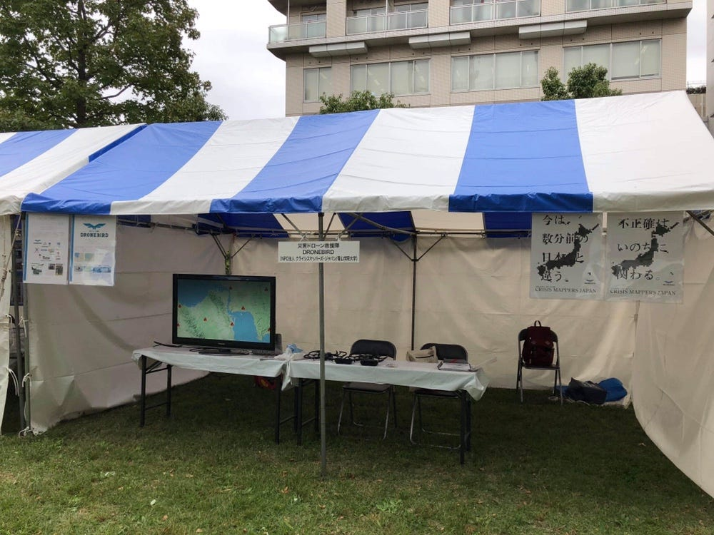

### 防災展のおまめ

日曜日は防災展のDRONE BIRD出展のお手伝いに行ってきました☺︎私は今回が初参加で、防災展に行ったこともなかったので一体どんなものなのだろう、と思いながら向かいましたが、行ってみたら想像よりもたくさんの出展があり、とても賑わっていました！VR体験をはじめとしたただの展示や紹介ではなく体験型の出展が多かったのが印象に残っています。休日ということもあり家族連れが多く、たくさんの子供が防災体験をしていました。中には泣き出してしまう子もいましたが、そのくらいリアルでわたし自身も学ぶことがたくさんありました。

私たち古橋研究室のブースはというと、DRONE BIRDの紹介をし、実際にドローンの展示も行いました。やはりドローンが目に引くのか、通りかかった人の多くが私たちのブースに立ち寄ってチラシとステッカーを受け取ってくれました！最後は足りなくなってしまうくらい、皆さんに興味を持ってもらえました。しかし、せっかく興味を持ってもらって質問してくれても私たちの知識が足りず充分に受け答えできない部分が多くあり反省点です。ですが、質問に答えるということで今の自分に足りない部分がわかり勉強になりました。

中には総務局の方や各地で講演をしている方など、是非広めていきたいと興味を持ってくださる方もいて大きな収穫になったのではないかと思います！

先生からの課題として、元気の出るトイレを体験してくるのともう一つ何か好きなブースに行くということで、まずは元気の出るトイレに行きました。

仮設トイレは初めてではありませんでしたが、まずは仮設とは思えないほどの綺麗さに驚きました。見た目もしっかりしていて、中も広々としていて何と言っても綺麗。災害に遭った方々にとって、こういった施設は安心に繋がるとても重要なものなのだと感じました。元気の出るトイレってどういうことなんだろうかと思っていましたが、お話を聞いても、たかがトイレだけどそういったひとつひとつを安心しえ利用することでそれは心の安心に繋がるし、トイレって生きるには欠かせない、生活の中心にあるものだとおっしゃっていて本当にその通りだと思いました。

もう一つ私が行ったブースは、日曜日のみに行われていた防災体験型アトラクションです。整理券もあって一日に4回しかないレアなもので、行ってみたらそのクオリティの高さに驚きました。内容は、3,4人でグループになって災害時に脱出するため様々な謎解きをして脱出を目指すというものです。もちろん謎解きの内容は防災に関するもので、基礎的なものが多いのですが意外と知らないことが多いことに気付きました。また、音や映像でとても急かされて（笑）制限時間が短いので焦って中々謎が解けませんでしたが、わたしは運良くとても知識のある方々と同じグループになり、なんと2番目に無事脱出することができました。

煙が出ている時は乾いたタオルで口をふさぐとか、新聞紙でスリッパが作れてしまったり、実際に体験型で知識を入れることでリアリティもありとても印象に残りました。最後にはきちんと解説のお話があり、とてもいいアトラクションだったと思います。
