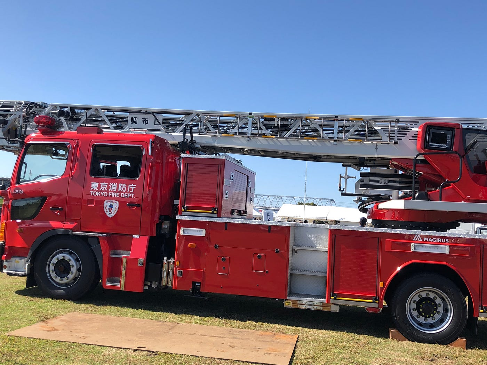
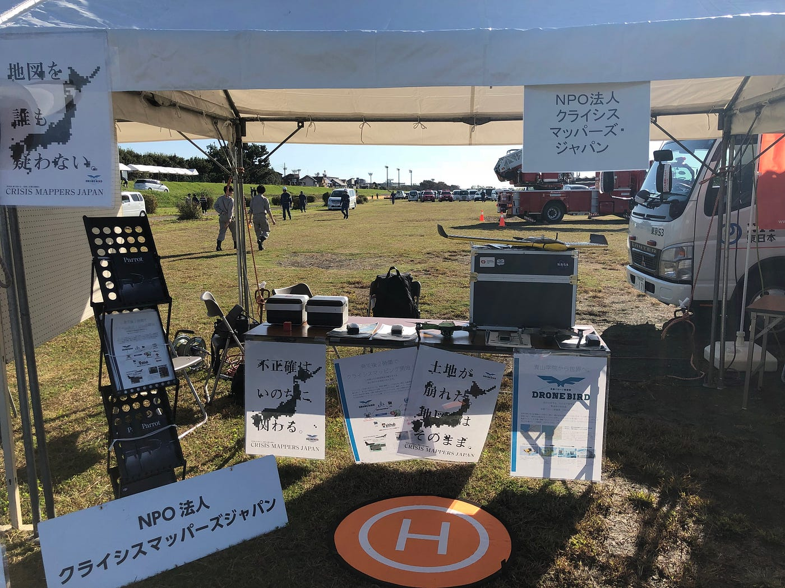
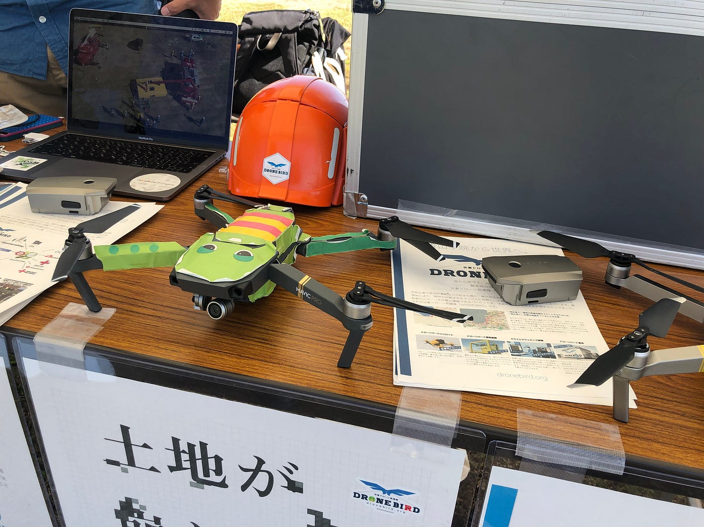
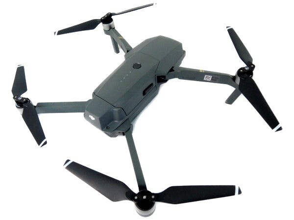
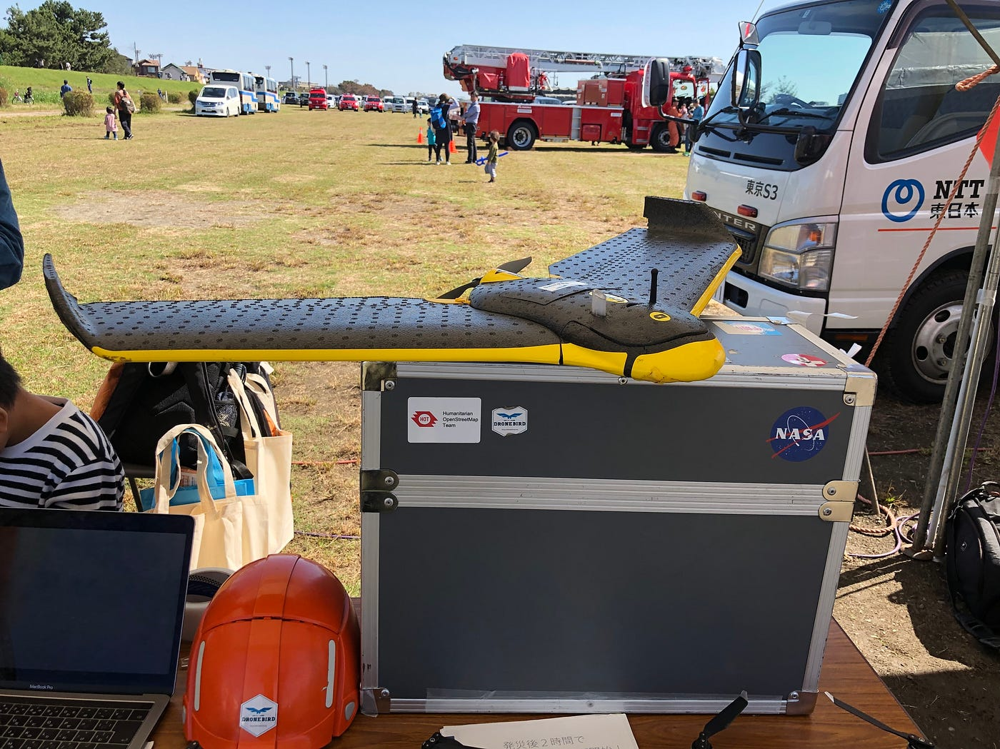
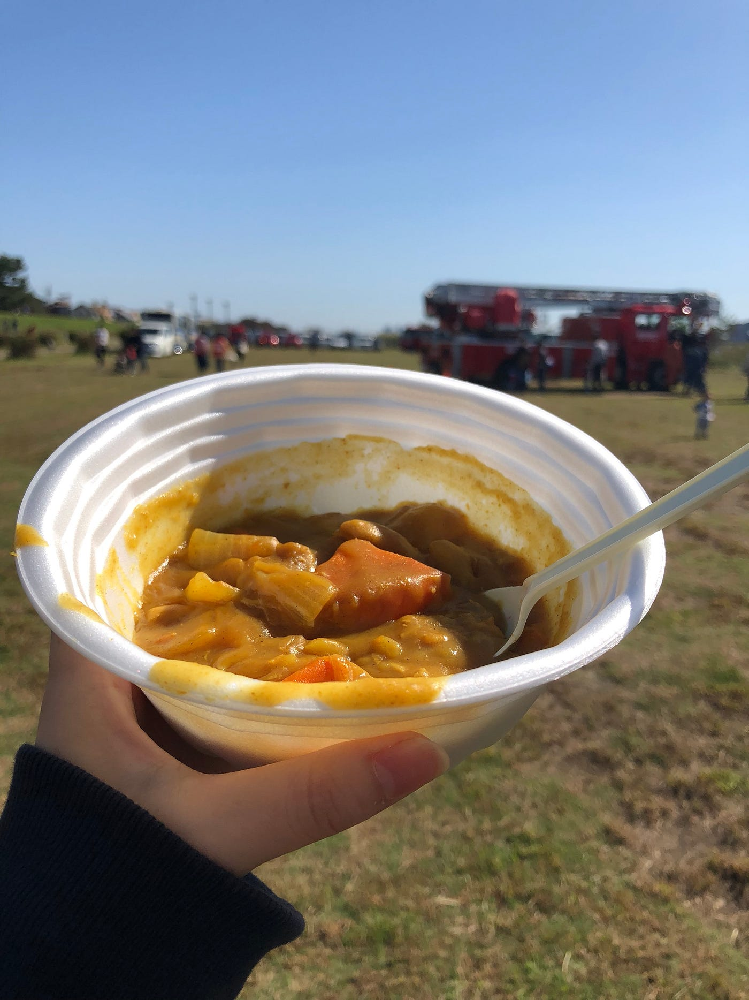
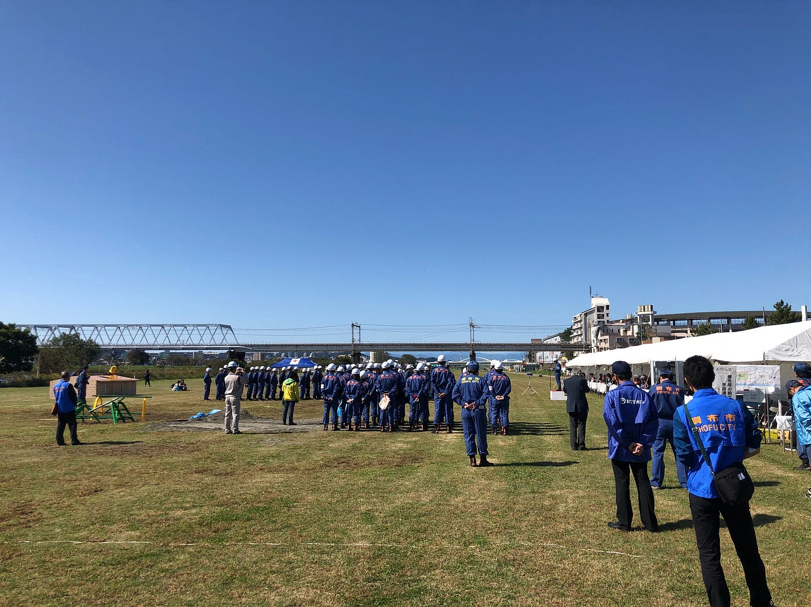

### 300万円ドローンと対面！！ 調布市防災訓練

こんにちは〜！古橋ゼミ3年生の多賀谷美里です！10/14に行われました調布市防災訓練の報告をさせていただきますー！

[strava.app.link](https://strava.app.link/Y7jFuhC3hR)

まずはこちらがストラバの記録です！6時おきで向かいました😪😪

### ブース

ブースはこんな感じで、わたしが到着した頃には先生がセットしてくださっていました！この日はとっても天気が良かったのですが、風が強くていろんなものが飛んでいったり、剥がれたりしました

### ドローンの紹介

タイトルにもあったように、イオンで飛ばしてたあの小さいドローン！の他に沢山の高価なドローンがあります！それぞれ性能が違います。飛ぶことのできる時間や、空撮向きのドローン、地図作り向けのドローンなどの違いがあることがわかりました。

#### MAVIC

上記の写真ではガチャピンの姿になっていますが、このMAVICは空撮に優れています。イオンで飛ばしているドローンは5分ほどでバッテリーが切れるのに対し、こちらのドローンでは15分ほど飛ぶことができるそうです。(説明書では30分ほど飛べるらしいが実質15分ほど)お値段は20万円ほど。

そして！こちらの翼が付いているような、こちらもドローンなんです！このドローンは地図作りのための空撮に向いているもので、お値段は300万🤭ブースに来られた方々も興味津々の様子でした！

### 受けた質問の紹介

私が受けた質問も紹介しておきます！

#### 風で飛んでいかないの？

風速5メートルくらいであればあまり問題はなく、あまりにも強い場合は、ドローン自身が飛びたくないと判断するようです。当日も風は吹いてましたが、風速5メートルほどではなく、大丈夫な様子でした。

### 全体を通して

一言で言うと、すごくいい休日でした！

天気がとてもよく、朝から外で活動ができて、とてもよい時間を過ごすことができました。ドローンの知識が参加するごとに増えていくので、フィールドワーク形式、参加型で覚えていくのがとても楽しいと感じました。

水の保管袋など防災グッズもお土産でもらえたのですが、次いつ、災害が起きるからわからない今、ぼーっとしていては行けないと感じました。

また今回は外国の方が多くいらっしゃいました。タイ留学中に習得した少しのタイ語で会話することができたことはとても嬉しかったです。留学が終わり、必修英語授業もないので、英語を話す機会が減ってしまいましたが、積極的に交流をしたいと思いました。

炊き出しのカレー(ルウのみ🤣)野菜が大きめでとても美味しかったです！皆さん早めにゲットしてくださいね！

来週は三鷹市での防災訓練があるそうです！お天気がいいことを祈っています！
