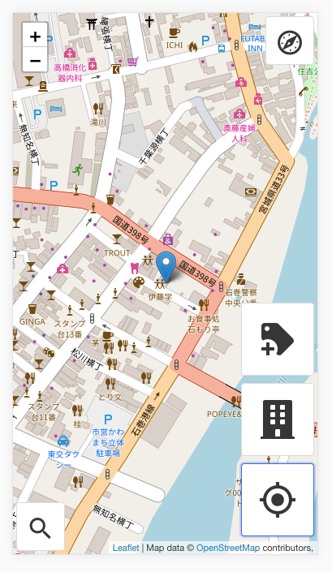
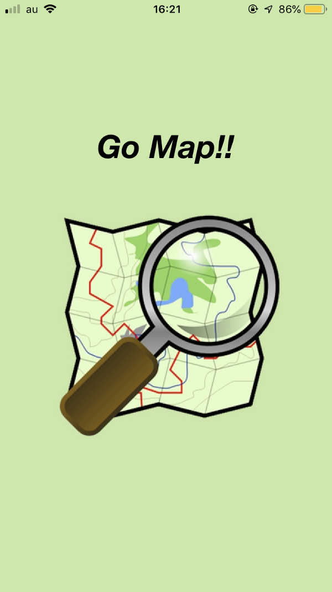
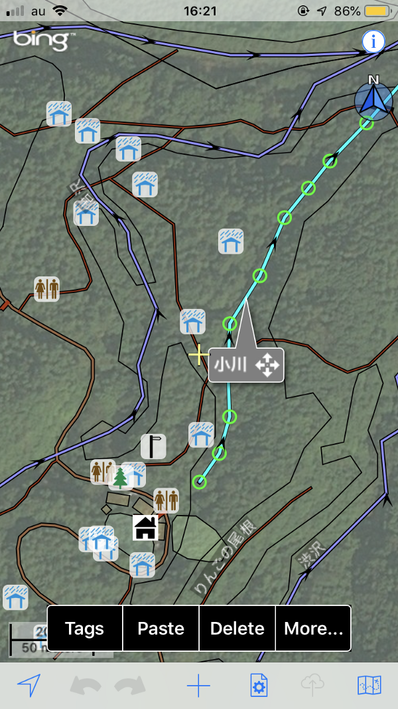
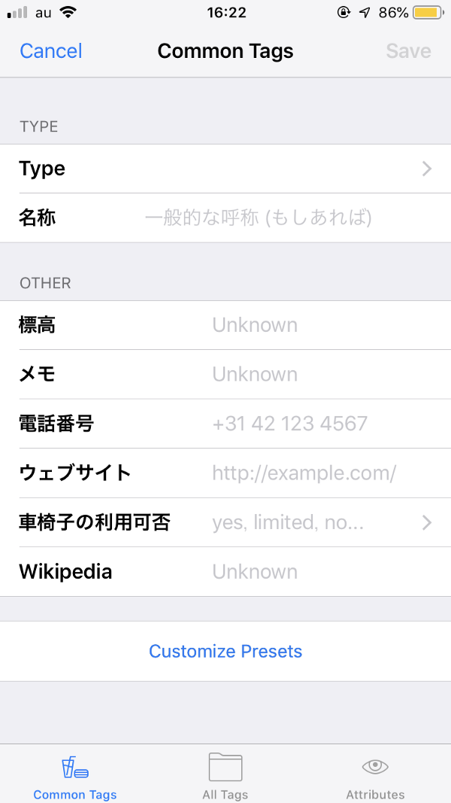
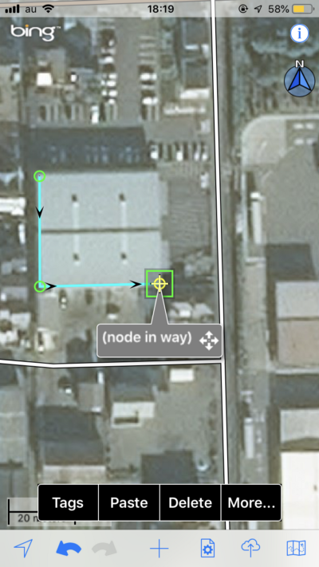
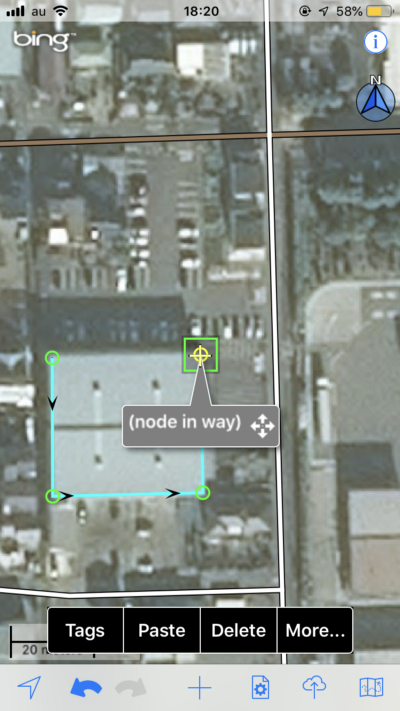
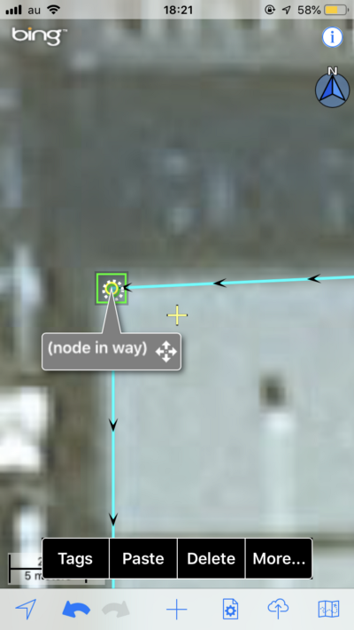

### OpenStreetMap×MyWork

今週のブログは私の卒業作品について。今までの卒論ネタのブログでは、OpenStreetMap(以下OSM)のデータ分析、OSMの編集ツールの紹介・分析を行なってきたが、これらはすべて私の卒業作品を紹介するための下準備だったのだ！

私が大学に入学してすぐの4月、ネパールで大地震があった。そこで今の研究室の先生である古橋先生が、ネパール震災でのクライシスマッピング、つまりは震災が起きたネパールのエリアでのOSMのデータ作りを呼びかけた。

私とOSMの出会いはそれが初めて。初めは地図がオープンであること(GoogleMapは著作権が厳しい)が、正義だということさえわからなかった。

だが、空間という誰もが必要とするような情報に、格差があることが正義なわけがない。ということに気がついたのだ。

そこで私は卒業作品を考えた時に、真っ先にこの空間データの格差を是正するOSMになんらかの形で貢献したいと強く思った。そこでいろいろ考えてたどり着いたのが、**OSMの編集ツール**。

下記に卒業作品用に当初考えてたスライドを載っける。

ではでは、どんな編集ツールを作ろうか。OSMを分析することから始めた。そこで発見したのが「建物」のデータが少ないということ。また、建物のデータが地図上にあるということは様々なことを意味する。例えば、そこに人が住んでいるということがわかる。そしてその情報は震災時等の支援に貢献する。

下記にOSM上のデータ格差については言及したブログのリンクを貼る。

[人口集中地区におけるOSMデータ格差
地図は人に使われて初めて価値のあるものとなる。
今回は人がいないエリアは切り捨て、人がいる所には建物があるという前提で、人口集中地区における地図インフラ格差を分析する。medium.com](https://medium.com/furuhashilab/%E4%BA%BA%E5%8F%A3%E5%AF%86%E9%9B%86%E5%9C%B0%E3%81%AB%E3%81%8A%E3%81%91%E3%82%8Bosm%E3%83%87%E3%83%BC%E3%82%BF%E6%A0%BC%E5%B7%AE-3a051e7e77df)

次にOSM上で「建物」のデータ量を増やすためには、どのような編集ツールがいるのかについて考えてみた。パソコンベースの編集ツールでは、個人的に不満はなかった。

しかし私は、そもそもパソコンを開かないといけないのがめんどくさいと思った。パソコンを持って学校に行く時、パソコンってほんと重たいな〜といつも思う。これだけスマホが普及した現在に、OSMに建物データを追加するためだけにパソコンを持ち歩かなければいけないのは変だ！と、考えスマホで編集できるツールを調べた。

#### ・例えばGO MAP!では

さまざまなアプリがある中で、OSMのデータを直接編集できるアプリは今のところGO MAP!だけだ。このアプリは非常に便利だ。建物だけではなく線、点とさまざまな編集・追加が可能だ。そのかわりに少しわかりづらく、見えづらい、と私は感じた。

[Go Map!!というツール
「Go Map!!」とは OpenStreetMap(以下OSM)において、情報を編集したり作ることのできるiOSアプリ。iOSアプリということは、App Storeでしかダウンロードすることができない。つまりiPhone用だ。medium.com](https://medium.com/furuhashilab/go-map-%E3%81%A8%E3%81%84%E3%81%86%E3%83%84%E3%83%BC%E3%83%AB-70a42718689f)

#### ・建物の追加に特化したアプリ

そこで私は「建物」のデータを追加するためだけの見た目もわかりやすく、操作も簡単なアプリを作ろうと考えた。文系の学生がアプリを作ろうと考えたのだ！それはそれはなかなか難しく、ただ今絶賛さまざまな壁にぶつかっている。

次回のブログはその壁と現在の選択肢について。
