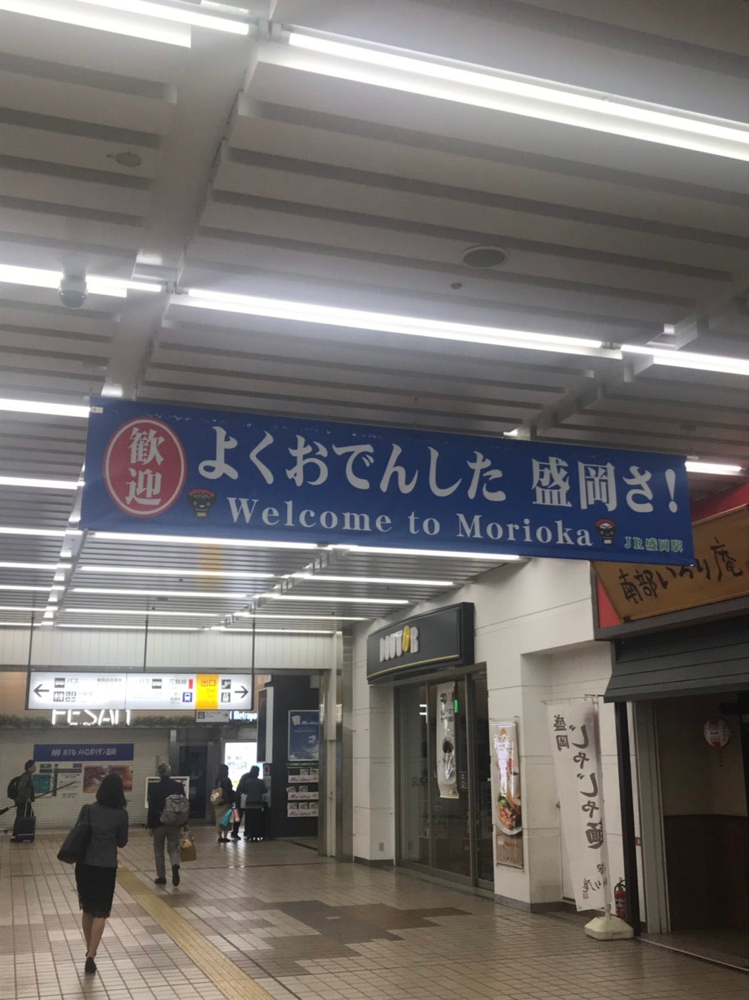
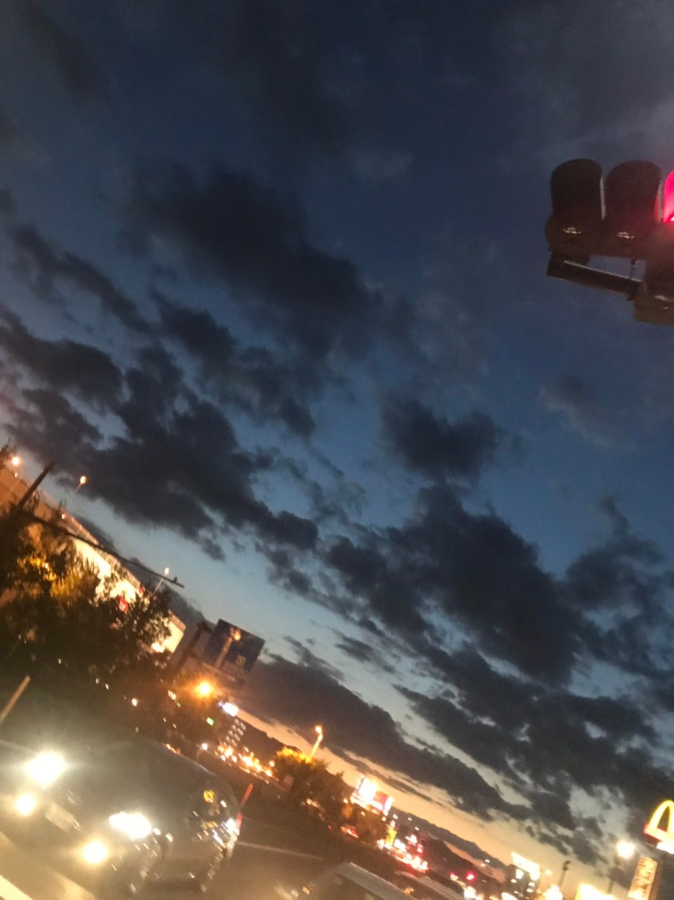
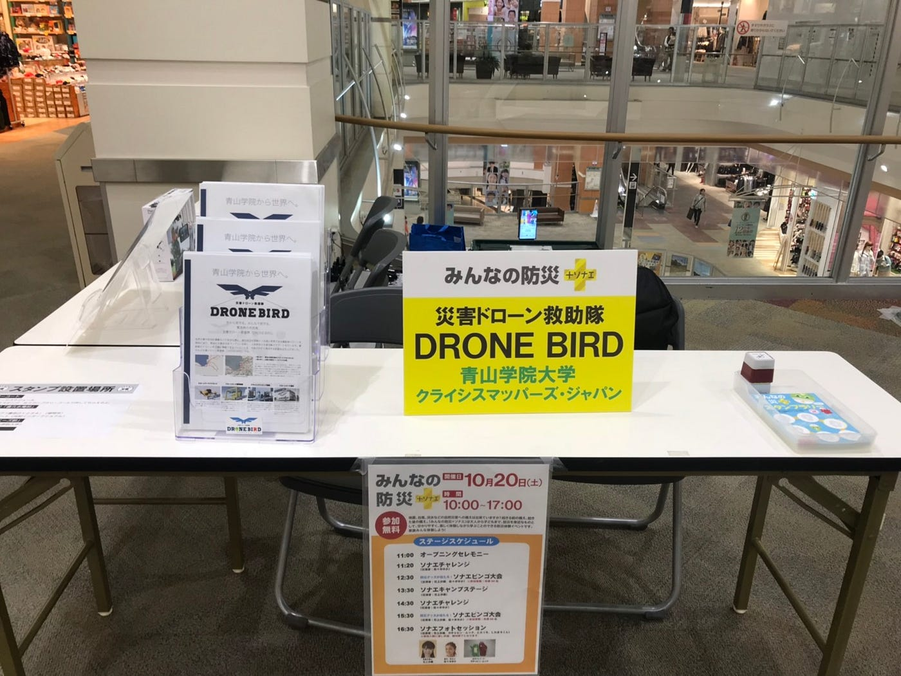
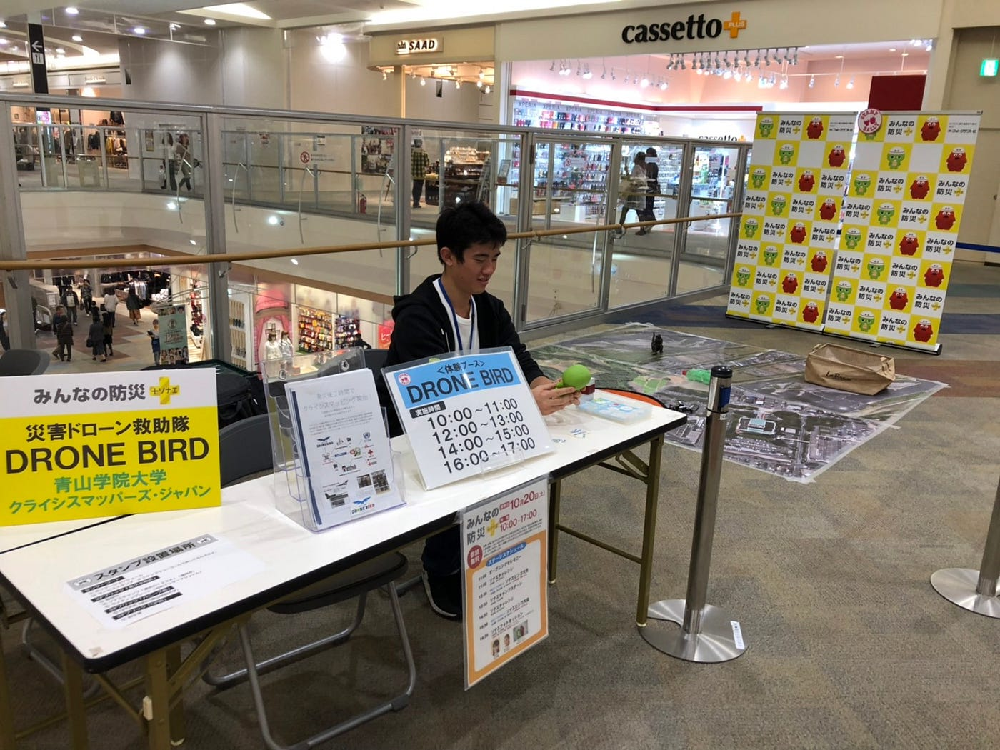
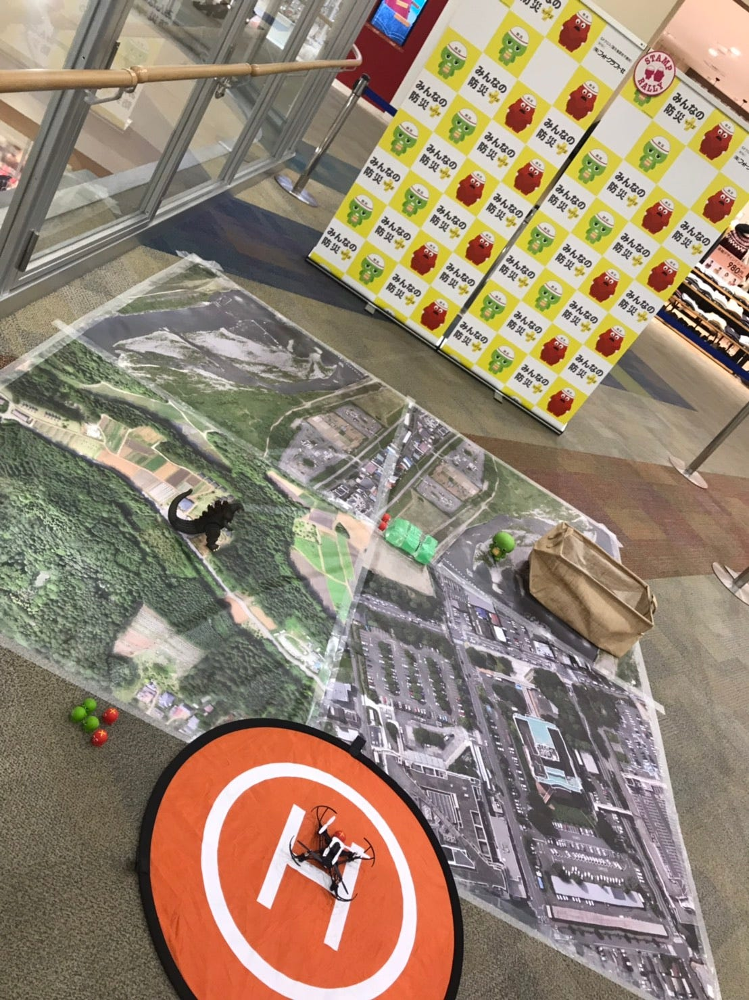
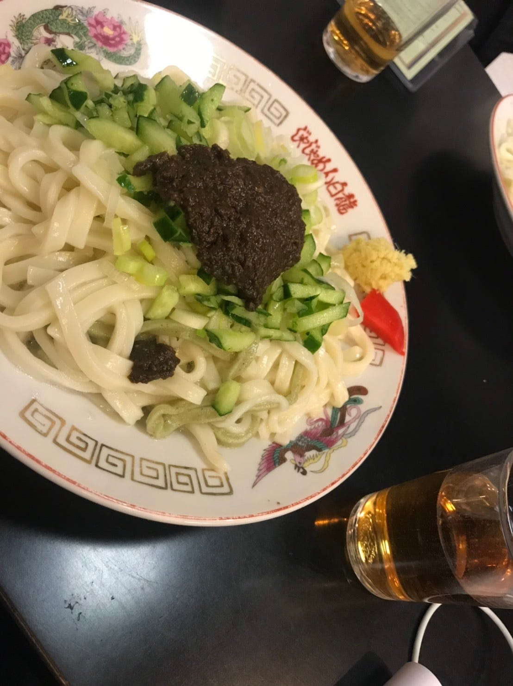

### 盛岡で成長できました！

こんにちは、古橋研究室三年の松本です。イオンモール盛岡南にて、同じく古橋研究室三年の牧とドローンの体験会を行ってきました。盛岡に一歩足を踏み入れた時、東北の肌寒さを身をもって体感しました。ただ、空気はすごく澄んでいて気持ち良かったです。皆さんもこれから東北へ足を運ぶ際は、服装には十分気を付けましょう。それでは報告へ移っていきます！

#### 実際の活動

私たちは、フジテレビ主催の”みんなの防災₊ソナエ”というイベントの一つのブースで青山学院大学を代表してドローンのことをより深く知ってもらうため、来てくださったお客様と会話をしたり体験会を開くなどをして、ドローンをより身近に感じてもらうということを行いました。

#### 午前

呼び込みはしていたのですが、午前中はあまりお客様が体験会のブースを訪れてはくれませんでした。ですが、興味を持ってくださる方は意外と多く、実際に資料を手に取って見てくださったりしていました。そのような方には、自分たちから積極的に話しかけていく必要があると感じました。自分たちがドローンを使ってどのようなことをしているのか、またドローン機材の話など話をすればするほど自分の勉強にもなるなと身をもって体感しました。従って、資料を手にもって下さるお客様がいたら、是非自分から”こんな活動をしているんです”と積極的に声をかけてみてください。これから防災訓練やイオンモールでの活動を控えている方へのアドバイスです！

#### 午後

午後からはだんだんと場内も賑わい始め、私たちのブースに足を運んでくださるお客様も増えてきました。ドローンの体験会にはParrotのMAMBOを使用しています。

私たちは上の写真のようにドローンにアームを付けておもちゃをバッグまで運んでもらい、ヘリパッドまで帰ってきてもらうというゲームを行いました。実際に私たちの前にイオンモールで体験会を開いたグループがいくつかあります。その方たちのブログを参考にして問題点は小さい子供達をどううまく扱うかということが大事だというがわかりました。そこで私たちは三つのことに気を付けようと話をしました。

・_**説明を簡単にすること_**

私たちは、ドローンのコントローラーの説明を必要最低限にしました。実際に説明したところは前進、後退、左右の動きをする右スティック、離着陸をするボタンのみ。今回使わないボタンの説明を省くことで一人に対しての時間の省略、ゲームの成功率のアップを図りました。

・_**子供の目線に立って子供に寄り添う事_**

説明を簡単にしたが故にここのボタンは何だろうと子供たちは逆に好奇心を持ってしまいます。そこで重要なのが子供の目線に立って子供に寄り添う事です。コントローラーは両手で持つものですが、その右側を子供に持ってもらって左側を私たちが持つという事です。実際に動かすところが離着陸ボタンと右スティックだけなので、そのように持つほうが子供の小さい手で持つよりも非常に楽に操作を行えます。また、高度の調節はコントローラーの左側を持っている私たちが必要な時のみ操作していました。

・_**ドローンを飛ばす際の子供の立ち位置を決める_**

子供はドローンに目がありません！したがって、ドローンに近づこうとするため非常に危険です。そのため、私たちはヘリパッドからおよそ1.5メートルほど後ろの床に養生テープを貼り、それ以上前には行かせないようにしていました。

これら三点を行うことでスムーズに、より効率的に体験会を終えることが出来ました。また、待っていただいているお客様には私たちは「一人当たり五分ほどかかります」と声掛けを行ったりして、お客様の時間も考えて体験会を行っていました。

#### まとめ

私たちはより効率よく終わらせるための工夫、子供たち・大人の方との接し方、ドローンの魅力の伝え方、自分たちの活動の把握などいろいろと考えることが多かった中、実際に何事もなく終えることが出来ました。また、このように人と接する機会を通して自分自身成長できたと感じております。ぜひ今後防災訓練、イオンモールでの活動を控えている方がいれば参考にしてみてください！以上、古橋研究室三年の松本でした。ありがとうございました。

stravaの記録です。

[https://www.strava.com/activities/1915546879](https://www.strava.com/activities/1915546879)
