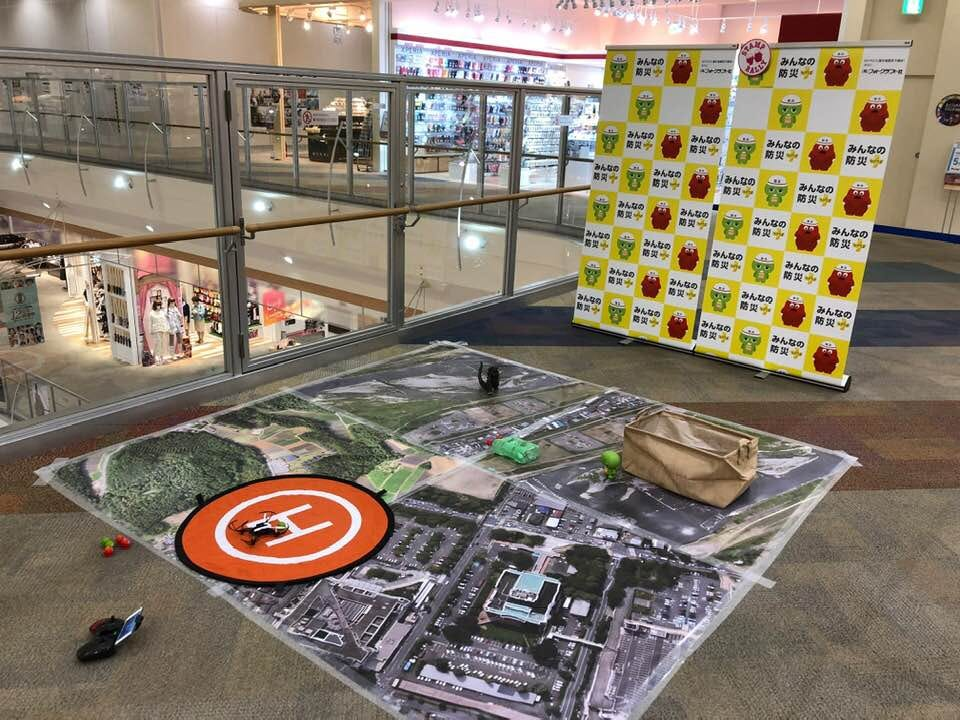
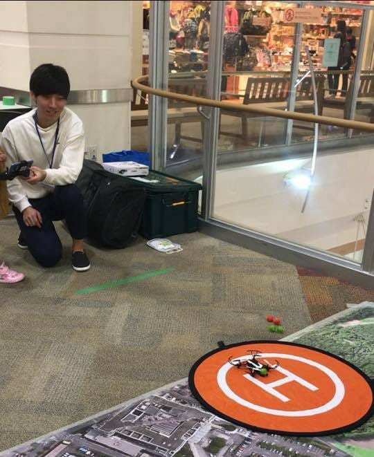
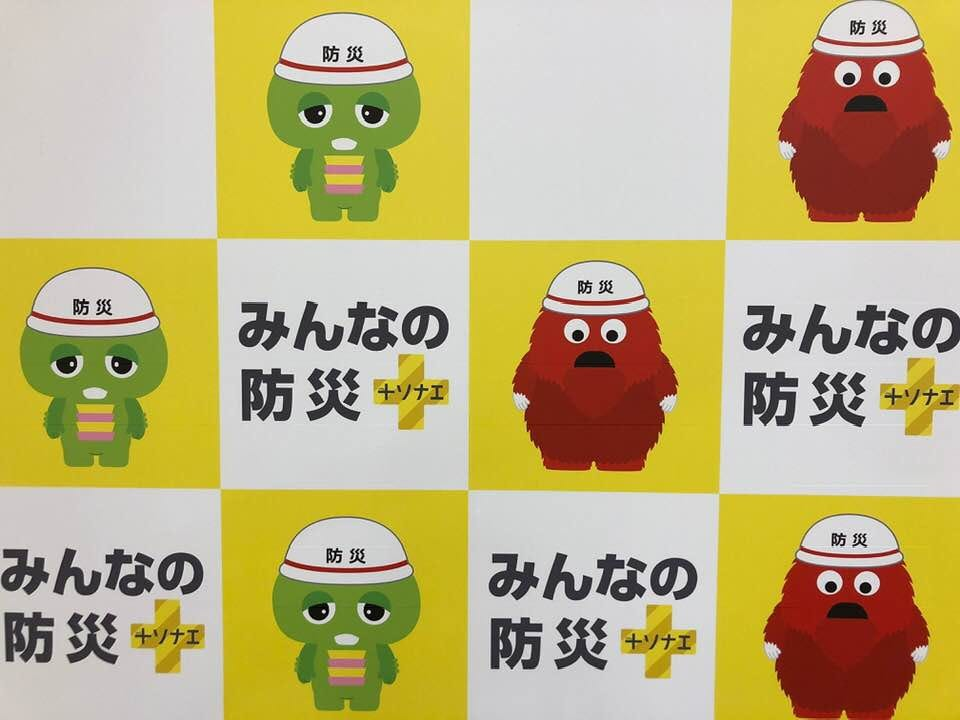
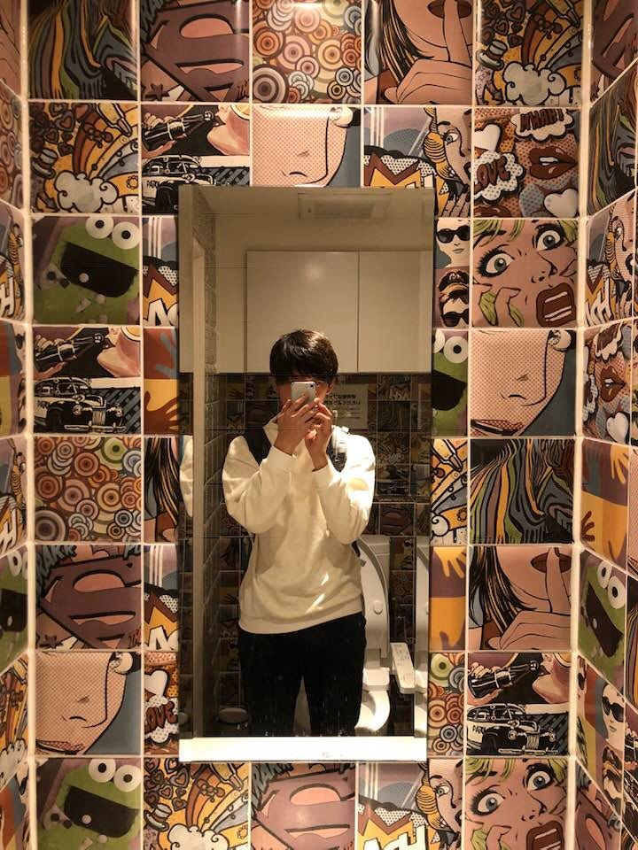

#### イオンモール盛岡南活動報告レポート

お疲れ様です。
古橋研究室三年の牧利亮です。
先週の東京国際防災展に引き続きドローンワークショップ＠盛岡南に参加させていただきましたのでその報告をさせていただきます。

> 当日の朝の様子

この時期の東北地方は、東京と比べ比較的肌寒く、現地までのバスの移動経路がとても寒かったです。朝9時にイオンモールに到着してすぐに、準備に取り掛かりました。事前に、以前のイオンモールの様子をブログチェックしていたので30分も満たないうちに準備も完了しました。改めて情報共有の意義を感じました。

> Parrotのペアリングについて

前回のイオンモールの巡回において、ドローンの調子不良ということで、新しいドローン二機を持って行きました。事前に古橋先生が、ペアリングができるかどうかの動作チェックを行ってくださっていたので、当日の朝にペアリングを行うときには、これといったトラブルはなく進めることができました。ありがとうございました。（本当は自分たちで確認を行うべきでした。申し訳ありません。重ねてになりますが、古橋先生ありがとうございます。）

> 当日の体験者について

主に体験されていたのは、八割が小学生でした。残りの二割が中高生やドローンに興味のある大人の方でした。中高生や大人の方々は、ゲームに慣れている世代でしたので、操作方法を説明した後にすぐに実践してもらい、スティック操作に応じたドローン移動を感覚的に体験してもらいました。小学生の子供達は、操作に不慣れでしたので、操作説明をするときに、少しずつスティックを動かすように説明しました。その背景として、体験会を始めてからわかったことですが、小学生はスティックを倒し続けるため、ドローンにつないである糸のテンションがいっぱいになり、墜落してしまうことがあったからです。それでも、操作がうまくいかないときは、一緒にコントロール操作を行い、小学生には補助をしてもらう形をとりました。

> 難しいと感じたこと

ドローンの説明から体験までの一連の流れを何度も繰り返す中で、感じたのは褒めることの難しさでした。褒め言葉も、「すごい」や「よくできたね」などワードが限られているので、それぞれの体験者のどんなところがすごかったのかを探すのがすごく大変でした。同じことを繰り返す中にも、一人一人の体験者の違いを探し続けるのは非常に難しかったです。特に、操作の順応性とそのスピード、操作スピード、着地位置の正確性などを褒めるポイントとして意識していました。

> ガチャピンとムック

14:30頃にガチャピンとムックがドローンバードのブースに来てくれて、子ども達や家族連れがそれから続々と来てくれました。事前に本部の方とガチャピンとムックが何時頃来るのか確認できていたので、その時間に体験会ができるように休憩を取り、うまく時間配分をしながら体験会を開催できたのはよかったかなと思いました。

> 1日を通して

一週間前に東京国際防災展に参加していたので、ドローンバードの活動に関することや、ドローンに関する質問など、特に困ることもなく対応することができました。やはり、現場で経験を積むことによって、座学で学ぶような内容を体験的かつアクティブに学ぶことができるのは、古橋研究室の一つの魅力であるように思わされました。

> 終わりに

17時に体験会を終え、盛岡駅周辺を散策しました。盛岡名物のじゃじゃ麺を食べたり、大槻さんに紹介していただいた、松屋のトイレにも行きました。これは毎年の恒例にしてもらいたいですね（笑）
初めての東北地方は短時間の滞在でしたが、とても充実した経験になりました。これからも、ゼミのイベントを含めた実践的な学びの機会に積極的に参加したいと思います。

STRAVAログ

[Follow Toshiaki on Strava to see this activity. Join for free.
Join Toshiaki and get inspired for your next workoutwww.strava.com](https://www.strava.com/activities/1915546375)
