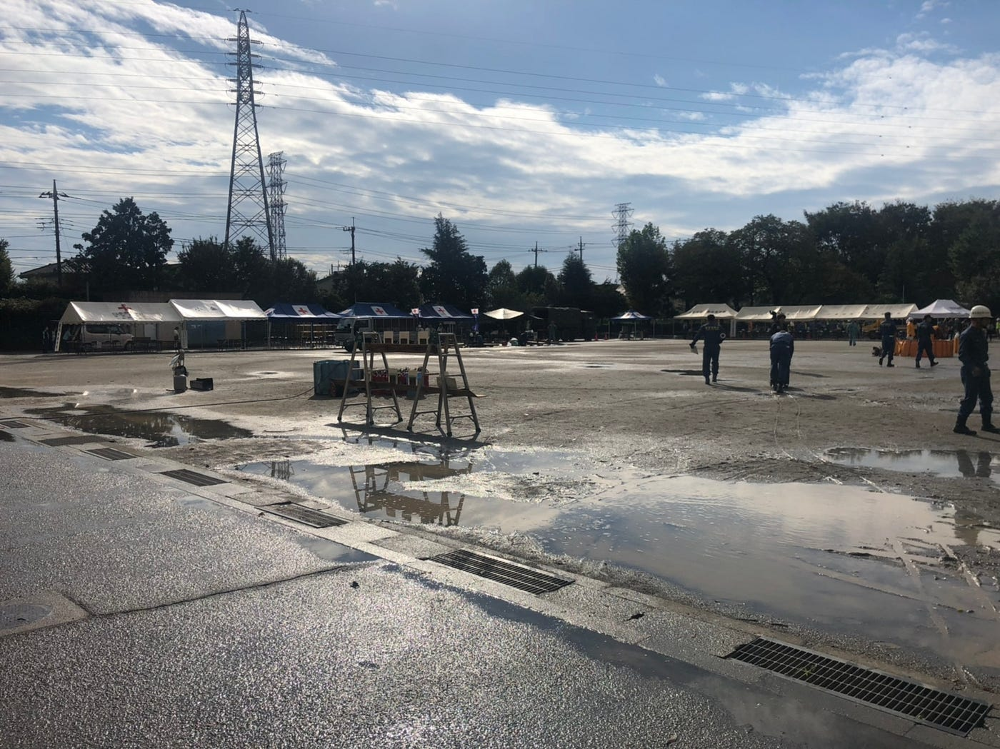
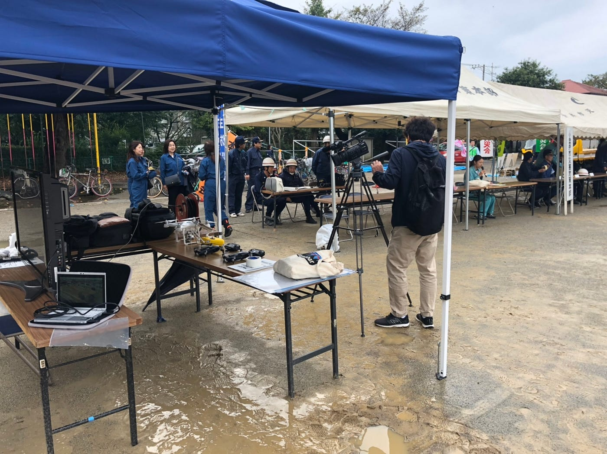
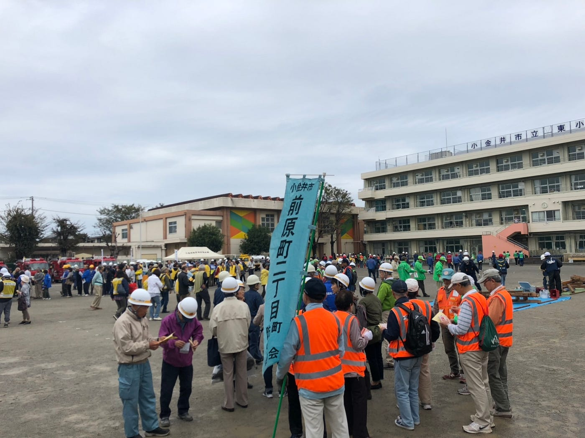
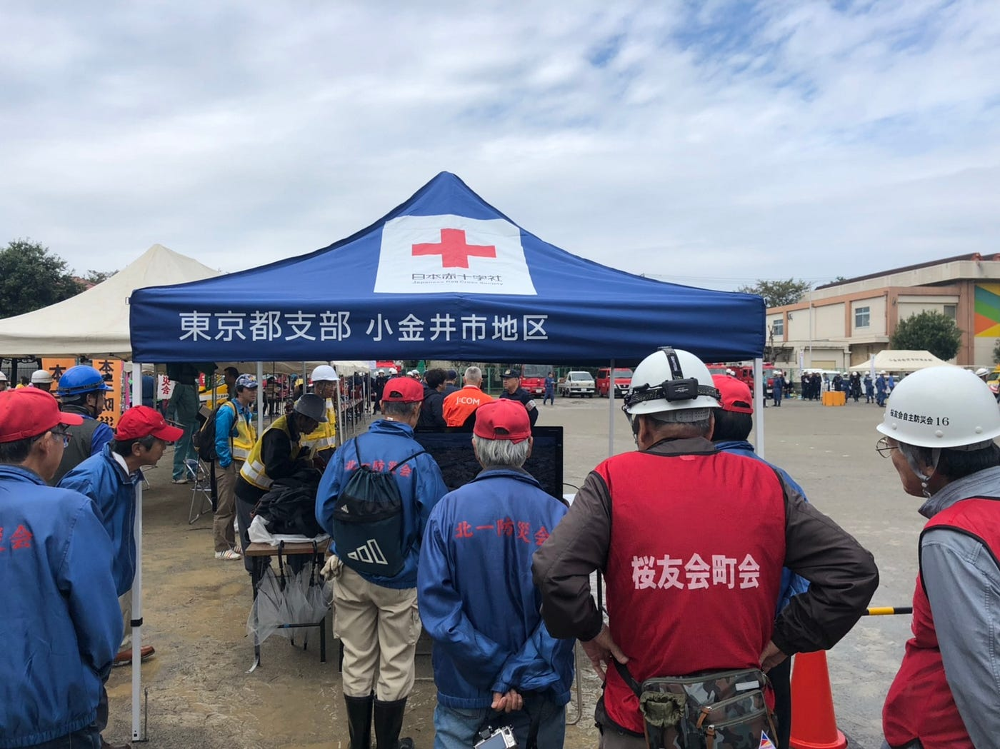
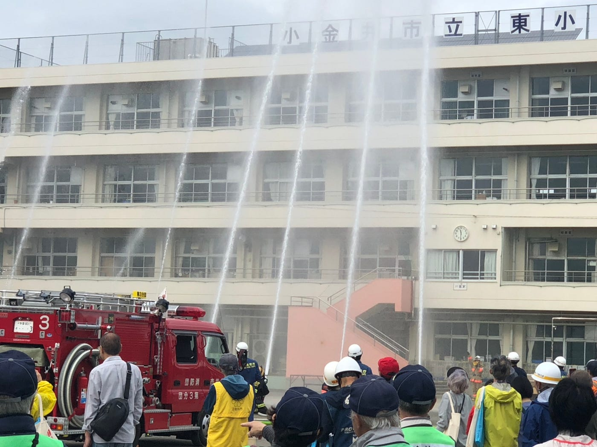

### 小金井市総合防災訓練

こんにちわ、青山学院地球社会共生学部4年栗原健太です。今回は小金井市総合防災訓練に古橋ゼミの一員として参加させていただきました。

集合の小金井東小学校へ行き雨のため30分程予定から遅れて設営が終わると晴れに☀️

自分たちの足元は結局イベントが終わるまで乾かず靴はびしょびしょになりました、、次回から足場が悪い場合は変えの長靴を持って行った方がいいかもしれない、、、

雨のため予定より遅れてですが、開会式が始まりました。

皆さんドローンの映像にとても興味津々でした。こんな小さいものからこんな綺麗に動画が撮れるのか、とドローン自体への興味が最初は多く、その後に何がドローンでできるのかを聞いてくださる方とドローンの性能だけ聞いて帰ってしまう方でツーパターンいました。

最後に消防団の方々が小学校が火事になったと想定して放水訓練をしていました。水を真上にあげるのですが、大迫力でした。ドローンで撮ったらすごそう、、、

今回は知識面の不足を深く感じたため、まずはドローン自体について学んで次に活かそうと思います、、、聞かれた事を自分で答えられるように、、、
