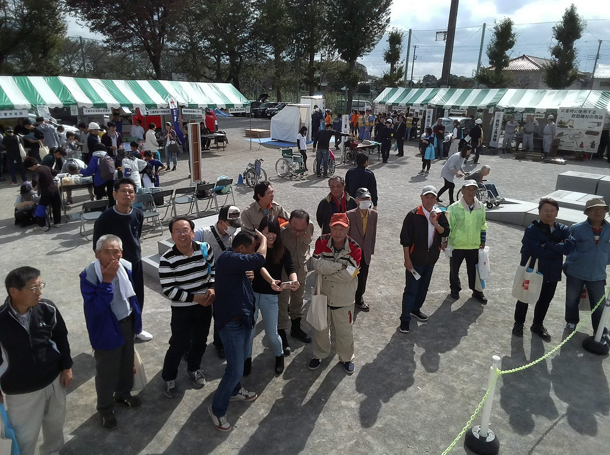
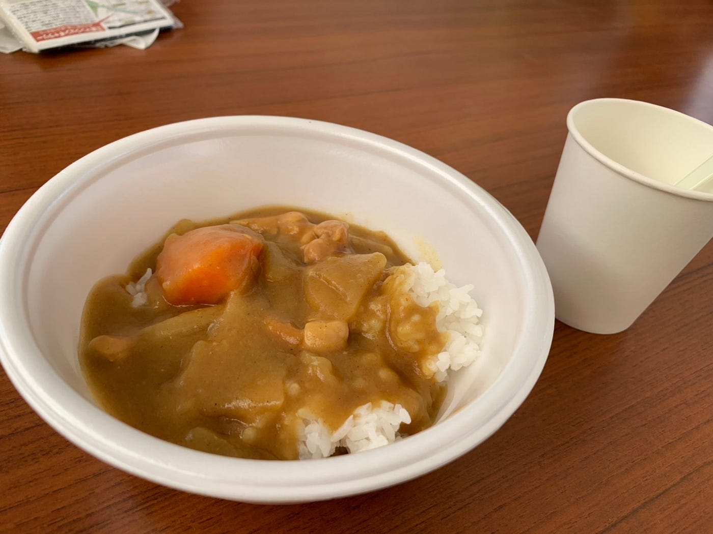

### 三鷹市防災訓練でドローンを飛ばした話！

お久しぶりです渡辺ゆうなです！

10/28三鷹市の防災訓練で、DRONE BIRDブースのスタッフとして参加させてもらいました。

流れとしては

9:45 整列

10:00 開始

10:20 & 11:20 ドローン飛行

12:00 終了

といったかんじでした。

この日はドローン体験の許可が取れなかったので、10:20と11:20にドローンショーとして私と田村さんで飛ばしました。

一回目は「Manbo」を飛ばしたのですが、風が思ったよりも強く、結構流されてしまいました。（風速何mぐらいかはわかりませんでした、申し訳ないです。） あとは、自分が立った位置が悪く、太陽の光がまぶしすぎてうまく操作できないことが多々ありました。

二回目は、初めて飛ばした「tello」を飛ばしました。初めての操作だったのですが、Manboよりも風に流されずらく、飛ばしやすかったです。

この時、私の周りにたくさんのご年配の男性が集まってきてずっと話しかけられていたのですが、その時に

「俺も飛ばしてみたい」

という声が多く聞こえました。

また、操作中の画面を見せたり、写真をとったりした時にとても興味を持たれていました。

困ったことと言えば

初めて見るドローンが多くて、それぞれの値段、何mまで飛べるか などについて答えられなかったこと。

が一番大きいです。

このようなイベントにスタッフとして参加する際には、スタッフとしてふさわしいぐらいの知識は身につけておかないといけないと思いました。

自衛隊のみなさんが作ってくれたカレー、美味しかったです！

とてもいい経験ができました、ありがとうございました！

最後にstravaのせておきます！

[朝のランニング - YUNA WATANABE's 20.5 mi run
Yuna W. ran 20.5 mi on Oct 27, 2018.www.strava.com](https://www.strava.com/activities/1941411186?utm_content=22923852&utm_medium=referral&utm_source=twitter)
