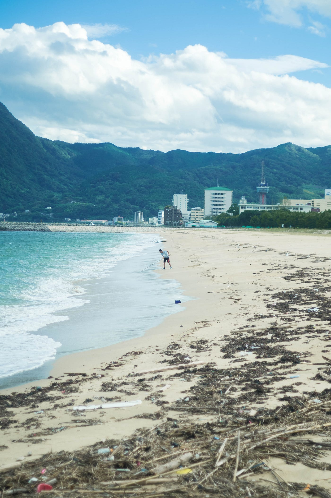
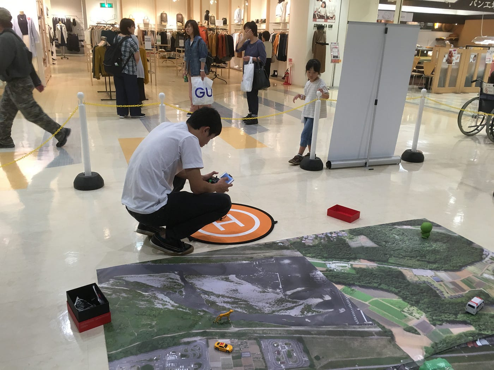
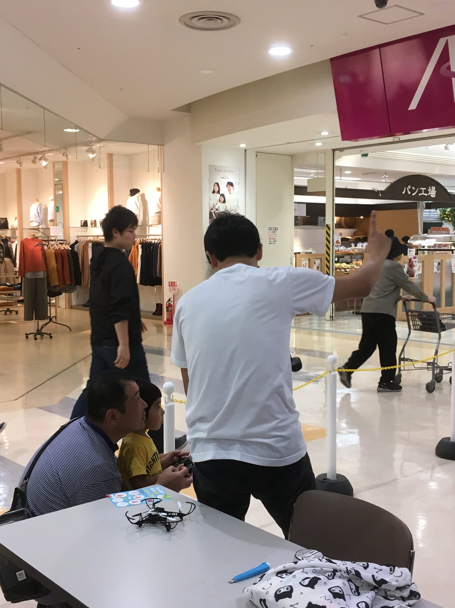
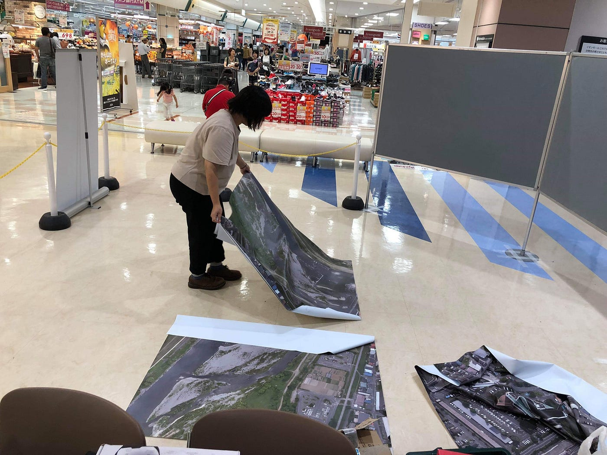

### 子どもたちが楽しくドローンを飛ばすために…【イオンモール三光 10/7】

すっかりご無沙汰してしまっています、安藤です。投稿遅くなってしまいました。忙しい日々で時間があっという間に過ぎていき、卒業も近くなって怖いです。

ほそぼそと就活を続けていますが、もうさすがにまずいでしょう…。秋なのです。本日は用事で深大寺を訪れましたが紅葉がほのかに色づいていました。高尾山や大山に行けば、もう綺麗に色づいている箇所もあるのではないでしょうか。行きたい。

10月上旬にイオンモール三光の『みんなの防災』に参加すべく、大分に飛びました。「今月の一枚」は、大分の海浜公園で撮った写真です。大分はもう3度目の訪問。好きな県の1つです。

当日の朝、宿泊先から最寄り駅に出るまでに工事による渋滞でバスが遅れてしまい、予定が大幅に狂ってしまいまして到着がだいぶ遅れてしまいご迷惑をおかけしました…。

なんとかイオンモール三光にたどり着き、従業員出入り口より会場入りしました。準備もほとんどやらせてしまいました…最低な先輩。

10：00までに準備を終え、開始。

### # 安全にドローンを飛ばすには…

前回、私は常滑のイオンモールに参加させて頂いたのですが、そのときには子どもたちは私達が身を挺して守るかコントローラーを奪うしか子どもたちを守る方法が見つかりませんでした。今回初めて**ドローンに糸をつけて飛行範囲を狭くする**方法があることを知りました。なるべく糸を短くして子どもたちの立ち位置にはドローンが及ばないようにしました。

午後になるとイオンモール内はやはり大勢のお客さんで賑わい、ドローン飛行体験も大行列となりました。ドローンを飛ばしたくて興奮して待っている子や少し不安そうな、恥ずかしそうな子もいました。どちらのタイプの子どもたちに対しても、勿論怖い思いはしてほしくないけど、楽しく操縦しながらも機械を扱うことに少し緊張感を持ってほしいと私は考えていました。操縦する力が強すぎてドローンが暴走してしまったときに「手を1回放して」と言ってもなかなか聞いていないのか、その言葉の意味がわからないのか暴走が続いてしまうことが多々ありました。無理矢理奪うのも違う気がしたので、まず操縦する前に予め「もしドローンが近づいてきてしまったら、こうやってボタンから指を放そう」と説明しました。「お姉さんとお兄さんの言うことは聞いてね」ということも。そして、少しでも危ないと感じたら「ストップ！」と呼びかけました。

前回の常滑のときとはまた違った客層というか、地域性というものが見られて非常に興味深かったです。親子や家族でイオンモールに買い物に来ている人はどちらも多かったのですが、ドローンを操縦したいと並んでくださるのが今回は子どもが多く、その他カップルやおじいちゃんおばあちゃんも興味津々で体験したり質問したりしてくださったのが印象的でした。常滑のときには子どもよりもお父さんたちが少年のように目を輝かせていたケースが多かったので…笑

交代でドローン操縦説明と呼び込み＆電池充電など行いました。最終回には、20分前から並んで待ってくださる方まで…。無事に17：00に終了することができました。18：00のバスが最終だったので、それに間に合うように片付けを終わらせました。結局何故かバスが来ず、帰りは少々大変な目に会いましたが…汗

### # 今回の反省点

まずは私が遅刻をしてしまって、準備をほとんどやらせてしまったことですね。あとは前回はなかった、大きな失敗は…

**1時間の体験を、お客さんが並んでくれているからといって引き伸ばしてしまったこと**です。

前回は私の他にタイムキーパーのプロがいてくれたので、1時間やったらお客さんがいても「また1時間後来てください」ということを伝えて、休憩を取ることができていました。私がちゃんとそれを後輩に伝えておくべきだったなと反省です。1回だけ30分オーバーしてしまった回がありました。最後に帳尻合わせをしましたが…。

あともう一つ反省点、ありました。ドローンの知識が無くてお客さんの質問に適切に答えられなかったことです。「小さいドローンはいくらなのか？」「どのくらいの時間飛行できるのか？」など大人からの質問に迅速に答えられなかったのはやはり少し悔しい…勉強不足でした。

ですが、今回も事故はなく子どもたちのフォローもでき、片付けもスムーズに終えることができた点に関しては良かったかなと思います。

私もしばらくドローンを飛ばしていないので、卒業までにまた何回か飛ばして練習しなければと思いました。

安藤
