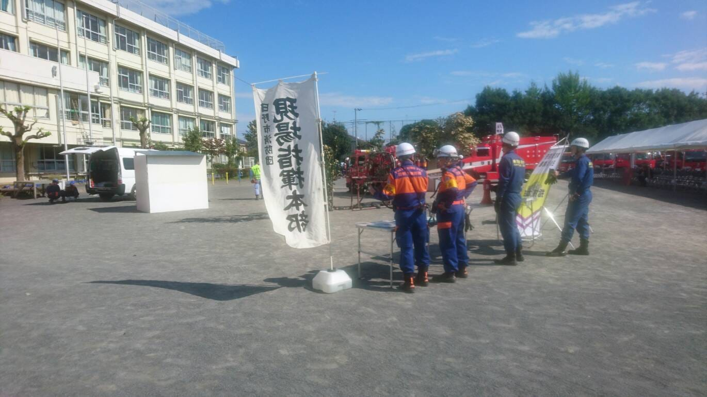
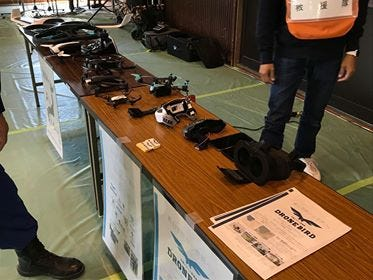
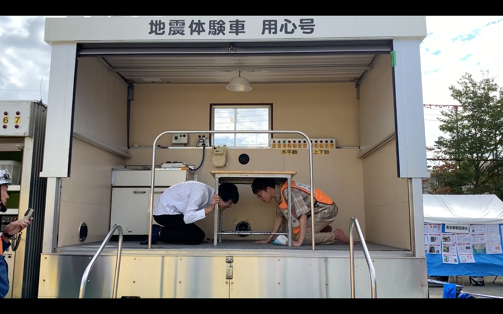

### 風の中の防災訓練@日野

おはようございます！こんにちは！こんばんは！
青山学院大学地球社会共生学部3年の板垣勇渡です！
今回は、2018年10月20日（土）に日野市立第五小学校で開催された日野市総合防災訓練にクライシスマッパーズ・ジャパンの一員として参加させていただきました。

> **1日の流れ**

9:00 集合
9:05 動作確認
10:30 全体リハーサル
12:00 防災訓練開始
12:50 館内展示準備
13:30 屋外訓練(ドローン飛行訓練)
14:00 館内展示
15:00 防災訓練終了
16:00 片付け完了

今回の日野市の防災訓練はドローン芸人の谷プラスワンさん、馬場加奈子さん、古橋研究室3年 渡辺匠と私の4人で参加しました。
今回の防災訓練の流れとしては、9時に現地で集合をし、展示場所やリハサールの時間の確認を係りの方と行いました。その後、持ってきたドローンの動作確認を行い、全体リハーサルに参加をしました。リハーサル後、防災訓練の流れに従い、演習でのドローン飛行訓練、体育館での展示を行いました。その後、片付けをして終了という形でした。

> **MamboかTELLOか**

今回の防災訓練、大きな問題がありました。

それは、、、

> 風が強い

という事です。

先述した通り今回の防災訓練では屋外でのドローンの飛行訓練演習がありました。本来ならばMamboとTELLO、どちらも飛ばす予定でしたが、飛ばされて一般の方に当たることを想定し、機体が軽く当たった時のリスクが低い、Mamboのみを飛ばすことしました。リハーサルの際にドローンを飛ばした際、こんなにも操縦が出来ないのかと思いました。初めて風のある中でドローンを飛ばしたので良い経験になりました。

> **体育館展示**

ドローンというものの目新しさか、たくさんの方がブースに来られました。MamboやTELLOを飛ばしたり、谷さんが持って来られたゴーグルを付けたりしてもらったりと、来て貰った人にも、周りで見ている人にも楽しんでもらえたかと思います。

今後、またこのようなイベントに参加をする際には、ブース内のドローンや看板の配置をもっとよく出来たら良いと思います！

> **最後に**

今回防災訓練に初めて参加をしましたが、風が強いという問題はありましたが、それ以外は特に問題はなく、楽しい1日でした！ブースに来られた方々の質問に完璧に答えられなかったところがあったので、もっとドローンへの知識を付けられるように頑張ります。

[日野防災訓練 - 勇渡 板垣's 2.7 km walk
勇渡 板. completed 2.7 km on Oct 19, 2018.www.strava.com](https://www.strava.com/activities/1915435916)

> _**追記_**

会場に地震体験をできるところがありました。実際に体験してみたのですが、地震ってこんなに揺れるものだったのか、東日本大震災の時もこんなに揺れたっけなと、改めて地震について考えるきっかけになりました。皆さんも機会があれば一度体験してみてください！

