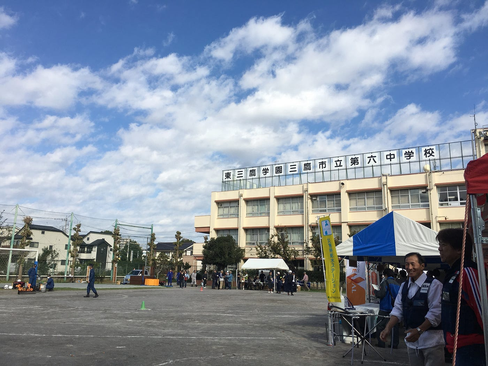
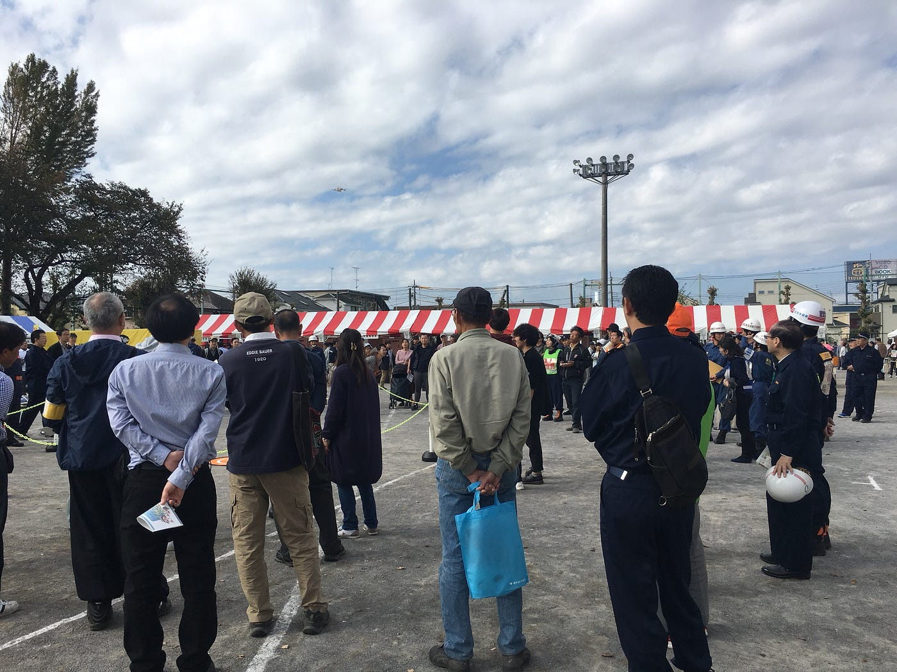
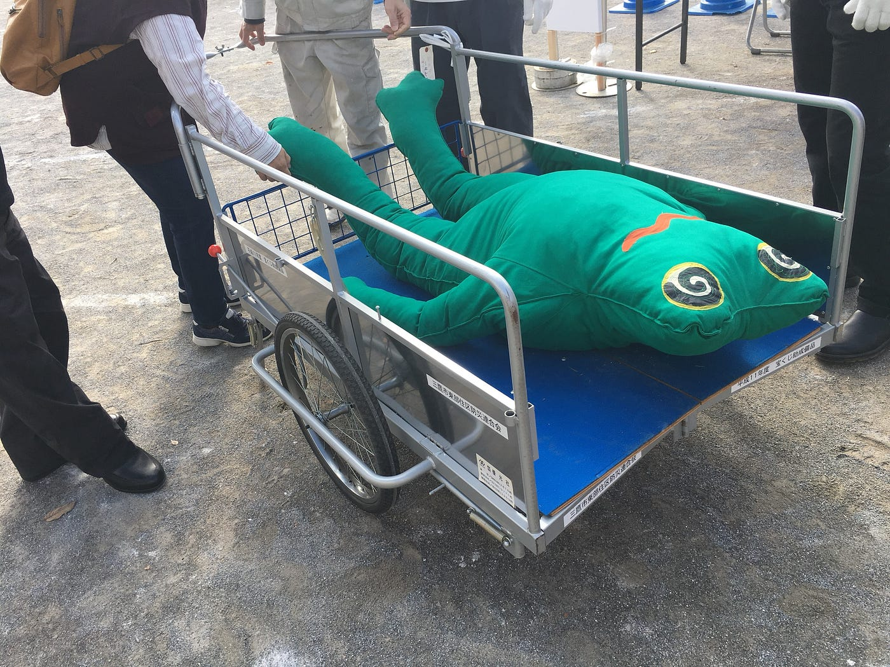
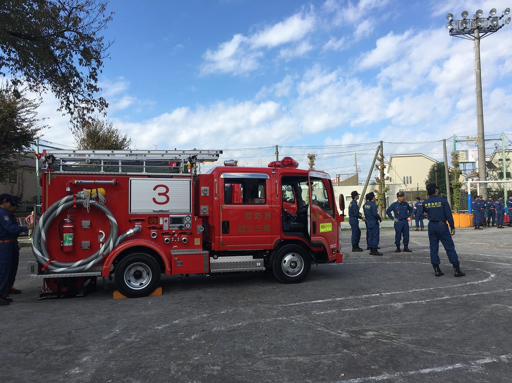
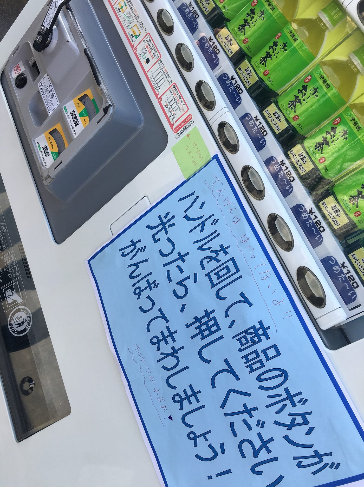
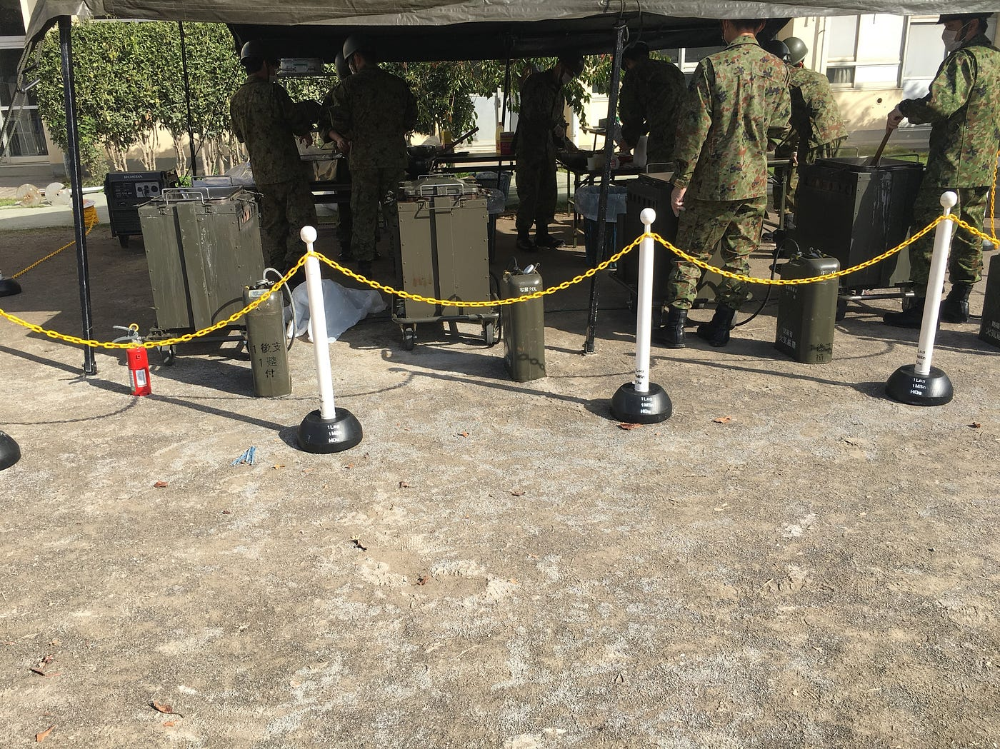

### _**高まるドローンへの関心@三鷹市総合防災訓練_**

ーーーーー

2018.10.28

三鷹市総合防災訓練にクライシスマッパージャパンとして参加してきました。

三鷹市の中学校で行われたこの防災訓練は、

地域の小中学生や、親御さん、ご年配の方など、幅広い年齢層の方がいらっしゃいました。

いらっしゃった方に実際に操縦させる事はなかったのですが、その分ドローンに関する質問が多く寄せられたように思います。

↑ドローン飛行デモも大人気！

今回、個人的には、

年齢層によって対応を変えることに苦労しました。

小中学生はおもちゃ感覚でドローンを見ていると感じました。中には、「これ(Tello)より、もう少し小さいやつ持ってる！！」と自慢してくれた男の子もいました。圧倒的に男の子が興味を持って立ち寄ってくれたと思います。

また、30〜40歳ぐらいの方は、主に子供と遊べるおもちゃとして、価格やどこで買えるか、資格の有無などを質問してくれた印象です。

50歳以上の方は、全く知識のない方と、かなり詳しい知識を持ってる方で二分していたように感じました。

詳しい方への対応までしっかり出来るようにするのも課題ですし、同時にほとんどドローンを知らない、見たことのないご年配の方への簡単な説明についても学習があると安心してブースの管理ができると思います。

ーーーーー

総合防災訓練、でしたので、他のブースも多くあり、どれも興味深かったです。

手押し車や、視界の悪い歩行練習、手回し発電の自販機など、具体的な体験が出来たり、

自衛隊による炊き出しがあったり……、と

とても充実した防災訓練だったなぁと思います。

懐かしい味がしたカレー

ーーーーー

同時に自分の知識不足にも十分気付かされたので、

より一層の努力が必要だと感じました。
