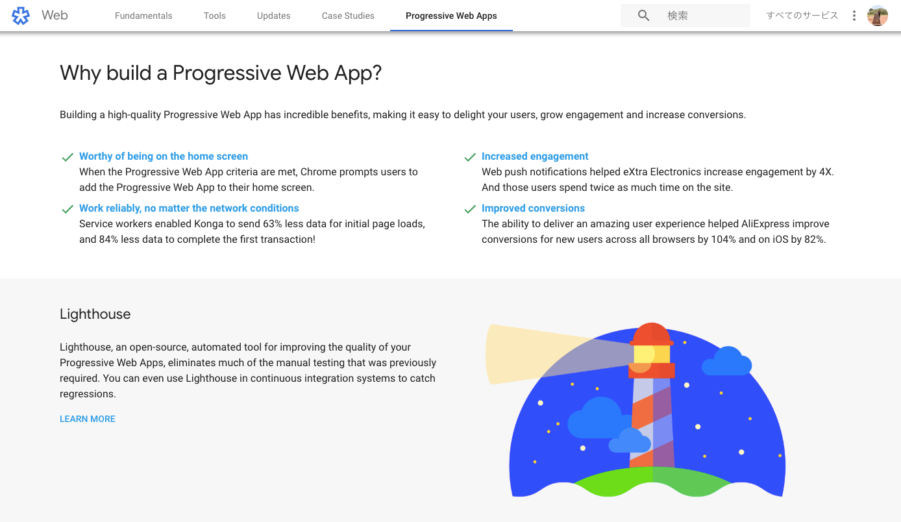

### OpenStreetMap×PWA

PWAって聞いたことある？その名も「Progressive Web App」。私のブログでもちょこちょこ名前を出しているが今回はこのPWAの紹介と私の卒業作品について。

先週のブログで語った、卒業作品、OSMのスマホ用編集ツールの作成。当初はアプリ(iOSアプリ)を作る気満々だったが、夏休みに石巻ハッカソンに行った時にデルシオさんが「PWAで作ったら？」と助言をくれた。

PWAとはモバイルユーザーの**UX向上を目的**とした、WEBページ／WEBアプリケーションとネイティブアプリの利点をいいとこ取りできる仕組み。モバイル端末でページを表示する時にネイティブアプリのような挙動をさせることが出来る。Google（Android Chrome）を中心に策定・展開されており、ユーザーとのエンゲージメントの向上やコンバージョン・リテンションの改善に効果があるとされる。 
By Qiita([https://qiita.com/edwardkenfox/items/4c0b9550ffa48c1f0445](https://qiita.com/edwardkenfox/items/4c0b9550ffa48c1f0445))

それではPWAの良いところと使用状況について紹介する。

#### PWAのメリット

- ページの読み込みや表示が速い

- オフラインでも動く(画面遷移をともなう操作もオフライン時に可能)

- プッシュ通知の受信が可能

- インストール不要

- ストアの審査なくアップデートが可能

- GPSを使った現在地取得と利用が可能

- ネイティブアプリのようなUIを実現できる

- 「**ホームに追加**」ボタンを表示でき、ホームに追加されたページはインストールされたアプリのように扱える

- ホーム画面のアイコンが設定できる

#### PWAの使用状況

国内サイト・サービスのPWA対応率をいくつか見てみたところ 、おおむねPWA対応率は高くないものの、suumo.jpなど一部のサイトでは非常に高い数字が出ていた。[A selection of PWA](https://pwa.rocks/) から見れるように、海外ECサービスやメディアサイトで活用事例があるものの、PWA対応しているサイトのシェアなどの数字は見つからず、活用事例はまだまだ少ないことが窺える。
By Qiita([https://qiita.com/edwardkenfox/items/4c0b9550ffa48c1f0445](https://qiita.com/edwardkenfox/items/4c0b9550ffa48c1f0445))

今後、ネイティブアプリの開発削減やwebのUX向上のために、PWA活発に使われる可能性もあるが、すでにアプリかされたサービスに関してはPWAに変更する花王制覇低いだろう。

OpenStreetMap(以下OSM)に関しては、先生と先週PWAを使ったOSMのサービスを探したが見つからなかったため、私が今回卒業作品でPWAを使えば “**新規性**” は確実にゲットだ！

#### 私がPWAを選ぶ理由

色々紹介したPWA。ではなぜアプリではなく私が卒業作品及びOSMのスマホ用編集ツールにPWAを選んだのか。簡単にまとめる。

まず、iOSアプリをリリースする時ってAppleによるStore審査という、アプリの審査が入り時間がかかる。そして何より、AppleStoreでアプリをリリースするためにはAppleのデベッロパー登録にお金もかかる。

つづきまして、iOSアプリはiPhoneにしか対応できず、アンドロイドでは使えないということ。それに対してPWAはどちらでも対応可能。もとより、海外でのiPhone普及率が日本ほど高くないことからiOSアプリ作成への懸念はあったため、PWAはその懸念をなくす最適な方法だと考えた。

３つ目は開発がiOSアプリに比べて簡単である。ベースはHTMLで書くためアプリの開発に比べて非常に簡易的であり、私のような文系でプログラミングといえばホームページ作成の経験ぐらいしかない人にとってはとっつきやすいと考える。

そして最後はインターネット上に公開された時の私の作品までのアクセスのしやすさだ。仮にiOSアプリを開発したとしよう。そしたらまずAppleStoreで的確に私が開発したアプリの名前を検索しないと私の作品まで到達しない。それに対してGoogleChromeのPWAで作品を作った場合、Google検索に引っかかる。どこの誰が開発したのかわからないアプリをわざわざダウンロードするより、Google検索エンジンで出てきたURLをクリックする方がアクセス及びいわゆるとっつきやすさは倍増だろう。

今回のブログはほぼPWAの説明になってしまったが今のところの卒業作品で書いたコードを最後に張りつつ、肝心の編集機能のコードを模索中という現段階である。

[AyameO/OpenStreetMap_PWA
卒業論文の研究に伴い開発途中のPWA for OpemStreetMap. Contribute to AyameO/OpenStreetMap_PWA development by creating an account on…github.com](https://github.com/AyameO/OpenStreetMap_PWA)
