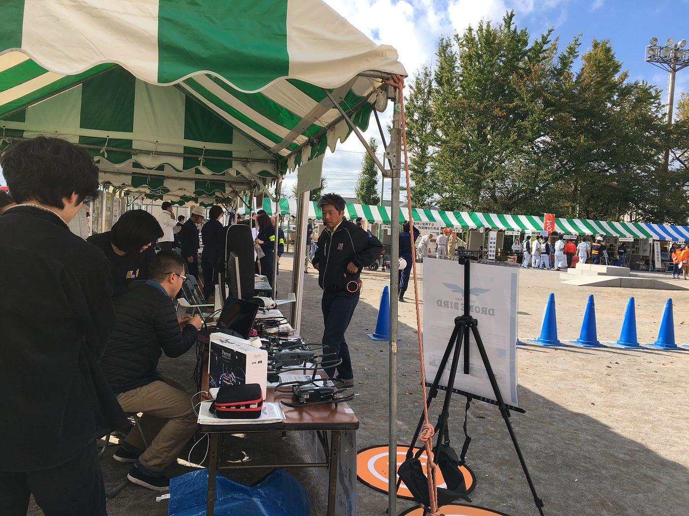
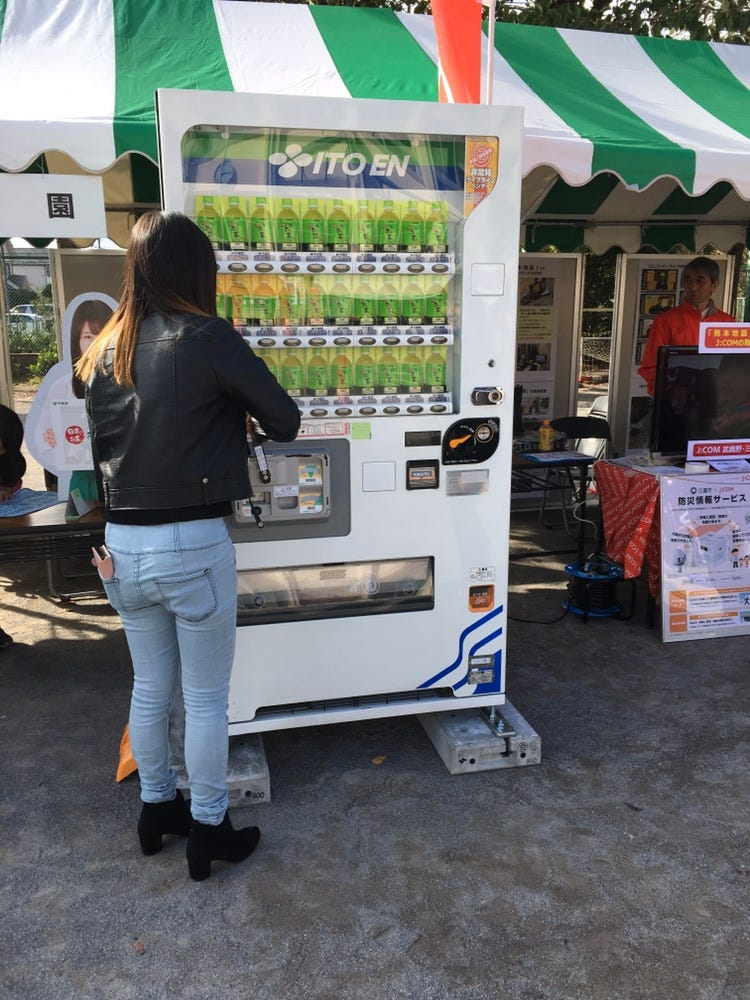
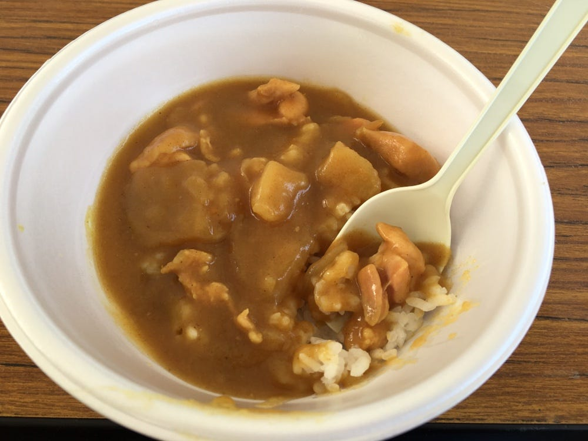

### 防災を「体験」すること

10/28の三鷹市防災訓練に参加しました！

今回は10時〜12時という2時間のプログラムで、ドローンはブースで二回飛ばすという形でした。

今回は住宅地が多い中の小学校で開催され、ご年配の方と小学生がたくさん来てくれましたね！

ブースで話していると、だいたい

- 値段

- 操作性、方法

- とばしてみたい

の３つをよく聞かれます。

特にご年配の方などは操作の難しさを聞くことが多く、小学校はとばしてみたい！って子が多かったです。

今回は許可が降りず実際にやってもらうということができなかったのですが、操作が難しいのかとかはやってみないと分からないので、体験ブースがあるのはとても大事と実感しました。

また今回は小学校の校庭を使っていたこともあって、ブースが多く色々なことが体験できました！

煙体験や水防体験、消化や担架体験など…「やってみる」ことで実践的に学べるブースが多かったです。

私の小学校では体験物を一気にできる機会がなかったので、子供達の防災意識度を上げるにもいいなと思いました。

また若い世代の活躍ということで大学生や若い方がブースに参加しており、子供達も見やすくなるのではないかな、と感じました。

まだまだ防災では若い世代として、頑張ろうと思います！

最後に…寒い中のカレーとても美味しかったです

以上、三鷹市防災レポートでした。
