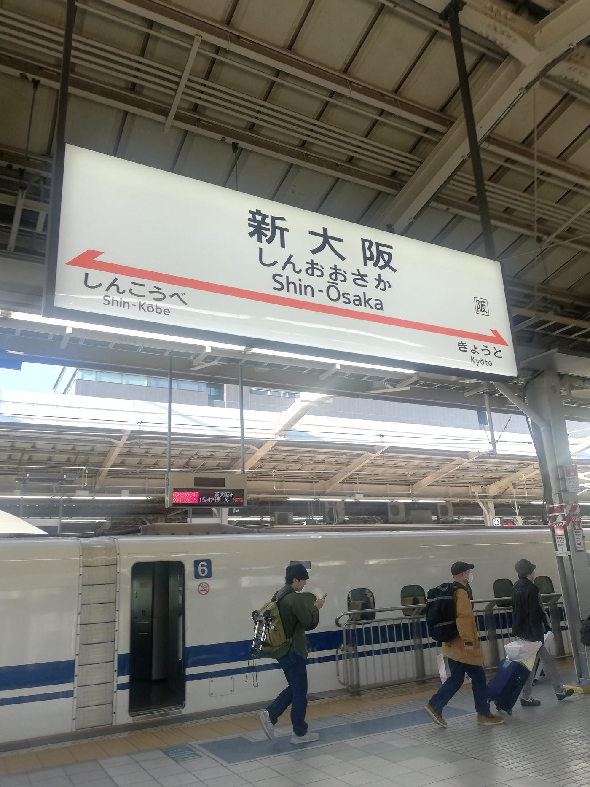
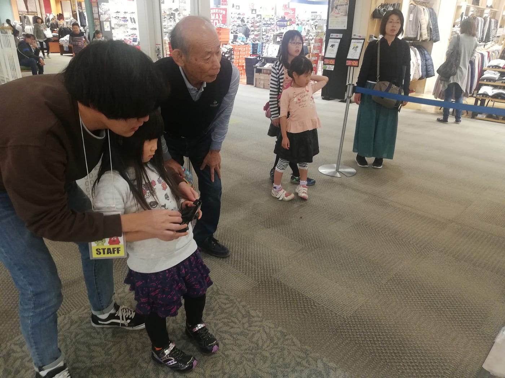
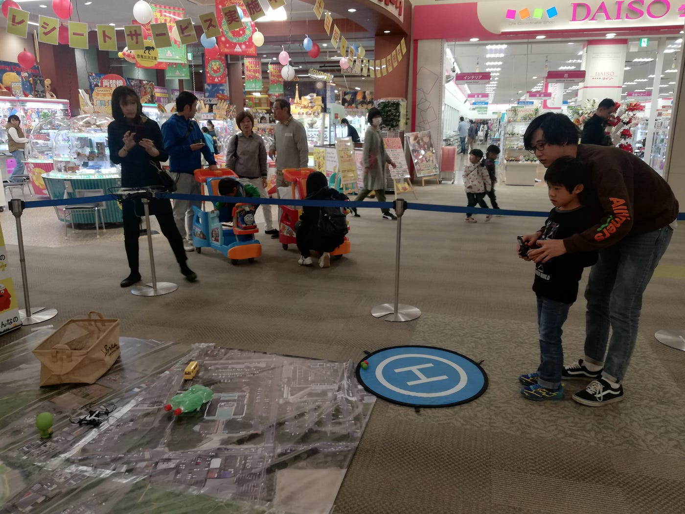
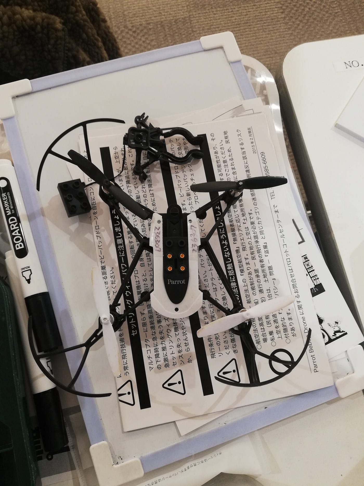
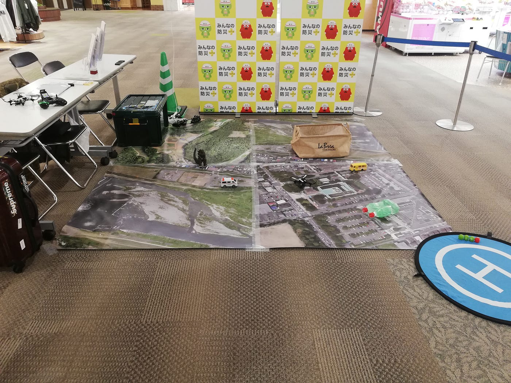
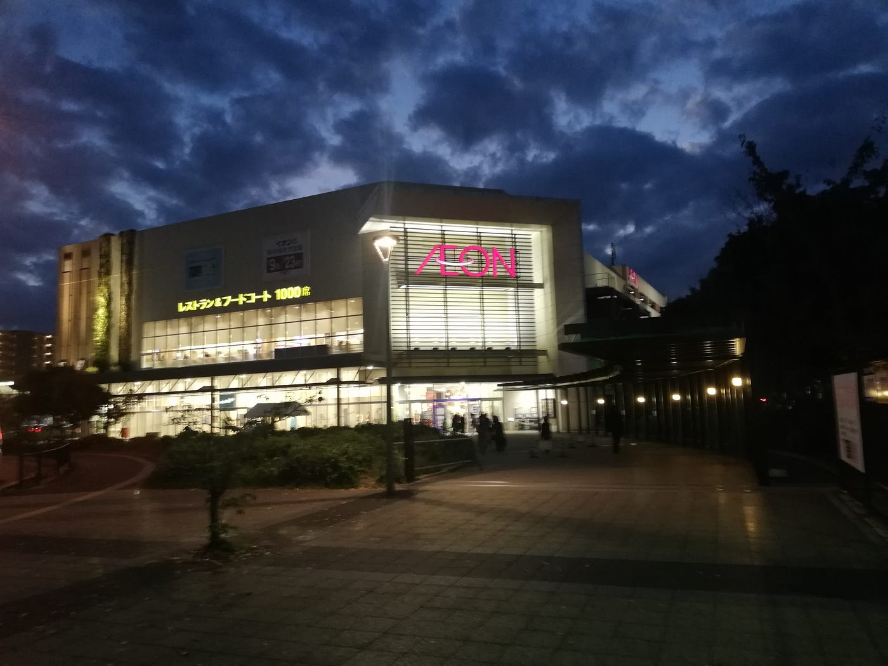

### 自覚を持ってイベントに取り組むということ【イオンモール学研奈良登美ヶ丘 11/4】

昨日（１１月５日）の授業に参加したゼミ生はご存知だと思いますが、今回私が参加したドローンの遠征ワークショップにおいて、不適切な態度で営業をしていたため、イベントのスポンサーであるフジテレビさんから初のクレームがきました。自分の営業態度に反省しつつ、古橋ゼミの評価を落としてしまったこと、また他の同ゼミ生に迷惑をかけてしまったことをここに謝罪申し上げます。今後このようなことがないように、今回のクレームの原因と改善、または遠征の報告も兼ねてこのレポートに記したいと思います。

#### **初のリモートにおける遠征、新大阪駅に到着する。**

淵野辺駅から新横浜駅まで電車で行き、新幹線に乗り換え夕方頃に新大阪駅に到着しました。知らない土地での遠方イベントは思った以上に体力を消耗しました。この日は新大阪駅付近のビジネスホテルに泊まり、翌日の９時に学研奈良登美ヶ丘駅前のイオンモールにて、ドローンイベントを開始しました。

### **ドローンを飛ばす子供の様子**

> **当日の客層について**

ブースの場所がゲームセンターの前にあったことや開催場所がイオンモールだったため、主に子連れの家族が全体の多くの割合を占めていました。また、中には親御さんでドローンを操縦したい人も多く、大人はやはり子供に比べて教えやすかったです。

※3台あるうちの1台はプロペラの保護プラスチックが紛失していた為、2台を主に運用していました。

### ドローンブースの風景

クレームを頂いた一つ目の原因として、ブースの状態が乱雑に見えたということがあります。ドローン等を入れる箱は航空写真の外側において、フィギュアなどの配置をもう少し整理しておく必要があったと感じました。また、古橋先生が不在のイベントなので、随時messangerで写真を送り確認を取ることの大切さを感じました。また、外側（スポンサー側）から見た際の見栄えの良さも意識していくべきでした。

### 営業時間中は来訪者がいない場合でも、しっかりと立って待機する。

クレームを頂いた二つ目の原因として、営業時間中の待機する態度に問題がありました。私は来訪者がいない空いている時間に、座ってスマホを操作していました。こうした態度は外側から見ると不適切かつ不真面目に見えても仕方がないとクレームを受けた事実を踏まえた上で、深く実感し反省しております。次回からこのようなイベントに参加する際は、会社とゼミが合同で開催しているイベントの係員という立場をわきまえた上で緊張感を持って接客します。

### **営業終了し大阪から神奈川へ**

実際に来て頂いたお客さんの反応は良かったと感じています。また、特に大きなトラブルは起きずに終えることができたので、その点は良かったです。また来訪人数自体は２００人を越えていたので、比較的賑わっていたと感じました。

### 今回のワークショップで反省・改善すべき点/まとめ

**・ドローンブースの見栄えを考えて配置する。**

**・営業中は接客の意識を持ち、緊張感を持つ（待機中に座ってスマホをいじらない）**

**・内側（ブース利用者や私たち）からだけでなく外側（スポンサーや見学者）からの景色も意識する。**

_また、当日はドローンのバッテリー切れで作業が停滞したこともあったので、トラブルの際は詳しい状況を正確に古橋先生に報告する必要があると思いました。_

以上の点を踏まえて反省した上で、今後のイベントに取り組んでいきたいと考えております。
また、来期のゼミ生などに今後クレームがないように、再発防止のレポートとして読んで頂ければと思います。

※レポートは二本に分けて執筆しようと思いましたが、一本にした方がまとめやすかった為、一本にしました。

[学研奈良登美ヶ丘イオンモール - BRIGHT SUNLIGHT's 549.3 km run
Bright S. ran 549.3 km on Nov 3, 2018.www.strava.com](https://www.strava.com/activities/1945231422?share_sig=EI5Y0D161541491735&utm_medium=social&utm_source=android_share)
