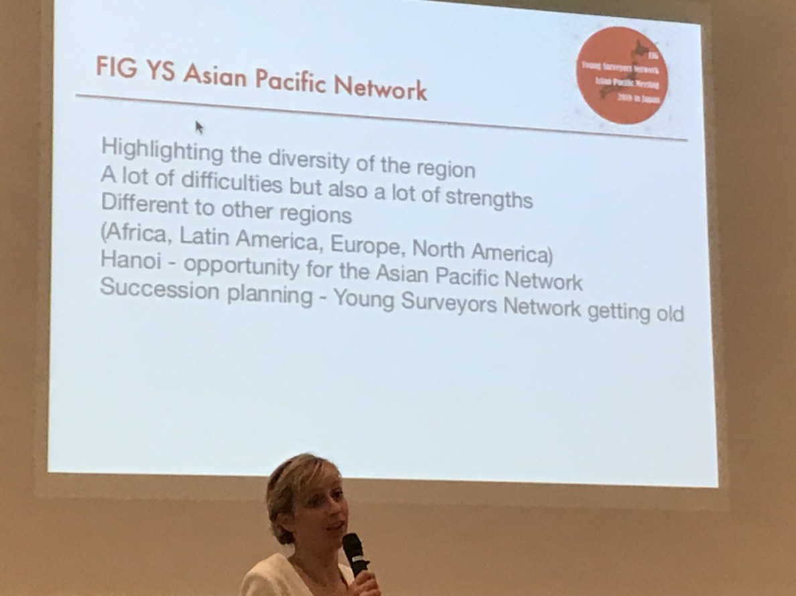
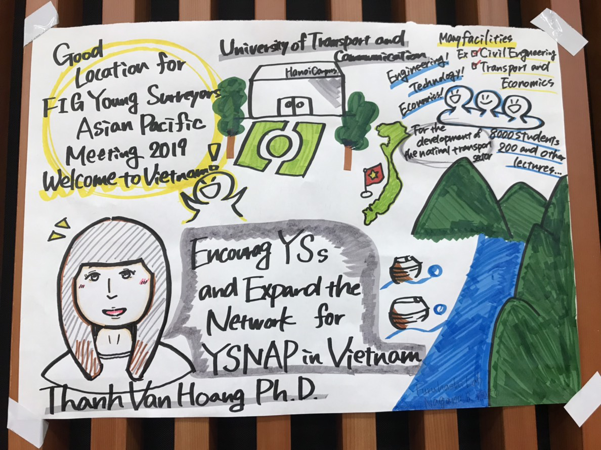
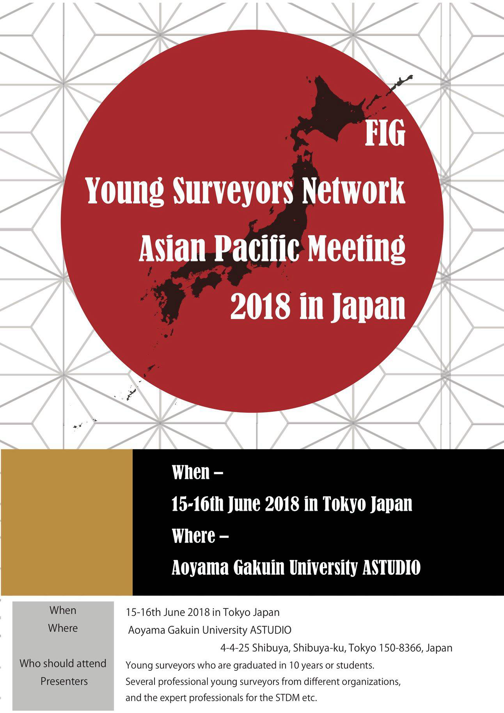

### DEAR DIARY 初めての国際カンファレンス

こんにちは、青山学院大学地球社会共生学部3年福田紗彩です。

今回は国連FIG ×古橋研究室Young Surveyors Network 2018 in Japanという国際カンファレンスに参加させていただきました。開催場所はAstudioという渋谷にある青山学院の施設でした。

私たち古橋ゼミの学生は、主に受付を行い、空いた時間に数人ずつプレゼンテーションを実際に見させていただきました。今回のイベントではたくさんの海外からの参加者がいました。彼らとは、受付にいたときに少しお話しをさせていただきましたが、英語の聞き取りなど課題が見つかりました。

私はその中で、session 3に参加させていただき、ベトナムについてのプレゼンテーションを聞きました。ベトナムはホーチミンとハノイという離れたところに大きな都市があり、その二つの都市を結ぶインフラなどが大切になるというお話でした。また、その中で、University of Transport and Communicationでの取り組みや、大学の歴史などのお話もいただきました。

これは4年生の先輩が書いてくださったグラレコです。今回の話の要点を一枚の絵にして分かりやすくまとめる力、この先しっかり学んで私も書けるようになりたいです。

初めての国際カンファレンス、とても刺激的なものとなりました。また、この先古橋ゼミの環境を通して様々なイベントに参加し、知識と経験を増やしていきたいと思います。

