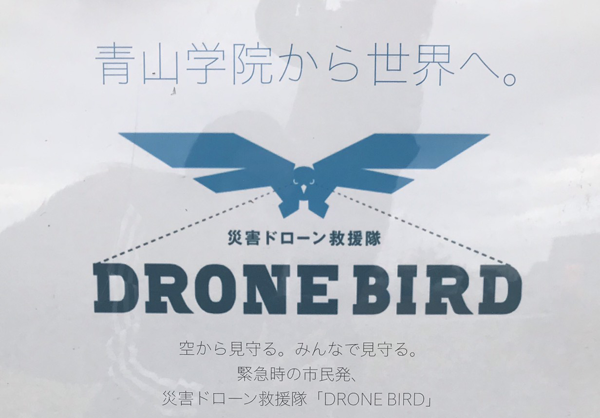
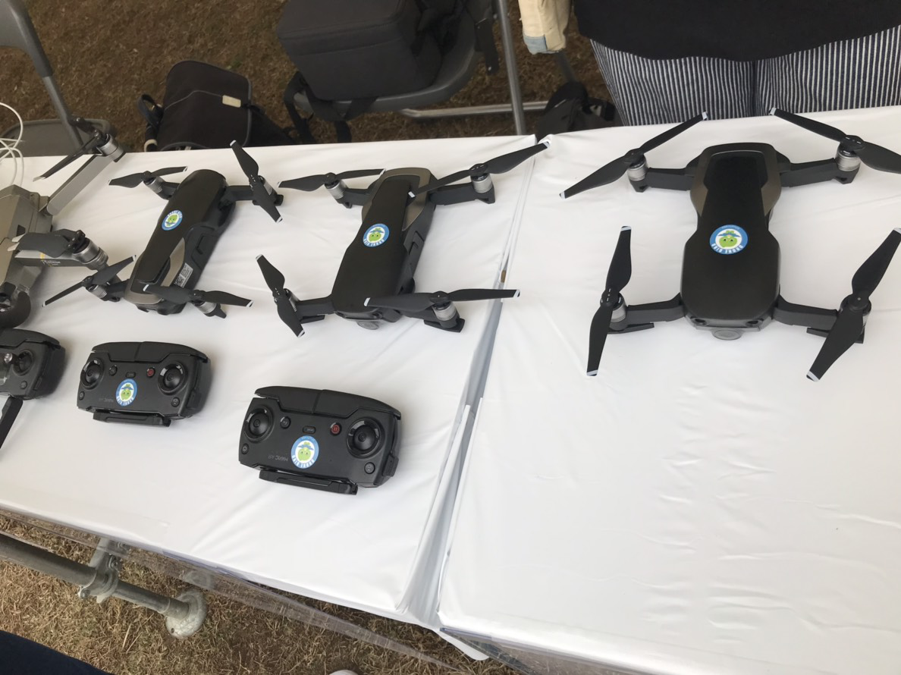
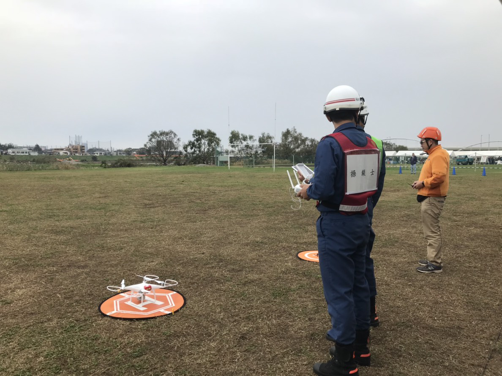
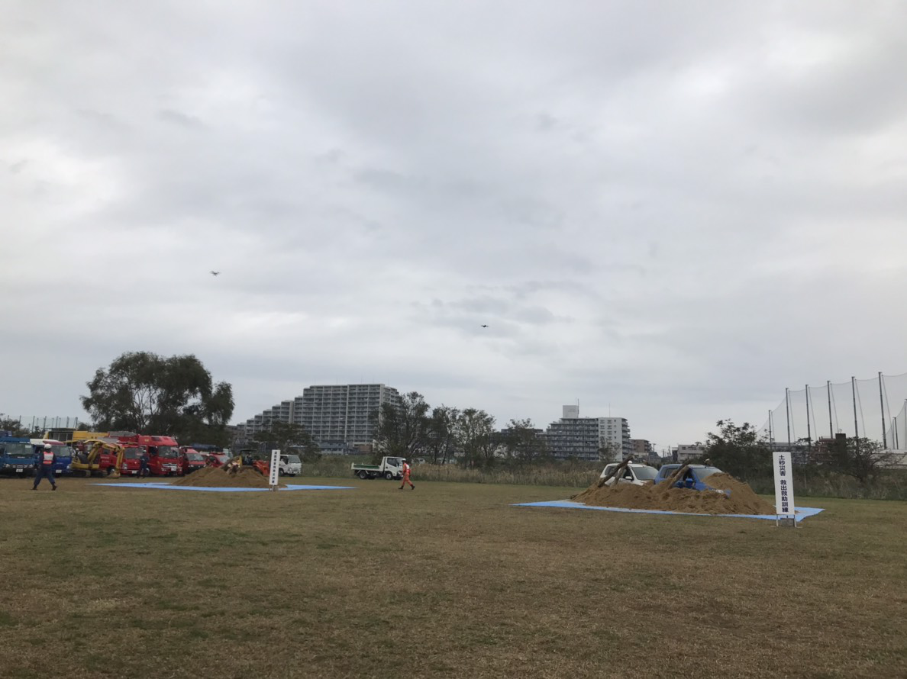

### DEAR DIARY 寒かった稲城市防災訓練

青山学院大学地球社会共生学部3年福田紗彩です。

11月4日日曜日ここ最近では珍しい寒さと共に朝の9時から始まった、稲城市での防災訓練。DRONE BIRDのスタッフとして参加させていただきました。

まず会場に入って感じたことは…「かっこいい！」。稲城市の消防団や救急隊、自衛隊の方など地域を救うヒーローがいました。やはり彼らは永遠の憧れですね♡

当日の流れとしては、8時からブースのセッティング、9時からブースでの対応、10時55分から古橋先生と稲城市の消防団の方によりドローンを飛ばし、12時終了という形でした。今回は航空法の関係でドローンを飛ばす許可が下りなかったため、私たち学生は飛ばすことはできなかったものの、消防団の型の操縦するドローンからの映像をリアルタイムでスクリーンから見ることができました。

ブースにいて感じたことは、ドローンを持っている人が多い！来てくださる方の多くが、「小さいサイズなら持ってるよ」「今度大きいサイズ買おうか迷ってるんだよね~」「昨日も飛ばしてきたよ」などすでにドローンの知識を持っている方がたくさんいました。ゼミでドローンを扱っているからか、なぜか誇らしさと、自分用ドローンを持っているということに羨ましさを感じました。

また、先生と稲城市の方の会話の中で、昔のラジコンとドローンを比べているのを聞いて、近い未来ドローンがラジコンのような子供の遊び道具になるのでは...？と時代の流れの速さに驚きを感じました。

10時55分からはドローンを飛ばすと同時に、消防団による土砂災害時の救出と救急の訓練が行われました。そこではまさかの土砂に囲まれていた車の屋根を切り外すという初めて見る光景に驚くとともに、危険を恐れず救出を試みる消防隊の方々に感動しました。

〈まとめ〉初めて地域で行われている防災訓練に参加してみて、子供も大人も幅広い人が参加していて、普段触れることのできない救急車両を間近で見たり、災害の体験をしたり、ドローンについて知ることができることから、新しい体験をたくさんすることができ、いい刺激になるとと思いました。

4.0 マイル のウォーキングに出かけました。

[朝のウォーキング - Saaya Fukuda's 4.0 mi walk
Saaya F. completed 4.0 mi on Nov 3, 2018.www.strava.com](https://www.strava.com/activities/1944436119?utm_content=33429911&utm_medium=referral&utm_source=twitter)

#strava
