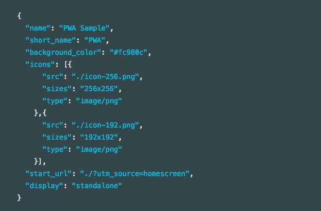
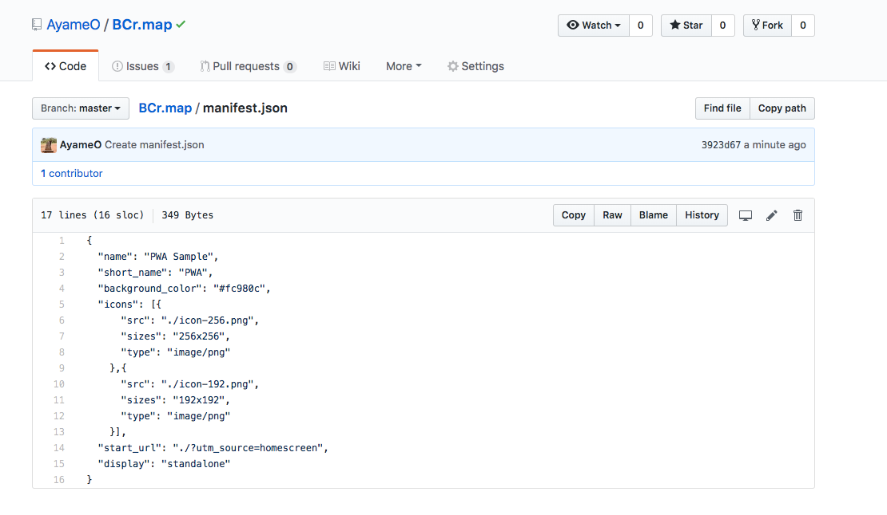
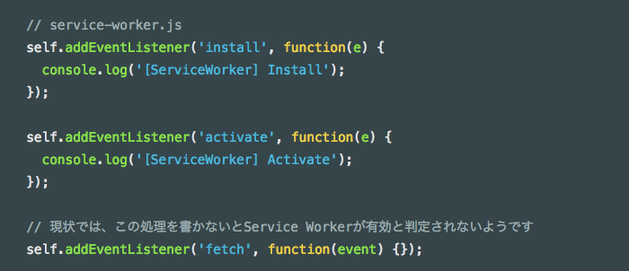
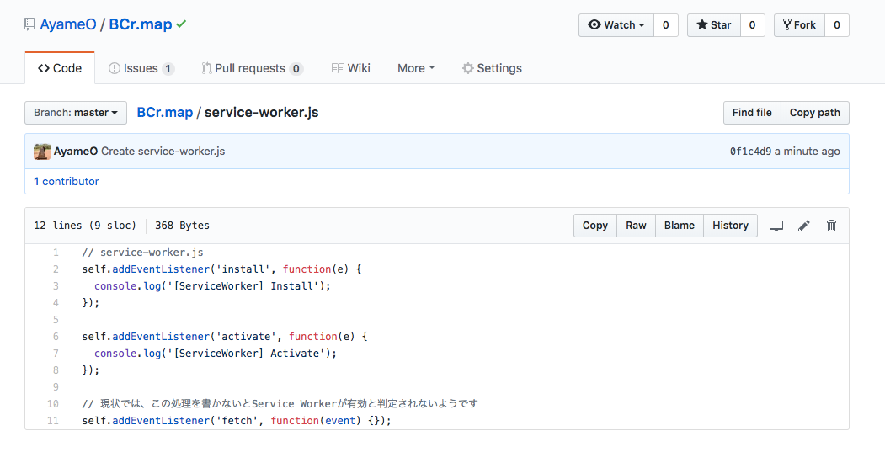
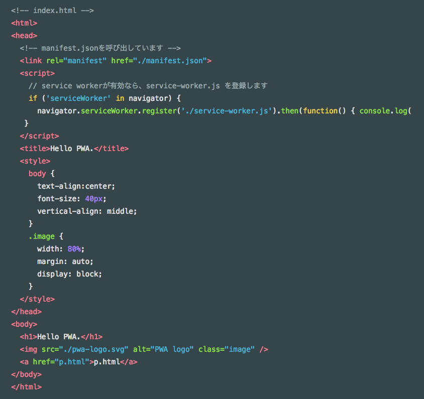
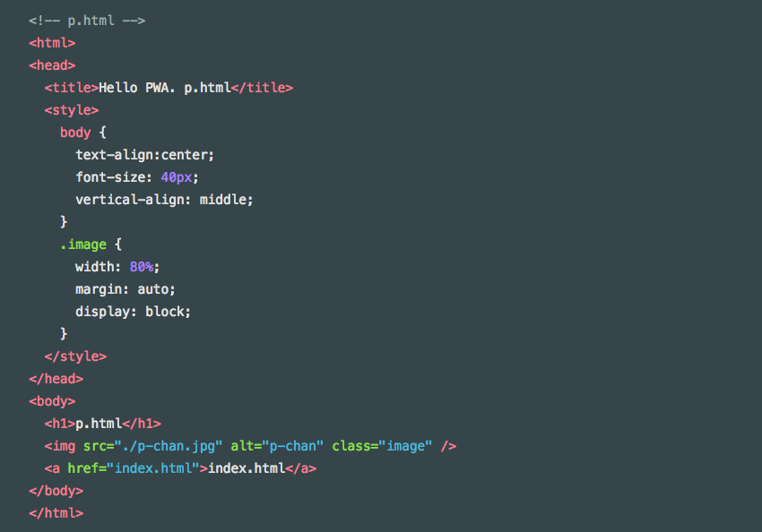

### PWAの利用方法

今回のブログは前回と前々回でお話ししたPWAの利用方法と、実際に現段階の私の作品をPWAに適応させるお話し。やり方はQiita ([https://qiita.com/umamichi/items/0e2b4b1c578e7335ba20](https://qiita.com/umamichi/items/0e2b4b1c578e7335ba20))を参考に行なう。

PWAってなにそれ？となった方は私の先週のブログにPWAの簡単な説明と私が卒業作品制作でPWAを使う理由を書いたので、よかったら下記の記事を参考にしてみてね。

[OpenStreetMap×PWA
PWAって聞いたことある？その名も「Progressive Web App」。私のブログでもちょこちょこ名前を出しているが今回はこのPWAの紹介と私のそ遊行作品について。medium.com](https://medium.com/furuhashilab/openstreetmap-pwa-cbed8bbe2218)

PWAを有効にするためのステップは３つある。
順を追って説明と実装をしていきましょう！
1.HTTPS対応
2.manifest.json設置
3.Service Workerを有効にする

#### ではでは１つ目のHTTPS対応

PWAに実装させるためにはWebサイトを「HTTPS化」する必要がある。HTTPSのSはSecurityのSで、HTTPより安全な通信という意味だ。SSL証明書の購入が必要で、購入には6千円〜数万円/年程度かかるらしい。

しかしGithub PagesならHTTPS化されているためおすすめ。私も卒業作品制作用にGithub Pagesを活用している。現在の卒業作品用のURLは「[https://ayameo.github.io/BCr.map/BCrV1.html](https://ayameo.github.io/BCr.map/BCrV1.html)」であり、しっかりとHTTPS化されている。

#### ２つ目はmanifest.json設置

index.htmlと同じ階層に manifest.json を作成する。さらにここで指定するホームスクリーン用アイコンもindex.htmlと同じ階層に配置する。コードは下記のモノを活用する。

#### 続いて３つ目、Service Workerを有効にする

Service Workerは、オフライン体験をサポートするために重要でsある。こちらもindex.htmlと同じ階層に配置する。下記にコードを貼る。

#### 最後にindex.html から`manifest.json,service-worker.js`を呼び出す

htmlを下記のように変更する。

以上今回はPWAの利用方法と実装。
こちらは現段階の作品パーマリンク。

[BCr.map
Edit descriptionayameo.github.io](https://ayameo.github.io/BCr.map/BCrV1.html)

次回のブログのネタは模索中〜。
