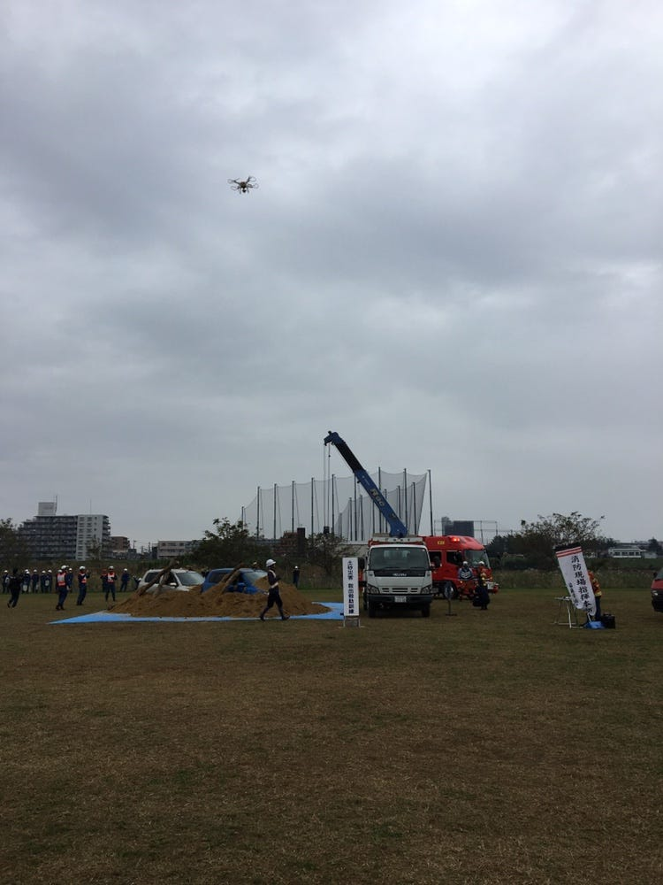
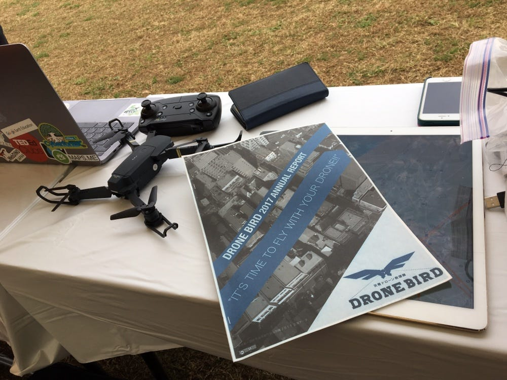
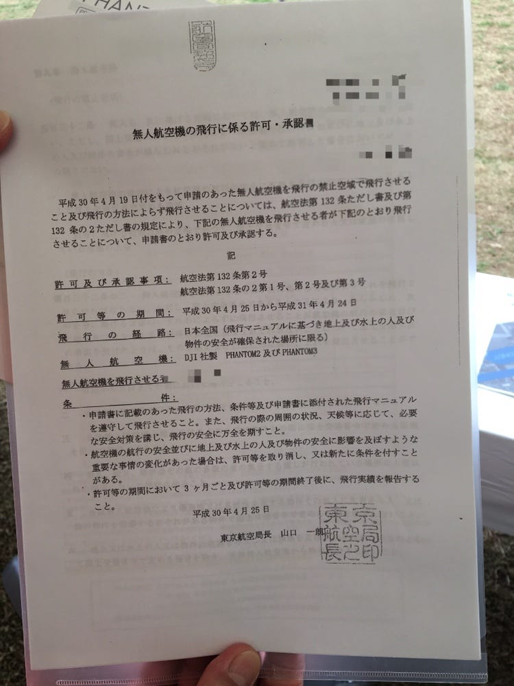
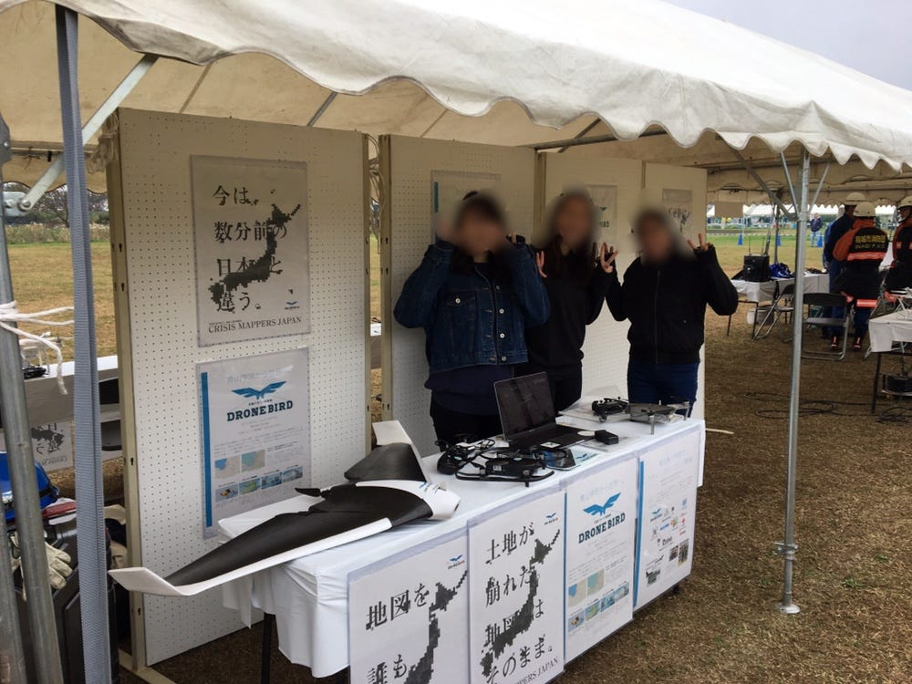

### 稲城市防災訓練に参加してきました

11月4日に稲城市の多摩川緑地公園で開催された防災訓練に参加してきました。

朝早くの開催ということで最寄駅の矢野口駅に到着するために朝も少し早起きしなければならなかったのですが、その分とても良い経験ができました。

9時に開催される防災訓練のために準備。
私たちのブースはNPO法人クライシスマッパージャパン、略してCMJです。
災害時ドローンを飛ばし、その瞬間瞬間に変化する地形や様子を撮影し、その情報を地図に落とし込み、赤十字や国境なき医師団等の現場で活動されている方々がより迅速に現場の状況を把握することを手助けしている団体です。
今回は私たち古橋ゼミのメンバーの他にもともと大和市の職員をされていて、今はご趣味でドローンを飛ばしていらっしゃる方とご一緒させていただきました。

私たちのブースにはDJIの折りたたみ式MAVIC 2 PRO とMAVIC AIR 、また固定翼飛行のドローンを展示しました。
どちらも10万円近くはするドローンなので触るだけで必死、、、

お恥ずかしながら私はあまりドローンの知識をしっかり持ち合わせていなかったので、これを機会にここぞとばかりに色々教えていただきました。

ご存知の通りドローンは近年話題になり個人的に所持する人も増加し、より身近になりました。一方で、まだまだ航空法に基づく厳しい規則が設けられています。
そのため個人で飛ばすにも組織で飛ばすにも200グラム以上のドローンを飛行させるには許可証が必要になります。
（昨年11月に岐阜県の大垣市で起きた事故によって今年はさらに規則が厳しくなったとか、、、）

この許可証は取得すれば1年間有効です。しかし取得すること自体が大変困難なものだそうです。
さらに今回のような防災訓練等を含むイベント開催時にはまた別で許可証を取得しなければなりません。
その際は、自身でドローンの飛行範囲を航空法で定められている飛ばせる範囲と照合し、その中でどの範囲までは人の侵入を禁止し、どれだけの人員を配置させるか、といった情報を書き込んだ申請書を提出します。

これを個人で取得する分には自分の技量で済むのですが、組織での取得となるとまた全員分の技量の証明が必要なのだそうです。大変、、、

こんなに飛ばすだけでも大変なのだから一般の方にはそんなに周知されていないのではないか、というのが私の最初の印象です。

しかしイベントが始まり実際にブースにお越しいただいたお客様はみなさん熱心にお話を聞いてくださる方、また多数質問をしてくださる方が多く、中には小型ドローンを所持していてそのドローンを実際にどのように活用させているのか見にきてくださったご夫婦等もいらっしゃったことに大変驚きました。

中でも多かった質問が、固定翼型ドローンの飛ばし方かと感じました。
回転翼型のドローンは動画を撮影することに長けています。
こちらのドローンは自身の操縦で自由に動かすことができるため、たとへば震災時等、倒壊してしまったビルの窓ガラスから中の様子を探りたい時などに役にたちます。
一方固定翼飛行のドローンは約数十キロ平方メートルの広範囲に渡る航空写真を撮影することが可能です。
こちらの飛ばし方は、最初に人力で放り投げるように飛ばしてあげた後は自動飛行です。
みなさん手にとって「思っていたより全然軽い！」とおっしゃっていたことがとても印象的でした。

今回の稲城市防災訓練では自身が知らなかったドローンの知識を学べたことに加え、様々な消防隊の実際の訓練の様子も拝見することができたとても貴重な経験になりました。

上記した写真は私たちの展示ブースの全貌です。
３年生のみんな一緒に体験できてよかったですありがとうー！！

最後に稲城市のキャラクター「なしのすけ君」との記念写真を晒して終わり。

https://strava.app.link/Skml0nZfLR

