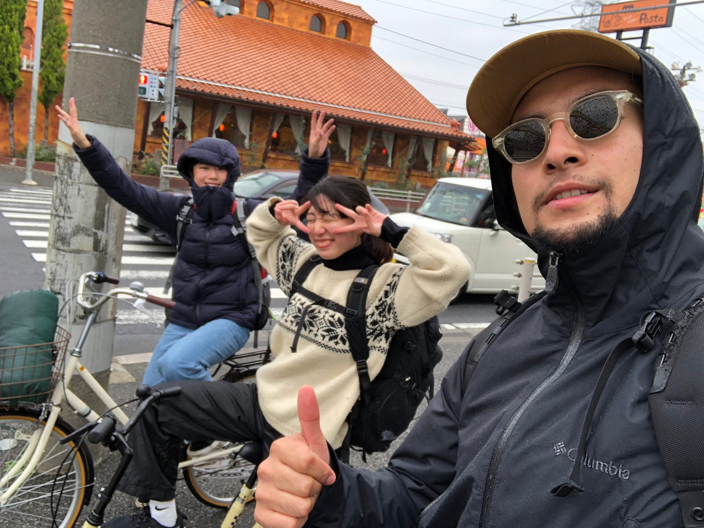
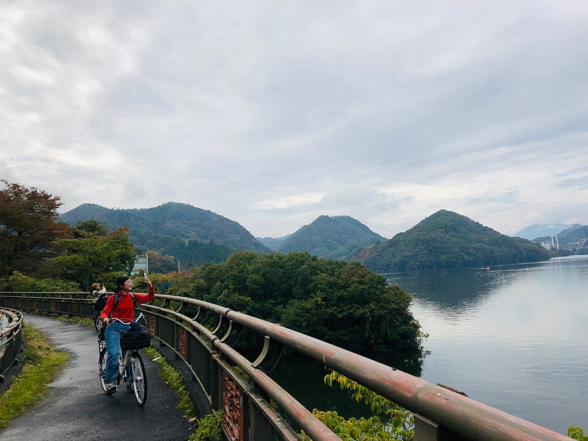
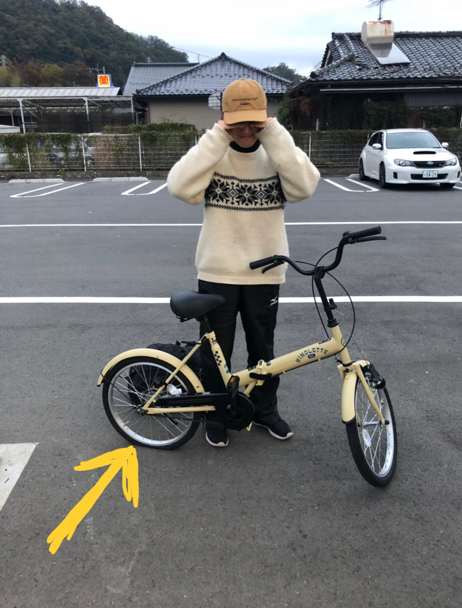
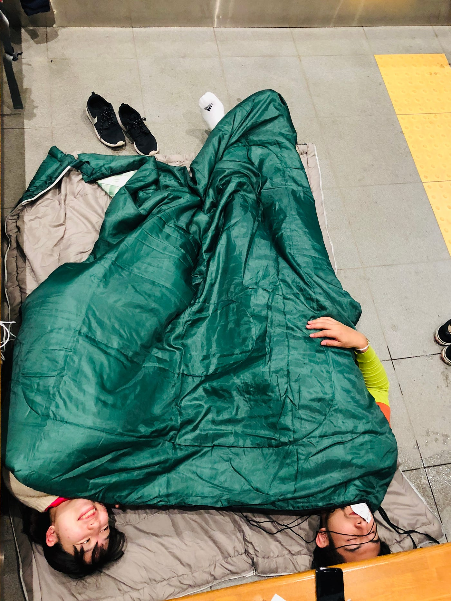

### チャリで富士山へ....１日目

青学のサガキャンから富士山駅まで総距離90キロ

朝の９時に相模原キャンパスに集合！！
ロードバイクの自分
ママチャリの友達←事の発端
激安折りたたみ自転車の友達
と3人で雨の中出発をしました。

すべり出しは順調だった16号線、
平坦な道を難なく走りながら到着した城山ダム。
しかし、アップダウンが多く、
山道に体力と精神をどんどん削られた。

合計で450mの坂道を登りきった後、
相模湖に着いて疲れが全部吹っ飛んだ3人。
こんなにも感動すると思ってもいなく、
写真にこの感動を収めようと必死の2人。

みんなの体力的がきつくなりはじめた、
神奈川県から山梨県に入ってから登り坂が増えたせいか、
ペースがだいぶ落ちはじめた。

なんとか山を越え待っていたのは、
激安折りたたみチャリの限界
空気をいくら入れても抜けていく…

タイヤに穴が空いた。
奇跡的にあったマツモトキヨシで接着剤を購入、
急いでタイヤの補強作業をした。

使用可能なチャリが残り2台になり日も暮れ始め、
私たちはこの無謀な挑戦を諦めかけた。
しかし、これまで頑張ってきたことが無駄になってしまう…
そう…私たちは越えてはならない線を越えてしまった

2人乗りでいこう!

真っ暗な夜道をひたすら距離を稼いだ
夜道をひたすら漕いで
運良く3人で目的地にたどり着いた
１日目の宿は無人駅の待合室で寒さをしのいだ。

夜に私たちは地元のご飯屋さんで次の日の計画を立てた。
至った結論は10キロ先の駅に行って温泉に入って電車で帰ろうというのだけ決めて川の字で寝た。

２日目に続く…
