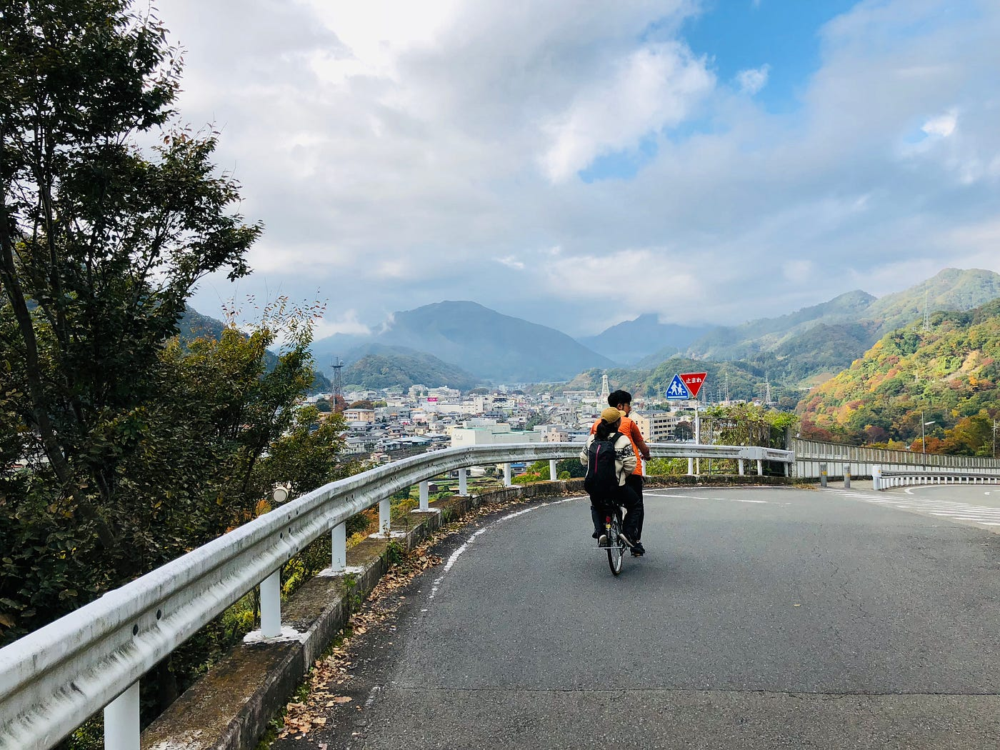
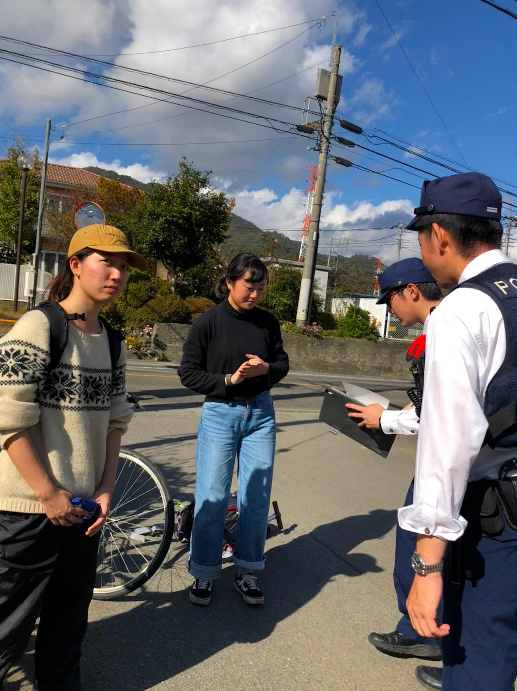
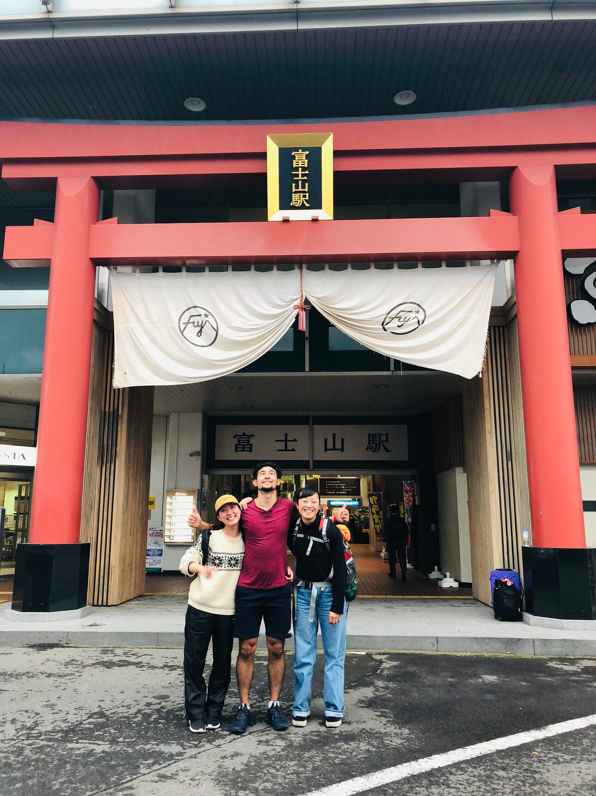

### 富士山へ…２日目

想像以上に過酷だったこの旅

地元の人たちの冷ややかな目線を感じて目覚めた、
朝ごはんと温泉を求めてチャリ2台で出発、
やっぱり筋肉痛で１日目よりもキツイ１日が始まった。

無事目的地の駅に到着をした3人
ここで旅も「これで終わって温泉に入れる！」とホッとした
だが、なぜか朝ごはんを食べ終わった後に
ぼくは無性にヤル気が溢れてきてしまった。

急遽、富士山駅までのルートを見直しました。
これいける！ここから先は緩やかな坂道だけだった
私たちはもう一度富士山へ行くスイッチを入れらることができた。

順調に距離を縮めたと思った残りの18キロ

ついに奴らにみつかった…
山梨ポリスに止められた
僕と友達は急いでママチャリから降りた。

無事優しい山梨ポリスから解放された3人…
もう2人乗りはできないとなり
最終手段でぼくが走るという結論になり
ぼくは富士山までマラソンをすることになった。

果てしない坂道をひたすら走り続けた。

私たちの目的は富士山駅に日が落ちる前に到着することだった。
ペースをどんどんあげた私たち3人
朝から何も食べてない3人も体力が限界にきている。

ひたすら曇りで富士山のふもとがときどき見えるとパワーをもらっては休憩を繰り返した。
街中に入ると坂も急になってきてぼくの足も限界に達して遂に休憩をいれながゆっくり駅へと目指した。

そして…
遂に富士山駅に3人とチャリ2台で着いた！

富士山駅で腹ごしらえを済ませて
２日ぶりのお風呂へ〜
そしてまた野宿をして次の日の始発でお家へ電車で帰る。

素晴らしい旅でしたこれほど達成感に満ち溢れたのは何年ぶりか
やってみたい人は是非！学生のうちに！

自転車は……？

知りたい人はぼくに聞きにきてくださいw
