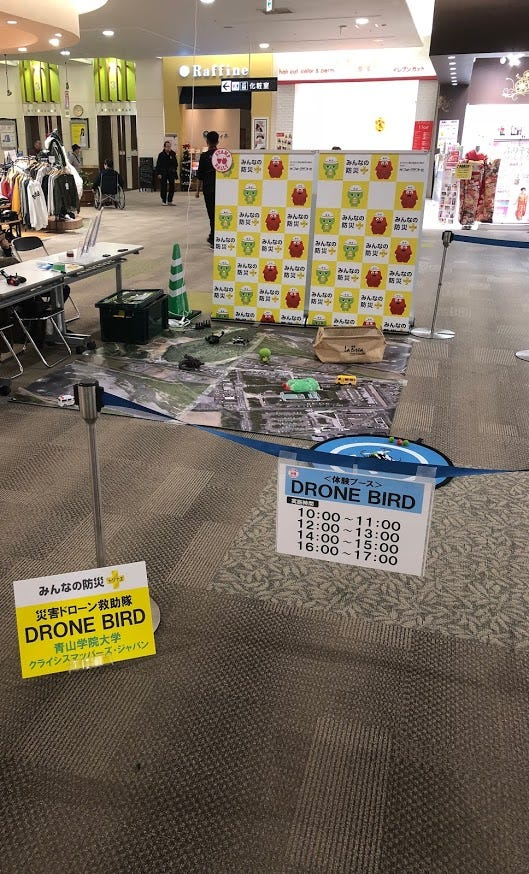
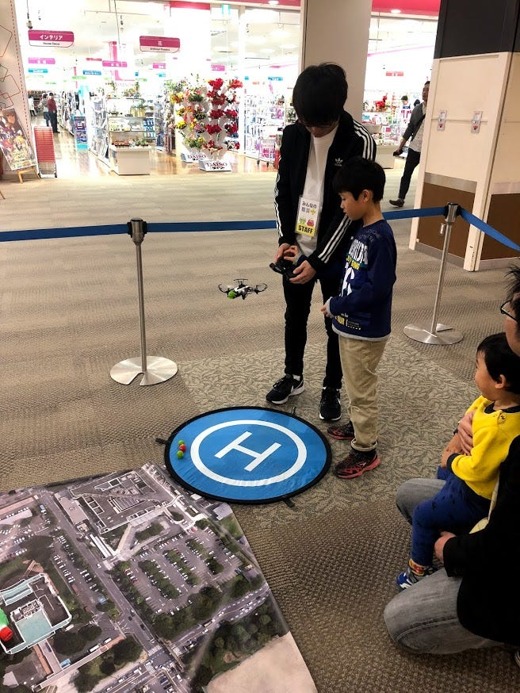
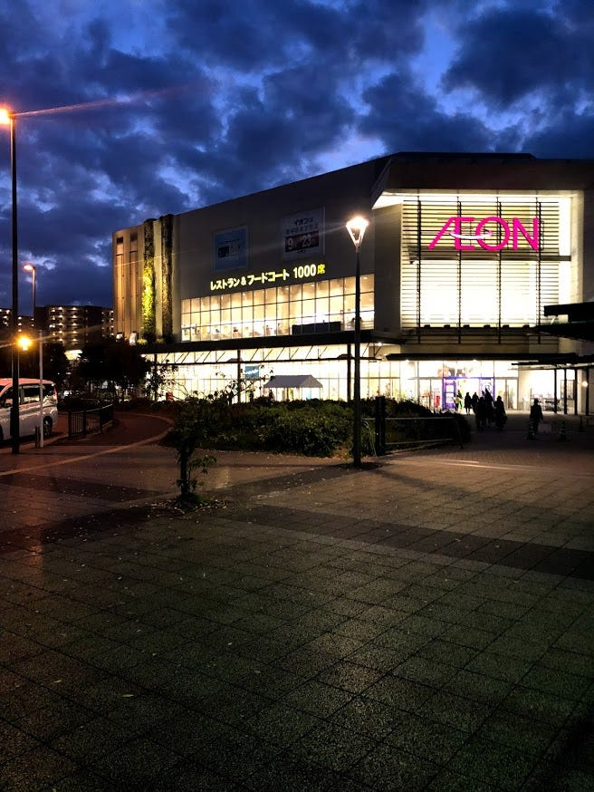
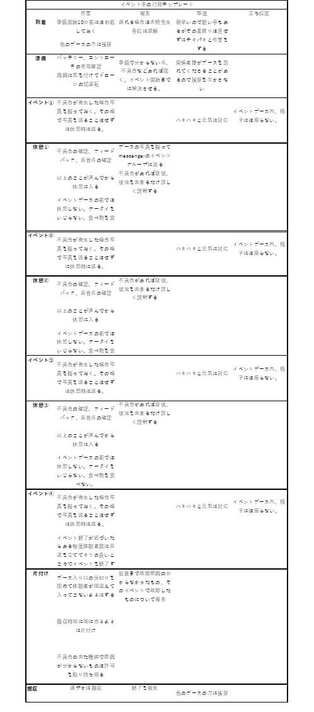

### 常に誰かが見ているという意識をもつ【イオンモール学研奈良登美ヶ丘11/4】

こんにちは、3年の秋山です。私は11/4にイオンモール奈良登美ヶ丘店で開催されたドローンワークショップに参加してきました。ご存知の方も多いと思うのですが今回のワークショップで私たちのイベントに対する態度が原因でスポンサーであるフジテレビ様から古橋ゼミで初のクレームを受けてしまいました。このことにより古橋先生はじめ関係者の方々に多大な迷惑をかけてしまいました。今後こういったことが起こることがないようになぜ起こったのかと今後どうしていくべきかをイベントの報告と合わせて報告していこうと思います。

### 新大阪に前泊

新大阪のホテルに前泊し翌日のイベントに備えました。

### イオンモール登美ヶ丘店に到着

イベント準備が午前9：00からだったため、イオンモールへは午前8：50頃到着し準備を始めました。

ここで反省点が１つ。横瀬のゼミ合宿からドローンに触れていなかったため2人ともうろ覚えでドローンやドローン回りの機材を準備していました。電源を入れる順番やセッティング方法などほかの人から見たら滅茶苦茶だったと思います。今回特に大きなトラブルは起きませんでしたが運が良かっただけでこのような不注意は故障などのトラブルに繋がります。分からないことがあったら逐一報告しましょう。

準備も終わり、イベントが開始いたしました。休日でドローン体験ブースの目の前がゲームセンターだったということもあり開始早々にたくさんのお客様に来ていただきました。

### 実際に子供たちと触れ合う

子供はドローンに興味津々でコントローラを子供の目の前に出した瞬間に触ろうとします。子供が1人でコントローラを操作するのは事故やケガに繋がる危険性があります。そのため子供にそうさせる直前は自分たちの指でコントローラのレバーを固定し1つずつ説明していくとよいと学びました。

上記で記述したようにイベントブースの目の前がゲームセンターでそこには綿菓子やお菓子など手が汚れるようなものがたくさん置いてありました。我々の気づかぬうちにそんな汚れた手でコントローラを触られてしまいコントローラが汚れていることが起きてしまいました。

その対策として、子供に触らせる前にまず汚れていないかパッとチェックする。汚れていればその場でウェットティッシュで拭く、混んでいる場合は親御さんに頼んで拭いておいてもらい順番を1つ繰り上げる対応をする。このように只ドローンの操縦方法を教えてはい、終わりではなくいろんなことに目を光らせて接客しなければなりません。

### 常に誰かに見られているという意識を持つ

私たちは今回体験者がいない間や、休憩中にブースにある椅子に座ってケータイを弄っていたり談笑したりしていました。なぜこんなことが起きてしまったのか考えてみたところ、私たち2人だけのリモートワークで言い方は悪いですが監視の目から離れた状態での作業だったので気が緩んでいました。大学三年生にもなって本当に情けないと思います。

こんな気の緩みがフジテレビ様からのクレームに繋がり古橋ゼミ全体の評価を落としてしまいかねない状況にしてしまいました。これからは例えそれがリモートワークで誰にも見られていなくても、青山学院大学の、古橋ゼミの代表として自覚をもち誰かに見られているという意識を常に持って取り組んでいきたいと思います。

今回の反省を生かして自分に何が出来るか考えてみました。そこで思いついたのが今後誰にも私たちと同じようなミスをしてほしくないと思い、イベント当日の行動テンプレートを作成しました。

イオンモールでのイベントスケジュールを参考に作成したため他のイベントでは使えないかもしれませんが基本的なすべきこと、してはいけないことは同じだと思うのでもし良ければご活用ください。

※ほかにもこんなことに気を付けたほうがいいなどお気づきになられましたら是非ご連絡ください

[古橋ゼミ奈良ドローンバード - shuntaro akiyama's 48.6 km walk
Shuntaro A. completed 48.6 km on Nov 3, 2018.www.strava.com](https://www.strava.com/activities/1945240078?share_sig=1EAD07EA1541942423&utm_medium=social&utm_source=ios_share)
