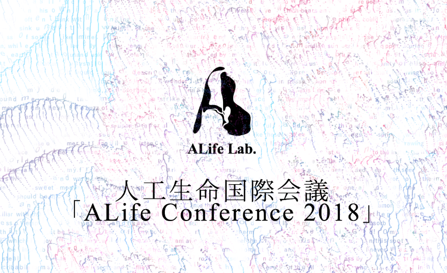

### ALIFE2018,怪我の功名とはこういう事

初めまして3年の秋山峻太郎です。

今回、私は日本科学未来館で6日間にわたり開催された[ALIFE2018](http://2018.alife.org/)の26，27の2日間参加してきました。そこで私が見て、聞いて、感じてきたことを書いていこうと思います。

### ▼ALIFEとは？

突然ですが皆さんは「ALIFE」という言葉を知っていますか？恐らく大多数の人にとってはあまりピンと来ていないんじゃないかなと思います。実際私も今回参加するまで知りませんでした。

「ALIFE」とはArtificial Lifeの略語です。日本語で言えば「人工生命」です。あまり聞き馴染みはありませんよね。

「人工生命」とは簡単に言えば生命とは「何か？」を研究する分野です。漠然としてますよね。詳しく説明すると

> [〝ALife は、生物を構成する物質そのものにとらわれるのではなく、その背景にある生命の成り立ちや仕組みなど生命現象の原理に迫ろうとしている研究分野なのだ。誤解を恐れずに言えばメタ的な生命の形、もっと言えば自律性や進化などを生み出す、まだ誰も見つけていない「生命のOS」を発見しようとしている。“](https://bizzine.jp/article/detail/2502)

いやー難しい！この一言に尽きます。言葉で説明するのは私には難しいので、詳しくは以下の動画がわかりやすためそちらをご覧ください。

### ▼ボランティア活動

今回私がALIFE2018に参加した経緯は、お恥ずかしながら6月に開催された国際カンファレンスに寝坊してしまい、「今回を逃したら海外になるかもしれないよ」と聞いていたので焦りに焦って古橋先生に連絡したところ、今回のボランティアを紹介していただき海外行きは免れることが出来ました。

ボランティア参加者は私のような学生から社会人として働いている方が多く参加していました。しかし、私との大きな違いといえば**全員理系**ということです**。**テーマがテーマなのでやはり研究を主にしている方が大半でした。

ボランティア当日は朝の7：45集合で眠たい目をこすりながら家を5時に出ました。電車に揺られ、到着するとそれぞれに役割が割り振られ、初日はフードの担当になり、プログラムが始まるとたっくさんの外国人が押し寄せて休む暇もなくとにかく大変でした。

2日目は最終日ということもあり、片付けから掃除から何から何までかなり大変で、まるで肉体労働のようで家に帰ると案の定筋肉痛になってました。

### ▼石黒教授のkeynote

5日間のプログラムの中で、自律的に動く掃除機ロボット「ルンバ」の開発者でありMIT人工知能研究者所長のロドニー・ブルックス氏、タクシーサービスUberのAI Labs 設立メンバーであり研究主任のケネス・O・スタンリー氏、ロボット工学者の石黒浩氏や、動物や人工物に憑依できるゲーム『Everything』で知られるアーティスト／アニメーター、デビッド・オライリー氏など蒼々たる顔ぶれのKeynoteが行われました。

私は、26日に行われた石黒教授のKeynoteに参加しました。（もちろんボランティアをしながら）

石黒浩教授の詳細は以下の動画をご覧ください

簡単にKeynoteをまとめると石黒教授がおっしゃるには、究極的な人類の進化の目標とは骨や肉が無機質の物質によって置き換えられた不死であるそうだ。

オーガニックな肉体、つまり私たちの体は複雑な分子構造により様々な環境に高い適応能力を持っている。しかし、その複雑な分子構造はとても脆い。そのため、我々の進化の目的は無機質で頑丈な体になることが目標である。

今我々は肉体を持っているがこの肉体の多様性には限界がある。人々にとって様々な価値観を持つことや独特な生き方をすること、つまり多様性は幸福につながる。

肉体が置き換えられることが可能になれば、我々は様々なボディーを選ぶことが出来る。つまりこの多様性が人間を幸福にさせる。

石黒教授は無機質な人間、肉体を置き換えた人間は数千年後には当たり前になるだろうとしている。

### ▼今回得たもの

まずは私の知らないことをたくさん知れたということです。石黒教授の言う無機質人間が未来には当たり前になるなんて考えたこともなかったし、そんなことを考えている人がいるなんて夢にも思ったことがありませんでした。新しい分野に少しでも足を踏み入れることが出来たこと、新しいことを知るという幸せを感じることが出来ました。

もう一つはやはり、たくさんの頭のいい人と一緒にボランティアという立場ではあるが1つのものを作り上げるのに携われたことが一番大きな成果でした。普通に生活していたら交流することなんてなかったであろう人たちと知り合いになれたことが本当にうれしくて、今後もこの交友関係を大事にしていこうと思います。

### ▼今後の課題

今回のボランティアを通じて痛感した私の課題

・英語力

・説明力 の2つです。

・英語力は来場された参加者の方々はほぼ外国の方でボランティアを通して関わることが多くありました。しかし、うまく受け答えできなかったり、ほかの人に助けてもらうことが多々ありました。半期の留学に行ったり、1年生のころから英語はみっちり勉強してるはずなのに本当に自分が情けないと改めて思わされました。

ボランティアの中には英語、中国語、韓国語などを自在に扱うひとがいたり、自分の研究している分野について英語で質問したりと、とにかくすごい人たちがいっぱいいました。やっぱりそのような人たちを見ているとかっこいいし自分もこうなりたいと思いました。

・説明力は、今回他のボランティアの方と多く接する機会があり仲良くなった人とはボランティア終了後にご飯に行ったり、ボーリングに行ったりと仲良くしていただきました。そんな時に、「学校では何を勉強しているの？」とか「ゼミでは何を先行してるの？、それは何に役に立つの？」と聞かれることが何回かありました。しかし、私にはうまく説明することが出来ませんでした。自分が普段にを勉強していて、何のためになるのか、将来どのように役立つのか これらを理解していませんでした。

### ▼終わりに

ALIFE Conferenceは30年の歴史があり、東京で開催されたのは今回が初めてでした。そんな歴史のある会議にボランティアとして裏から支えられたことを心から嬉しく思います。

6月に開催された国際カンファレンスに寝坊したことにより今回参加することになったわけですが、あの時寝坊していなかったらALIFEの知識も友人も経験も得ることが出来なかったと思うので、今思えば寝坊して良かった、怪我の功名ってこういう事を言うんですね。（ごめんなさい）

お伝えしたいことが多すぎてこれでもまだ足りないくらいなのですが、拙い文章でしたが長々とありがとうございました。
