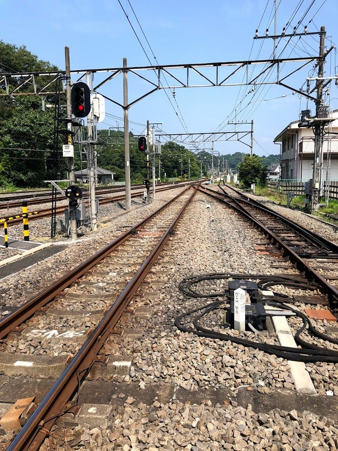
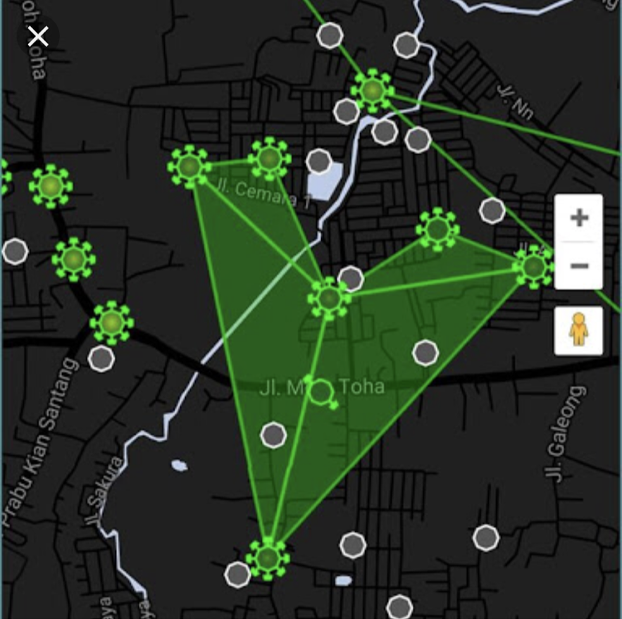
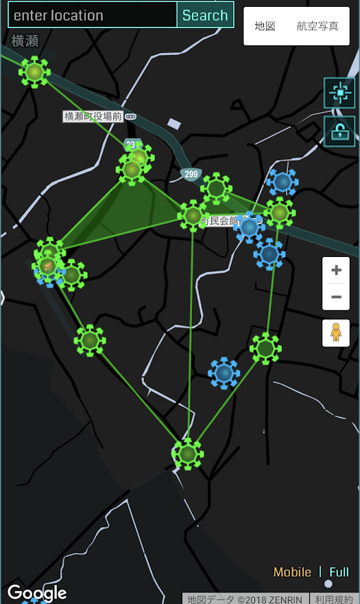
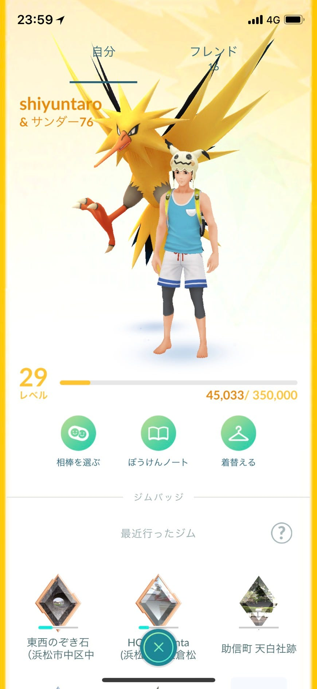

### 暑い、とにかく暑い、そして暑い

こんにちは、古橋ゼミ３年の秋山です。8/5–8/7のゼミ合宿に参加してきたのでそれを報告します。

### 1日目

僕の地元は田舎です。（唐突）でも、その田舎よりもなにもないというのが横瀬の第一印象でした。正直言うとここで２泊３日生活するのかと憂鬱になりました。

1日目は主にMapillaryを使いました。これは常に携帯を持って写真を撮影しなくてはならなかったため携帯で何か焼けるんじゃないかと思うくらい熱くなり、しまいにはこんなものが出てしまうくらいまで

[古橋邸からジェラート屋さんまで — shuntaro akiyama’s 1.1 mi walk
Shuntaro A. completed 1.1 mi on Aug 5, 2018.www.strava.com](https://www.strava.com/activities/1750416701/shareable_images/map_based?hl=ja-JP&v=1533444295)

### ２日目

２日目は結論から言うと、とにかく疲れました。

朝は川の近くでドローンを飛ばしました。初めてのことだったのでとなりの山の中に落っことしてしまうのではないかとか、川の中に水没させてしまったらなどと緊張しました。実際にやってみると思ったよりも直感的で不器用な僕にも出来そうです。ドローンガチメンバーにも参加したのでこれかたたくさん練習しようと思います！

８月６日の秩父の最高気温は35.0度。とんでもない暑さの中でingressを使ってフィールドアートを作成しました。

フィールドアートのテーマは古橋先生が『8月6日の8：15は広島原爆忌で技術を間違って使った過去を振り返るタイミングとしてフィールドアートに刻んでもいいかもしれません』とメッセンジャーでおっしゃっていたのでそれを参考に平和運動や反戦運動の象徴として使われているピースマークを作ろうとしました。

しかし、ポータルの数的にも規模的にも難しそうだったので、テーマはそのままでアートをハートに変更しました。

完成までの道のりはとにかく大変で、暑さがまず僕たちを苦しめました。また、坂の多い地域だったので足が棒になるとはこういう事かと思わされました。

僕らのメンバーは5人で5人中2しか緑チームがいなく、そのことに気づいたのが出発してからだったので準備不足でした。しかし、緑チームがポータルキーを獲得できなくてもドロップ機能を使ってみんなで分担して頑張りました。

作成中についさっき奪取したポータルが青チームのLV8のレゾネーターが刺されてていました。一生懸命歩いて作ったフィールドアートが壊されていたので戸惑いを隠せないまま続けていると、その近くのポータル付近で車に乗ったingressガチ勢に遭遇しました。

その方に大学のゼミの一環としてフィールドアートを作成している旨を伝えたところ、快く反転してくれるとおっしゃってくれたのでその後は順調にフィールドアートを作成し完成しました。

僕たちが理想としていた「ハート」にはお世辞にも見えず、いびつになって強いました。フィールドアートの難しさを実感し、他のアクティブプレーヤーの存在について考えていなかった点が今回の反省点でした。

[フィールドアート — shuntaro akiyama’s 4.9 mi walk
Shuntaro A. completed 4.9 mi on Aug 6, 2018.www.strava.com](https://www.strava.com/activities/1753067366)

### 3日目

この日は前日から続く雨で1日の始まりは良いものとは言えませんでした。しかし、家の中でドローンをアプリの設定から電源を落とすところまでやり、みんなでしゃべりながらアットホームな感じで楽しく過ごせました。

帰宅の時間になりやり遂げた感と共にテントをたたまないといけないという現実が僕を襲いました。

その時テントは雨で水を吸い込み重くなっていたし、たたむのは初めてだったのでぐっちゃぐちゃになりながらやっとの思いでテントをしまいました。

### まとめ

今回の合宿で計画性の重要性に改めて気づかされました。恐らく今回計画をもっとしっかり立てていればもっと楽に、時間をかけずスムーズに物事が進んだと思っています。今後は計画性をしっかりともって行動しようと思います。

[ジェラート屋さんから古橋邸まで — shuntaro akiyama’s 5.1 mi walk
Shuntaro A. completed 5.1 mi on Aug 5, 2018.www.strava.com](https://www.strava.com/activities/1750870572/shareable_images/map_based?hl=ja-JP&v=1533462409)

[Japan,横瀬
Mapillary — Street-level imagery, powered by collaboration and computer visionwww.mapillary.com](https://www.mapillary.com/app/?lat=35.9750292962752&lng=139.09195208934983&z=17&menu=false&pKey=_Ew0W1iDImxEK5Z7usGxvA&focus=photo)

P.S.

先輩の合宿ブログでポケモンGOを夜中にやったという話が出てて、最近僕もサンダーデイから、フリーザデイ、コミュニティなど全部に参加してなかなかのガチ勢っぷりを発揮しているので今度また同じ機会があったら僕も参加したいです！！

