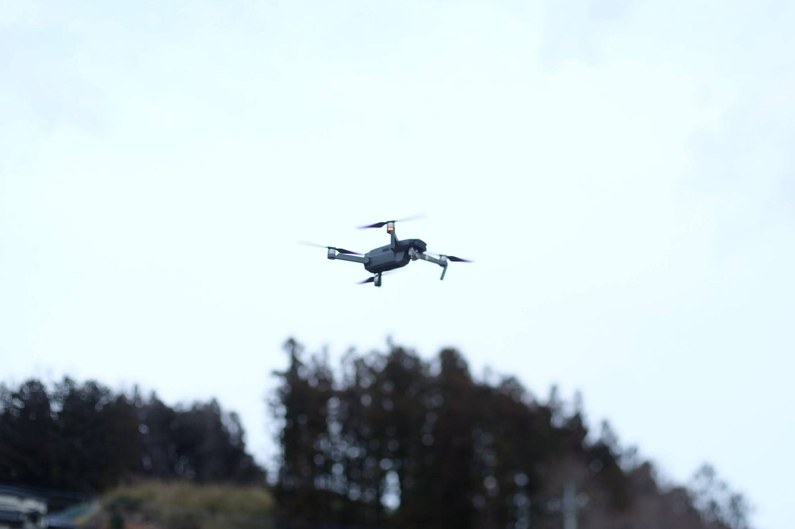

### ドローンの初心者講座

ドローンを飛ばすのって難しいの？そもそも誰でもドローンって飛ばしていいの？ドローンの豆知識から飛ばすための法律まで、今回はちょっと卒論から離れてドローンの話しをする。

#### ドローンってなんでドローンって言うの？

ドローンって言葉、知らぬ間に使っているけれどなんでドローンっていう名前なのか考えたことはあるだろうか。実はドローンという言葉はアメリカの軍用語。射的の訓練に使われていた飛ぶ的のことだったらしい。またまたドローンには「雄蜂」という意味があり、ドローンのあの音は確かに蜂みたいだよね。

#### ドローンってラジコンみたいな感じ？

実は実は、ドローンとラジコンには明確な**違い**がある。
そのキーワードは「**自律飛行**」。ラジコンはコントローラーから手を離すと墜落する。しかーし、ドローンにはホバリングと言われるその場で停止しようとする機能があるのだ。だからドローンの場合、コントローラーから手を離しても、途端に勝手に墜落することはないのだ。ここがラジコンとドローンの違い。私はドローンとは自由に可動することができるコンピュータだと思っている。OSのアップデートもあるしね。

#### ドローンって飛ばすの難しいの？

ドローンにも色々種類があるよね。どんな目的のために使うかで異なると思うけど、私一個人の意見としては、飛ばすのはそんなに難しくない。まるでゲームをするかのように私はコントローラーを握っている。プログラムで飛行回路を指定して勝手に飛んでくれるドローンもあるし。

だがしかーし！法律を守りつつ、ドローンの機体の属性を考慮しつつ、天候を気にしつつ、目的があったらそれを達成する計画が必要なのだ！ここが難しい。測量、空撮、レース、ただ飛ばすだけ。様々な目的があると思うが、その目的ごとに必要なスキルが異なる。

#### そんで私は何者だ？と、ドローンの種類

ほんなら私はどんなドローンに触れたことがあるのか、それを説明しつつ、ドローンの種類を説明する。ちなみに私が飛ばしたことがあるドローンはすべて古橋研究室のドローンである。

**固定翼機 vs 回転翼機
固定翼機**は飛行機タイプとも呼ばれる。その名の通り、見た目が飛行機みたいでおしりに小さなプロペラがひとつ付いている感じ。こちらは飛行させる時、手でバッて放ってあげなきゃならない。飛行時間が比較的長いので、広範囲を空撮するのに適している。
**回転翼機**はマルチコプターとも呼ばれる。ヘリコプターみたいにプロペラがマルチに付いているタイプだ。みんながよく見たことあるやつ。こちらの方が細かなコントロールに向いている。動画撮影など。

飛行機タイプについては古橋先生が飛ばす、地図作成用に広範囲の画像を取ることができる、eBeeとDiscoシリーズしか間近で見たことがない。こちらはしばしば先に飛行ルートをドローンに指定して、先生は飛ばしている。私は飛ばしたことがない。

マルチコプターはおもちゃのトイドローンからFPVで操縦するレース機、動画作成用に空撮する機体などを操縦したことがある。レース機を飛ばすためにアマチュア無線という資格も取った。感想としては、動画作成用には動画の完成図からどういうカットのシーンが欲しいのかを場所によって考えて飛ばしたり、カメラの角度コントロールが難しいと思う。やはりただ飛ばすだけではなくて、レースだったらスピードを、動画作成だったら動画のことを考えながら飛ばすのでそこが難しい。

### DJI vs Parrot

こちらは一般ユーザ向けの空撮用ドローンメーカーの２大手企業！
DJIが中国の会社で有名な機体はMavicやPhantom。
Parrotはフランスの会社で有名な機体はBepopやAnafi、Disco。

#### ドローンの法律

ドローンって日本国内どこでも勝手に飛ばして良いわけではない。室内なら良いのだが、大きな本格的なドローンはちょっと室内ではなかなか飛ばせないよね。。ちなみにこのドローンに関する法律は国よって違う。ドローンを入国の際に持ち込めない国もある。

**200gがドローンの境目(2018年**現在)

ドローン飛行に関しては様々な法律で規制されているが、その大前提として、200g以上のドローンがその法律の対象となる。しかーし、おもちゃのドローンを公園とかで飛ばしてたりしたら怒られちゃうこともあったり。あとは200g未満のドローンでも飛行中のドローンのプロレラにあたった場合、血が出るのこともあるのでそれなりに注意がいる！

**航空法
**こちらは人口密集地区では飛ばしてはいけないよ、150m以上高く飛ばしてはいけないよ、日中しか飛ばしてはいけないよ、などのルール。

**民法
**民法では人の私有地では許可なく飛ばしてはいけないといったルール。

[【ドローンに関わる法律】航空法や条例、ルールをわかりやすく解説！
ドローンを日本国内で利用する場合には、航空法を始めとするさまざまな法律を遵守しなければなりません。そこで、この記事では「ドローンに関わる法律は何？…viva-drone.com](https://viva-drone.com/law-on-drones-in-japan/)

↑ その他にも様々な規則があり、調べたら色々出てくるよ。

[ドローン情報基盤システム
Edit descriptionwww.dips.mlit.go.jp](https://www.dips.mlit.go.jp/portal/)

↑ こちらのサイトは規制外で飛ばすための申請をするサイト

#### 資格は存在するけど、なくたって飛ばせる

このご時世いろんなドローンの資格が存在するけれど、実際のところドローンを飛ばすのに資格は必要ない。要は法律を守って飛ばせば良いのだ。FPVでレース用のドローンを操縦すると言うならば無線だったり、使う周波数帯によって実は色々あったりするが、空撮機を飛ばす時には基本関係ない。ただ10万円もするドローンを初めて飛行させて、ぶつけて壊したりするのは怖いよね。そのような社会のニーズに合わせて様々な資格が世に出没したのであーる。

おすすめは安い、7gとかのトイドローンでドローンの操縦スキルを鍛え、法律をちゃんと理解しつつ、風や地形を考慮して今度はお外で本格ドローンを少しづつ練習するのが近道だと思う。どんな機体が良いのかなどアドバイスをしてくれるような人が身近にいたらとってもいいね。ちなみに私はただいま動画作成用にMavic2が欲しいっす！

#### 雑談

雑談になるがドローンの操縦には、コントローラーのスティック操作にはモード1からモード4まで４つの種類がある。ラジコンではモード1が広く使われていたため日本国内ではモード1が人気だが、海外ではほとんどモード2が使われているため、これからドローンを始めるに人には個人的にモード2がおすすめ！

以上、今回はドローンのお話し。次回からは卒論ネタに戻ろうと思う。
