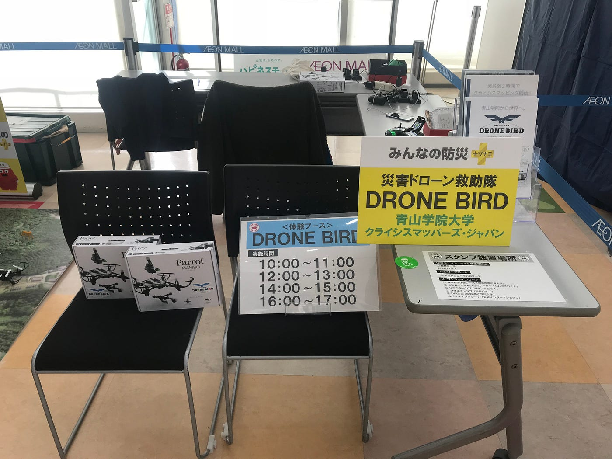
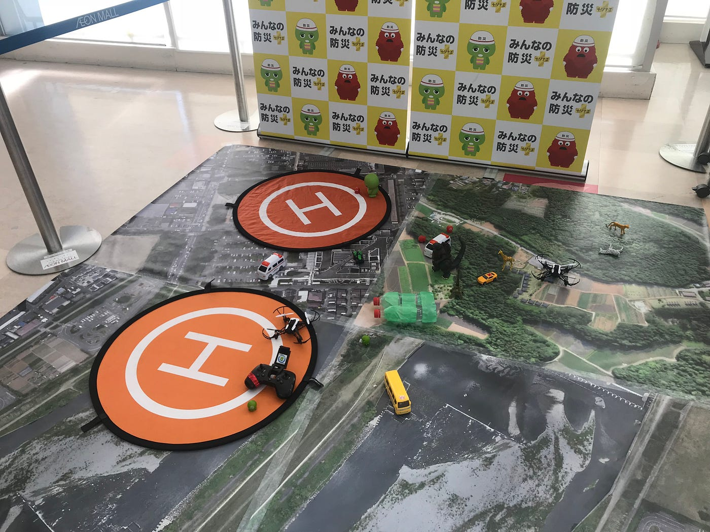
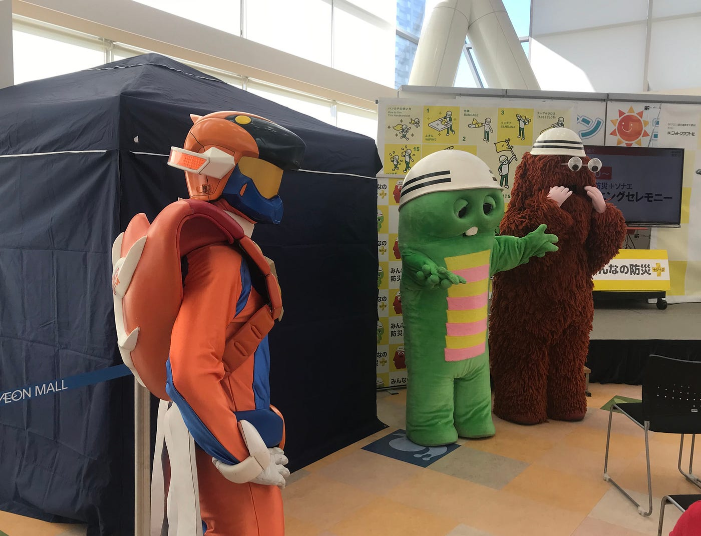
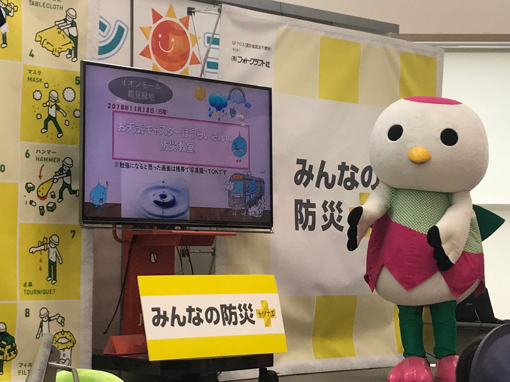
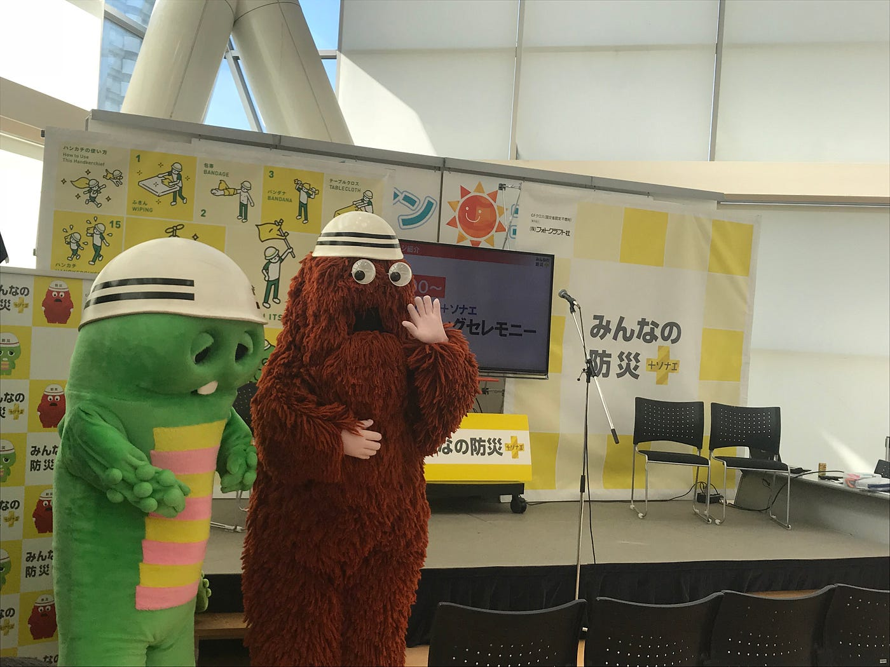

### イオンモール巡業フィナーレ！

古橋研究室3年の末光香織です。

ついにこの日が来てしまった。

イオンモール巡業ドローンワークショップ最終日！！

### 最後の会場は...

11月18日に行われたイベント「みんなの防災」最後の会場は、大阪です！

イオンモール鶴見緑地は新大阪駅から電車で約25分、駅から徒歩5分。アクセスも非常に良かったです！私たちは前日入りし、京橋駅近くに宿泊したので電車・徒歩含め約15分で行くことができました。

> プチ余談

高校生ぶりの大阪で気付いたのですが、大阪って階段多い。東京は上りも下りも駅にエスカレーターあるところ多いですよね。

でも大阪は上りのエスカレーターはあっても下りがないところが多いなと感じました。

荷物を持ってると移動が大変…。大阪へ出張の方多いと思いますが改めて大変ですね、本当にお疲れ様です。

さて前回私が参加したイオンモールむさし村山の時は、他の参加団体は1階でDRONE BIRDのブースだけ３階と

とても寂しかったのですが…。

**今回はメインステージの隣！！**周りにも他の団体さんがいて寂しい思いをせずに過ごすことができました。笑

### 会場準備

到着して早速ドローンの操作確認をしようとしたのですが

バッテリーの充電がなかったので、充電をしながら先にテーブル周りの準備をしました。

周りから綺麗に見えるように整頓して充備していきました。

ドローンのペアリング・操作も終了し、イベント開始です！

### 体験者の多くはやはり子供

ステージでのイベントと交代にドローンの体験会があったのでどの回も多くの方がブースに来てくれました。

大阪の子供はやんちゃだと言われ、ここ2週間不安の日々を送っていました。

**しかしそこまでやんちゃする子供はおらず一安心しました！泣**

と言いつつも、コントローラーも自分の手で制御することは常に頭に置いていました。

### 前回のイオンモールとと変えた点

今回、小学生というよりは

幼稚園生からそれ以下の子供が多かったため

あまり自分から話してくる子はいませんでした。

なので自分から「こんにちは！」から積極的に話しかけるように。

子供に何をやるのかわかりやすく伝えるために

> 「君にやってもらいたいミッションがあります！奥のヘリポートにいる大きいガチャピンのところにこのドローンを使って、小さいガチャピンかムックを届けてもらいます。」

という感じで伝えたり、

親御さんと一緒に

> 「できるかなあ、むずかしそうだね！一緒にやってみようか。」

とコミュニケーションをとることを心がけました。

最初に興味を持たせるような説明をすることで集中して取り組んでくれたと思います。

終わった後も

> 「ミッション成功だよ！おめでとう！」

などと最初に難しいと言ったことで、その難しいことができた達成感で子供たちも喜んで帰ってくれました

### 反省

一度、近くで作業していた多賀谷さんの頭に

ドローンがぶつかってしまったことがあったのでそこはかなり反省です。

つけているテグスの範囲内では作業してはいけない。

頭ではわかっていたことですが改めて気をつけなければと思いました。

### 他のブースでは

休憩時間にメンテナンスしながら周りを見ていると、

胸骨圧迫の体験だったり、テーマソングのショーなど様々で

私も一観客として見ていました。笑

そして**恒例のキャラクターグリーティング**。

**ガチャピンとムックの登場です！**大人も子供もテンション上がっていました。

今回はそれだけではありません。

**大阪市消防局セイバーミライ**と**鶴見区公式キャラクターつるみっぷ**も来てくれました～。

### 最後に

嬉しいことに前回参加した時よりも多くの方が

ドローン体験しに来てくれました。

でもDRONE BIRDの活動をもっと広められるような話や、宣伝ができたらもっと良かったなと思います。

「みんなの防災」イベント最後にはフジテレビさんの計らいで

ステージイベントの登壇者の方々、キャラクターたちと一緒に写真を撮ってくださいました＾＾

イオンモール巡業これにて終了。みなさんお疲れ様でした！！

stravaログ

[https://www.strava.com/activities/1971872244](https://www.strava.com/activities/1971872244)

[https://www.strava.com/activities/1971872244](https://www.strava.com/activities/1971872244)
