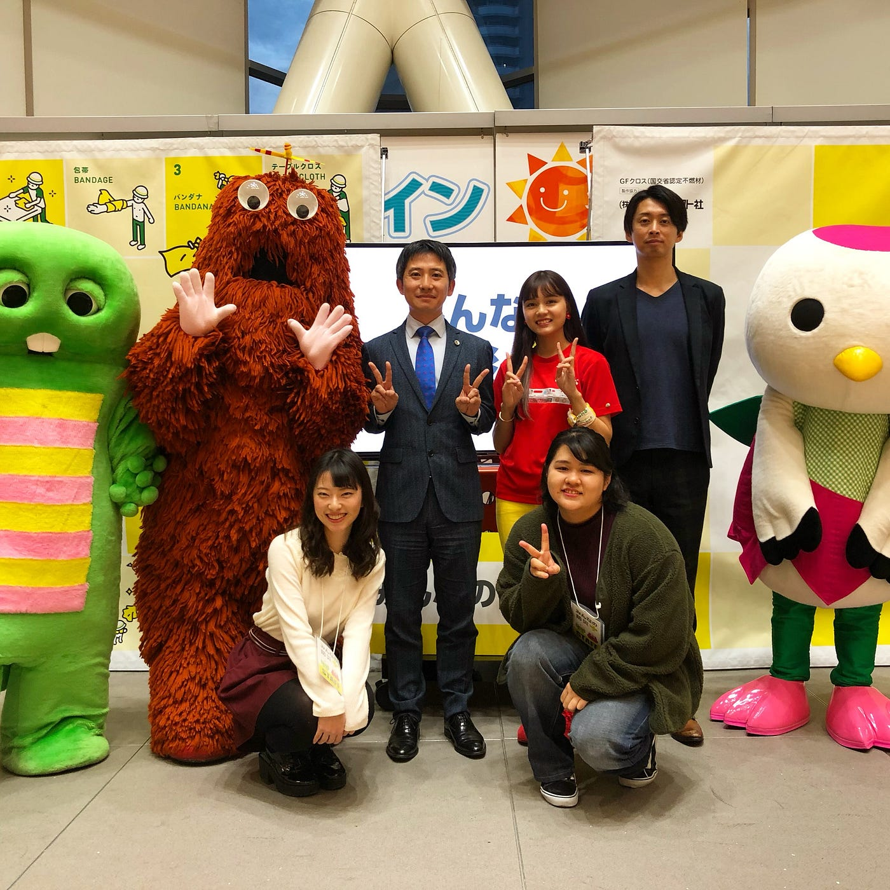
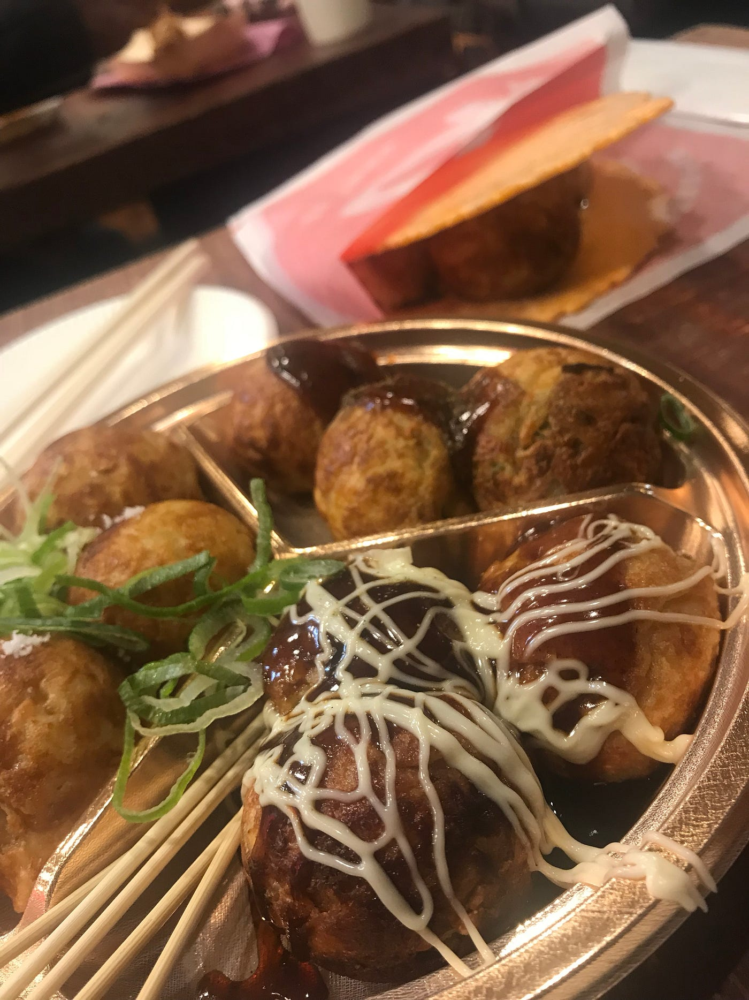
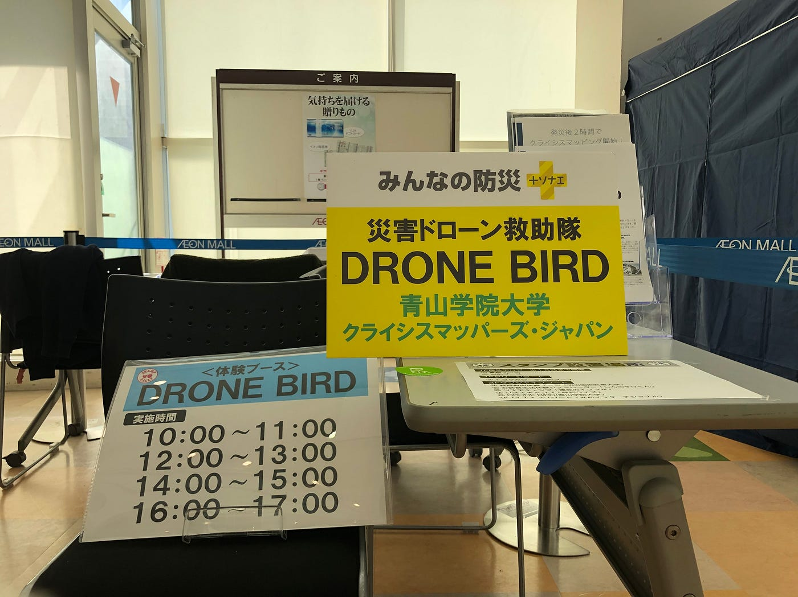
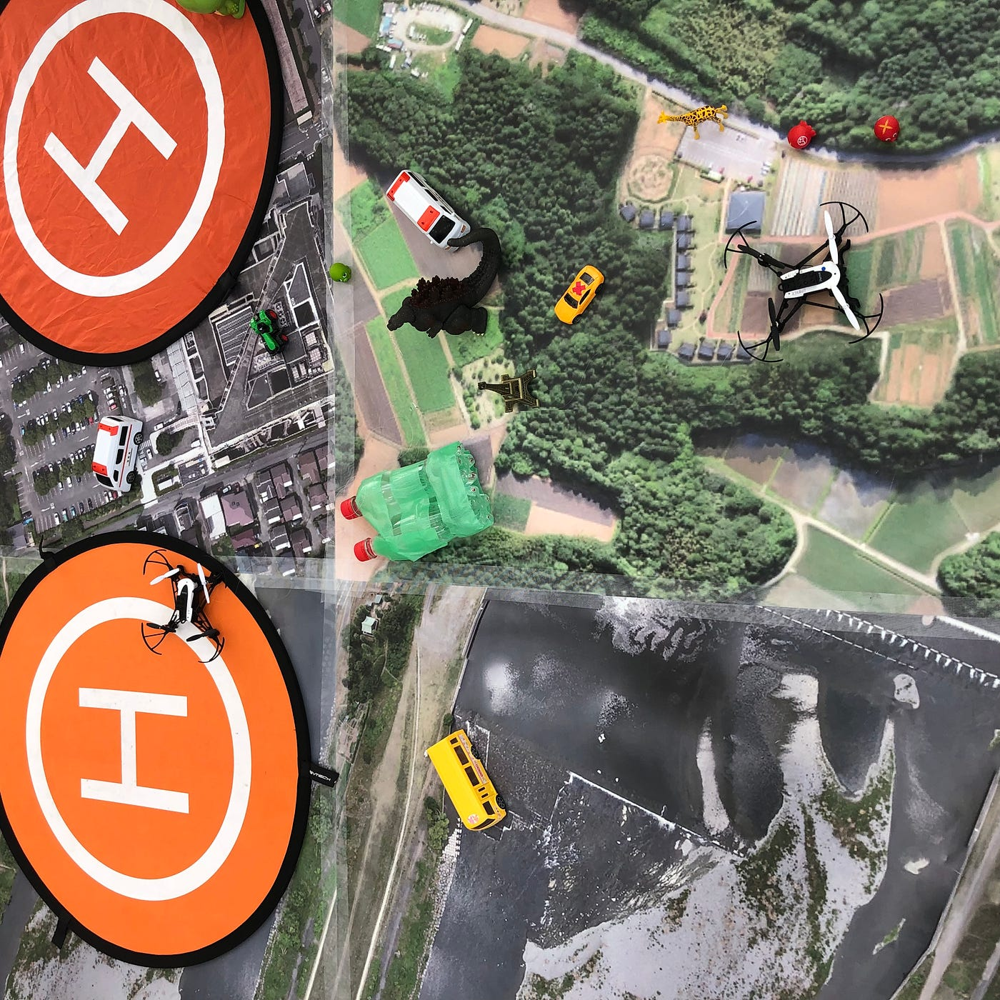
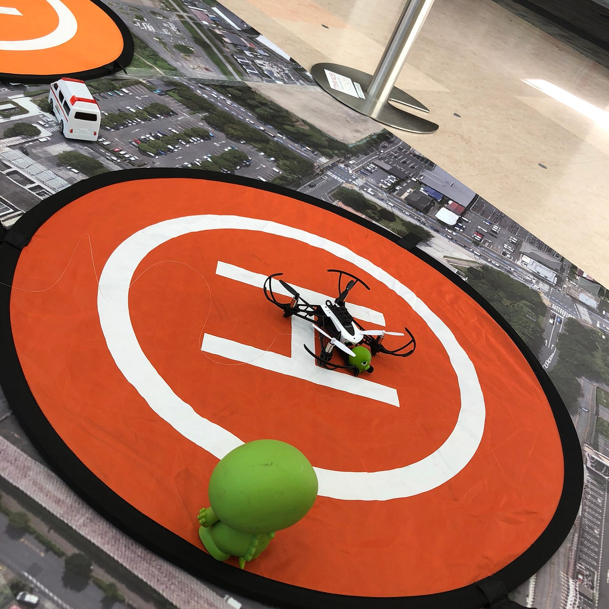
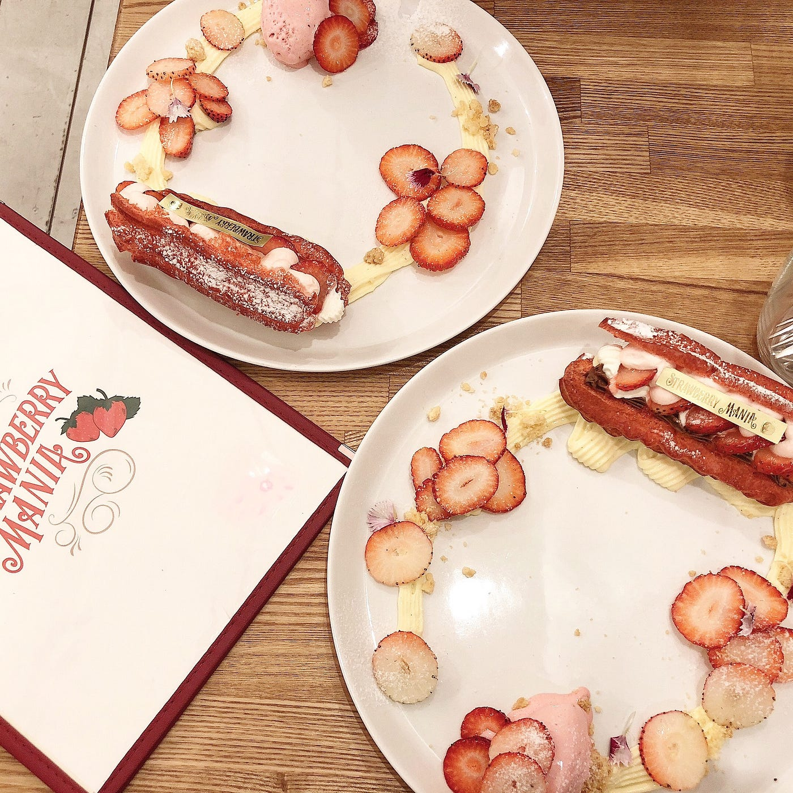
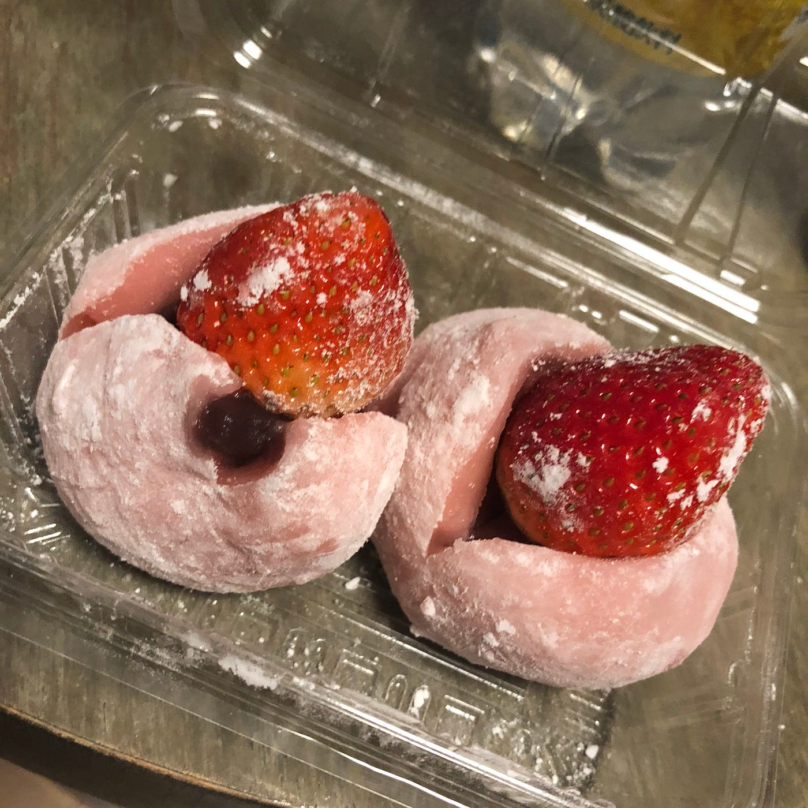

### 防災➕ソナエ イオンモールフィナーレ！！

### at大阪鶴見緑地

皆さまこんにちは！古橋ゼミ3年生多賀谷美里です！先週大阪鶴見緑地で行われましたイオンモールでの活動の報告をさせていただきます！

### 今回の舞台は、、、

#### じゃーん！大阪です！！！！🐙

私の両親は大阪生まれ大阪育ちで、親戚も大阪にいるので小さい頃から年に一回は大阪に帰省しています！あの独特な関西人魂だったり、先生の仰っていた子供のやんちゃさなんかは、なんとなーく理解しながら新幹線で向かいましたっ！

[大阪1日目 - Misato Tagaya's 336.0 mi walk
Misato T. completed 336.0 mi on Nov 17, 2018.www.strava.com](https://www.strava.com/activities/1969240487)

↑初日のストラバの記録

USJなどで訪れる人が急増し、1ヶ月前にはどこのホテルも満員&高いんだそうです😭

### イオンモール当日

[イオンモール大阪 2日目 - Misato Tagaya's 64.0 mi walk
Misato T. completed 64.0 mi on Nov 17, 2018.www.strava.com](https://www.strava.com/activities/1971877672)

まずは先に2日目のストラバのログです！

イオンモール鶴見緑地は今福鶴見という駅から徒歩で行けるほどの便利な立地でした！武蔵村山も参加した我々はバスより楽だね〜なんて話しながら会場イン！

### 設営&準備

武蔵村山経験済み&イオンモールも最終回ということで、誰よりも沢山の報告を聞いていたのもあり、問題なくセッティングができました！

↑机の周りの様子

イベントが始まると、沢山の子供達が並んでくれました！思っていたよりやんちゃな子供たちはおらず、ちゃんと列に並んでくれました！(安心。。。)柵、ポールを乗り越えて並べてある車などで遊び始めた子供たちも多かったです！(さすが大阪！笑笑)

### 今回工夫したこと

イオンモール2回目でだったので前回の反省を活かし、工夫したことがあるので報告致します。

> **積極性**

今回、積極性を意識し、運営を行いました。前回参加した武蔵村山はドローンのこともドローンバードのこともよくわからないまま参加してしまいました。そこから、今回のイオンでは他のメンバーの報告を聞いたり防災訓練に参加することで得た知識を使いたい！と思っていました。

そこで、並んでいる子供達に、「なぜこの防災イベントにドローンがあると思う？」と聞いたり、親御さんにもドローンや、活動について積極的にコミュニケーションを図ることしました。その結果、ドローンの体験も楽しんで帰ってもらえたり、サンタさんにドローンを頼む！と言ってる子もいました。

> **教え方**

末光さんの報告にもあったように子供の距離の計り方を意識致しました。

「反対側にいる、ガチャピン、ムックの元に、この子を届けてあげたいんだけど、協力してくれないかな？」と声をかけることで、一緒にやる共同作業であるということを、意識させ、コントローラーを子供にもってかれなくなりました。

また、恥ずかしがっている子でも、円滑なコミュニケーションをとることができました。

↑無事に到着した様子

### 全体を振り返って

一言感想でいうと、ほんとに充実感の塊でした！

というのも、本当にたくさんの子供達が来てくれたので、すごく大変で疲れましたが、無事に事故なく終えることができてホッとしています。今回、休憩の関係で、私は1人でブースを回す時間があり、それはそれは大変でしたが、責任を持ってやりとげられました！意識一つで感じ方も変わるな、と思いました。それと同時に、毎回授業でやっている報告会の重要さも痛感しました。今回何もなく終えれたのも、他のメンバーの報告だったり自分の前回の経験の存在はとても大きかったと思います。

### 多賀谷のこれから

私が現時点で、予定を組んでいるフィールドワークはこれが最後でした！

これからゼミではグラレコが始まったり本格的にゼミが始まって行く中で、やはり指示待ちではなくて積極的に動くことがとても大事なんだと感じています。

グラレコに関しては授業にプラスして、かとゆかさんと末光さんにTEDx AGUのグラレコの依頼頂いたので、挑戦する予定です！

また前回のデジタルファブリケーションにとても興味があるので、もう少し考えていこうかなと思っています！まちづくり×デジタルファブリケーション、大好きなスイーツを絡めたものなど、模索中です。

### おまけ

積極性、、、ということでスイーツも紹介したいと思います！笑(関係なくない？笑笑)

1日目に立ち寄った心斎橋にあるストロベリーマニア🍓のいちごのエクレアです！

こちらのお店、なんと12月に原宿にオープンするそうなんです！なぜ先に大阪に出したのか不思議で仕方ないね、って末光さんと話しながら🍓

以上です!!

