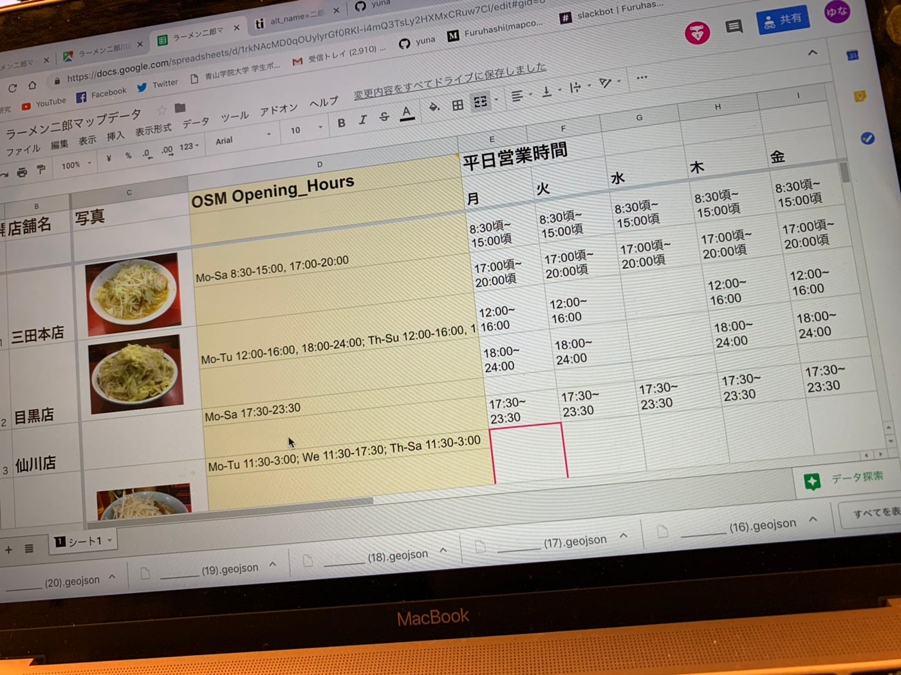

### 卒研で今やってること！

渡辺ゆうなです。久しぶりのブログです。ブログは書いてませんでしたが研究はさりげなく進めてしまっていたので今更何を書けばいいのかわからなくなってたのですが、また書き始めようと思います。

☆現時点での研究テーマについて

今現段階としての研究テーマは、

**「OSMにラーメン二郎の正確なデータを埋め込む」**

を考えています（古橋さんからの提案です）

そのためには

・正確な位置情報

・二郎はファーストフード？レストラン？二郎の定義

・二郎につけるためのタグ

・急な休業などにどう対応するか

などのたくさんの課題があるので、そこにアプローチしていこうと考えています。

具体的に今は何をやっているかというと

[ラーメン二郎マップデータ
シート1 開店した順, 店舗名, 写真, OSM Opening_Hours, 平日営業時間, 土曜営業時間, 日・ 祝営業時間, 休業日, 住所, OSM-ID, 緯度( 十進), 経度( 十進), 備考 月, 火, 水, 木, 金…docs.google.com](https://docs.google.com/spreadsheets/d/1rkNAcMD0qOUylyrGf0RKl-i4mQ3TsLy2HXMxCRuw7CI/edit#gid=0)

これを作成しています。

しばらくはこの表を作るうえでぶちあたった課題について書きたいと思います。

どんどん更新します！

渡辺ゆうな
