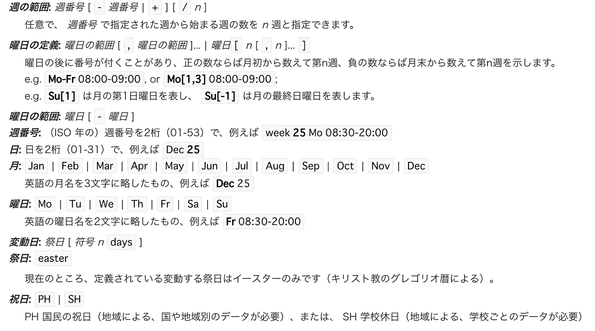

### 卒研：Opening_Hoursでの課題

[ラーメン二郎マップデータ
シート1 開店した順, 店舗名, 写真, OSM Opening_Hours, 平日営業時間, 土曜営業時間, 日・ 祝営業時間, 休業日, 住所, OSM-ID, 緯度( 十進), 経度( 十進), 備考 月, 火, 水, 木, 金…docs.google.com](https://docs.google.com/spreadsheets/d/1rkNAcMD0qOUylyrGf0RKl-i4mQ3TsLy2HXMxCRuw7CI/edit#gid=0)

私は[ジロリアン](https://ja.wikipedia.org/wiki/%E3%83%A9%E3%83%BC%E3%83%A1%E3%83%B3%E4%BA%8C%E9%83%8E#%E3%82%B8%E3%83%AD%E3%83%AA%E3%82%A2%E3%83%B3)である。

今まで、日本全国の様々な[ラーメン二郎](https://ja.wikipedia.org/wiki/%E3%83%A9%E3%83%BC%E3%83%A1%E3%83%B3%E4%BA%8C%E9%83%8E)を訪れ、[OpenStreetMap](https://www.openstreetmap.org) で言うところの Survey を行ってきた。 そして、私の卒論は自分の足で集めたラーメン二郎の情報を OpenStreetMap に反映させることをテーマに選んだ。

このスプレッドシートを作成していくにあたって、各店舗の営業時間を「[Opening_Hours](https://wiki.openstreetmap.org/wiki/JA:Key:opening_hours)」という形式で表記していった。

Opening_hoursの書き方については基本的に

[JA:Key:opening_hours - OpenStreetMap Wiki
Note that sunset and sunrise times requires geolocation to compute the position angular elevation of the sun, and the…wiki.openstreetmap.org](https://wiki.openstreetmap.org/wiki/JA:Key:opening_hours)

ここを参照している。

そこで直面した問題は

**・京都店の休業日→祝日の翌日が休み**

**・池袋東口の休業日→月が祝日の場合は翌日が休み**

この表記が非常に難しいということ。

先ほど記載した[Wiki](https://wiki.openstreetmap.org/wiki/JA:Key:opening_hours)を参照すると、**祝日休業は「PH off」**と書かれる。

また、週の範囲では**「+」「−」**が使われていること、変動日は**「n days」**と表されてることから、これらの記号を組み合わせて使用することは可能だと考える。

よって、京都店の休業日「**祝日の翌日が休み**」に関しては「**PH +1 day off**」と表すことができる。

問題は池袋東口店だ。「**月曜日が祝日の場合、翌日火曜休み**」。

Opening_Hoursの定義をよく見ると半角スペースは[論理積AND](https://ja.wikipedia.org/wiki/%E8%AB%96%E7%90%86%E7%A9%8D)を意味することがわかった。また「月曜日が祝日の場合の翌日火曜」という条件は、言い換えると「祝日の翌日が火曜」とも置き換えられる。そこで 祝日の翌日を **PH +1 day **とし、それが火曜である **Tu** との[論理積AND](https://ja.wikipedia.org/wiki/%E8%AB%96%E7%90%86%E7%A9%8D) として **PH +1 day** **Tu **で「祝日の翌日が火曜」という条件が表現できたと考える。最後にこの日が休みであることで **off** を付け**「PH +1 day Tu off」**と表すことができると考えた。

実際に [Facebook](https://www.facebook.com/groups/osmjapan/permalink/2220688377983009/) と [Twitter](https://twitter.com/nabeyuna2/status/1073819043117715457) で、この考え方で正しいかOSMコミュニティに公開質問をしてみた。

**「PH +1 day Tu off」**の表現は問題なさそうである。また、Opening_Hours の検証ツールも教えていただいた。感謝！

[opening_hours evaluation tool
Edit descriptionopeningh.ypid.de](https://openingh.ypid.de/evaluation_tool/)

余裕があれば他にこのような使われ方をしていないか先行事例も探していきたい。

次段階では、OSMで使用されているラーメンタグについて調べていく。

(本投稿は [OSMアドベントカレンダー2018](https://qiita.com/advent-calendar/2018/osmjp) に向けて一部修正)
