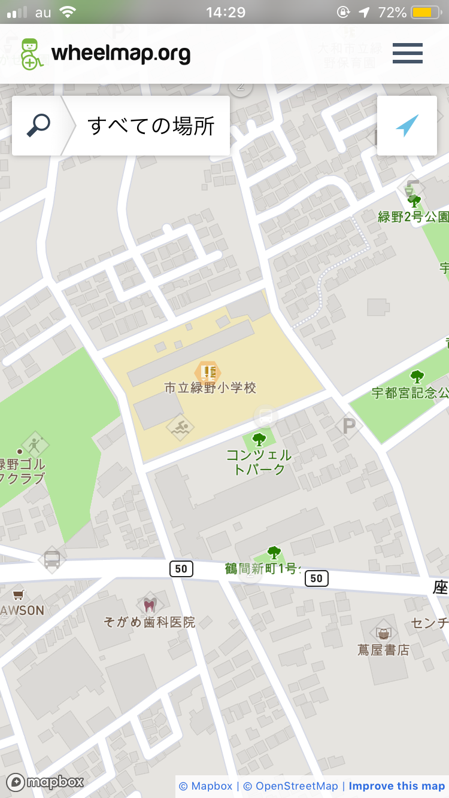
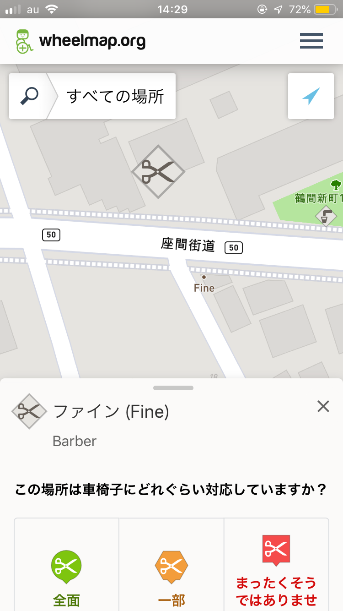
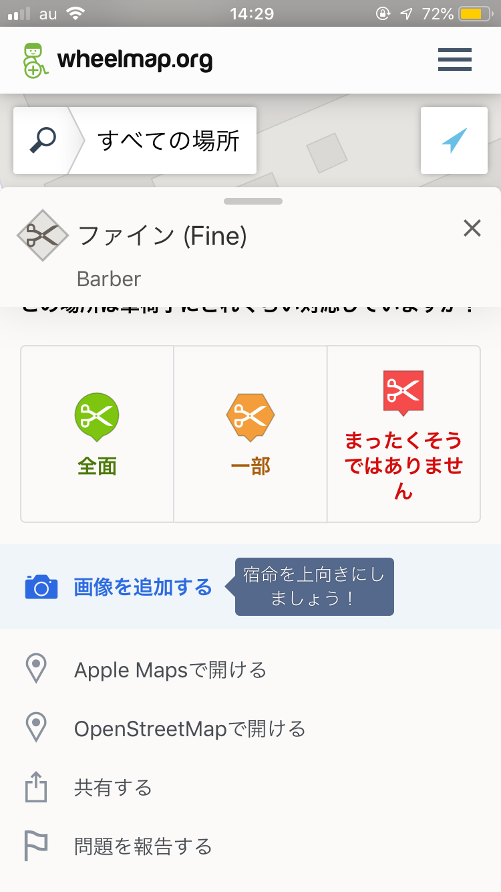
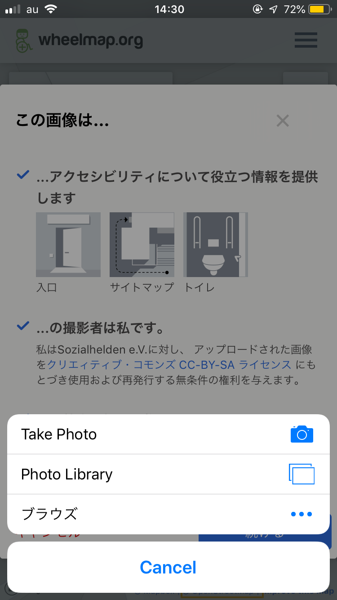
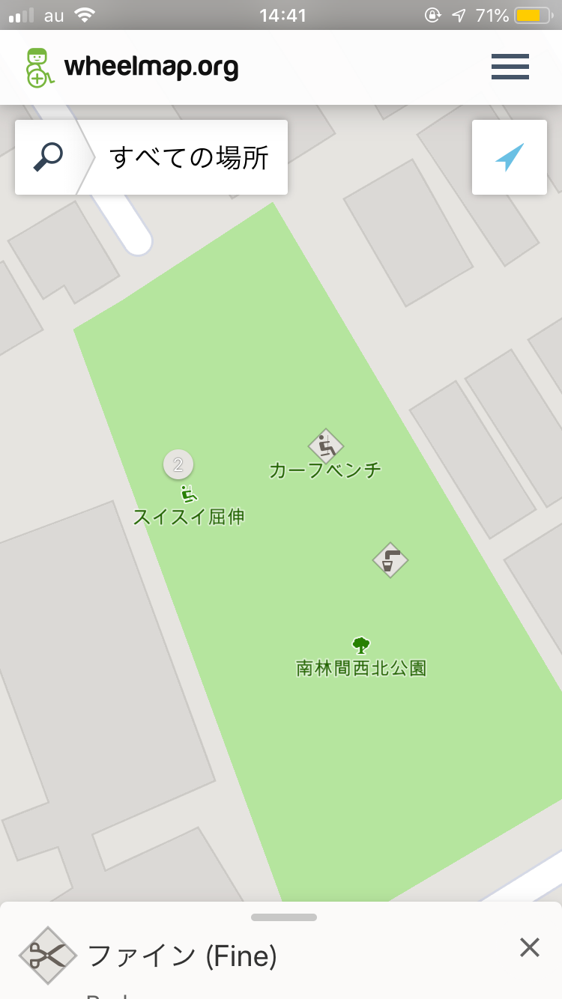
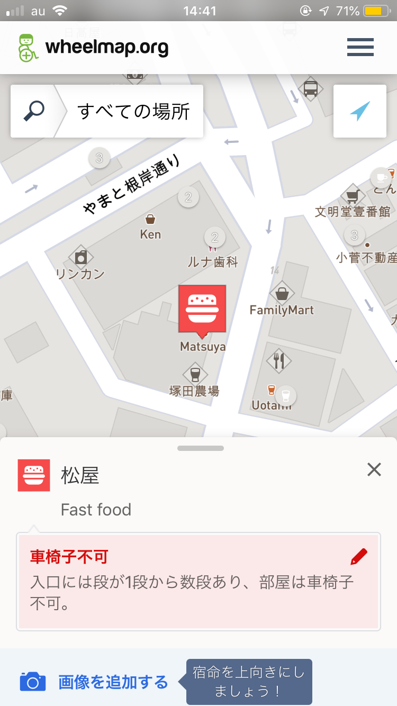
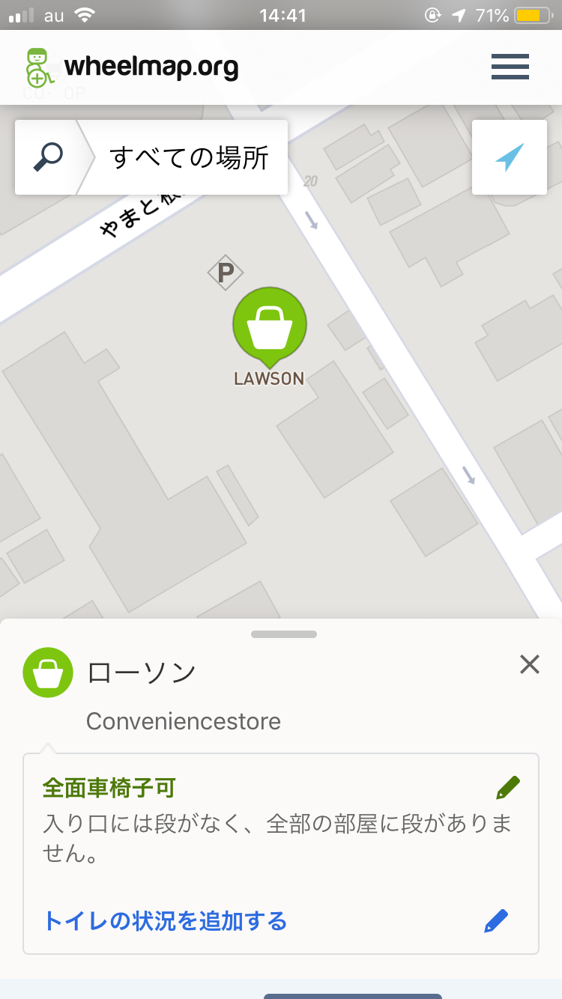

### Wheelmapというツール

「Wheelmap」とは車椅子で目的地に行くことができるかどうかを確かめる、またその情報をOpenStreetMap(以下OSM)に加える地図サービス。ブラウザ上でも、スマートフォン(iOS,AndroidOS)のアプリでも、どちらでも簡単に操作をすることができる。

車椅子が通行可能かという定義には、具体的な道幅は定められていない。おそらく車椅子もタイプによって幅が異なるからだろう。ここの幅の判断は自分の感覚と、あとはお店の人に直接聞いてみるのも良いだろう。

#### **段差は７cmまで**

先ほど、道幅の基準は正確には定められていないと言ったが、段差の方は「７cm以下」と決まっている。しかしながら個人的には、車椅子の方一人で移動していた場合、この７cmも段差をクリアするのはなかなか大変なように感じる。

それではWheelmapの使い方を少し紹介する！

#### ・ アプリの仕様はとっても簡単

#### ・ 画像も追加できるよ

#### ・ 観覧には色をみるべし！

以上、今回はWheelmapの紹介。Wheelmapは非常に便利で、操作が簡単！あなたが住む街の情報もぜひ加えてみてね〜

それではまた来週〜。
