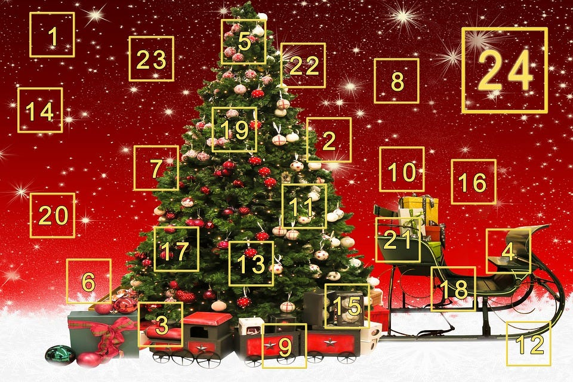

### アドベントカレンダー(Advent Calendar) のススメ

もうすぐクリスマス。

キリスト教系の青山学院大学では恒例のツリー点灯式が 11/30 に行われ、子どもたちがあと何日とカウントダウンを始める時期。

ここ数年、アドベントカレンダー(Advent Calendar)が技術系ITコミュニティで盛り上がっている。

少しその意義と魅力について古橋研究室のアドベントカレンダーへの自主的な参加を促すためにも記す。

元々は宗教的な伝統としてのクリスマスをカウントダウンするための日めくりカレンダーを意味するが、技術系ITコミュニティでは 12月1日から25日のクリスマスまでの毎日、誰かが担当して日替わりで関連するテーマに合わせたブログを公開する。現代版のリレーエッセイのようなものだ。

### そもそもブログを活用した情報発信ができているだろうか？

自分で学んだこと、疑問に思ったこと、インターネット上に分散された情報をまとめてみたこと。

実はそういった知識は、自分だけではなく多くの人にとっても重要な知識となることが多い。

日々の忙しい時間の中で、ブログを執筆することは、それなりに負荷のかかることである。

しかし、限られた時間の中で少しでも筆をすすめ、自分の頭の中の思考やアイディアや概念を文字にする。

その蓄積が糧にもなるし、なにより情報を積極的に発信することで、フィードバックを得ることができ、情報が集まりやすくもなる。

ブログは修正も簡単に行えるため、誹謗中傷の要素が含まれないよう注意しながらも、

勢いで一気に書き上げてその日のうちに配信可能なスピード感もある。

そして、アドベントカレンダーはその執筆を加速してくれるキャンペーンであるといえる。

逆に、アドベントカレンダーですら参加できない人は、強制されないかぎり、一生ブログを使って情報発信することはないだろう。

というわけで、12月1日ということもあり、まずはアドベントカレンダーが持つ大きなメリットを５つ取り上げてみた。

### **# アドベントカレンダーの良いところ**

1. **同じテーマを多様な視点で眺めることができる。**
理想的なアドベントカレンダーは、毎日担当者がバラバラであることだ。同じテーマで執筆しても、それぞれ持っている興味や、取り組んでいることは異なる。それを25パターン網羅的に見渡すことができるのはとても魅力的である。

1. **ブログをはじめるきっかけを与えてくれる。**
普段の情報発信はSNSに偏りがちな人が多いと思う。しかしSNSはその固有のサービス利用者にとってはシェアしやすいが、もっと幅広い層に情報を届けるにはSNSは不向きである。そういう意味で、年に一回はブログで情報発信するきっかけを作ってくれるのがアドベントカレンダーだ。まずは書き出してみる。しかも一人でなくアドベントカレンダーに参加する仲間と一緒に書いてみる。その一歩を踏み出してみよう。

1. **コミュニティの裾野を感じられる。**
アドベントカレンダーの執筆陣を見ると、SNSでよく見るあの人や、今までまったく意識していなかったこんな面白いことを考えている人がいるのかなど、そのテーマ、コミュニティに参加する人々の顔が見えてくる。アドベントカレンダーはそんなコミュニティの裾野を広げ、そこに集う人々の顔を可視化するイベントでもある。逆に、そのテーマに興味があったけどあまり今まで接点のなかったコミュニティとつながる接点となることもある。今展開されている様々なアドベントカレンダーを眺めながら、予約されていない日があったならば、積極的にそこにブログを投下する度胸もまた大事である。

1. **年末だからこそできる１年間のまとめ。**
12月1日から25日という師走に実施されるアドベントカレンダー。この時期はやはりその年全体を振り返るチャンスでもある。流行語大賞や年間ランキングと同様、この１年でどんなことが起き、何にチャレンジし、何ができなかったのか。過去を振り返りながら今をみつめる。

1. **思いついたら誰でも企画できる。**
アドベントカレンダーは誰でも企画できる。参加者が集まるかはやってみないとわからないし、もちろん沢山の人が参加してくれたほうが盛り上がる。しかし、仮に誰も賛同してくれる人がいなくても、一人で25日間毎日ブログを書きあげる一人アドベントカレンダーを実行する人もいる。2018年現在 Qiita を含めいくつかのアドベントカレンダー機能を持ったブログ配信サービスもある。この気軽さがアドベントカレンダーの魅力である。

以上、アドベントカレンダーについて、少し熱く語ってみた。

何はともあれ、やってみないとわからないことは多い。

まずは１日で良いので、予約をし、どこでもいいのでブログを執筆してみよう。

そして記事の Permalink を埋め込めばアドベントカレンダーの提出は完了。とても簡単。

今年の個人的におすすめのアドベントカレンダーも折角なのでまとめてみた。

- [OpenStreetMap アドベントカレンダー2018](https://qiita.com/advent-calendar/2018/osmjp)

- [Google Earth/Earth Engine アドベントカレンダー2018](https://qiita.com/advent-calendar/2018/googleearth)

- [FOSS4G アドベントカレンダー 2018](https://qiita.com/advent-calendar/2018/foss4g)

- [DRONEBIRD/Japan FlyingLabs/古橋研究室 アドベントカレンダー2018](https://qiita.com/advent-calendar/2018/dronebird)

是非来年(2019年)は、自分の意志で、もしくは仲間たちと一緒に、自分たちのアドベントカレンダーを企画してみてほしい。
