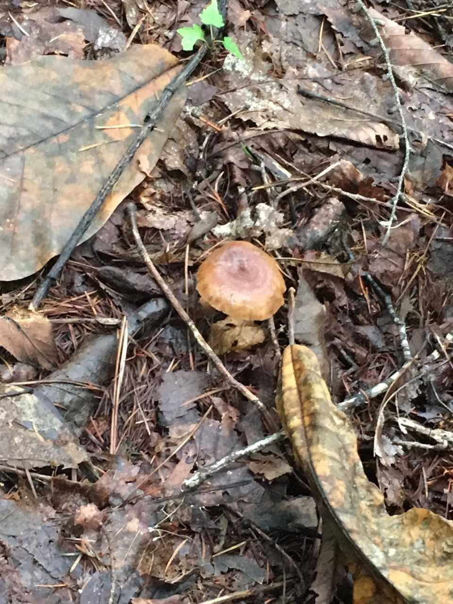
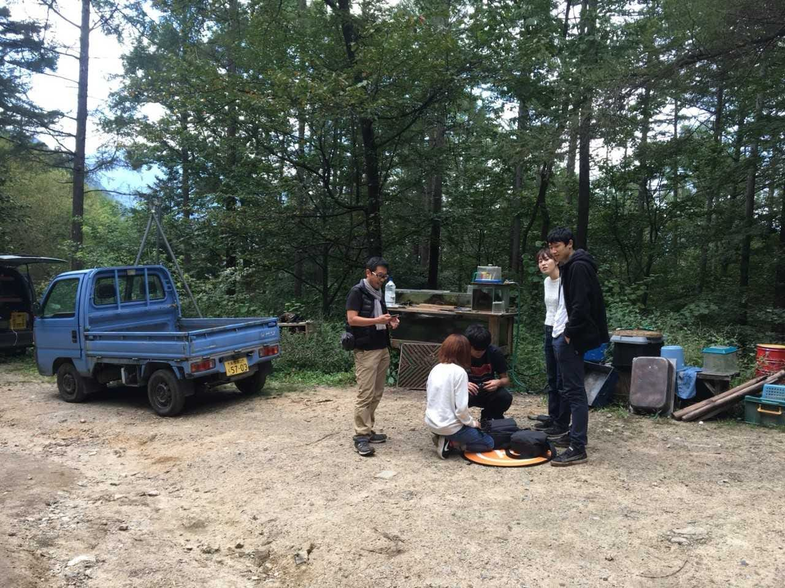
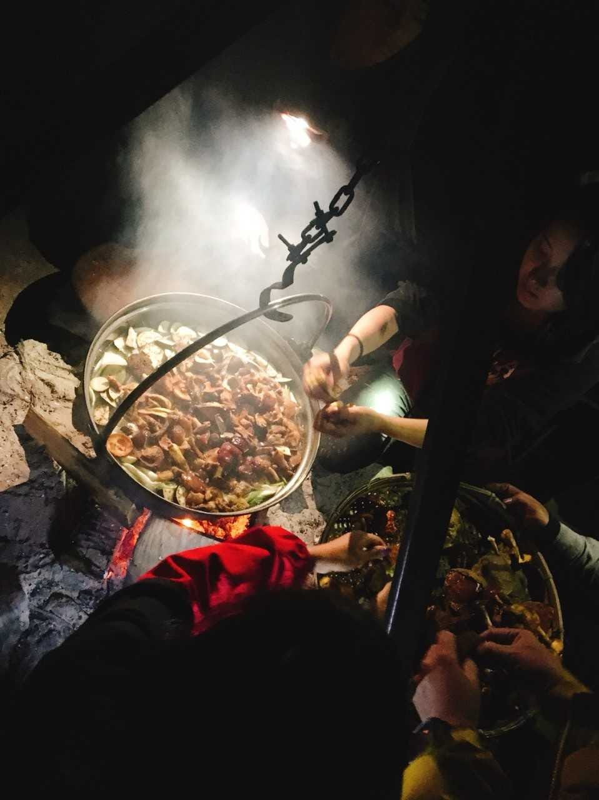
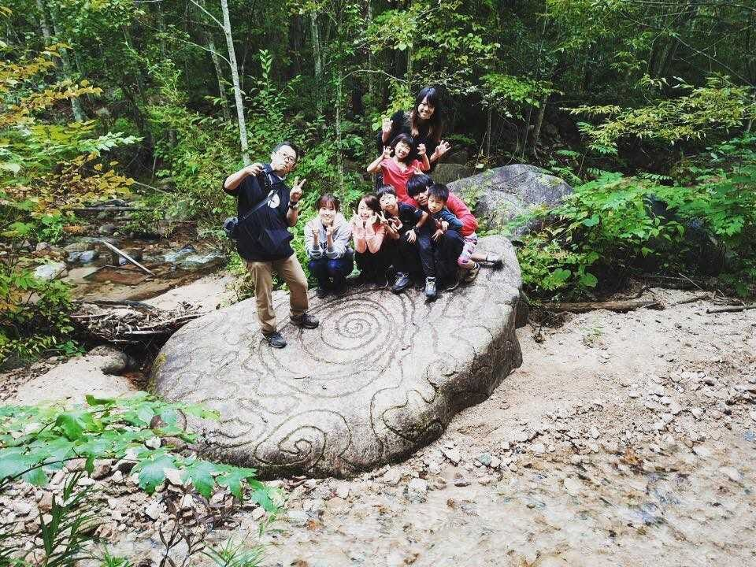

### **大自然の中でのキャンプ合宿！**

こんにちは。古橋ゼミ3年の保利です。

今回は週末の休みを利用して、9/22～24日に長野の信濃大町にある、「**森と暮らしの郷（通称森くら)**」というところでキャンプ合宿を行いました！

まず果てしなく遠い！！！びっくり！

生徒数人でレンタカーを使って現地に向かいましたが、片道４時間の長いドライブ。しかし道を間違えたりなんやかんやで結局６時間ほどかかり、現地に着いたのは夜の２０時ごろ。本来なら生徒の私たちもお手伝いするはずだった食事の支度もすでに現地の方がやってくださり、とても申し訳なかったです…ありがとうございました…！

今までキャンプの経験が一切なかったので、はじめて火を囲みながら食事をしました！寒かったけどおいしかったです！

その後、これまた人生初のテント泊。地面の感触を背中に感じながら疲れもありすぐに眠りに落ちました。

’[https://www.strava.com/activities/1857871707/embed/8078aa656acc2cd90c4edae7cb71900fd004e8bc'](https://www.strava.com/activities/1857871707/embed/8078aa656acc2cd90c4edae7cb71900fd004e8bc')></iframe>

翌朝、朝食の支度のため５時半に起床。昨晩と比べ物にならないくらい寒い。トレーナーやセーターやらを何枚も着込み、やっと動けるレベルでした。スープがとってもおいしかった～～～

そのあとまず山に入り、薪運び。寒いからと何枚も着込んでいた服を脱がないと動けないほど汗だくに。どうすれば山の中で切り倒された木を安全に、かつ効率よく、道に待機しているトラックに運べるかをみんなで考え、現地の方のアドバイスのもと、木をどんどん下に投げて道路まで運ぶという手法で作業を行いました。半端ない量だったので普段運動を全くしない私にとっては大分きつかった…。理科の植物の授業で習った、木を伐採してそこに穴ができると地面に光が当たってまた植物が育つ…という仕組みを肌で感じることができました。

そのあとは近くの温泉にみんなで行ってしばしゆったり。広いお風呂で長野のきれいな空気を吸うのはとても贅沢でした。

午後はドローンの練習！私は大部分のゼミ生が参加していた秩父の合宿に参加できなかったので、きちんとドローンを扱うのはその日がはじめて。今回の合宿の前にイオンモール巡業に参加しましたが、ドローンの使い方が全く分からずてんやわんやだったので今回きちんと古橋先生に教えていただきました。

イオンモールの時は安全の面から飛行の高さ制限がありましたが、今回は森の中で自由に飛ばし放題！５０メートルくらいの高さまで上げると遠くの景色や森の全体像が見えてとても面白かったです。すごいすごい！と久しぶりに子供のようにはしゃいでしまいました。個人的にフライパッドを畳むのがめちゃめちゃに下手なのでそれが一番大変でした…あれもっと畳みやすくならないんですかね…。

その日の夜ご飯は子供たちが山で採ってきてくれたきのこを使ったきのこ汁や、ラム肉のBBQ、秋刀魚などめちゃめちゃ豪華でした。大自然の中で食べるごはんは格別ですね。お酒も入って楽しい夜でした。

<iframe height=’405' width=’590' frameborder=’0' allowtransparency=’true’ scrolling=’no’ src=’https://www.strava.com/activities/1861913839/embed/044ae8c2b84797114eecd8aad4c6c896810c0b07'></iframe>

３日目は子供たちもいっしょに山の中の沢まで探索。そこからドローンの空撮も行いました。いやー水が透き通っていてきれい！沢までの道のりは険しかったですが楽しかったです。

<iframe height=’405' width=’590' frameborder=’0' allowtransparency=’true’ scrolling=’no’ src=’[https://www.strava.com/activities/1877148670/embed/f4e25b12037cafb479e4dc964d7fcf943be67f2f'](https://www.strava.com/activities/1877148670/embed/f4e25b12037cafb479e4dc964d7fcf943be67f2f')></iframe>

[https://www.strava.com/activities/1877148670](https://www.strava.com/activities/1877148670)

以上、森くらでの合宿レポでした。

キャンプもドローン撮影も初めてで、ストラバなんかも初めて使ったので、とても新鮮で楽しい合宿でした。今回教わったことを忘れないように復習しなくては…！

最後にとってもブログの更新が遅くなってしまい申し訳ありませんでした。
