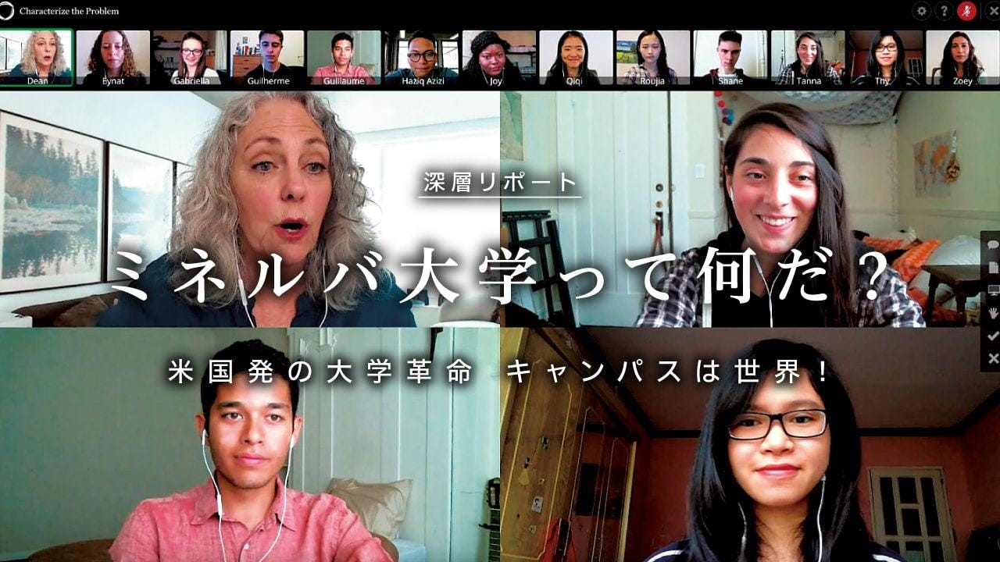

### 未来の大学はこれだ！！

大学の姿が変わろうとしている…

私は大学４年生、
来年から社会人として働く。
卒論に追われている毎日…
そんな中、先生からある大学の存在を知りました。

ミネルヴァ大学！

この写真に書いてある通りキャンパスがありません！

4年間で7都市を移動しながら学ぶという全寮制の大学。
講義はすべてオンラインで行われ、
ディスカッション中心の授業や、
企業と協働してプロジェクトを通じて課題解決の手法を学ぶという、
従来的な価値観からすると大変ユニークなカリキュラムをとっています。

ミネルヴァ大学の教育は、
コンセプトとして「自由」です。

授業はオンラインなので、
PCとインターネット環境があれば世界中のどこでだって授業を受けることができます。

朝9時に始まって12時半には終わります。
平日の午後や休日は完全にフリーです。

ディスカッション形式の授業、
準備に時間はかかるが
それもスケジュールが決められているわけではないので、
各自のペースで進めることができます。

こういった動きは日本でも始まっています。
ホリエモンが最近作った、
堀江貴文イノベーション大学もオンラインで授業を行う形を取っている。

そこでホリエモンが目指していることとして
普通の大学ではなくてスポーツジムのようなものを目指しているというのです。運動不足の解消、トレーニング、ダイエットなど
それぞれ違った目的をもって通ってもらう。

このようにオンライン上へと授業が進化していく未来の大学
より自分がやりたいことに時間をかけることができる
世の中へとシフトしていってるのがわかります。
これから自分の好きなこと得意なことが仕事になっていく

日本ではまだこういったことに世論は良いことだと思っていない
しかし、こういった教育機関がどんどん増えていくことによって
事務作業はAIにすべて任せて人間は好きなことを仕事にできる
世界がすぐそこに来ているのかもしれません！！
