### State of the Map Asia 2018 報告

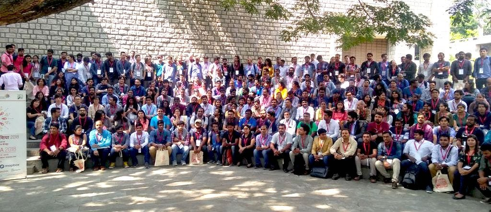

OpenStreetMap の公式カンファレンスを [State of the Map (ステート・オブ・ザ・マップ)](https://stateofthemap.org/)と呼ぶ。SotM(ソートゥム/エスオーティーエム)と短く呼ぶこともある。

世界中の地図を詳細に描くボランタリーな[OpenStreetMap](https://www.openstreetmap.org)活動が、各国でどこまで進んだのか、技術的なチャレンジは何か、どんな便利なツールがあるのか、悩んでいることはないか、一緒になにかプロジェクトができないか。

そんな様々な課題や情報をみんなで持ち寄り、顔と顔を突き合わせて議論するのが[SotM](https://stateofthemap.org/)であり、古くは2007年の [SotM 2007 Manchester, United Kingdom](https://2007.stateofthemap.org/) からほぼ毎年、世界中のどこかでマッパーたちが集まり数日間の濃密な時間を一緒に過ごす。

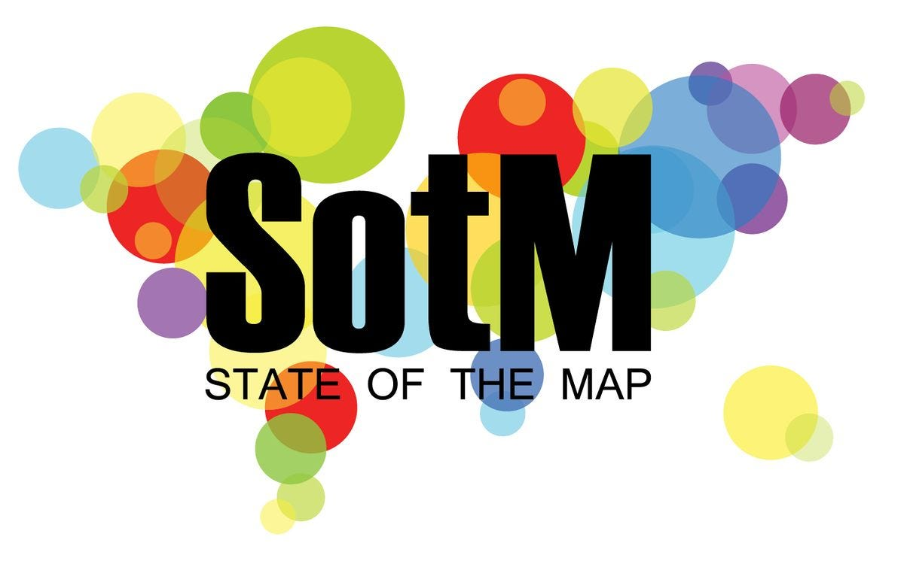

その後、アイルランド、オランダ、スペイン、米国と続き、2012年にはアジアで初めて[SotM 2012 Tokyo](https://2012.stateofthemap.org/) が開催された。忘れもしないが、このときの大会実行委員長を古橋が務めさせていただいた。OSM創始者のSteve Coast氏をはじめWheelmap代表のRaul Krauthausen氏等世界中の著名なマッパーたちが日本にやってきたその感動は何者も代えがたく、やはり濃密な時間を体験させていただいた。

いずれにしても、その後のイギリス、アルゼンチン、ベルギーを経由して昨年(2017年)は５年ぶりに日本の会津若松で [SotM 2017 Aizuwakamatsu](https://2017.stateofthemap.org/) で開催し、2018年はイタリア・ミラノで11回目のOpenStreetMap国際会議 SotM と続いている。ちなみに来年2019年はOSM活動の最もアクティブなドイツ・ハイデルブルグでの開催が決定している。

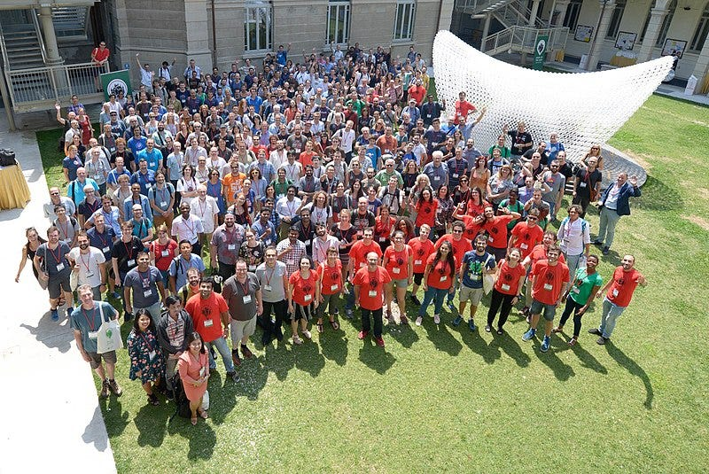

このような世界中のマッパー達が集う国際会議と並行して、2010年前後から、あちこちの[リージョナルなSotM](https://wiki.openstreetmap.org/wiki/State_Of_The_Map)も産まれ始めている。SotM-EU, SotM-US, SotM-LatAm, SotM Africa, SotM Oceania, SotM Baltics, SotM Taiwan, SotM Japan そして、SotM Asia だ。

2011年以降、各地のSotMに参加させてもらっている立場として、様々なマッパーが集い、ディスカッションするこの会議はOSMコミュニティを盛り上げ、相互に連携する重要な役割を担っていることを毎回再確認する。

2012年の東京開催では、まだまだ相互に顔が見えていなかったアジアのマッパー達がリアルにつながる場として十分に機能した。とくに、国際会議としてのSotMは、欧州・北米など、アジアから参加するには距離とコストが大きな負担となっている。実質 Scholarship 制度がなければ、日本や台湾など一部の国からのみの参加となってしまうため、先進国と途上国との差が生まれてしまう。

そこで、SotM Asia カンファレンスを軸に、アジアのマッパーコミュニティの立ち上げをはじめた。最初はカンファレンスの相乗りである。2014年 9月のキックオフシンポジウムとして Asia Resilience Forum in Bangkok, Thailandを開催し、アジアの著名なマッパーらを招聘した。この実績を基に2015年3月に仙台で開催された国連世界防災会議において、世界銀行の力を借りて Asia Resilience Forum セッションを開催。この場にもアジアの主要なマッパーらを招聘し SotM Asia キックオフ会議を行った。同じ年の9月にSotM Taiwanでもアジアマッパーらが再結集し現地でキックオフMeetupをしつつ、第1回 SotM Asia 2015 Jakarta, Indonesia がスタートしたのだ。

その後、[SotM Asia 2016 Manila Phillipines](http://2016.stateofthemap.asia/), [SotM Asia 2017 Kathmandu, Nepal](http://2017.stateofthemap.asia/), を経て、今年は [State of the Map Asia 2018 Bengaluru, India](https://stateofthemap.asia/) が12カ国、約300名の参加者に恵まれ無事に開催できた。（ちなみに、古橋はウェブサイト管理のサポートで出発ギリギリまで https 対応や、ドメイン設定に追われていた…orz）

[State of the Map Asia 2018
The State of the Map Asia organising team is dedicated to providing a harassment-free conference experience for…stateofthemap.asia](https://stateofthemap.asia/)

さて、いきなり冒頭から書き出しが長くなってしまったが、このブログは SotM Asia 2018 について振り返る。

ままず、オーガナイズメンバーは、OpenStreetMap India コミュニティと、mapbox BLR の混成チームである。とくにmapboxからDevelopment Seed に移籍した Sajjad と mapbox の Jina 、そしてSotM会場には参加できなかったが遠隔でイベントを支えた Maning が中心となって、このイベントを成功に導いた。改めて感謝したい。mapbox BLRチームとは、2015年に日本のOSMデータ位置修正プロジェクトを青学チームとコラボするなど、常に密に情報交換行ってきた。今年はいよいよ彼らの本拠地へ訪れたことになる。

[State of the Map Asia
SotMAsia18 wouldn't have happened without Sajjad and Jinal! Tremendous amount of thanks and appreciation for taking…www.facebook.com](https://www.facebook.com/SotmAsia/photos/pcb.748296442184290/748296382184296/?type=3&theater)

会場となったのは、インド・バンガロール南部のIIMB(Indian Institute of Management, Bangalore) キャンパス。メインストリートは常にクラクションと車の慢性的な渋滞で騒々しいが、IIMBキャンパスにはいるとその騒音が嘘のように消え、熱帯林の自然豊かなキャンパスの景色に癒やされる。もちろんキャンパス内のOpenStreetMapデータも充実しており、道に迷うことはない。

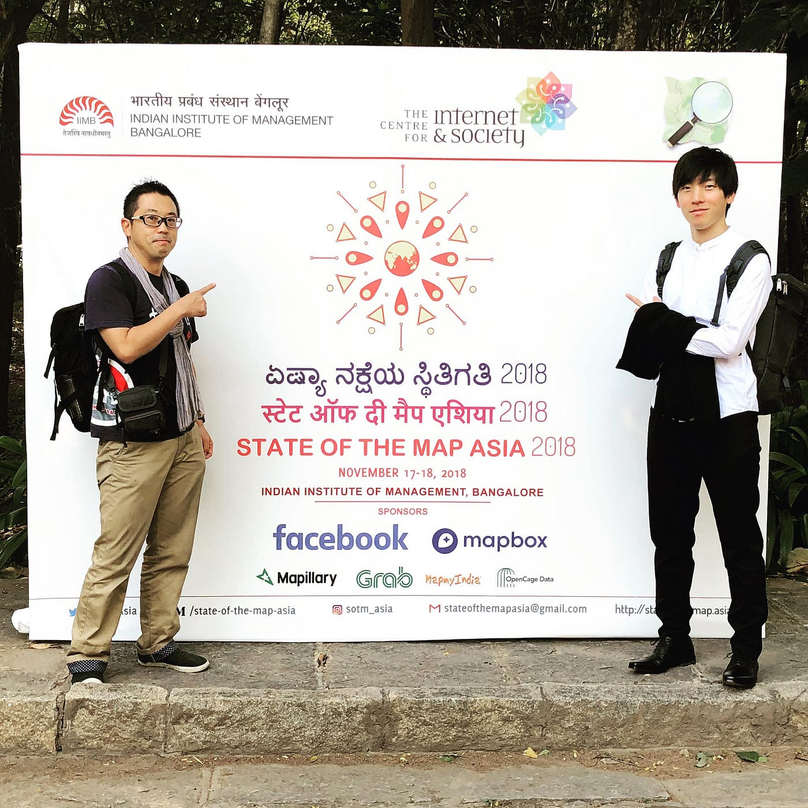

カンファレンス冒頭では、主催者側が用意した燭台に火を灯し、アジアでのカンファレンスらしく厳かな儀式からSotM Asiaは始まった。

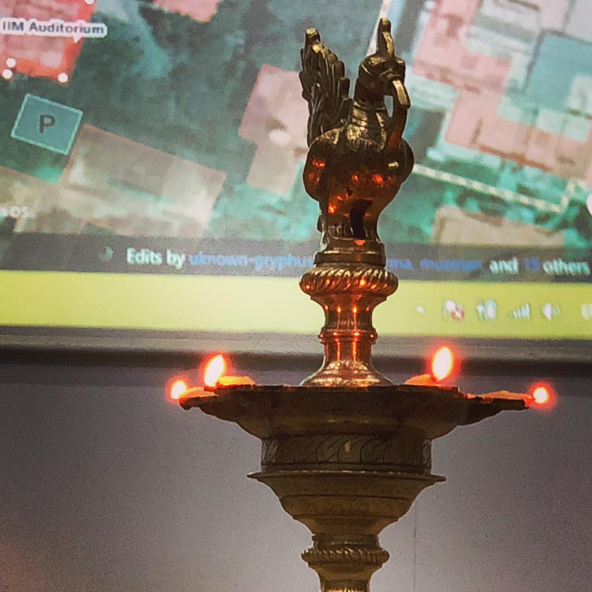

初日の午前中は、State of the Map Country Panel セッション。インドネシア、台湾、インド、フィリピン、ネパール、そして日本のメンバーが、今までの活動と、これからについてそれぞれ考えていることを共有した。特に、ネパールをはじめアジアはとにかく災害が多く、クライシスマッピングが結果的にOSM活動全般を支えている話や、活動の継続性について、教育期間との連携を重視する意見、それに女性の参加数がまだまだ少ないなどジェンダーバランスの是正等、我々が次何をすべきなのか積極的な意見交換が行われた。

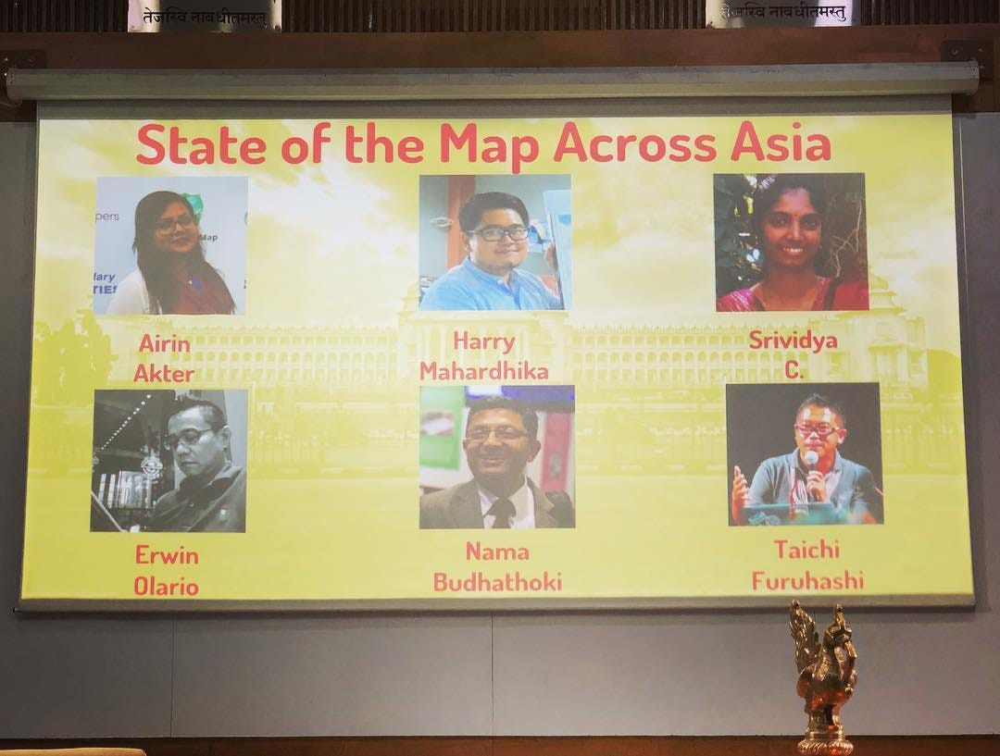

SotM Asia 2018 カンファレンスのスポンサリング企業は以下のとおりである。Facebook, mapbox, Mapillary, Grab いずれもOSMをビジネス利用しながら、その規模を広げているアクティブな企業ばかり。彼らの講演もまた興味深い。

Facebookからは、会社として OSMにどのようにコミットしているか、昨年のタイ全国の衛星画像からの道路自動抽出を始め、ボランティアではなく企業としてOSMの関わり方を講演し、アジア地域ではインドネシアのマッピングと、組織としてOSMデータの品質向上に注力していく姿勢を改めて表明した。

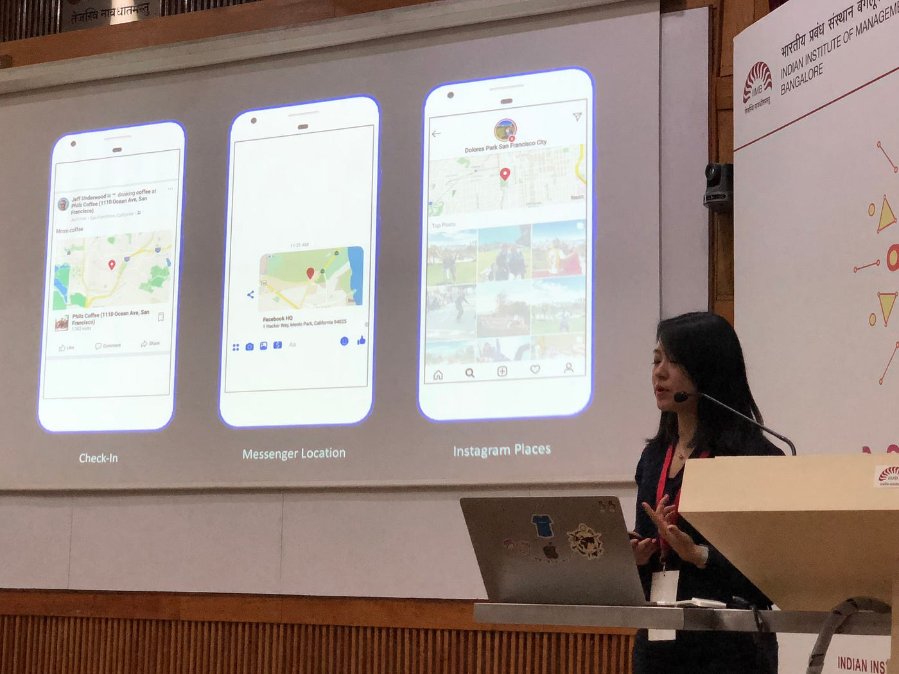

mapbox は悪意のあるVandalism対策に対して、[OSMCha](https://osmcha.mapbox.com/) を中心とした品質チェックツールを最大限に活用してその封じ込め作戦を世界中で実施している。そのなかで mapbox BLR チームが果たしている貢献は非常に大きい。

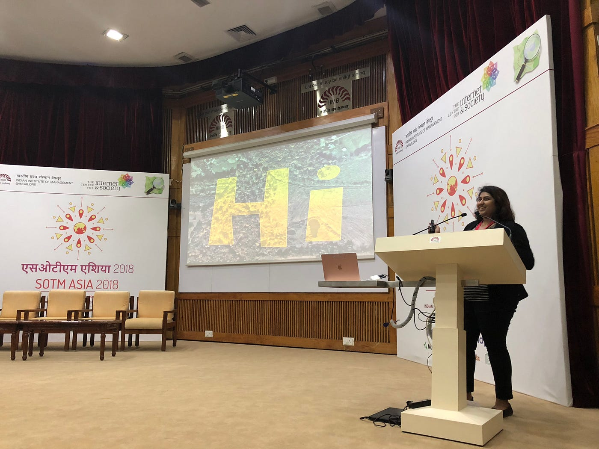

世界中に普及しているシェアリングエコノミーの代表格として出てくるのがUBERとLyftとGrabといった配車サービス。とくにアジア圏では Grab の存在感はひしひしと感じる。興味深いのは各社ともにOSMを使っている企業であり、Grabは OSM Foundation のスポンサーでもあるほどにOSMへの貢献を率先して行っている。またお金を出すだけではなく、データ作りにも参加し始めている。とくにナビゲーションサービスにとって、地図が歩かないかは大きな差がある。組織的なデータ入力でGrabも一部で入力データの品質など問題を指摘されているところもあるが、続々とその輪が広がっているように感じる。

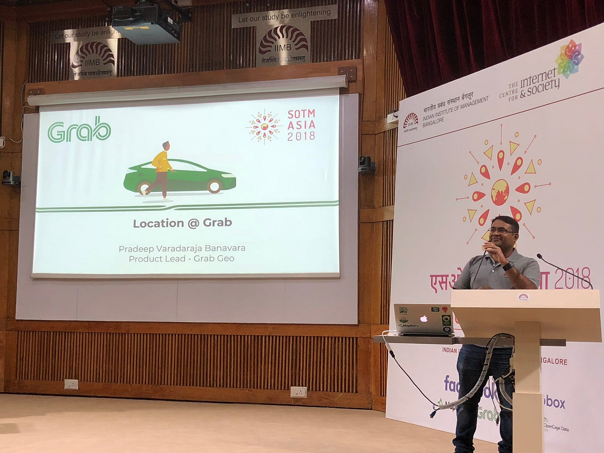

インドコミュニティからの発表で興味深かったのが [Siddharth Agarwal氏](https://twitter.com/sidagarwal)の Walking across India 。自分の足でインドを歩きマッピングするその姿勢と、道中で記録する写真の美した、フィールドノートの美しさがとにかく芸術的で、彼の風景の切り取り方をずっと眺めてみたくなるそんなプレゼンテーションだった。

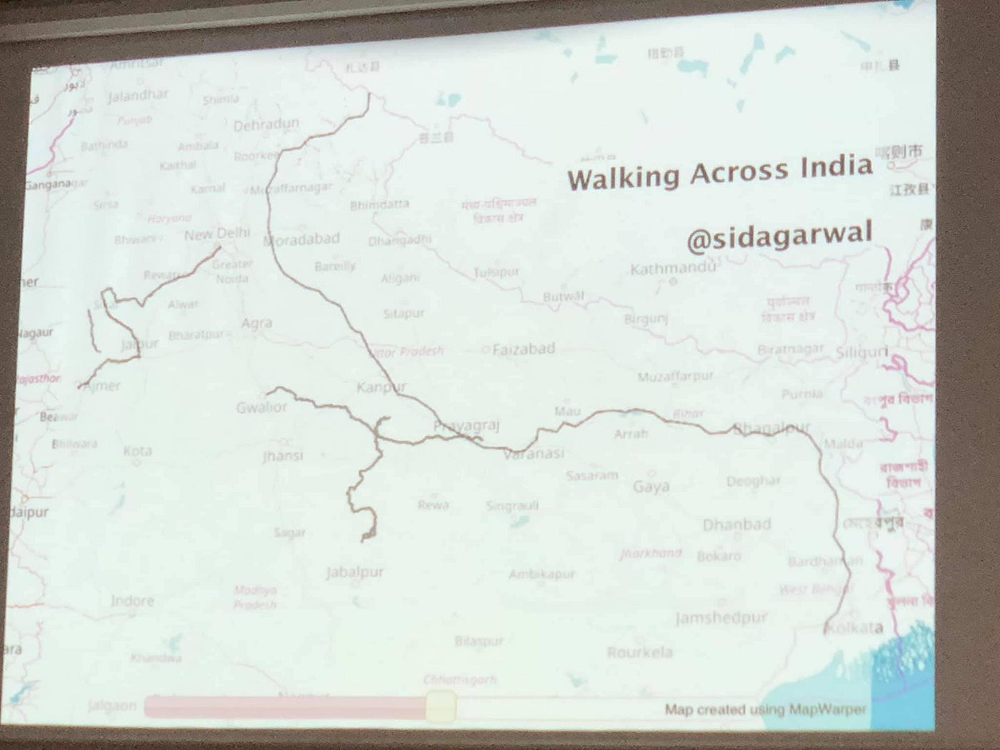

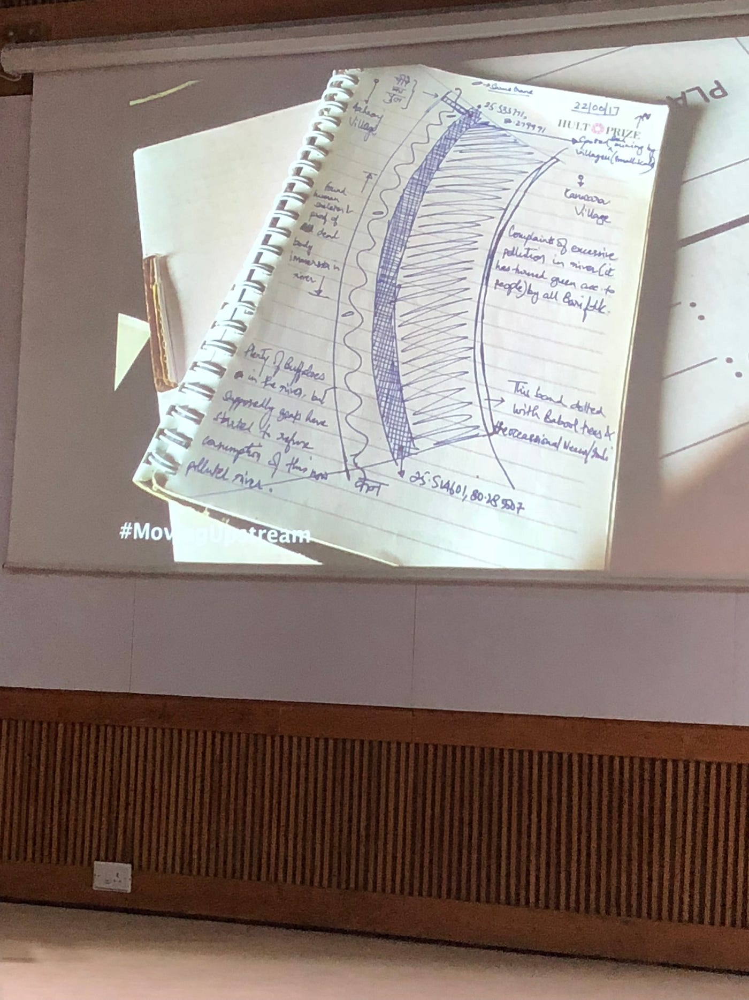

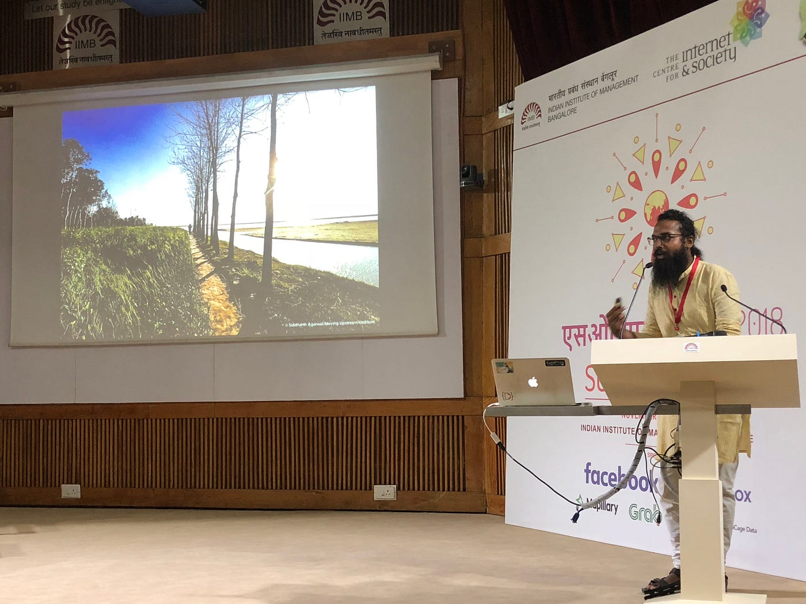

[Siddharth Agarwal (@sidagarwal) | Twitter
The latest Tweets from Siddharth Agarwal (@sidagarwal). Mad man / Walking across India / Water and Trees / Story…twitter.com](https://twitter.com/sidagarwal)

他にもまだまだ書き足りないことがたくさんあるけれど、アドベントカレンダーの期日が過ぎてしまったので、ひとまずここまでとして、後日追加するかもしれない。

最後に、来年の SotM Asia 2019 開催地は只今絶賛立候補募集中である。締切は12月15日までに OSM Wiki に立候補。来年の SotM Asia で、各国のマッパーらと再開するのが今から楽しみである。

[State of the Map Asia/Bids - OpenStreetMap Wiki
It has become a State of the Map Asia tradition to announce the host of the next conference on the last day of the…wiki.openstreetmap.org](https://wiki.openstreetmap.org/wiki/State_of_the_Map_Asia/Bids)

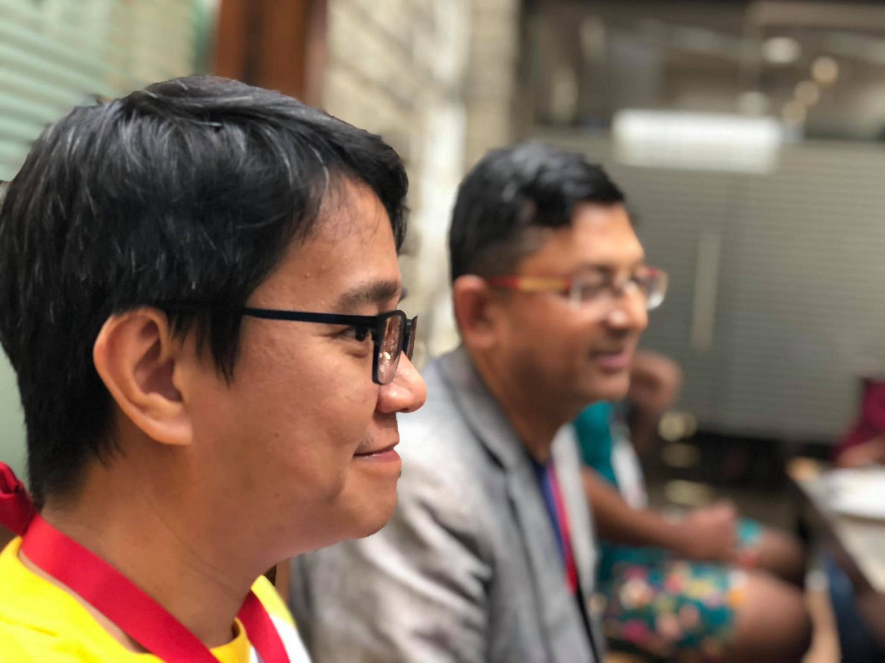

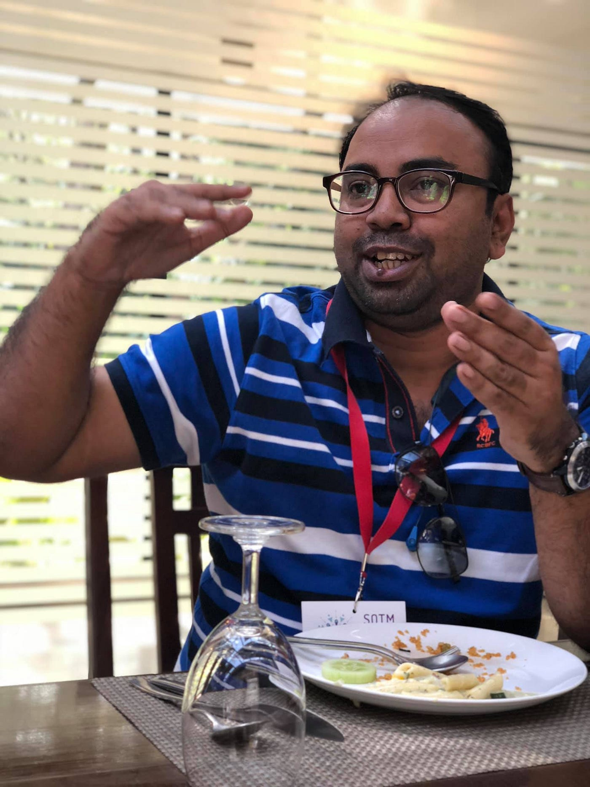

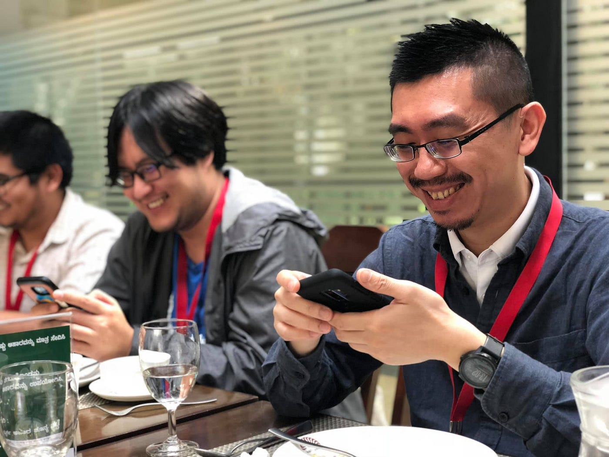
