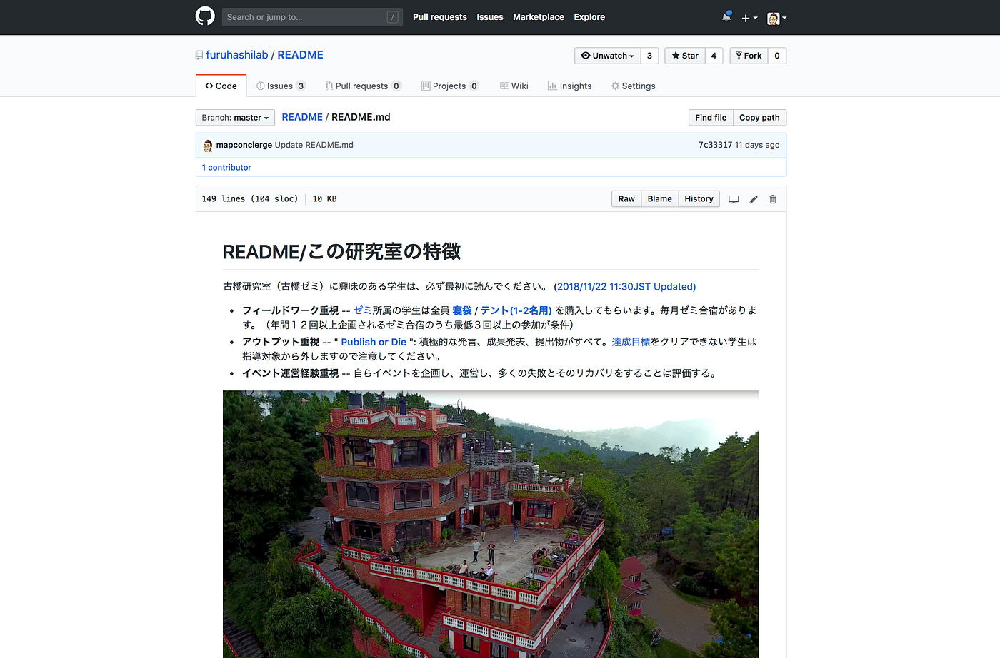

### 古橋研究室のルール｜README.md を読もう！

古橋研究室が実質的に始まったのは2017年秋学期。

このブログを書いている時点で、まだ歴史は１年しかない新しい研究室である。

そこで研究室を作るにあたって、どのような方針で、何を目指していくのか。

また最低限守るべきルールは何か。そのあたりを明文化しようと作ったのがこの [README.md](https://github.com/furuhashilab/README) ということになる。

[furuhashilab/README
古橋研究室（古橋ゼミ）に興味のある学生は、最初に読んでください。. Contribute to furuhashilab/README development by creating an account on GitHub.github.com](https://github.com/furuhashilab/README)

いわば、古橋研究室における運用マニュアルでもあり、ナレッジでもあり、研究室の憲法でもある。

随時学生たちと議論しながら、より現実的で実用的なものとなるようアップデートしているが、この１年間実際に運用してみてわかってきたことは、

> “自由度を高めると学生は迷う”

ということである。

とかく、イノベーション的視点で若い感性から独創的なアイディアが飛び出してくることに期待してしまうが、空間情報スキルがまだまだ十分に体に染み付いていないことと、重要な情報の取得方法を知らないがために、自由度を与えても具体的に何をしたら良いのか、自分がすべき行動に迷いがある。

研究室が目指すゴールは明確に記述している。

「一億総伊能化社会」の実現を目指す。

ただそれだけで、学生たちが同じ方向を向いてくれるかというと、そうならない。

一億総伊能化社会が何なのかを学生たちが理解できていないのだ。

> **# 目的：**

> **一億総伊能化社会※ における、よりしなやか(レジリエント)な社会システムを提案し、実践する。**

> ※ スマホのような端末の存在によって、誰もが当たり前に空間情報の恩恵を受け、それを利活用できる世の中

そこで、具体的にやるべきことを [README.md](https://github.com/furuhashilab/README) に追記し始めた。

例えばフィールドワークをどのくらいの頻度で参加すべきか、位置情報ゲームの経験をどの程度積んでおくべきか、国際会議での外国人とのコミュニケーションはどうあるべきか、そもそも国際会議とはどんなことが行われるのか、外部の有識者とのコミュニケーションはどうしたらよいのか…

挙げればキリはないが、とにかく具体的にやるべきことを、できるだけ定量的に評価できるようにルールを作成したわけである。

このルールは今後も学生と議論し、課題を提出してもらいながら、逐一ブラッシュアップされていくであろう。

そして、研究室に所属する教員と学生が同じ方向を向いて、最終的には自由度の高い活動へと繋げられるために、まずは最低限クリアしてもらうこと、守ってもらうことを、理解してもらいながら、まずは古橋研究室へ所属を希望する学生は、この [README.md](https://github.com/furuhashilab/README) を最低３回は熟読し、頭に叩き込んでもらえれば幸いである。

この投稿は [DRONEBIRD/Japan FlyingLabs/古橋研究室 Advent Calendar 2018 アドベントカレンダー](https://qiita.com/advent-calendar/2018/dronebird)を兼ねています。
