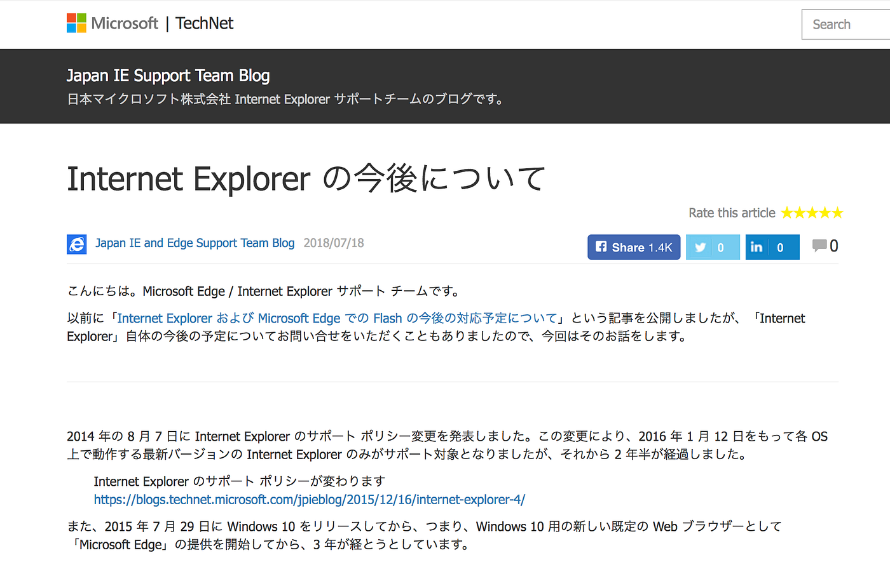
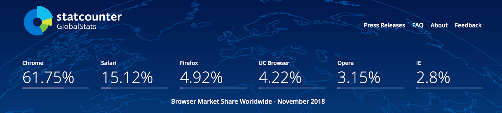
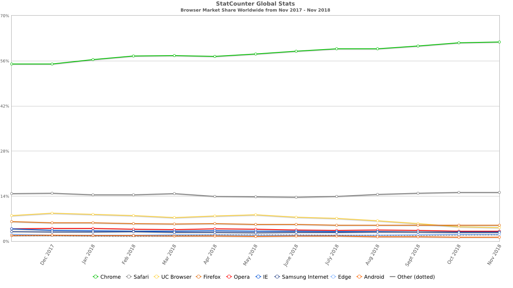

### なぜ古橋研究室はIE使用を禁止しているのか

古橋研究室には[特有のルール](https://github.com/furuhashilab/README#5-%E5%8F%A4%E6%A9%8B%E3%82%BC%E3%83%9F%E7%89%B9%E6%9C%89%E3%81%AE%E3%83%AB%E3%83%BC%E3%83%AB)がある。

[furuhashilab/README
古橋研究室（古橋ゼミ）に興味のある学生は、最初に読んでください。. Contribute to furuhashilab/README development by creating an account on GitHub.github.com](https://github.com/furuhashilab/README#5-%E5%8F%A4%E6%A9%8B%E3%82%BC%E3%83%9F%E7%89%B9%E6%9C%89%E3%81%AE%E3%83%AB%E3%83%BC%E3%83%AB)

このルールに従えない学生には、残念なことだが古橋研究室では適切な教育は行えない。その理由はシンプルだ。

ルールに従わないことで発生する多くのトラブルの対処によって**本質的な授業進行の妨げと、ルールに従っている学生に対するフォローが疎かになる問題が発生する**からだ。

とくにマイクロソフトのインターネット・エクスプローラー(通称IE)に対しては厳しく対処している。

IEが用いている技術は、インターネットが一般に普及した2000年代前半にはシェアも高く、Windowsの標準ウェブブラウザとして、ActiveX を含めたWindowsマシンでの効果的な機能拡張などもありそれなりに地位も高かったが、いわゆるウェブ標準として議論・策定されてきた標準化に背を向ける実装も多く、ウェブブラウザは何を選んでも同じように機能することが理想とされていたがIEがそれをブラウザ依存というインターネットの負の遺産を助長した。

しかし、2005年にAJAXと呼ばれる技術を軸に、ウェブの標準化がより進められ、IE以外のウェブレンダリングエンジンは相互に進化と合併を繰り返すことで、HTML5とJavaScriptの改良と相まって、最先端の技術を、可能な限り速く、クロスプラットフォームが前提の仕組みができあがった。

もちろんセキュリティの問題や様々な拡張の中で、アップデートが日常茶飯事になったとはいえ、最新のモダンウェブブラウザと呼ばれる Google Chrome、Mozilla Firefox、Apple Safari 等と Chrome のベースとしてオープンソース化されている Chromium(例えば Facebookアプリ内ブラウザ等) はモダンウェブブラウザと呼ばれ、独自に進化したIEとは別にモダンウェブブラウザとしてあっという間にそのシェアをIEから奪っていった。2018年11月現在 IE の世界シェアは 2.8% である（statcounterより引用）。

[StatCounter Global Stats - Browser, OS, Search Engine including Mobile Usage Share
Tracks the Usage Share of Search Engines, Browsers and Operating Systems including Mobile from over 10 billion monthly…gs.statcounter.com](http://gs.statcounter.com/)

その結果起きたことはシンプルだ。

最先端の技術を存分に使い、ウェブブラウザの種類や端末のOSに依存しないクロスプラットフォームのサービスが続々とリリースされる中で、独自の進化を遂げたシェアの少ないIEへの対応は、ウェブサービス運営側からみてもコストの塊であるため、段階的にIEへの非対応を掲げている。

また、モダンウェブブラウザになれなかったレガシーなIEを用いることで、その実効速度は遅く、JavaScriptをはじめ多くの不具合が IE を使うことで発生している。

これらの問題解決方法はシンプルだ。

IEを使わなければいい。それだけだ。

マイクロソフトも、IEのサポートはもうしたくないし、早く最新の Edge ブラウザに移行してほしいと訴えている。

[Internet Explorer の今後について
こんにちは。Microsoft Edge / Internet Explorer サポート チームです。 以前に「Internet Explorer および Microsoft Edge での Flash…blogs.technet.microsoft.com](https://blogs.technet.microsoft.com/jpieblog/2018/07/18/internet-explorer-support/)

未だに IEブラウザを使っているパターンを考えてみた。

1. Windows標準ブラウザしか使ったことがなく、他のブラウザが存在することを知らない

1. 他のウェブブラウザのインストール方法がわからない

1. 自分の使っているウェブブラウザが 最新のEdgeだと誤解している

1. IEに依存した古いウェブサービスに依存した業務を行っている

1. 新しいウェブブラウザを試す少しの好奇心を持ち合わせていない

4 に関しては日本国内ではよく聞く話だが、古橋研究室ではこのような仕組みは一切使わないので安心してほしい。もちろん古橋研究室として大きく関わっている災害ドローン救援隊DRONEBIRDにしても、企画するイベントにしても同様にモダンウェブブラウザのみ扱う。そして1,2,3,5 のような学生は残念ながら、我々の研究室で行う授業やゼミにはついていけないと想定される。

最近マイクロソフトは、モダンウェブブラウザ入りしたい現行の Edge を捨て、Google の提供する Chromium ベースの新しい Edge について検討しているとのニュースも流れた。（追記： 正式発表されました）

[Microsoft is building a Chromium-powered web browser that will replace Edge on Windows 10
Microsoft's Edge web browser has seen little success since its debut on Windows 10 in 2015. Built from the ground up…www.windowscentral.com](https://www.windowscentral.com/microsoft-building-chromium-powered-web-browser-windows-10?fbclid=IwAR0iqZmXwb2ClDzjQUvsCNFNySUeHi23RSeRCvHiCw5NUMEVay-Kf0s14cc)

[Microsoft、Webブラウザ「Edge」をChromiumベースに ブランドは保持
米Microsoftは12月6日（現地時間）、「Windows 10」のデフォルトWebブラウザ「Microsoft Edge」をオープンソースのChromiumベースに切り替えると 発表…www.itmedia.co.jp](http://www.itmedia.co.jp/news/articles/1812/07/news069.html?fbclid=IwAR3L-bXuTcCkgdfHx8xvTnDGPzYEvxasWcdaBUZAgjTPh9gJHeB4nJ5ENh8)

IEを作ったマイクロソフトが、先のブログでこのように述べている。

> “世の中の大きな流れとして、Web ブラウザーという観点では相互運用性を保ちつつも、最新の Web 標準の技術を取り入れる方向性となっていることをご認識いただき、引き続き Legacy Web から Modern Web への移行を十分に余裕をもった計画で検討を進める必要があるということを、今回の記事をきっかけに改めて意識をしていただけますと幸いです。”

古橋研究室に興味がある学生は、まず自分がどんなウェブブラウザを使っているか調べ、それがIEであったら即座に使用を停止し、自分に合ったウェブブラウザを自分の意志で選んでもらいたい。
