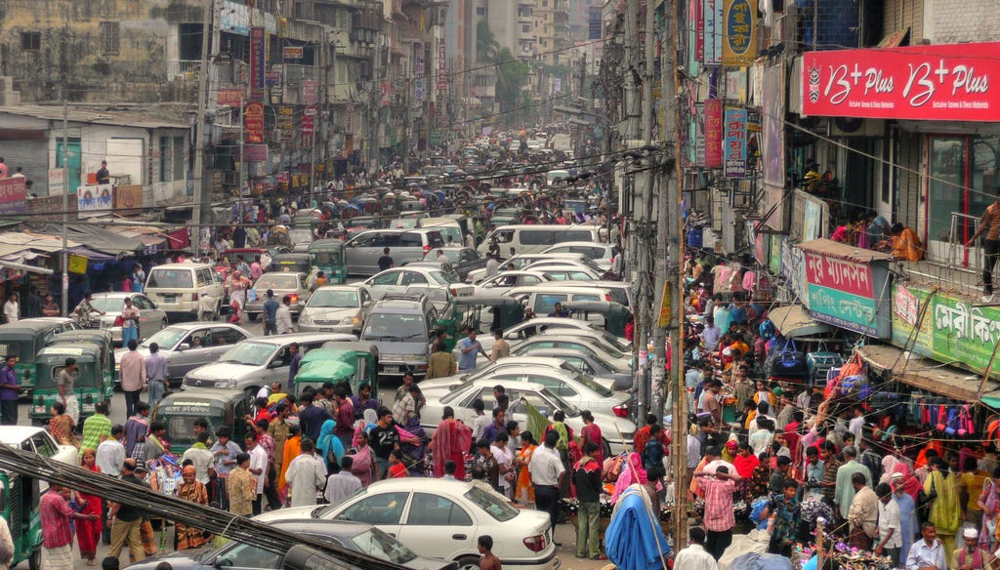
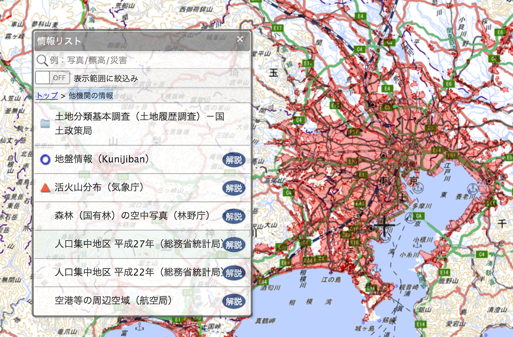
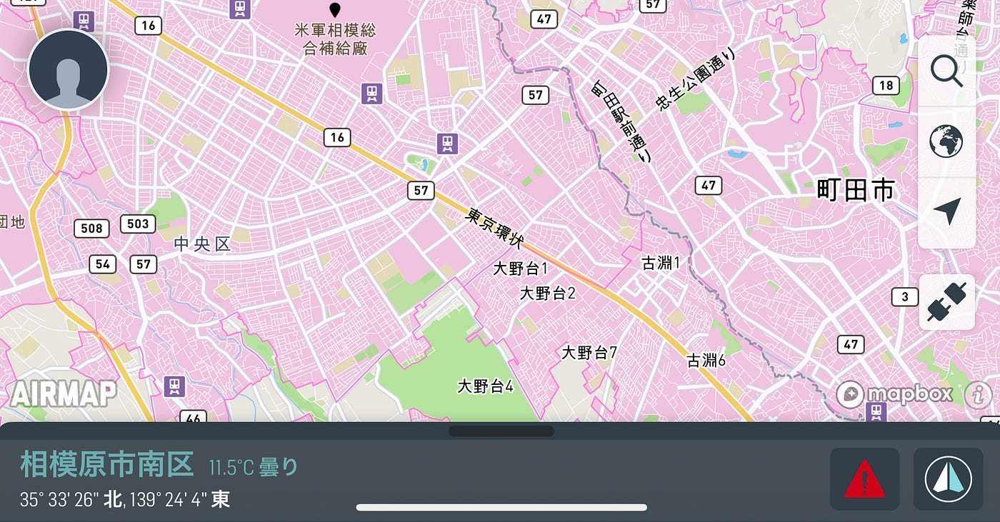
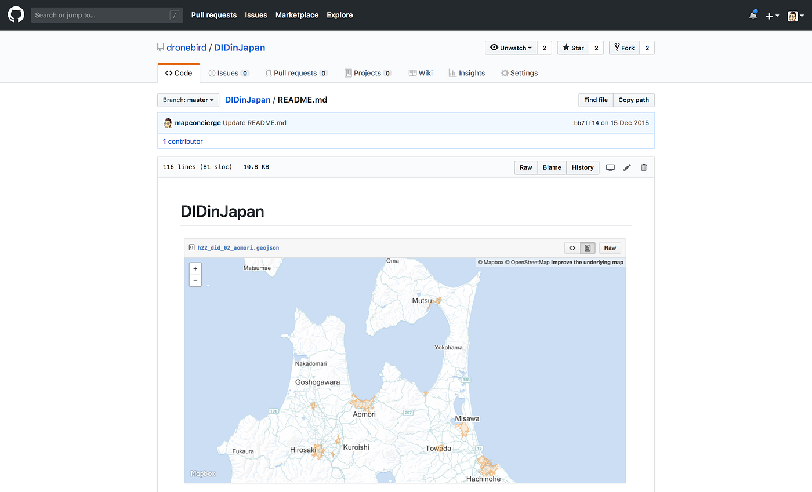
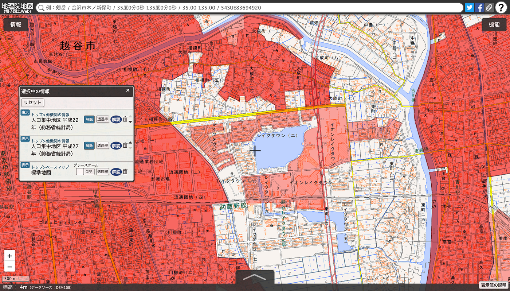
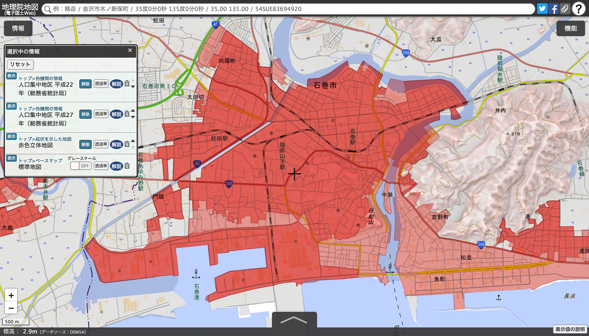

### 人口集中地区(DID)を知る方法

ドローンのことをよく知っている人かどうか確認する便利なキーワードがある。

> “この場所は
DID(ディーアイディー)ですか？”

総務省が国勢調査のために5年に一度作製する人口密度の高いエリア、もう少し具体的に言うと一平方キロあたり4,000人以上の人口密度がある場所がDID(Densely Inhabited District)、正式名称「[人口集中地区](https://ja.wikipedia.org/wiki/%E4%BA%BA%E5%8F%A3%E9%9B%86%E4%B8%AD%E5%9C%B0%E5%8C%BA)」だ。

2015年12月に改正された航空法によって、このDIDエリア内では、重量200g以上のドローンは、飛行する10日前までに国土交通大臣の押印つき無人航空機飛行許可証を航空局から取得しておかなければならない。

つまり、都市部でドローンを飛行させる場合は、多くのケースでこの許可証を取得する必要があり、ドローンを本格的に飛ばしている人は常に頭の中にどこまでがDIDで、どこからDIDエリア外なのか意識する必要がある。

冒頭の質問に、淀みなく回答できなかったとすると、その人はドローンに関しては素人と言える。

ちなみにこの飛行申請は、飛行訓練実績が10時間以上あれば誰でも提出可能で、よく誤解されるが日本国内においてドローンの操縦ライセンスは国家資格としては存在しない。民間組織がそれぞれライセンスと称して盛んにドローンスクールを宣伝しているが、ライセンスが取得できることが重要なのではなく、本質的で実践的なテクニックが学べるかどうかで見極めてほしい。

ちなみに、青山学院大学の青山キャンパス、相模原キャンパスは共にDIDエリアに含まれている為、最低条件として航空局からの飛行許可証を取得しておく必要がある。

では、このDIDの確認方法をいくつか紹介しよう。

### # 地理院地図でDIDを見てみよう

PCで確認する場合に便利なのが[地理院地図](https://maps.gsi.go.jp/#)である。DIDそのものは総務省が作製しており、[地理院地図](https://maps.gsi.go.jp/#)は国土交通省が管理運営しているが、この点に関しては縦割り行政のしがらみなく、[地理院地図](https://maps.gsi.go.jp/#)内の「他機関の情報」としてDIDエリアを赤く塗り潰すことができる。

ショートカットの[URLはこちら](https://maps.gsi.go.jp/#9/35.454518/139.700561/&base=std&ls=std%7Cdid2015&blend=1&disp=11&lcd=did2010&vs=c1j0h0k0l0u0t0z0r0s0f1&d=vl)。

自分で追加したい場合は、左上にある「情報」ボタンから「他機関の情報」を選んで、現時点で最新の「人口集中地区 平成27年（総務省統計局）」を選択。小縮尺では塗りつぶされないので、市区町村界が読み取れる程度に拡大すると、赤く塗りつぶされる。

個別に読み込むXYZタイルはこちら。
** [http://cyberjapandata.gsi.go.jp/xyz/did2010/{z}/{x}/{y}.png**](http://cyberjapandata.gsi.go.jp/xyz/did2010/{z}/{x}/{y}.png)

### # AIRMAPでDIDを見てみよう

スマホやタブレットで、素早くDIDを確認するには、色々なアプリが存在するが、オススメは[AIRMAP(日本では楽天AIRMAP)](https://www.rakuten-airmap.co.jp/)だ。iOS/Android どちらにも対応していて無料で使え、指定したエリアの風速など気象情報も確認できる。また背景地図は mapbox/OpenStreetMap が使われているため、飛行予定エリアの詳細地図がない場合は自分で書き足せるのも嬉しい。

### # GISデータとして使ってみよう

単に見るだけではなく、ポリゴンデータとしてGISなどで分析したり、独自表現で可視化したい場合は[e-Stat](https://www.e-stat.go.jp) からダウンロードできる([ライセンス CC BY 4.0](https://www.e-stat.go.jp/terms-of-use))。但し、多少使いにくいのでこちらでGeoJSON形式に変換して[GitHubレポジトリ](https://github.com/dronebird/DIDinJapan)にまとめて置いたので、必要な時は自由にダウンロードしていただいて構わない。（平成27年度データは現在調整中）

また、個別に読み込むのは前述の地理院地図XYZタイルが便利だ。以下のようにQGISやArcGISでタイルレイヤを指定すればオーバーレイできる。
 [http://cyberjapandata.gsi.go.jp/xyz/did2010/{z}/{x}/{y}.png](http://cyberjapandata.gsi.go.jp/xyz/did2010/{z}/{x}/{y}.png)

### # DIDのせめぎ合い

5年に1回の頻度で更新するということは、街が発展し宅地造成が進行中や、完成したばかりのニュータウンはDIDの定義が追いついていないケースがある。そのような場所はおそらくつぎの更新である2020年にはDID認定されるはずで、事前の飛行許可証を取得しなくても、土地の所有者からの許諾さえとれば自由に飛ばせる残り2年間を存分に活用すべきだ。

逆に、少子高齢化に伴う過疎化が進んだ地域等は、今までDIDとされていたエリアが指定解除となるケースも出てくる。例えば東日本大震災で大きな被害のあった石巻は2010年の定義ではDIDが広く設定されたが、震災後はその面積が縮小している。

DIDエリアのせめぎ合う場所は、日本という世相を示す指標なのかもしれない。
