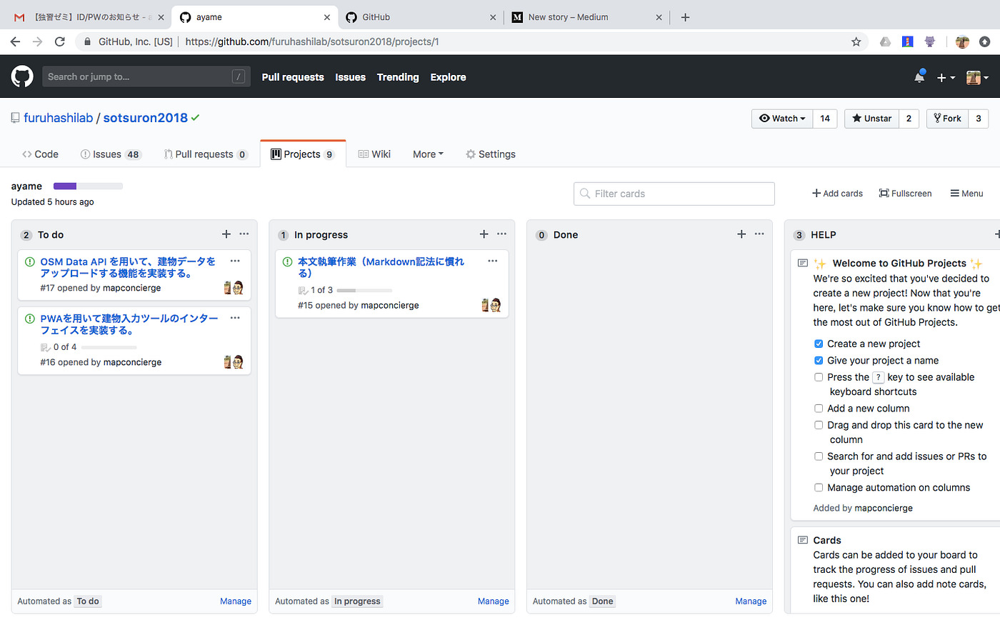

### GitHubで卒論管理

文系の学生が卒業間際に提出する卒業論文って、紙媒体で出力されたレポートが大半をしめる。そんな中で古橋研究室の卒業論文は一味違う。

> まず、最終形態が一般的な論文ではない。

卒業論文と呼んでおきながら、提出するための最終形態がなるべく論文ではないこと。そのためこれからはブログでは卒業制作と呼ぶことにしよう。実は今まで学生が定期的にあげていたブログさえも、そのブログの内容は卒業制作のための研究である。

古橋研究室の4年生は5月頃から、毎週1回、研究室ブログをあげるべし！
と言われ、卒業研究や研究室での活動、時には自分の好きなことについてブログを書いてきた。

> 卒業制作の進歩管理はGitHubで

これまた驚きの卒業制作の進歩管理はGitHubで行われている。文系の学部でありながらも、メディア系の授業であるため、古橋先生は積極的に授業内でGitHubを活用してきた。

そのため私はGitHubを使うことに抵抗がなくなり、自分が学んでいることや活動を積極的にインターネットにアウトプットするようになった。勉強の復習は自分がGitHubで作ったリポジトリを見れば、いつでもどこでもでき、他人に共有するときも非常に便利だ。

古橋研究室ではGitHubのProjectsで各学生の卒業制作進歩状況を共有し、質問や報告作業にIssuesを使う。また私の場合は卒業制作がPWAなため、GitHub Pagesを活用している。下記のリンクはそのレポジトリでここのWikiに、OpenStreetMapの問題提起や私がこのPWAを作るにあたった経緯を書き込み、誰かがこれを見て、私が卒業してもこの研究が引き継げられことを大いに期待する。

[furuhashilab/BCr.map
AyameO 卒業作品進歩公開用web. Contribute to furuhashilab/BCr.map development by creating an account on GitHub.github.com](https://github.com/furuhashilab/BCr.map)

これが古橋先生が大切にしている**”継続性”**に繋がるのだ。

このような卒業論文および卒業制作はまさに、現代を生きている古橋先生だからこその発想で、現代にいながらも近代を生きている人にはできない発想だ。

私たち学生も、現代を生きなければいけない。
私たち4年生は就職活動を終え、社会に飛び立つまでまもないわけだが、最近特にひしひしと感じる。この感性を大切にして社会人になって、かつ社会に出てからも持ち続けるんだ！とここに宣言しておく。

#### 今はGitHubだとしても数年後には変わっているかも。

このような緊張感と世の中にレーダーを張りながら現代を生きる。
刺激をもらいながらも、自分も他人に刺激を与えられるものを何か作り続ける。を私のテンションが高いうちの当面の目標にする。

昨日、内定先からのお題であった基本情報技術者試験の午前試験免除試験というものを受け、今日結果発表があり合格したので、これから卒業制作に打ち込もうと思う。

次回のブログは本文執筆作業と、JavascriptでPWAの中身を改変するお話。
