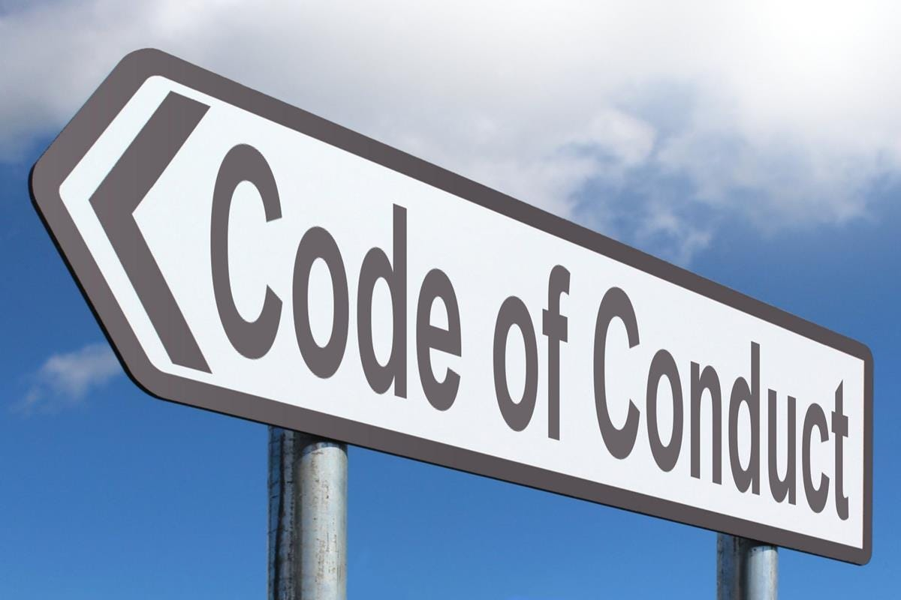
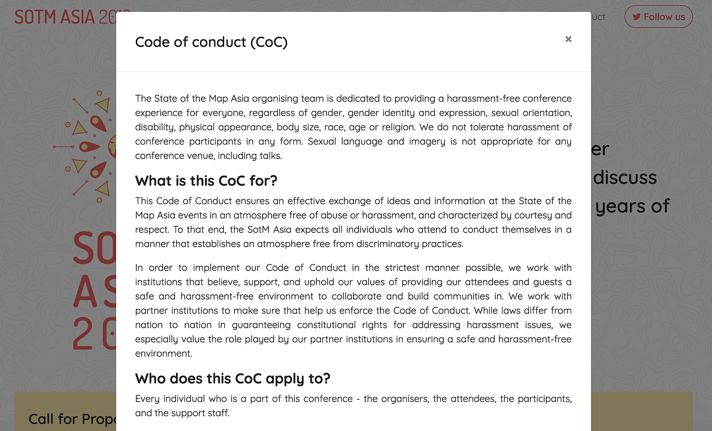

### 古橋研究室の行動規範 Code of conduct (CoC) v1.0 公開

国際カンファレンスに積極的に参加を勧めている古橋研究室では、最近そのイベントの Code of Conduct(以下CoC) に目を通すように声をかけている。特に多国籍なメンバーとなるイベントでは、様々な考え方、宗教、文化が入り混じり、お互いにリスペクトする雰囲気を醸成する原則としてのCoC はあって当たり前の雰囲気となっている。

同時に、日本国内でのイベントも増えてきており、研究室の学生にその心構えを共有するとともに、参加頂く方々とも基本的な方向性を意識合わせしておく必要がある。

そこで、CoCの中でもなるべく短く、要点がスッキリと収まっている [GitHub Patchwork イベントの CoC](https://techplay.jp/event/575585) をベースに Fork させていただき、以下の CoC ver 1.0 を策定した。

ここで改めてみなさんに共有をしたい。

### [行動規範 v1.0](https://github.com/furuhashilab/README/issues/4)

2018–12–09 updated

古橋研究室は、一億総伊能化社会の実現のために必要とされる様々な諸問題を解決し、世界中のすべての人々が地図を自由に利活用できる時代を作るべく学生と様々な方々と共に教育/研究を行っているゼミです。

我々は我々が企画・主催する全てのプロジェクト及びイベント参加者の方々を大切に思っており、参加者全員に楽しんで、充実した体験をして欲しいと思っています。 そのため、これらのプロジェクト及びイベントにおいて、参加者全員がその他の参加者に対して敬意と礼儀をもって参加することを求めています。

求められる行動を明確にするために、古橋研究室のプロジェクト及びイベントに参加する全ての代表者・学生・参加者・登壇者・出店者・主催者・ボランティアの方々は次の行動規範に合わせて行動することを求めています。そして、我々のプロジェクト及びイベント主催者はこの行動規範を実施します。

### 短いバージョン

古橋研究室のプロジェクト及びイベントはどの性別、性的指向、身体障害、外見、体型、人種や宗教であっても参加者全員にとってハラスメントが無いイベント体験を提供することに注力しています。どのような形のハラスメントも容認しません。

全てのコミュニケーションは様々な経歴をもつプロフェッショナルな参加者にとってふさわしい内容が求められます。我々のプロジェクト及びイベントで性的な言葉や画を用いたプレゼンテーションはふさわしくありません。

- 他の人には思いやりをもって接しましょう。

- 他の参加者を侮辱したりけなすのはやめましょう。

- 社会人の常識をもって行動しましょう。学生だからといった言い訳は通用しません。

- やる気のない態度・姿勢は周りの人に対しても悪影響を及ぼします。本人にその意図がなかったとしても、第三者からどのように見られ、どのように受け取られているのかを客観的に判断し、我々のプロジェクト及びイベントが価値あるものとなるよう考えて行動してください。

ハラスメントや性差別、人種差別や排他的な冗談はふさわしくないことを覚えていてください。

これらのルールに違反する参加者は、我々が主催するプロジェクト及びイベント管理者の独断によってそれらプロジェクト及びイベントから退出を求められることもあります。

全ての人にとって快適で、友好的な場を提供することへの協力に感謝いたします。

### 長いバージョン

ハラスメントとは性別、性的指向、身体障害、外見、体型、人種、宗教、公共の場での性的表現に関する侮辱的な発言、意図的な脅迫、ストーカー行為、付きまとい、嫌がらせな撮影、録音、録画、トークやその他イベントに対しての持続的な妨害、不適切な身体的接触や望まれない性的な注目等を意味します。

嫌がらせ行為を止めるように警告された参加者は直ぐに応じることが求められます。

### 言葉の選択も考えましょう。

性差別、人種差別や排他的な冗談は周りにいる人に対して侮辱的な発言になることもあるのを覚えていてください。侮辱的な冗談は古橋研究室のプロジェクト及びイベントにふさわしくなく、古橋研究室のプロジェクト及びイベントではどのような状況であっても容認はされません。

参加者が行動規範に反する行動を行った場合には、主催者は違反者を注意したり、返金無しでイベント・カンファレンスから退出させる等を含む主催者が必要と思ったどのような処置でも行えます。

### 連絡情報

ハラスメントを受けた場合、参加者のハラスメントを目撃した場合、その他気になる事を見た場合は遠慮なく古橋研究室のメンバーに伝えてください。

古橋研究室のメンバーは参加者が警備や警察への連絡、付き添いの提供や、その他ハラスメントを受けた参加者がイベントの参加中に安心して参加出来るよう、喜んでその手助けを行います。皆さまの参加を大切に思っています。

### ライセンス

この行動規範の英語版は、Ada Initiative及びボランティアによって作成された [Geek Feminism wiki](http://geekfeminism.wikia.com/wiki/Conference_anti-harassment/Policy) 上のものをforkしたものです。元のCode of Conduct は [Creative Commons Zeroライセンス](https://creativecommons.org/publicdomain/zero/1.0/deed.ja) で公開されています。
