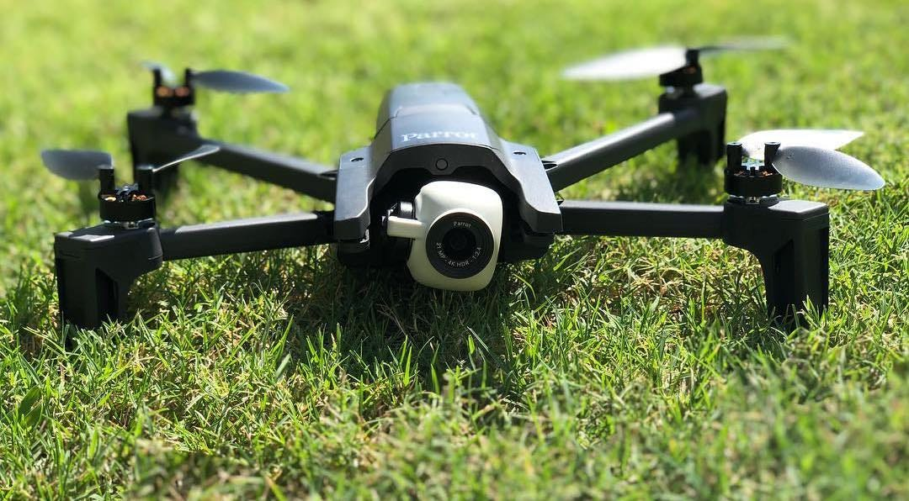
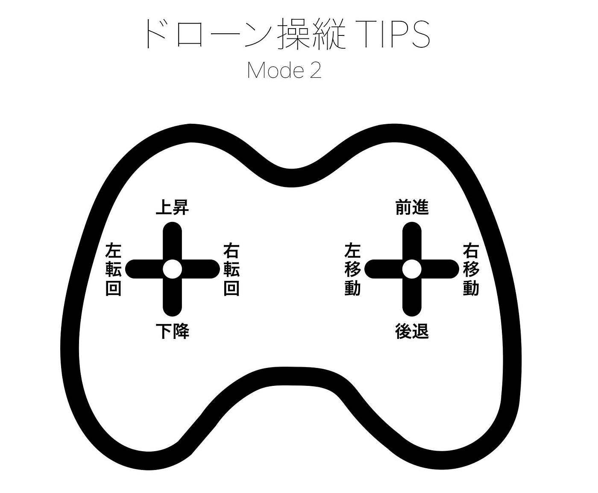
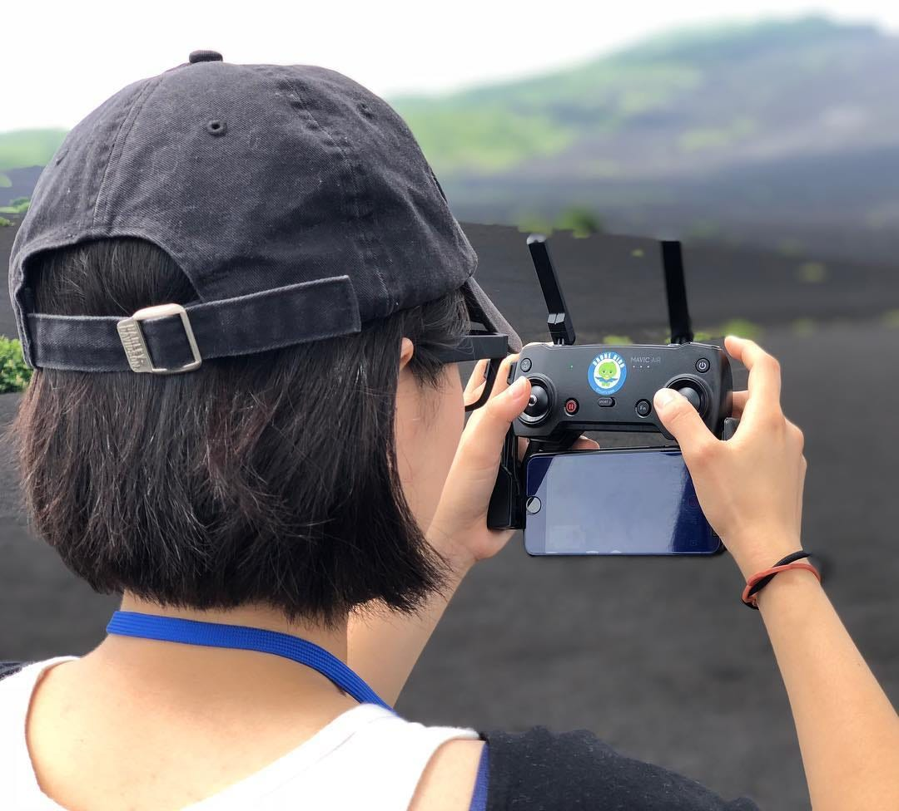

### モード1とモード2の仁義なき戦い

ドローン関係者が集まっている場で、時によっては、険悪な雰囲気になりかねない質問がある。

> 「操縦する時はモード1ですか？モード2ですか？」

もし、その場が静まり返ったら、深追いせずに別の話題に移ろう。そのまま話を続けてしまうと、おすすめエディタ論争のvi派とemacs派のような、はたまたINGRESSの青派と緑派のような不毛な争いに巻き込まれかねないからだ。

しかし、**ドローンの機材をシェアする場合には、必ず確認しなければならない大事なこと**でもある。

ドローンをマニュアルで操縦する場合は、多くの場合プロポに備えられた2本のスティックを操作する。このスティックを左右それぞれどちらの方向に動かすとドローンがどう振る舞うのか、割り当てられたパターンが4種類、モード1からモード4まで存在する。現実的にはそのうちのモード1とモード2のいずれかを採用されることがほとんどで、目的によって向き不向きがある為、自分がどのようなスタイルでドローンを操縦するかを定めてから購入する機体を決めるべきであると思う。とは言え最近のドローンはモード1とモード2が切り替えられるものが多いので、初めて買うのであれば両モードに対応しているものを買い、あとで自分のスタイルを決めれば良い。

スティックモード1と2の大きな違いは、上昇/下降を制御するスティックが右なのか左なのかという点である。

色々な方から話を聞くと、ドローンが普及する前、いわゆるラジコンヘリが主流だった頃の日本は、圧倒的にモード1の操縦スタイルが多かったとのこと。それには理由があって、今のドローンとは違い姿勢制御と高度維持がかなり難しく、人間の微妙なスティック操作が飛行の安定性に関わっていた。特に高度維持のための上昇/下降は難易度が高く、出来るだけ繊細な操作を行うために、利き手(多くの人は右手)側のスティックで上昇/下降を制御するスタイルが普及した結果、モード1派が多くなったと聴いている。

当然、そのような時代に飛行制御を身につけてノウハウをためた経験者たちに師事した、次の世代は、師匠のスタイルを継承することが多く、初期のドローン操縦士もまたモード1を選択する人が多かった。

一方で、海外では圧倒的にモード2が主流となっている。そもそも市販されているドローンの初期設定はモード2になっているケースが多く、加えて、姿勢制御技術が向上したことで、もはや手放しでもドローンは高度維持ができるようになった。こうなると、高度制御と、前後左右の制御を分離して行いたいと思う発想は自然だ。

モード2では、左スティックで高度を決めると、高度を変えない限り、残りの作業は右スティックに集中すれば良くなる。特にゲーム世代には馴染みやすい操縦体系と言える。

地図作成のための空撮では、高度を固定して、地表面と平行な二次元平面での移動が主となる。この場合もモード2が向いているが、実際の現場はオートパイロットで制御することが多いのでその重要度は低くなってきている。

結論から言うと、モード1を選ぶか、モード2を選ぶかはどちらでも良い。先達からのノウハウをしっかり継承したければモード1でも良いし、目的に合わせてどちらが向いているのか自分の判断で選んでほしい。

但し、機材の貸し借りをするコミュニティの中ではどちらを主とするか決めておいた方が良い。

古橋研究室と災害ドローン救援隊DRONEBIRD/Japan Flying Labsはチームとしてはモード2を推奨している。**最大の理由は海外コミュニティとの連携が多いこと**だが、子ども向けドローンワークショップで使用する機体もデフォルトがモード2が多く、何より地図作成のための空撮手法も高度を維持して行うことが多いため、総合的に判断してモード2が向いている。

ただ、いつまでもドローンの操縦がスティック操作に依存するとも思わない。例えばDJI は [Phantom X](https://youtu.be/ec1EF2UaQ4U) という未来のドローンのコンセプト映像で、全てをゼスチャー操作と自動制御で操るドローンを提案している。事実その一部はゼスチャーコントロールやアクティブトラックとして最新機種に随時投入されている。

もしかしたら案外、モード1とモード2の仁義なき戦いはあっという間に過去のものになるのかもしれない。

そして、ドローンスクールもまた、教えるべき要素の変化に追従していけるのかが重要となるだろう。
