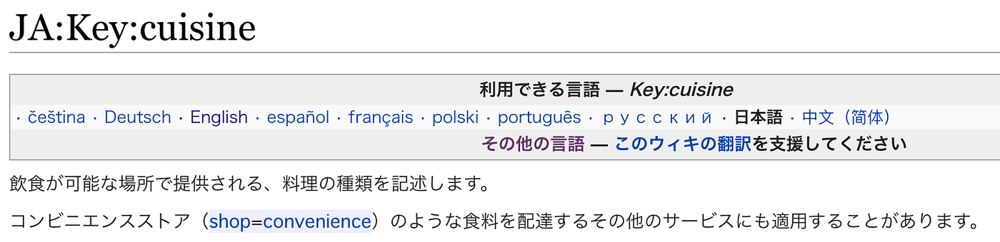
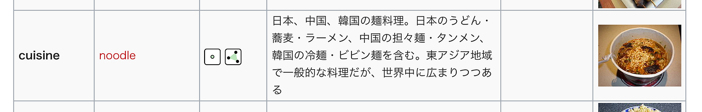

### 卒検：OSM ラーメン二郎についているタグ（cuisine編）

前回のブログでも書いた「ラーメン二郎についているタグ」今回はcuisineについているタグについて記述していく。

### 現在のOSM入力情報

OSM上にすでにあったラーメン二郎の情報が** ２２店舗分**

cuisine=ramenだった店→12店舗、cuisine=noodleだった店→4店舗、 noodle;ramenだった店→1店舗、cuisine=[jiro;ramenだった店](https://www.openstreetmap.org/changeset/59113080)→1店舗、未入力→4店舗

### OSM上での定義

[JA:Key:cuisine — OpenStreetMap Wiki
Edit descriptionwiki.openstreetmap.org](https://wiki.openstreetmap.org/wiki/JA:Key:cuisine)

cuisineとは、飲食が可能な場所で提供される、料理の種類を記述するもの。

noodle：日本、中国、韓国の麺料理。日本のうどん、蕎麦、ラーメン、中国の担々麺、タンメン、韓国の冷麺、ビビン麺を含む。東アジア地域で一般的な料理だが、世界中に広まりつつある。

[JA:How to map a — OpenStreetMap Wiki
このリストは日本におけるPOIのタグ付けルールを整理する目的で作成されました。 Ja:Map Featuresまたは、 Map Features…wiki.openstreetmap.org](https://wiki.openstreetmap.org/wiki/JA:How_to_map_a#.E3.83.A9)

五十音順POIタグ一覧によると

ラーメン屋は

・cuisine=noodle;ramen

・cuisine:ja=ラーメン

とされている。

### OSM上でラーメン二郎につけるべきcuisineタグはどれか？

ラーメン二郎には

・麺（noodle）

・ラーメン（ramen）

・二郎系（jiro）

この３つの要素がある。この中でシンプル且つわかりやすくラーメン二郎をタグづけするにはどのタグを選べばいいのか。

### 各ワードの知名度・表現度

この３つのワードを細かくしていくと

・noodleの中の１つの種類であるramen

・ramenの中の１つの種類であるjiro

となる。noodle＞ramen＞jiro ということだ。

つまりは

「ramen」というワードを世界中の人が「noodle」の一種、と知っているのならば、

**「ramen;jiro」というタグがつけられればとてもシンプルでわかりやすくなる。**

ラーメンにも、家系、博多系、二郎系などの様々な種類がある。その中で、すぐに「二郎系のラーメン屋」とわかるためには、すでに１つの店舗で使われている「jiro」というタグを採用するのが一番わかりやすいのではないか？

（個人的には、「ramen」というワードは今や世界的に有名だと思う。少なくとも、私が長期滞在していたニュージーランド、マレーシアで出会った人では、「ramen」は私たちが説明しなくても理解している人たちしかいなかった。

しかし、アフリカ大陸などで通じるかどうかはわからないので、そういった中でOSM上で「noodle」表記をスキップし、「ramen」タグをいきなりつけていいのか？ということは今後調査し、考える必要がある。）

今の時点での結論では、OSM上でのラーメン二郎につけるべきcuisineのタグは

「ramen;jiro」が最適だと考える。
