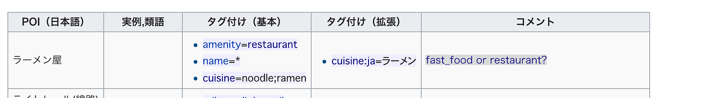
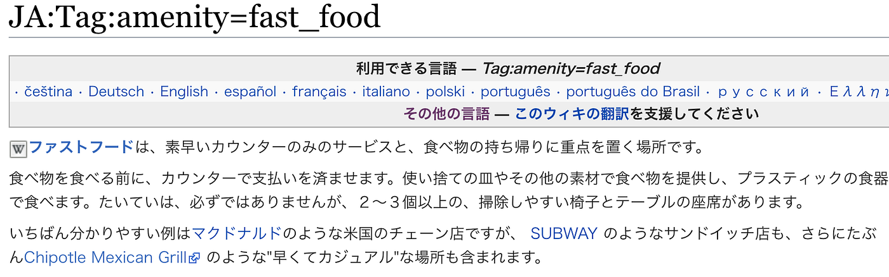
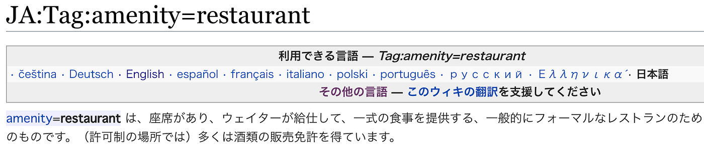
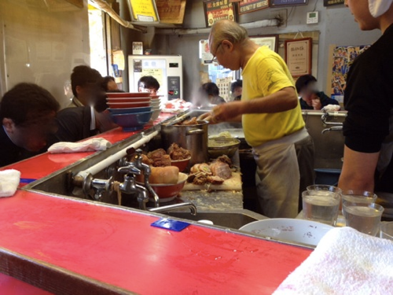

### 卒研：OSM ラーメン二郎についているタグ（amenity編）

OSM上にある、ラーメン二郎についている「タグ」を調査した。

結果

OSM上にすでにあったラーメン二郎の情報が** ２２店舗分**

内、amenityがfast_food だった店→１１店舗、restaurantだった店→１１店舗

cuisineがramenだった店→１２店舗 noodleだった店→４ noodle;ramenだった店→１jiro;ramenだった店→１未入力→４

だった。

次に、OSM上での定義を見ていく。今回はamenityについてだ。

五十音順POIタグ一覧によると

ラーメン屋は

・amenity=restaurant

とされている。

[JA:Tag:amenity=fast_food - OpenStreetMap Wiki
Edit descriptionwiki.openstreetmap.org](https://wiki.openstreetmap.org/wiki/JA:Tag:amenity%3Dfast_food)

ここにある通り、fast_food は

・素早いカウンターのみのサービス（支払いもカウンター）

・食べ物が持ち帰り可能

・プラスチックの容器

・掃除しやすいテーブルと椅子

・早くてカジュアルな場所 も含まれる

・例として、マクドナルド、SUBWAY、Chipotle Mexican Gril があげられる。

と記されている。

一方restaurantはこうだ。

[JA:Tag:amenity=restaurant - OpenStreetMap Wiki
Edit descriptionwiki.openstreetmap.org](https://wiki.openstreetmap.org/wiki/JA:Tag:amenity%3Drestaurant)

・座席がある

・ウェイターが給仕

・一式の食事を提供

・フォーマルなレストランのためのもの

・許可制の場所では酒類の販売免許を所持

また、「併用されるタグ」の欄には

- [drive_through](https://wiki.openstreetmap.org/wiki/JA:Key:drive_through)=yes -レストランにドライブスルーがある。代わりに [amenity](https://wiki.openstreetmap.org/wiki/JA:Key:amenity)=[fast_food](https://wiki.openstreetmap.org/wiki/JA:Tag:amenity%3Dfast_food) を検討してください。

という記載がある。

これらを踏まえ、４つの視点からラーメン二郎と比較していく。

### **素早いカジュアルなサービス**

ラーメン二郎は全店舗食券制なので、「支払いもカウンター」には当てはまらないが、食券制は支払いの過程を簡略化していると考えると、fastfoodに属されていいだろう。（全店舗カウンターだけというわけではないので、それについては後記述する）

二郎の場合はプラスチックの容器ではなくガラスでできたどんぶりだが、食べ終わった際には客が自分でどんぶりをカウンターに置き、カウンターに置いてある台拭きで自分の食べた部分を拭くのがルールだ。

基本的に二郎はウエイターが給仕しているわけでもなく、水、掃除もセルフサービスである。店内には店主、助手、バイトがいるが、基本的にカウンターの中から出ることはほぼない。

これらも、全て過程を簡略化してあるからであるため、フォーマルな場所というよりも、早くてカジュアルな場所＝fast_foodと捉えることができる。

### **持ち帰り制度について**

食べ物（二郎の場合はラーメン）の持ち帰り制度は基本的にない。ただ、「鍋二郎」というサービスは持ち帰りに近いと言える。鍋二郎とは、鍋を持参し、その鍋に麺、ヤサイ、豚、スープを入れてもらい、店以外の場所で食べることだ。

ただし、このサービスをしている店舗は限られており、その中でも、毎日している店舗と期間限定の店舗がある。

例えば、八王子野猿街道店２では、中央大学が近くにあるため、中央大学の学園祭がある期間に鍋二郎を開催することが多い。

また、相模大野店では、W杯の日本代表戦の日にだけ鍋二郎を開催する。

このように、不定期に鍋二郎を開催する二郎が多数ある。

この鍋二郎、私もやったことが何回かあるのだが、気軽に持ち帰ってさらっと食べるというよりは、複数人と食べるイベントごとのようなかんじになる。

鍋二郎というサービスはあるが、俗に言うテイクアウトのようなサービスではないため、これはfast_foodにもrestaurantにも該当しないだろう。

ドライブスルーが可能な二郎は存在しない。

### **酒類の販売について**

酒類を販売している二郎は私が把握している限り４店舗ある。西台、小滝橋、歌舞伎町、小金井だ。

小金井では瓶ビール、西台では缶チューハイ、缶ビールを提供している。

ただし、私の経験上、二郎で酒を飲みながらラーメンを食べている人はほぼみたことがない。ただでさえ量が多いラーメンと、腹が膨れる酒を一緒に頼もうという人はなかなかいないだろう。「早く食べなければいけない、ロットを乱してはいけない」という暗黙の了解もあるから尚更だ。待ち人がいなく、空席がある状態ならゆっくり飲んでも大丈夫だろう。

酒類の販売はしているが、酒を飲みに来る人少なく、置いている店も少ないので、restaurantに当てはまるとはいえないだろう。

### **カウンター席とテーブル席について**

基本的に二郎はカウンター席のみの店舗が多いが、テーブル席が存在する店舗も多々ある。

栃木、小金井、野猿の街道系３つ、新潟、小滝橋である。

会津若松に関しては座敷の席がある。

新潟、会津若松に関しては、二郎では一般的な着丼前にコールを聞かれるのではなく、テーブル席、座敷に着席した時点でコールを聞かれる。

その他の店では、着丼直前に一回店員がコールを聴きにきて、そこから着丼といった順序である。

テーブル席のみの二郎はなく、必ずカウンター席が存在する。また、テーブル席がある店舗もテーブルは１つか２つで、どの店舗も席数はカウンター席のほうが圧倒的に多い。

また、二郎は回転率を大切にしているため、仮に複数人でテーブル席がある店舗に行っても、テーブル席に案内されるとは限らない。子供づれのグループをのぞいて考えれば、一番効率のいいように回る席に案内される。

二郎はカウンター席がほとんど、テーブル席があっても、そこに案内されるとは限らない、これらのことを踏まえると、ラーメン二郎はrestaurant ではなく fast_food のほうが適していると考えられる。

これら４点を踏まえると、ラーメン二郎につけるべきamenity のタグは

**restaurant ではなく、fast_food に統一するべき**

と結論づけた。
