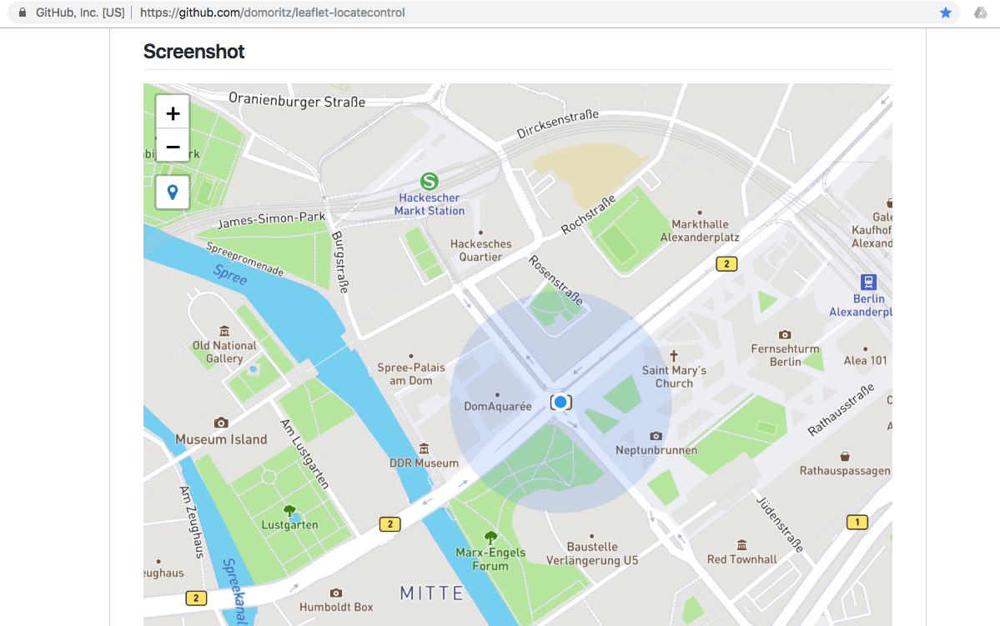
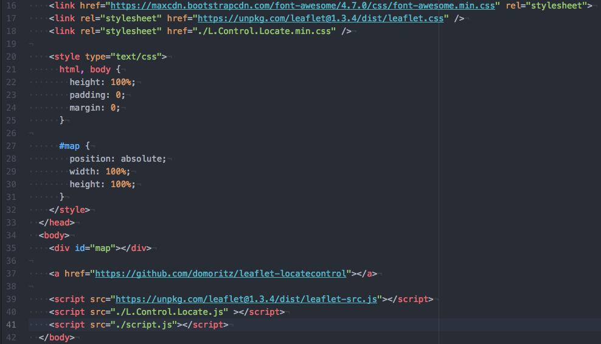
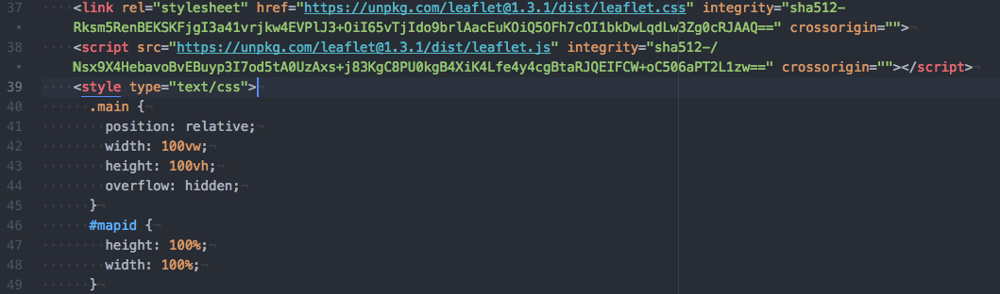
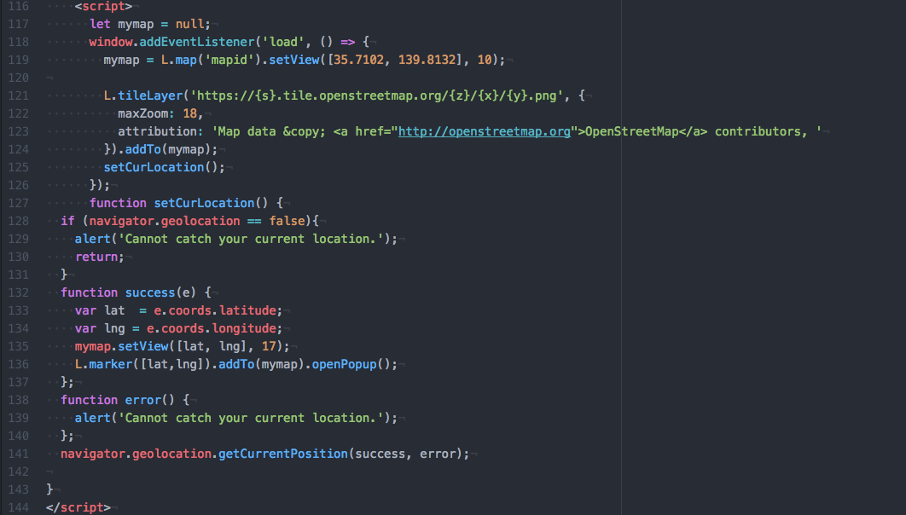
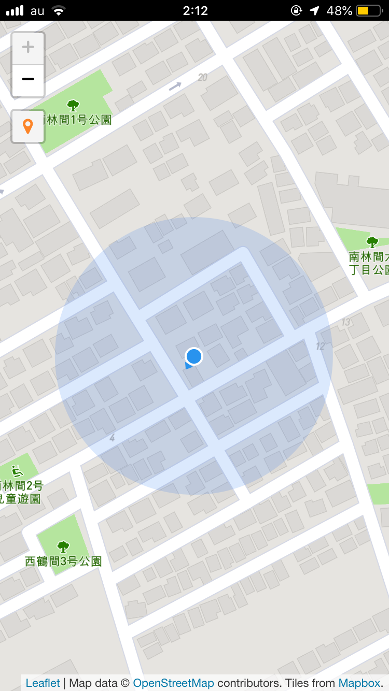
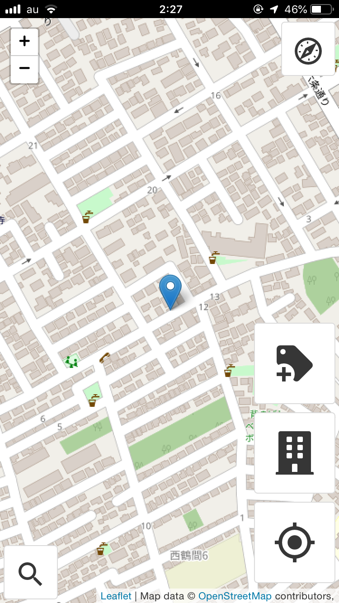

### 現在位置表現実装

今回のブログは卒業制作のPWA(OSM編集ツールの予定)で、LeafletのPlugins機能の中で**[Leaflet.Locate**](https://github.com/domoritz/leaflet-locatecontrol)(現在位置表示)を実装したお話。

PWA？なにそれ？？という方は、以前私が書いた ”[OpenStreetMap×PWA](https://medium.com/furuhashilab/openstreetmap-pwa-cbed8bbe2218)” を参照してもらいたい。

[OpenStreetMap×PWA
PWAって聞いたことある？その名も「Progressive Web App」。私のブログでもちょこちょこ名前を出しているが今回はこのPWAの紹介と私の卒業作品について。medium.com](https://medium.com/furuhashilab/openstreetmap-pwa-cbed8bbe2218)

### まず、Leafletとは？

私が現在作成中のOpenStreetMap(以下OSM)において、建物(building)データのみの追加・編集に特化し、操作の簡易性とデバイスの手軽さ、アプリのデザイン(UX)を重視した、スマートフォン用編集ツールPWAにおいて、その開発にLeafletを活用している。

Leafletとは。「**Leaflet** は広く使われているWeb地図のためのJavaScriptライブラリである。 2011年に最初にリリースされた。 モバイルとデスクトップのプラットフォームのほとんどに対応し、HTML5とCSS3に対応している。Leafletを使うと、GISの知識のない開発者でも容易にタイルベースのWeb地図を表示できる。」By [Wikipedia](https://ja.wikipedia.org/wiki/Leaflet)

私がLeafletを使っている理由は、Leafletには様々なPlugins機能があるからである。Plugins機能を使うことで、Web地図を表示させるだけでなく、機能を拡張することができる。

### **Leaflet.Locateという**プラグイン**を追加したよ**

**[Leaflet.Locate**](https://github.com/domoritz/leaflet-locatecontrol)は地図上に自分の現在位置を表示させるプラグイン。実は初めは違うプラグイン機能を使って、現在位置を表示していたのだが、より自分的にデザインが気に入ったプラグインを発見したので、実装してみた。

情報系の知識に乏しいため、少し時間がかかったがPWAでLeaflet.Locateを実装してみた。ついでにこれから編集機能を追加するにあたって、もとよりデザインの構成を考えるために配置したアイコンたちも消してみた。

↓↓ 変更箇所は[こちら](https://github.com/furuhashilab/BCr.map/blob/master/index.html)

↓↓ 編集前の現在位置表示にはこんなプラグインを活用していた
(アイコン配置は省略)

プラグイン機能の追加にはGithubにアップされているソースコードをただコピペして貼れば良いという訳ではない。

コードの中のどれがその追加したい機能に関するコードなのか。ファイルもたくさんあるため、探すのに少し苦労をした。また相対パスで書かれたファイル指定には気をつけなくてはいけない。必要なファイルのみを自分のリポジトリにあげ、階層を整える必要があるのだ。また自分が必要ないと思った機能についてはコードを少し書き換え、採用している。

私は編集前は<id=”mapid”>を使っていたが、なかなかうまくいかなかったので今回<id=”map”>に変更した。

全体のデザイン(UX)を考えるにあたり、今回は現在位置表示ボタンが背景地図がなるべく隠れないようにより小さい方が良いと思ったのと、ボタンの位置を変更したかったたため、プラグインを変更した。また編集前のコードでは、移動するたびに現在位置表示ボタンを押すと地図上にアイコンが増えてゆく仕様だったため、見栄えをよくするためである。

以上、今回は**[Leaflet.Locate**](https://github.com/domoritz/leaflet-locatecontrol)(現在位置表示)を実装したお話。
次回をお楽しみに〜。
